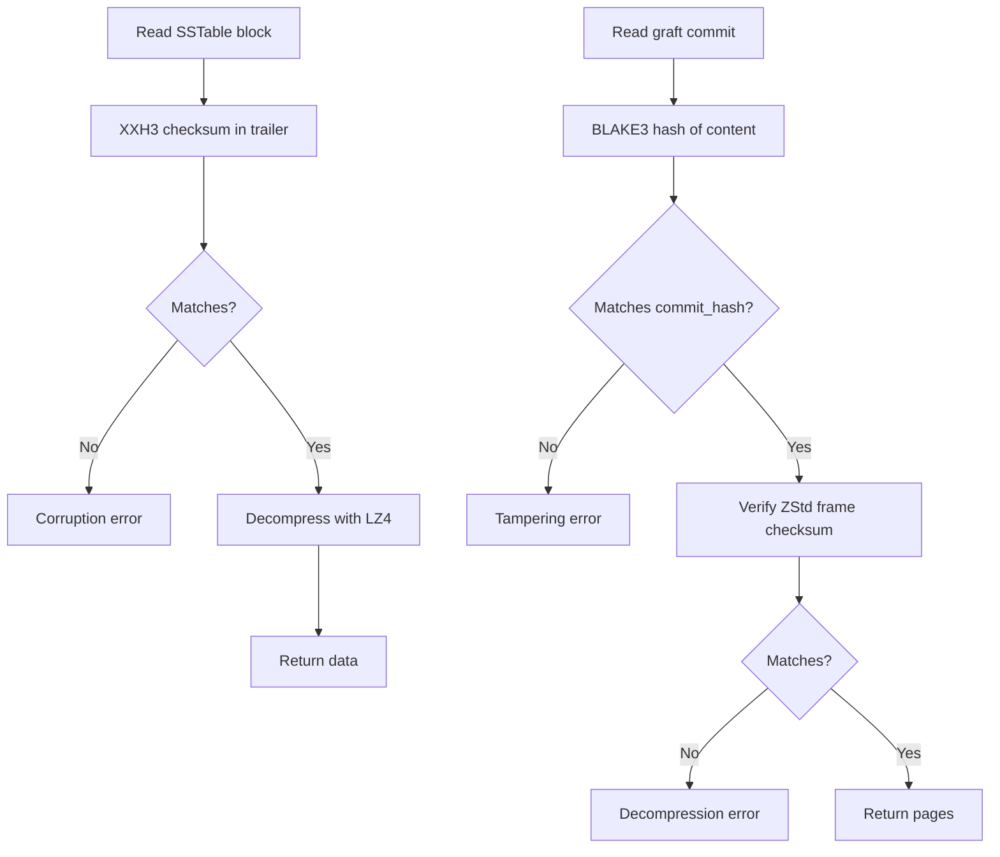

# Orbitinghail -- Checksums and Data Validation

The orbitinghail ecosystem uses multiple checksum and hash algorithms for data integrity, each chosen for its specific tradeoffs: speed, collision resistance, or cryptographic security.

**Aha:** The ecosystem uses a layered integrity strategy. At the block level, XXH3 128-bit catches random bit flips (fast, 99.999...% detection). At the commit level, BLAKE3 catches intentional tampering (cryptographic). At the segment level, ZStd checksums catch decompression errors. Each layer catches corruption at its granularity — a corrupted page in a segment is caught by the ZStd frame checksum before the BLAKE3 commit hash is even checked.

## XXH3 128-bit Checksums

**Used by:** lsm-tree blocks, SFA ToC, graft order-independent checksums

```rust
use xxhash_rust::xxh3::xxh3_128;

let hash: u128 = xxh3_128(data);
```

| Property | Value |
|----------|-------|
| Output size | 128 bits |
| Speed | ~30 GB/s on modern CPU |
| Collision resistance | Non-cryptographic (birthday bound 2^64) |
| Use case | Block integrity, corruption detection |

XXH3 is the fastest non-cryptographic hash for block-level integrity checks. It is used for:
- SSTable data block checksums (trailer)
- SFA Table of Contents checksum (trailer)
- Graft's order-independent set checksum

**Aha:** XXH3 is used for block checksums because decompression speed is the bottleneck, not hash speed. LZ4 decompresses at ~20 GB/s — computing XXH3 at 30 GB/s doesn't add measurable overhead. A cryptographic hash like BLAKE3 (~5 GB/s) would add ~25% overhead to the decompression pipeline.

## BLAKE3 Commit Hashes

**Used by:** graft commit hashes

```
┌────────────────────┬──────────────────────────┐
│ 4-byte magic       │ BLAKE3 hash (28 bytes)   │
│ [0x68,0xA4,0x19,0x30]                        │
└────────────────────┴──────────────────────────┘
```

```rust
use blake3::Hasher;

const COMMIT_HASH_MAGIC: [u8; 4] = [0x68, 0xA4, 0x19, 0x30];

let mut hasher = Hasher::new();
hasher.update(&COMMIT_HASH_MAGIC);
hasher.update(log_id.as_bytes());
hasher.update(CBE64::from(lsn).as_bytes());  // CBE64-encoded, not LE
hasher.update(&vol_page_count.to_le_bytes());
hasher.update(&commit_page_count.to_le_bytes());
for (pageidx, page_data) in ordered_pages {
    hasher.update(&pageidx.to_le_bytes());
    hasher.update(page_data);
}
let hash = hasher.finalize();
```

| Property | Value |
|----------|-------|
| Output size | 256 bits (truncated to 248 bits + 32-bit magic) |
| Speed | ~5 GB/s |
| Collision resistance | Cryptographic (2^128 birthday bound) |
| Use case | Commit integrity, tamper detection |

The hash covers:
- Magic 4-byte prefix `[0x68, 0xA4, 0x19, 0x30]` (type safety)
- Log ID (which log this commit belongs to)
- LSN in CBE64 encoding (ordering)
- Volume page count (snapshot size)
- Commit page count (this commit's scope)
- Ordered (pageidx, page_data) pairs (actual data)

**Aha:** Including the 4-byte magic prefix in the hash input means a BLAKE3 hash of a commit can never equal a BLAKE3 hash of non-commit data. Even if someone computes BLAKE3 of the exact same bytes without the magic prefix, the result is different. This is a form of domain separation — the same hash function produces distinguishable outputs for different data types.

## ZStd Frame Checksums

**Used by:** graft segment frames

ZStd's built-in checksum (32-bit XXH32) is enabled for every frame:

```rust
use zstd::zstd_safe::{CCtx, CParameter};

let mut cctx = CCtx::create();
cctx.set_parameter(CParameter::ChecksumFlag(true))?;
```

The checksum covers the uncompressed frame content. On decompression, ZStd verifies the checksum — if it fails, decompression returns an error.

## Order-Independent Checksum (Graft)

Source: `graft/crates/graft/src/core/checksum.rs`

```rust
// Uses ChecksumBuilder struct with add()/build()/pretty() methods
pub struct ChecksumBuilder {
    sum: u128,
    count: u64,
    total_bytes: u64,
}

impl ChecksumBuilder {
    pub fn add(&mut self, item: &[u8]) {
        let hash = xxh3_128(item);
        self.sum = self.sum.wrapping_add(hash);
        self.sum ^= hash;
        self.count += 1;
        self.total_bytes += item.len() as u64;
    }

    pub fn build(&self) -> u128 {
        self.sum ^ (self.count as u128) ^ (self.total_bytes as u128)
    }
}
```

This checksum has the property: `checksum([a, b]) == checksum([b, a])`. The XOR operation is commutative, and the wrapping sum is also commutative. The count and total_bytes are included to detect:
- Duplicate items (count changes)
- Items with same hash but different content (total_bytes changes)

**Aha:** The order-independent checksum is used when the set of items matters but not their order. This is common in distributed systems where two nodes may process the same items in different orders but need to verify they have the same set. Without this property, every comparison would require sorting first.

## Checksum Verification Chain



## Replicating in Rust

```rust
// Block-level integrity with XXH3
use xxhash_rust::xxh3::xxh3_128;

let expected_checksum = xxh3_128(&block_data);
let actual_checksum = read_checksum_from_trailer(&file)?;
if expected_checksum != actual_checksum {
    return Err(Error::Corruption);
}

// Commit-level integrity with BLAKE3
use blake3::Hasher;

const MAGIC: [u8; 4] = [0x68, 0xA4, 0x19, 0x30];
let mut hasher = Hasher::new();
hasher.update(&MAGIC);  // 4-byte magic prefix
hasher.update(&commit_data);
let hash = hasher.finalize();
```

See [Storage Formats](08-storage-formats.md) for the formats that use these checksums.
See [S3 Remote Optimizations](10-s3-remote-optimizations.md) for remote integrity patterns.
See [LSM-Tree](02-lsm-tree.md) for block-level checksums.
