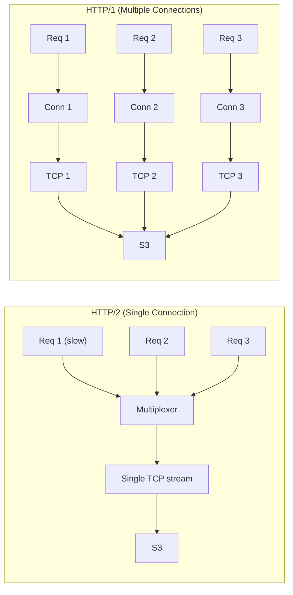

# Orbitinghail -- S3 and Remote Storage Optimizations

This document details the optimizations used when writing to S3 and other remote object stores in the orbitinghail ecosystem. The graft remote storage layer applies specific HTTP, DNS, connection, and concurrency optimizations that are non-obvious but critical for production performance.

**Aha:** The single most impactful S3 optimization in this codebase is using HTTP/1 instead of HTTP/2. HTTP/2 multiplexes all requests over a single TCP connection, which means one slow request (e.g., a large object upload) blocks all other requests — head-of-line blocking at the TCP level. For S3, where each request is independent and the bottleneck is per-request latency, 5 concurrent HTTP/1 connections give better throughput than 1 HTTP/2 connection with multiplexing.

Source: `graft/crates/graft/src/remote.rs` — remote client configuration

## HTTP/1 vs HTTP/2 for Object Storage



| Aspect | HTTP/2 | HTTP/1 (multi-conn) |
|--------|--------|-------------------|
| Connection count | 1 | 5 |
| Head-of-line blocking | Yes (TCP level) | No |
| TLS handshake | 1 | 5 |
| Memory per connection | Higher | Lower |
| Throughput for independent requests | Lower | Higher |

## DNS Caching with Hickory

```rust
use hickory_resolver::TokioAsyncResolver;

let resolver = TokioAsyncResolver::tokio(ResolverConfig::default(), ResolverOpts::default());
let connector = HttpConnector::new_with_dns_resolver(resolver);
```

S3 requests resolve `bucket.s3.region.amazonaws.com` on every new connection. Without DNS caching, each connection adds ~10-50ms for DNS resolution. Hickory caches DNS responses according to their TTL, reducing resolution to ~0ms for cached entries.

## Connection Timeouts

```rust
// 5s connect timeout — fail fast when S3 is unreachable
connector.set_connect_timeout(Some(Duration::from_secs(5)));

// 60s TCP user timeout — detect dead connections
socket.set_tcp_user_timeout(Some(Duration::from_secs(60)));
```

The connect timeout prevents hanging on network issues. The TCP user timeout (Linux-specific) detects connections that have stopped responding — the kernel sends a RST after 60 seconds of unacked data.

## Retry Strategy

```rust
use opendal::layers::RetryLayer;

let op = Operator::new(backend)?
    .layer(RetryLayer::new())
    .finish();
```

The `RetryLayer::new()` applies OpenDAL's default retry strategy with exponential backoff and jitter for transient S3 errors.

## Concurrent Operations

```rust
// REMOTE_CONCURRENCY = 5 concurrent operations for reads/writes
const REMOTE_CONCURRENCY: usize = 5;

// Upload segment with concurrency
let mut futures = Vec::new();
for chunk in segment.chunks() {
    futures.push(op.write(chunk.path(), chunk.data()));
}
let results = futures::stream::iter(futures)
    .buffer_unordered(concurrency)
    .collect::<Vec<_>>()
    .await;
```

5 concurrent operations provide a good balance between throughput and connection count. Too few (1-2) and the pipeline is underutilized. Too many (20+) and you risk overwhelming the S3 endpoint or hitting connection limits.

## Atomic Writes with Preconditions

```rust
// Atomically write only if the object doesn't exist
let result = op.write_with(path, data)
    .if_not_exists(true)
    .await;

match result {
    Ok(()) => println!("Created new object"),
    Err(e) if e.is_condition_not_met() => println!("Object already exists"),
    Err(e) => return Err(e),
}
```

S3 supports conditional writes via `If-None-Match: *`. OpenDAL abstracts this as `if_not_exists(true)`. This is used for:
- Commit records: prevent duplicate commits
- Segment files: deduplicate uploads

**Aha:** The `if_not_exists` precondition replaces distributed locking. Instead of acquiring a lock before writing, two processes simply attempt to write with `if_not_exists(true)`. One succeeds, the other gets a condition-not-met error. This is lock-free idempotency — the same pattern used in distributed databases with compare-and-swap operations.

## Object Path Design

```
/logs/{logid}/commits/{CBE64-hex-LSN}    # CBE encoding for descending order
/segments/{sid}                          # Flat structure
```

CBE encoding ensures that listing objects in reverse order gives the newest commits first. This eliminates the need to list all objects and sort them.

## Byte-Range Reads

```rust
// Read only bytes 1000-2000 of a 100MB object
let reader = op.reader_with("segments/sid-123")
    .range(1000..2000)
    .await?;
let chunk = reader.read().await?;
```

S3 supports HTTP Range headers for partial object reads. The graft segment format leverages this by storing a frame index that maps PageIdx to byte ranges. Reading one page requires downloading only the frame containing that page.

## Cost Considerations

| Operation | S3 Cost | Optimization |
|-----------|---------|-------------|
| PUT request | $0.005 per 1000 | Batch pages into segments to reduce PUT count |
| GET request | $0.0004 per 1000 | Use Range requests to get only needed frames |
| LIST request | $0.005 per 1000 | Use CBE encoding to avoid listing all objects |
| Data transfer out | $0.09/GB | Compress pages with ZStd (typically 2-3x ratio) |

## Replicating in Rust

```rust
use opendal::{Operator, Scheme, layers::RetryLayer};

let op = Operator::via_builder(
    Scheme::S3,
    S3Config::builder()
        .bucket("my-bucket")
        .region("us-east-1")
        .access_key_id("...")
        .secret_access_key("...")
        .http_client(HttpClient::http1_only())
        .dns_resolver(HickoryResolver::default())
        .build()
)?
.layer(RetryLayer::new())
.finish();

// Atomic write
op.write_with("path/to/object", data)
    .if_not_exists(true)
    .await?;

// Range read
let chunk = op.read_with("path/to/object")
    .range(1000..2000)
    .await?;
```

See [Remote Sync](05-remote-sync.md) for the full sync process.
See [Graft Storage](04-graft-storage.md) for segment format.
See [Production Patterns](12-production-patterns.md) for broader production considerations.
