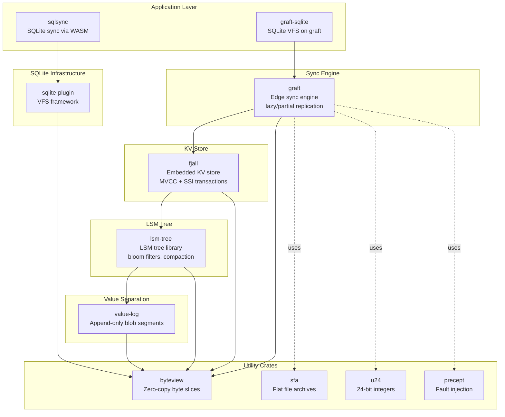
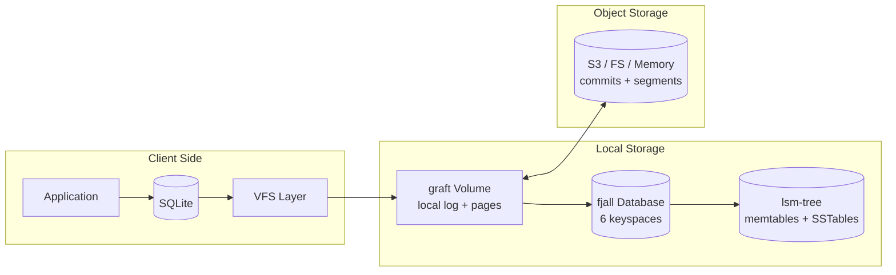

# Orbitinghail -- Overview

## What Is Orbitinghail

Orbitinghail is not a single project — it is an **ecosystem of storage engines** authored primarily by Carl Sverre (@carlsverre). The ecosystem spans embedded key-value stores, LSM-tree implementations, edge sync engines, SQLite replication systems, and utility crates for zero-copy data handling. Together, these projects form a cohesive stack for building **offline-first, sync-capable, high-performance storage systems** in Rust.

## Why These Projects Exist

The orbitinghail ecosystem addresses a specific problem space: **how do you build storage systems that work offline, sync reliably, and perform well under concurrent access?**

Traditional approaches either:
1. Use a central database (single point of failure, no offline)
2. Use CRDTs (complex conflict resolution, eventual consistency)
3. Use operational transforms (centralized ordering, scalability limits)

Orbitinghail takes a different approach: **deterministic replay through journals**. Every system in this ecosystem uses append-only logs (journals, timelines, WAL) as the source of truth, with deterministic replay ensuring convergence. This gives you:

- **Offline-first**: Clients operate on local journals, sync when connected
- **Serializable isolation**: SSI transactions in fjall, serializable snapshots in graft
- **Page-level granularity**: Graft syncs individual 4KB pages, not whole databases
- **WASM compatibility**: SQLsync reducers run in WASM for browser-based sync

## The Ecosystem, Crate by Crate

| Crate | Lines | What It Is |
|-------|-------|-----------|
| **fjall** | ~3,000 | Embedded LSM-tree KV store with multi-keyspace, MVCC snapshots, SSI/OCC transactions, journal-based WAL, background compaction/flush, crash recovery |
| **lsm-tree** | ~6,000 | The underlying LSM tree library with block cache, bloom filters, SSTable format, key-value separation, leveled/FIFO compaction |
| **graft** | ~5,000 | Transactional storage engine for edge sync — uses fjall for local storage, volumes track sync points, lazy/partial page fetching from object storage |
| **sqlsync** | ~2,500 | SQLite sync via custom VFS and WASM reducers — timeline-based mutation replay, replication protocol, reactive query subscriptions |
| **byteview** | ~700 | Zero-copy byte view types — inline small values (≤20 bytes), share heap allocations for subslices, prefix caching for fast comparison |
| **value-log** | ~1,200 | Append-only value log for large blob storage — KV-separated LSM, segment-based GC, merge readers for deduplication |
| **sfa** | ~300 | Simple File Archive — flat file archive with named sections, ToC + trailer for random access |
| **u24** | ~700 | 24-bit unsigned integer — same size/alignment as u32 with MSB always zero, extensive num traits |
| **precept** | ~400 | Fault injection testing framework — Antithesis-compatible assertions, distributed slices, 50/50 random faults |
| **sqlite-plugin** | ~900 | SQLite VFS framework — type-safe Vfs trait, FFI bindings, static/dynamic registration |
| **sqlite-vfs** | ~300 | Lightweight SQLite VFS abstraction (used by sqlsync) — File trait, Vfs trait, register function |

## Architecture at a Glance

## Key Design Patterns Across the Ecosystem

### 1. Append-Only Journals as Source of Truth

Every system uses journals:
- **fjall**: Journal entries (Start/Item/End/Clear) with xxh3 checksums, rotated at 64 MiB
- **graft**: Commit logs with LSN-ordered entries, stored in object storage at deterministic paths
- **sqlsync**: Timeline journals with LSN-tracked mutations, replayed through WASM reducers

**Why it matters**: Append-only means writes are always sequential (fast), recovery is deterministic (replay from journal), and sync is natural (diff two journals).

### 2. MVCC Through Sequence Numbers

- **fjall**: `SnapshotTracker` with DashMap-based watermark management — each transaction gets a seqno, reads see all seqnos ≤ its snapshot point
- **lsm-tree**: InternalKey = (user_key, Reverse(seqno), value_type) — higher seqno sorts first, enabling "latest version wins"
- **graft**: LSN (Log Sequence Number) as non-zero u64, with LsnRange for efficient set operations via `range_set_blaze`

**Why it matters**: Readers never block writers, writers never block readers. Snapshots are cheap (just a seqno), garbage collection knows exactly when old versions are safe to drop.

### 3. Zero-Copy Data Handling

- **byteview**: 24-byte tagged union — inline ≤20 bytes, or share heap with ref counting and prefix caching
- **graft**: `Page(Bytes)` — immutable 4KB pages backed by `bytes::Bytes` for zero-copy sharing
- **lsm-tree**: `ValueHandle` pointers into blob files, not full values

**Why it matters**: No unnecessary allocations, no unnecessary copies. A subslice of a byteview shares the original heap allocation, incrementing its ref count.

### 4. Lazy / Partial Replication

- **graft**: Snapshots reference pages that may not be cached locally — pages are fetched on-demand from remote segments
- **sqlsync**: LocalDocument maintains a storage journal (committed pages from coordinator) and a timeline journal (local mutations), rebasing on sync

**Why it matters**: You don't need to download an entire database to work with it. Graft fetches individual 4KB pages as needed, making it practical to work with multi-GB databases over slow connections.

### 5. Crash Safety Through Two-Phase Commits

- **fjall**: Journal Start→Item→End entries — crash mid-write means incomplete journal entries are detected via checksums and ignored
- **graft**: `PendingCommit` in Volume metadata — if crash occurs during remote push, recovery checks if the commit hash matches on remote
- **sqlsync**: Storage commit appends pending pages to journal before marking visible

**Why it matters**: Power loss at any point leaves the system in a recoverable state. Journals are the single source of truth — if it's not in the journal, it didn't happen.

## What This Looks Like in Rust

The orbitinghail ecosystem is already written in Rust. If you want to replicate similar patterns in your own Rust projects, the key architectural decisions to internalize are:

- **Typed identifiers with zerocopy**: Graft's `Gid
` uses zerocopy for zero-copy byte layout validation with type-specific prefixes
- **RAII guards everywhere**: SnapshotNonce in fjall, Mutator in byteview, ReadGuard/WriteBatch in graft — resources are released on drop
- **Copy-on-write versioning**: lsm-tree's SuperVersion is cloned with modifications, never mutated in place
- **Distributed slices for test catalogs**: precept uses `linkme` to collect static assertions across the binary at link time
- **Trait-based plugin systems**: sqlite-plugin's `Vfs` trait with default implementations lets you override only what you need

## What a Production-Grade Version Looks Like

The orbitinghail ecosystem is already production-grade. Key indicators:

- **Extensive testing**: fjall has 892 lines of SSI transaction tests alone; graft has bank-workload tests verifying $100M total across concurrent transfers
- **Fault injection**: precept integration with Antithesis deterministic fuzzing; graft has crash-after-commit recovery tests
- **Benchmarks**: lsm-tree has block cache benchmarks, bloom filter false-positive rate calculations, compaction throughput measurements
- **Real-world use**: SQLsync examples include guestbook apps in React and Solid.js; graft-sqlite has 17 custom pragmas for production operations

See [fjall Database](01-fjall-database.md) for the top-level database architecture.
See [LSM Tree](07-lsm-tree.md) for the underlying tree implementation.
See [Graft](08-graft.md) for the edge sync engine.
See [SQLsync](09-sqlsync.md) for SQLite sync via WASM reducers.
