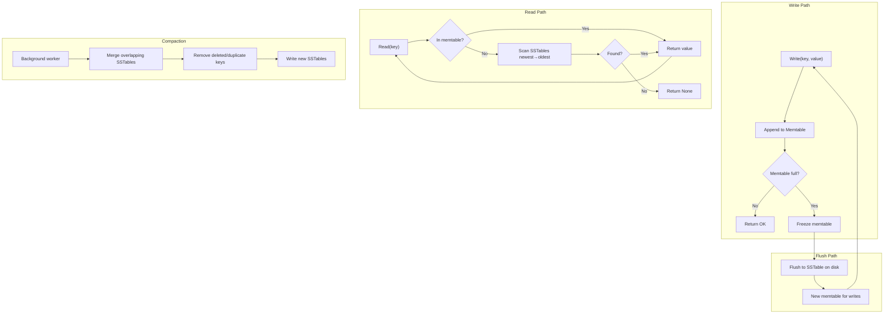

# Orbitinghail -- LSM-Tree Storage Engine

The `lsm-tree` crate is a K.I.S.S. implementation of a Log-Structured Merge tree. It is the foundational storage engine for fjall and graft. An LSM-tree transforms random writes into sequential appends, enabling high write throughput while maintaining acceptable read performance through compaction and bloom filters.

**Aha:** The LSM-tree's core insight is that writes are always fast when they're appends. Instead of updating a B-tree node in place (which requires reading the page, modifying it, and writing it back), an LSM-tree appends the new value to an in-memory memtable. When the memtable fills, it is flushed to disk as an immutable SSTable. Reads check the memtable first, then scan SSTables from newest to oldest. The tradeoff is read amplification (multiple SSTables to check) and space amplification (multiple versions of the same key), both solved by compaction.

Source: `lsm-tree/src/memtable/mod.rs` — memtable implementation
Source: `lsm-tree/src/table/` — SSTable implementation

## LSM-Tree Architecture



## Memtable

Source: `lsm-tree/src/memtable/mod.rs`

The memtable is an in-memory sorted data structure backed by `crossbeam-skiplist`:

```rust
pub struct Memtable {
    pub id: MemtableId,
    pub items: SkipMap<InternalKey, UserValue>,
    pub(crate) approximate_size: AtomicU64,
    pub(crate) highest_seqno: AtomicU64,
    pub(crate) requested_rotation: AtomicBool,
}
```

**Operations:**
- `insert(item: InternalValue)`: O(log n) — append to skiplist, returns `(added_size, new_size)`
- `get(key, seqno)`: O(log n) — lookup in skiplist (respecting sequence number visibility)
- `remove(key)`: O(log n) — insert tombstone (special marker value)

**Aha:** The memtable uses a skiplist, not a B-tree, because skiplists are naturally concurrent. `crossbeam-skiplist` provides lock-free reads and writes — no mutex needed. Multiple threads can insert and read simultaneously without blocking.

When the memtable's `approximate_size` reaches the flush threshold (configurable via fjall's `max_memtable_size`, default 64 MiB), it is "frozen" — a new empty memtable becomes active, and the frozen one is flushed to disk as an SSTable.

## SSTable Format

Source: `lsm-tree/src/table/block/`

An SSTable (Sorted String Table) is an immutable file containing sorted key-value pairs:

```
┌──────────────────────────────────────────────────┐
│                   SSTable File                    │
├──────────────────────────────────────────────────┤
│  Data Block 1  │  Data Block 2  │  ...           │
├──────────────────────────────────────────────────┤
│  Index Block (binary + hash index)               │
├──────────────────────────────────────────────────┤
│  Filter Block (bloom filter)                     │
├──────────────────────────────────────────────────┤
│  Meta Block (version, counts, key range)         │
├──────────────────────────────────────────────────┤
│  Trailer (offsets, sizes)                        │
└──────────────────────────────────────────────────┘
```

### Data Block Format

```
┌──────────────────────────────────────────────────┐
│                   Data Block                      │
├──────────────────────────────────────────────────┤
│  Header (magic bytes, compression type)          │
├──────────────────────────────────────────────────┤
│  Data items (prefix-compressed key-value pairs)  │
├──────────────────────────────────────────────────┤
│  Binary index (sparse restart points)            │
├──────────────────────────────────────────────────┤
│  Hash index (optional, for large blocks)         │
├──────────────────────────────────────────────────┤
│  Trailer:                                        │
│    trailer_start_marker: u8 (0xFF)               │
│    binary_index_step_size: u8                    │
│    binary_index_len: u32                         │
│    binary_index_offset: u32                      │
│    hash_index_len: u32                           │
│    hash_index_offset: u32                        │
│    prefix_truncation: u8                         │
│    restart_interval: u8                          │
│    fixed_key_size: u8 flag + u16 value           │
│    fixed_value_size: u8 flag + u32 value         │
│    item_count: u32                               │
└──────────────────────────────────────────────────┘
```

### Prefix Compression

Within a data block, keys are prefix-compressed relative to the previous key:

```
Key 0: "users:1001:profile"        (stored in full)
Key 1: "users:1001:settings"       → prefix "users:1001:" shared, suffix "settings" stored
Key 2: "users:1002:profile"        → prefix "users:" shared, suffix "1002:profile" stored
```

The restart interval (typically 16 keys) determines how often a full key is stored. Between restarts, only the shared prefix length and suffix are stored.

**Aha:** Prefix compression is especially effective for hierarchical key namespaces like `users:{id}:{field}`. With a restart interval of 16, a 20-byte key averages 5-8 bytes of storage within a block, reducing data block size by 40-60%.

### Binary Index

The binary index is a sparse array of `(key, offset)` pairs at each restart point. It enables binary search within a block:

```rust
// Binary search in the index
fn find_key(&self, key: &[u8]) -> Option<usize> {
    let idx = self.binary_index.partition_point(|entry| entry.key < key);
    // Check the restart point at idx
    // Then scan forward within the restart interval
}
```

For large blocks (>64KB), an optional hash index provides O(1) lookup for exact matches.

## Bloom Filters

Source: `lsm-tree/src/table/filter/`

```rust
// lsm-tree/src/table/filter/standard_bloom/mod.rs
pub struct StandardBloomFilterReader<'a> {
    inner: BitArrayReader<'a>,  // Raw bytes exposed as bit array
    m: usize,                   // Bit count
    k: usize,                   // Number of hash functions
}

// lsm-tree/src/table/filter/mod.rs
pub enum BloomConstructionPolicy {
    BitsPerKey(f32),
    FalsePositiveRate(f32),
}
```

The bloom filter uses the **Kirsch-Mitzenmacher technique**: two hash functions `h1(x)` and `h2(x)` generate k hashes via `h_i(x) = h1(x) + i * h2(x)`. This avoids computing k independent hash functions.

**False positive rate:** Configurable via `FilterPolicy::all(FilterPolicyEntry::Bloom(BloomConstructionPolicy::BitsPerKey(10.0)))`. With `BitsPerKey(10.0)`, the bit array is ~9.6 bits per key and k (number of hash functions) is computed as `(bpk * LN_2)` ≈ 6 (truncated to usize). The filter is checked before reading the SSTable — if the key is definitely not in the table, we skip the disk read entirely.

**Aha:** The bloom filter is the single most important optimization for read performance. Without it, every read that misses the memtable must check every SSTable on disk. With it, most misses are detected in memory, saving disk I/O. A 1% false positive rate means 99% of missing keys are detected without a disk read.

## Compaction Strategies

Source: `lsm-tree/src/compaction/`

Compaction merges overlapping SSTables to reduce read amplification and space amplification.

| Strategy | Write Amplification | Read Amplification | Space Amplification | Use Case |
|----------|--------------------|-------------------|--------------------|----------|
| **Leveled** | High (rewrite at each level) | Low (1 SSTable per level) | Low | Read-heavy workloads |
| **Tiered** | Low (merge all at once) | High (check all SSTables) | High | Write-heavy workloads |
| **FIFO** | None (just delete old files) | High | High | Time-series data with TTL |
| **Major** | Very high (compact everything) | Lowest (single SSTable) | Lowest | Periodic optimization |

### Leveled Compaction

```
Level 0: [SST-A1, SST-A2, SST-A3]  ← recently flushed, may overlap
Level 1: [SST-B1]                   ← compacted from L0, sorted, no overlap
Level 2: [SST-C1, SST-C2]           ← compacted from L1, sorted, no overlap
Level 3: [SST-D1, SST-D2, SST-D3, SST-D4]  ← largest level
```

L0 SSTables can overlap in key range (they come directly from memtable flushes). L1+ SSTables are non-overlapping within their level. Compaction picks one L0 SSTable and one overlapping L1 SSTable, merges them, and writes new L1 SSTables. This cascades down the levels.

## Blob Tree (Key-Value Separation)

Source: `lsm-tree/src/blob_tree/`

Following the **WiscKey pattern**, large values are stored separately from keys in a value log:

```
LSM-tree stores:  key → ValueHandle { blob_file_id, offset, on_disk_size }
Value log stores:  blob_file_id:offset → actual value bytes
```

This keeps the LSM-tree compact (keys are small, handles are fixed-size) while large values live in append-only segments. Garbage collection merges segments and discards stale values.

Source: `value-log/` — separate crate for value log implementation

## Block Cache

Source: `lsm-tree/src/cache.rs`

```rust
// lsm-tree/src/cache.rs
struct CacheKey(u8, u64, u64, u64);  // (tag, root_id, table_id, offset)

pub struct Cache {
    data: QuickCache<CacheKey, Item, BlockWeighter, FxBuildHasher>,
    capacity: u64,
}
```

Uses `quick_cache` with `FxBuildHasher` for LRU caching of data blocks and blob values. Hot blocks stay in memory, avoiding disk reads. The cache key is a 4-tuple `(tag, root_id, table_id, offset)` where the tag distinguishes block vs blob entries.

## Replicating in Rust

The `lsm-tree` crate is already a Rust implementation. For building on top of it:

```rust
use lsm_tree::{AbstractTree, Config};
use lsm_tree::config::{FilterPolicy, FilterPolicyEntry, BloomConstructionPolicy, BlockSizePolicy};

let seqno = Default::default();
let visible_seqno = Default::default();

let tree = Config::new("/tmp/my-store", seqno, visible_seqno)
    .data_block_size_policy(BlockSizePolicy::all(4096))
    .filter_policy(FilterPolicy::all(
        FilterPolicyEntry::Bloom(BloomConstructionPolicy::BitsPerKey(10.0))
    ))
    .open()?;

tree.insert("key", "value", 1);        // returns (added_size, new_size)
let value = tree.get("key", Some(1))?;  // get with seqno visibility
```

See [Fjall Database](03-fjall-database.md) for how lsm-tree is used in a full database.
See [Storage Formats](08-storage-formats.md) for the detailed SSTable layout.
See [Checksums and Validation](09-checksums-validation.md) for block integrity verification.
