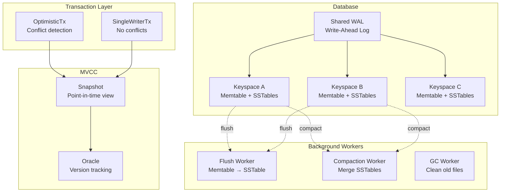
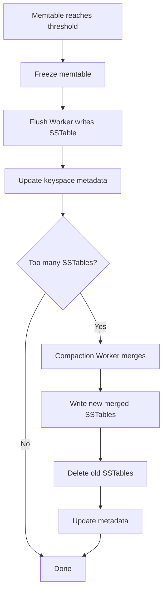

# Orbitinghail -- Fjall Database

Fjall is an embeddable KV database built on top of `lsm-tree`. It adds multiple keyspaces (column families), serializable transactions, MVCC snapshots, crash recovery via WAL journal, and automatic background compaction. It is the storage foundation for graft.

**Aha:** Fjall's multi-keyspace design shares a single WAL but has separate memtables and SSTables per keyspace. This means a single `db.persist()` fsyncs all keyspaces atomically — either all keyspaces are durable or none are. Cross-keyspace batch writes are supported: insert into keyspace A and delete from keyspace B in a single atomic operation. The shared WAL is the key insight that enables atomicity across keyspaces.

Source: `fjall/src/db.rs` — Database struct
Source: `fjall/src/journal/` — WAL journal implementation

## Architecture



## Keyspaces (Column Families)

```rust
let db = Database::builder("/tmp/my-db").open()?;

let users = db.keyspace("users", KeyspaceCreateOptions::default)?;
let orders = db.keyspace("orders", KeyspaceCreateOptions::default)?;

users.insert(b"user:1", b"Alice")?;
orders.insert(b"order:100", b"user:1,book")?;
```

Each keyspace is an independent LSM-tree with its own memtable and SSTables. Keyspaces share the WAL and the background compaction worker.

## Write-Ahead Log (WAL)

Source: `fjall/src/journal/`

Every write is first appended to the WAL before being applied to the memtable:

```
WAL Batch (fjall/src/journal/entry.rs):
┌─────────────────────────────────┐
│ Entry::Start                    │
│ - item_count: u32               │
│ - seqno: SeqNo (u64)            │
├─────────────────────────────────┤
│ Entry::Item                     │
│ - value_type: u8                │
│ - compression: CompressionType  │
│ - keyspace_id: u64              │
│ - key_len: u16                  │
│ - uncompressed_len: u32         │
│ - compressed_len: u32           │
│ - key: bytes                    │
│ - value: bytes (compressed)     │
├─────────────────────────────────┤
│ Entry::Item ...                 │
├─────────────────────────────────┤
│ Entry::End(checksum: u64)       │
│ + TRAILER_MAGIC bytes           │
└─────────────────────────────────┘
```

On crash recovery, the WAL is replayed: each entry is read and applied to the memtable. Entries that were fully written are applied; partially written entries are detected by a trailing checksum and discarded.

**Aha:** The WAL uses append-only writes with a checksum at the end of each batch. During recovery, the last batch is checked — if the checksum doesn't match, the batch was partially written during the crash and is discarded. This is a form of "fuzzy" checkpointing that doesn't require fsync after every write.

## Transactions

### SingleWriterTx

For workloads where only one thread writes at a time. Requires `TxDatabase` (aka `SingleWriterTxDatabase`):

```rust
// Must use TxDatabase, not plain Database
let db: TxDatabase = /* ... */;
let tx = db.write_tx();  // returns WriteTransaction<'_> directly
tx.insert(&users, b"key", b"value")?;
tx.commit()?;
```

No conflict detection needed — there's only one writer. Reads can happen concurrently from any number of readers.

### OptimisticTx

For concurrent writers with conflict detection. Requires `OptimisticTxDatabase`:

```rust
let db: OptimisticTxDatabase = /* ... */;
let tx = db.write_tx()?;  // returns Result<WriteTransaction>
tx.insert(&users, b"key", b"value")?;

// commit() returns Result<Result<(), Conflict>>
match tx.commit()? {
    Ok(()) => println!("Committed successfully"),
    Err(Conflict) => println!("Retry the transaction"),  // Conflict is a unit struct
}
```

**Aha:** Optimistic transactions don't acquire locks. They record which keys they read, and on commit, they check if any of those keys have been modified since the transaction started. If so, the commit returns `Err(Conflict)` and the application retries. This is much faster than lock-based transactions for low-contention workloads but requires retry logic.

## MVCC Snapshots

```rust
let snapshot = db.snapshot();  // Point-in-time view (not Result)
let value = snapshot.get(&users, b"key")?;
```

A snapshot captures the current state of all keyspaces. Subsequent writes don't affect the snapshot. The snapshot tracks which SSTable versions were visible at creation time.

Source: `fjall/src/snapshot.rs`

## PersistMode

```rust
pub enum PersistMode {
    SyncAll,     // fsync all keyspaces
    SyncData,    // fsync data only (metadata may be delayed)
    Buffer,      // Buffered write, no immediate fsync
}
```

`db.persist(PersistMode::SyncAll)` fsyncs all keyspaces, ensuring all writes are durable. This is the safest mode but the slowest. `PersistMode::Buffer` defers durability to the OS page cache — fast but risky on crash.

## Flush and Compaction Workers

Background workers handle maintenance:



The flush worker runs when the memtable is full. The compaction worker runs when the number of SSTables exceeds a threshold. Both run in the background — writes and reads continue during maintenance.

## Configuration

```rust
// Database-level configuration
let db = Database::builder("/tmp/my-db")
    .cache_size(32 * 1024 * 1024)  // 32 MiB block cache
    .worker_threads(1)              // Compaction worker count
    .open()?;

// Per-keyspace configuration (block size, bloom filters, memtable size)
let opts = || KeyspaceCreateOptions::default()
    .max_memtable_size(64 * 1024 * 1024)  // 64 MiB memtable (default)
    .data_block_size_policy(BlockSizePolicy::all(4096))  // 4KB blocks
    .data_block_hash_ratio_policy(HashRatioPolicy::all(8.0));

let kv = db.keyspace("my-data", opts)?;
```

## Replicating in Rust

Fjall is already a production-ready Rust implementation. For application use:

```rust
// Simple key-value store
use fjall::{Database, KeyspaceCreateOptions, PersistMode};

let db = Database::builder("/tmp/app-db").open()?;
let kv = db.keyspace("app-data", KeyspaceCreateOptions::default)?;

kv.insert(b"config", serde_json::to_vec(&config)?)?;
db.persist(PersistMode::SyncAll)?;

// Transactional update (requires OptimisticTxDatabase)
let tx = db.write_tx()?;
let old = tx.get(&kv, b"counter")?;
let new = parse_counter(&old) + 1;
tx.insert(&kv, b"counter", new.to_string().into_bytes())?;
tx.commit()??;  // outer Result for I/O, inner for Conflict
```

See [LSM-Tree](02-lsm-tree.md) for the underlying storage engine.
See [Graft Storage](04-graft-storage.md) for the syncable storage layer built on fjall.
See [Storage Formats](08-storage-formats.md) for the WAL and SSTable layouts.
