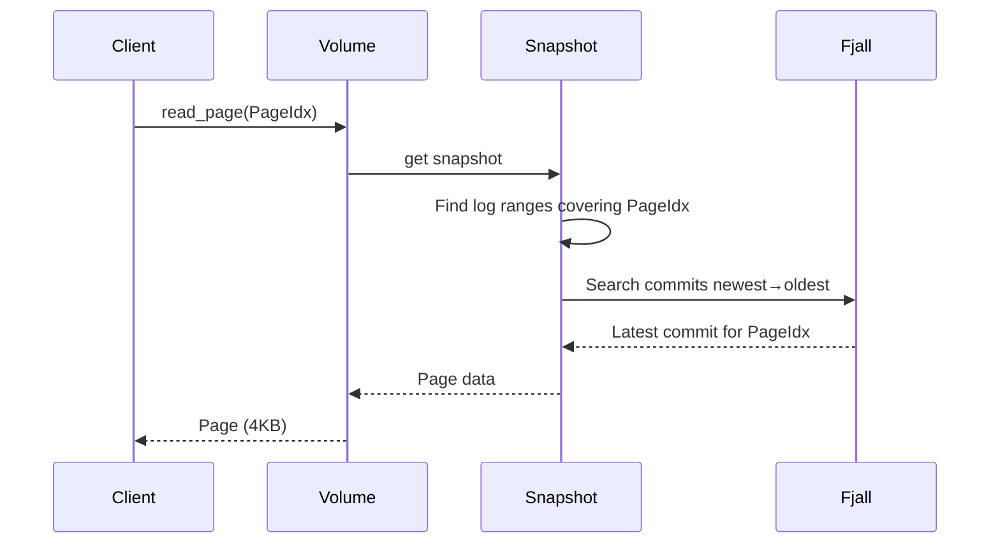

# Orbitinghail -- Graft Syncable Storage Engine

Graft is a page-oriented, syncable storage engine designed for offline-first applications. It sits on top of Fjall for local storage and OpenDAL for remote storage (S3, filesystem, memory). It uses a log-based replication model where commits are appended to a log and synced to remote object storage as compressed segments.

**Aha:** Graft's core abstraction is the **Page** — a fixed 4KB unit of data indexed by a 1-based `PageIdx`. Unlike a KV store where keys are arbitrary bytes, pages have a strict positional index. This simplifies sync: instead of reconciling arbitrary key changes, graft syncs page ranges. A commit records which pages were modified at which LSN (Log Sequence Number), and the remote sync task uploads only pages that haven't been synced yet.

Source: `graft/crates/graft/src/core/` — core data model (Page, GID, LSN, Commit)
Source: `graft/crates/graft/src/remote/` — remote storage and sync

## Core Data Model

### Page

```rust
// graft/crates/graft/src/core/page.rs
pub const PAGESIZE: ByteUnit = ByteUnit::from_kb(4);  // 4KB pages

pub struct Page(Bytes);  // Newtype wrapper for zero-copy sharing
pub struct PageIdx(NonZero<u32>);  // 1-based index, newtype with validation
pub struct PageCount(u32);  // Newtype with validation
```

Pages are the atomic unit of storage. Every read and write operates on a full page. This is the same design as database page files and filesystem blocks.

### PageSet (Compressed Bitmap)

```rust
// Uses splinter-rs for compressed bitmap
pub struct PageSet {
    splinter: CowSplinter<Bytes>,
}
```

A `PageSet` tracks which pages exist in a set. Instead of a `Vec<PageIdx>` or `HashSet<PageIdx>`, it uses a compressed bitmap — for sparse sets of 100 pages within a 10GB volume, the bitmap uses ~12 bytes instead of 400 bytes.

Source: `splinter-rs/` — compressed bitmap implementation

### LSN (Log Sequence Number)

```rust
pub struct LSN(NonZero<u64>);  // Newtype wrapper for log sequence numbers
```

LSNs are monotonically increasing integers assigned to each commit. They provide a total ordering of writes within a log. LSNs wrap around using modular arithmetic for circular logs.

### GID (Global ID)

```
┌──────────────┬──────────────────────────┐
│ Timestamp    │ Random                   │
│ 7 bytes      │ 9 bytes                  │
└──────────────┴──────────────────────────┘
```

A 16-byte globally unique identifier with type-safe prefixes:
- `VolumeId` — identifies a volume
- `LogId` — identifies a log
- `SegmentId` — identifies a segment

Serialized as Base58 for alphanumeric sorting (filesystem-friendly).

### Commit

```rust
// graft/crates/graft/src/core/commit.rs
// Serialized using bilrost (protobuf-like binary encoding)
#[derive(Message)]
pub struct Commit {
    pub log: LogId,
    pub lsn: LSN,
    pub page_count: PageCount,
    pub commit_hash: Option<CommitHash>,
    pub segment_idx: Option<SegmentIdx>,
    pub checkpoints: ThinVec<LSN>,
}

pub struct SegmentIdx {
    pub sid: SegmentId,
    pub pageset: PageSet,
    pub frames: ThinVec<SegmentFrameIdx>,
}

pub struct SegmentFrameIdx {
    frame_size: u64,       // compressed byte length of this frame
    last_pageidx: PageIdx, // last page in this frame
}
```

A commit records that `page_count` pages were written at `lsn` in `log`. The `commit_hash` provides integrity verification. The `segment_idx` points to the segment file and includes a frame index for byte-range reads. The `checkpoints` field tracks which LSNs have been upgraded to full-volume checkpoints — if this commit's own LSN is in `checkpoints`, it is a checkpoint commit.

### CommitHash

```rust
// graft/crates/graft/src/core/commit_hash.rs
const COMMIT_HASH_SIZE: usize = 32;
const HASH_SIZE: usize = 31;
const COMMIT_HASH_MAGIC: [u8; 4] = [0x68, 0xA4, 0x19, 0x30];

#[repr(u8)]
pub enum CommitHashPrefix {
    Value = b'C',
}

#[repr(C)]
pub struct CommitHash {
    prefix: CommitHashPrefix,  // 1 byte, always b'C'
    hash: [u8; HASH_SIZE],    // 31 bytes, truncated BLAKE3
}
```

```
┌──────────────────────────────────────┐
│ prefix (1 byte) │ BLAKE3 hash (31b)  │
│ b'C' (0x43)     │                    │
└──────────────────────────────────────┘
```

Total 32 bytes (`COMMIT_HASH_SIZE`). Base58 encoded (44 chars). The `COMMIT_HASH_MAGIC` `[0x68, 0xA4, 0x19, 0x30]` is fed into the hash *input* (domain separation), not stored in the struct. The struct's prefix byte `b'C'` overwrites the first byte of the BLAKE3 output to create a type-safe tag.

### CommitHashBuilder

```rust
pub struct CommitHashBuilder {
    hasher: blake3::Hasher,
    last_pageidx: Option<PageIdx>,
}

impl CommitHashBuilder {
    pub fn new(log: LogId, lsn: LSN, vol_pages: PageCount, commit_pages: PageCount) -> Self {
        let mut hasher = blake3::Hasher::new();
        hasher.update(&COMMIT_HASH_MAGIC);
        hasher.update(log.as_bytes());
        hasher.update(CBE64::from(lsn).as_bytes());
        hasher.update(&vol_pages.to_u32().to_be_bytes());
        hasher.update(&commit_pages.to_u32().to_be_bytes());
        Self { hasher, last_pageidx: None }
    }

    /// Panics if pages are written out of order
    pub fn write_page(&mut self, pageidx: PageIdx, page: &Page) { /* ... */ }

    pub fn build(self) -> CommitHash {
        let hash = self.hasher.finalize();
        let mut bytes = *hash.as_bytes();
        bytes[0] = CommitHashPrefix::Value as u8;  // overwrite first byte with prefix
        // transmute to CommitHash
    }
}
```

**Aha:** The CommitHashBuilder enforces strict page ordering — `write_page` panics if a page is written with a lower PageIdx than the previous one. This guarantees that the same set of pages always produces the same hash regardless of the order they were collected. The 4-byte `COMMIT_HASH_MAGIC` fed into the hasher provides domain separation: a BLAKE3 hash of commit data can never collide with a BLAKE3 hash of non-commit data.

### Checksum (Order-Independent)

Source: `graft/crates/graft/src/core/checksum.rs`

```rust
#[repr(C)]
pub struct Checksum {
    sum: u128,    // wrapping sum of 128-bit digests
    xor: u128,    // xor of 128-bit digests
    count: u128,  // number of elements
    bytes: u128,  // total byte length
}

#[repr(C)]
pub struct ChecksumBuilder {
    checksum: Checksum,
}

impl ChecksumBuilder {
    pub const fn new() -> Self { /* ... */ }

    pub fn write<B: AsRef<[u8]>>(&mut self, data: &B) {
        let hash = xxhash_rust::xxh3::xxh3_128(data.as_ref());
        self.checksum.sum = self.checksum.sum.wrapping_add(hash);
        self.checksum.xor ^= hash;
        self.checksum.count = self.checksum.count.wrapping_add(1);
        self.checksum.bytes = self.checksum.bytes.wrapping_add(data.as_ref().len() as u128);
    }

    pub const fn merge(self, b: Self) -> Self { /* combines two builders */ }
    pub const fn build(self) -> Checksum { self.checksum }
}
```

The checksum is order-independent: `checksum([a, b]) == checksum([b, a])`. Both wrapping addition and XOR are commutative. The four fields (`sum`, `xor`, `count`, `bytes`) together detect duplicates, permutations, and length mismatches. Display uses `blake3::hash` of the raw bytes then Base58 for human-readable comparison.

## FjallStorage Layout

Graft uses six fjall keyspaces:

| Keyspace | Key | Value | Purpose |
|----------|-----|-------|---------|
| `tags` | `ByteString` | `VolumeId` | Named volume references (like git refs) |
| `volumes` | `VolumeId` | `Volume` | Volume metadata |
| `checkpoints` | `LogRef` | `()` | Checkpoint index |
| `log` | `LogRef` | `Commit` | Commit log, LSNs ordered descending |
| `page_versions` | `PageVersion` | `()` | Page version index: latest-wins lookup |
| `pages` | `PageKey` | `Page` | Actual page data (KV separation enabled) |

**Aha:** Keys in the `log` keyspace are designed so that descending lexicographic order corresponds to "newest first." This means iterating the log from the beginning gives you the most recent commits first — no reverse scan needed. The `page_versions` index uses the same trick: the key encodes the LSN in descending order, so the first entry for a page is always the latest version.

## Reading a Page



Reading a page involves:
1. Get the current snapshot
2. Search commits from newest to oldest across all log ranges
3. Find the latest commit that contains the target PageIdx
4. Read the page from the `pages` keyspace using the PageKey (log_id + lsn + pageidx)

## Snapshot Model

A `Snapshot` is a logical view of a Volume composed of LSN ranges from multiple Logs:

```rust
pub struct Snapshot {
    pub volume_id: VolumeId,
    pub path: ThinVec<LogRangeRef>,  // Path of log ranges
}

pub struct LogRangeRef {
    pub log_id: LogId,
    pub lsns: RangeInclusive<LSN>,
    // Note: no checkpoints field on LogRangeRef
}
```

A snapshot captures the state at a point in time. It can include local log ranges and remote log ranges (from S3). Reading from a snapshot automatically fetches pages from the appropriate source.

## LEAP Prefetching Oracle

Source: `graft/crates/graft/src/oracle.rs`

The `LeapOracle` implements the **LEAP prefetching algorithm** (Maruf & Chowdhury, USENIX ATC 2020):

```
Access pattern:  10, 11, 12, 13, 14, ...
Delta buffer:    +1, +1, +1, +1, ...
Majority vote:   +1 (100% confidence)
Prediction:      Next page will be current + 1
```

The oracle tracks recent page access deltas in a 32-entry circular buffer. It uses Boyer-Moore strict majority voting to find access trends. When a trend is detected (sequential, stride, reverse), it prefetches along the trend. When no trend is detected, it falls back to neighborhood prefetching.

**Aha:** LEAP is designed for the specific access patterns of database workloads: sequential scans, index lookups with predictable strides, and reverse scans. A generic LRU cache doesn't prefetch — it only caches what was read. LEAP predicts what will be read next and fetches it proactively.

## Replicating in Rust

```rust
use graft::core::{PageIdx, page::Page, commit_hash::CommitHashBuilder, lsn::LSN};
use graft::remote::{Remote, RemoteConfig, segment::SegmentBuilder};

// Remote configuration
let remote = RemoteConfig::S3Compatible {
    bucket: "my-bucket".to_string(),
    prefix: Some("data/".to_string()),
}.build()?;

// Build a segment from pages
let mut segment = SegmentBuilder::new();
segment.write(pageidx!(1), &page1);
segment.write(pageidx!(2), &page2);
let (frames, chunks) = segment.finish();

// Upload segment
remote.put_segment(&sid, chunks).await?;

// Compute commit hash
let mut hash_builder = CommitHashBuilder::new(log_id, lsn, vol_pages, commit_pages);
hash_builder.write_page(pageidx!(1), &page1);
hash_builder.write_page(pageidx!(2), &page2);
let commit_hash = hash_builder.build();

// Upload commit (atomic, idempotent)
remote.put_commit(&commit).await?;
```

See [Architecture](01-architecture.md) for the layer diagram.
See [Remote Sync](05-remote-sync.md) for the S3 sync process.
See [Storage Formats](08-storage-formats.md) for the segment format.
