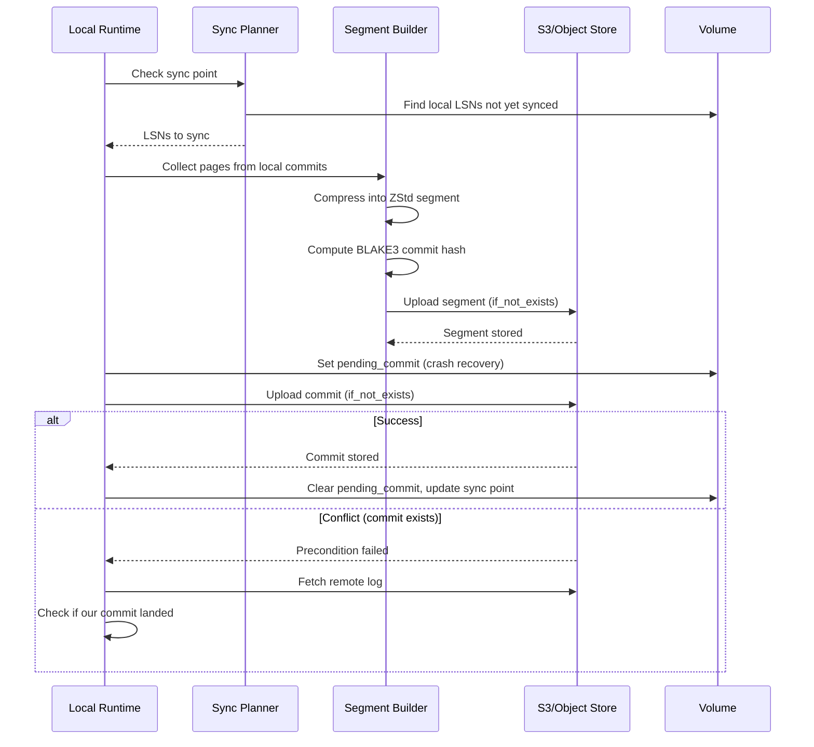

# Orbitinghail -- Remote Sync to S3

Graft syncs local changes to remote object storage (S3, filesystem, memory) through OpenDAL. The sync process uploads compressed segments containing pages and atomic commit records. The design ensures crash safety, idempotency, and efficient byte-range reads.

**Aha:** Remote storage uses CBE (Complement Big-Endian) encoding for LSNs in object paths. An LSN of 1000 becomes `CBE64(1000)` which sorts *descending* lexicographically. This means listing objects under `/logs/{logid}/commits/` in reverse order gives you the most recent commits first — the same ordering trick used in the local fjall keyspaces. The local and remote use the same ordering principle.

Source: `graft/crates/graft/src/remote/` — remote storage
Source: `graft/crates/graft/src/remote/segment.rs` — segment builder

## Object Path Layout

```
/logs/{logid}/commits/{CBE64-hex-LSN}    # Commit records
/segments/{sid}                          # Compressed page segments
```

Commits are stored one per file, named by their CBE-encoded LSN. Segments are stored by their SegmentId and contain multiple pages.

## CBE Encoding

CBE (Complement Big-Endian) encodes integers so that lexicographic string order matches numeric *descending* order:

```rust
// CBE64: ones-complement big-endian encoding
fn cbe64(n: u64) -> [u8; 8] {
    (!n).to_be_bytes()  // Complement then big-endian
}
```

Example: LSN 1 → all-ones complement → `0xFFFFFFFFFFFFFFFE` in hex. LSN 1000 → complement → sorts before LSN 1.

**Aha:** Without CBE, listing S3 objects would return commits in ascending LSN order (oldest first). You'd need to list all objects and then reverse the list to find the newest commits. With CBE, a simple reverse listing gives you newest first. For a log with millions of commits, this avoids listing the entire prefix.

## Segment Format

Source: `graft/crates/graft/src/remote/segment.rs`

Segments contain compressed pages using ZStd level 3:

```
┌──────────────────────────────────────────────────┐
│                   Segment File                    │
├──────────────────────────────────────────────────┤
│  Frame 1: ZStd compressed (up to 64 pages)      │
│  - Frame header (ZStd format)                    │
│  - Pages 1..N concatenated, sorted by PageIdx   │
├──────────────────────────────────────────────────┤
│  Frame 2: ZStd compressed                        │
├──────────────────────────────────────────────────┤
│  ...                                             │
└──────────────────────────────────────────────────┘
```

**Frame properties:**
- Each frame contains up to 64 pages (256 KB uncompressed max)
- Pages within a frame are strictly increasing by PageIdx
- ZStd checksum flag enabled — each frame has an integrity check
- Content size flag disabled — frames are stream-chunked

### Streaming Segment Builder

Source: `graft/crates/graft/src/remote/segment.rs`

```rust
pub struct SegmentBuilder {
    frames: ThinVec<SegmentFrameIdx>,
    chunks: Vec<Bytes>,
    cctx: CCtx<'static>,
    last_pageidx: Option<PageIdx>,
    current_frame_pages: PageCount,
    current_frame_bytes: u64,
    chunk: Vec<u8>,
}

impl SegmentBuilder {
    pub fn new() -> Self { /* sets ContentSizeFlag(false), ChecksumFlag(true), CompressionLevel(3) */ }
    pub fn write(&mut self, pageidx: PageIdx, page: &Page) { /* panics if out of order */ }
    pub fn finish(mut self) -> (ThinVec<SegmentFrameIdx>, Vec<Bytes>) { /* flushes last frame */ }
}
```

The builder uses a reusable `CCtx` to avoid allocation overhead. Output is chunked for memory efficiency — chunks are flushed to a Vec as the compression output buffer fills, not buffered entirely in memory. The `finish()` method returns both the frame index (for the commit record) and the compressed chunks (for upload).

## Remote Commit Process



### Step-by-Step

Source: `graft/crates/graft/src/rt/action/remote_commit.rs`

1. **Recovery check**: Call `attempt_recovery()` — if a `pending_commit` exists from a prior crash, fetch the remote log and verify whether the commit landed.
2. **Plan**: `plan_commit()` compares local sync point with remote. Determines which local LSNs need syncing. Detects divergence (remote has commits we don't know about).
3. **Build segment**: `build_segment()` runs in a blocking thread. Collects pages from local commits (newest first, deduplicating by PageIdx), compresses via `SegmentBuilder`, computes `CommitHash` via `CommitHashBuilder`. Also caches segment pages in local storage.
4. **Upload segment**: `remote.put_segment(sid, chunks)` — streaming upload via `writer_with().concurrent(5)`. No precondition — segments are content-addressed by SegmentId, so duplicates are harmless.
5. **Prepare**: `remote_commit_prepare()` sets `PendingCommit { local, commit, commit_hash }` on the Volume. This is the crash recovery point. Uses `precept::sometimes_fault!` for deterministic crash testing.
6. **Upload commit**: `remote.put_commit(&commit)` with `if_not_exists: true`. This is the linearization point — the commit is the authoritative durability record.
7. **Success**: `remote_commit_success()` clears `pending_commit`, updates the local sync point, writes the commit to the remote log locally.
8. **Conflict handling**: If `put_commit` returns `precondition_failed()`, call `attempt_recovery()` which runs `FetchLog` to pull the remote log and then `recover_pending_commit()` to check if our commit hash matches.

**Aha:** The `if_not_exists` precondition check makes the commit upload idempotent. Two processes syncing the same data concurrently won't corrupt each other — the second one's upload will fail the precondition check, and recovery will verify the first one's commit is correct. This eliminates the need for distributed locking. The `precept` fault injection framework enables deterministic testing of every crash point.

### Crash Recovery (PendingCommit)

```rust
pub struct PendingCommit {
    pub local: LSN,          // latest local LSN included in the commit
    pub commit: LSN,         // the remote LSN we're writing to
    pub commit_hash: CommitHash,  // expected hash of the commit
}
```

Recovery flow when `pending_commit` exists:
1. `FetchLog { log: volume.remote }` — fetch all commits from the remote log
2. `recover_pending_commit(vid)` — check if the commit at `pending_commit.commit` LSN has a matching `commit_hash`
3. If match: the commit succeeded before the crash — clear `pending_commit` and update sync point
4. If no match or not found: the commit failed — clear `pending_commit` (segment upload is idempotent, so the orphaned segment is harmless)

## S3 Optimizations

Source: `graft/crates/graft/src/remote.rs` — `RemoteConfig` and client setup

| Optimization | Implementation | Effect |
|-------------|---------------|--------|
| **HTTP/1 only** | `reqwest::ClientBuilder::new().http1_only()` | Avoids HTTP/2 head-of-line blocking for concurrent object uploads |
| **DNS caching** | `reqwest::ClientBuilder::hickory_dns(true)` | Reduces DNS lookup latency for repeated S3 requests |
| **Connect timeout** | `.connect_timeout(Duration::from_secs(5))` | Fast failure when S3 endpoint is unreachable |
| **TCP user timeout** | `.tcp_user_timeout(Duration::from_secs(60))` | Detects dead connections quickly |
| **RetryLayer** | `Operator::new(builder)?.layer(RetryLayer::new())` | Automatic retry on transient errors |
| **Concurrency** | `REMOTE_CONCURRENCY = 5` | Parallel reads/writes for throughput |

**Aha:** HTTP/1 is faster than HTTP/2 for object storage workloads. HTTP/2 multiplexes requests over a single connection, which means a slow request blocks all others (head-of-line blocking). For S3, where each request is independent and the bottleneck is network latency, multiple HTTP/1 connections give better throughput.

## Byte-Range Reads

To read a single page from a remote segment:

1. Read the commit to find the `segment_idx`
2. Read the segment's frame index (small, typically <1KB)
3. Find which frame contains the target PageIdx
4. Make an S3 `Range` request for just that frame's byte range
5. Decompress the frame and extract the page

This means reading one 4KB page from a 100MB segment only downloads the frame containing that page (typically 32-256KB), not the entire segment.

**Aha:** The frame index is the key to efficient random access. Without it, you'd need to download and decompress the entire segment to find one page. With it, you make a targeted `Range` request for just the bytes you need. The frame index is small because there are at most `ceil(total_pages / 64)` entries.

## Remote Struct and Methods

Source: `graft/crates/graft/src/remote.rs`

```rust
#[derive(Debug, Clone)]
pub struct Remote {
    store: Operator,  // OpenDAL operator
}

#[derive(Debug, Deserialize, Serialize, Default, Clone)]
#[serde(tag = "type", rename_all = "snake_case")]
pub enum RemoteConfig {
    Memory,
    Fs { root: String },
    S3Compatible { bucket: String, prefix: Option<String> },
}
```

Key methods on `Remote`:

```rust
impl Remote {
    pub fn with_config(config: RemoteConfig) -> Result<Self>;

    // Atomic commit write — returns precondition_failed on collision
    pub async fn put_commit(&self, commit: &Commit) -> Result<()>;

    // Streaming segment upload via writer_with().concurrent(5)
    pub async fn put_segment<I: IntoIterator<Item = Bytes>>(&self, sid: &SegmentId, chunks: I) -> Result<()>;

    // Byte-range read of a segment
    pub async fn get_segment_range(&self, sid: &SegmentId, bytes: Range<u64>) -> Result<Bytes>;

    // Fetch a commit (returns None if not found)
    pub async fn get_commit(&self, log: &LogId, lsn: LSN) -> Result<Option<Commit>>;

    // Stream commits in order, stopping at first NotFound
    pub fn stream_commits_ordered<I>(&self, log: &LogId, lsns: I) -> impl Stream<Item = Result<Commit>>;
}
```

**Aha:** `stream_commits_ordered` uses `FuturesOrdered` with chunked concurrency — the first LSN is fetched alone (fast failure if log is empty), then subsequent LSNs are fetched in batches of `REMOTE_CONCURRENCY`. It stops as soon as any fetch returns NotFound, avoiding scanning past the end of the log.

## Sync Lifecycle

Push and pull are independent — a client can work offline, accumulate local commits, and sync when connectivity is restored. Remote commits are pulled into the local log via the `FetchLog` action.

## Replicating in Rust

For a simpler S3 sync without the full graft stack:

```rust
use opendal::{Operator, layers::RetryLayer, options::{WriteOptions, ReadOptions}};

// Atomic write with precondition (graft uses write_options)
op.write_options(
    &path,
    data,
    WriteOptions {
        if_not_exists: true,
        concurrent: 5,
        ..WriteOptions::default()
    },
).await?;

// Streaming write (graft uses writer_with for segments)
let mut w = op.writer_with(&path).concurrent(5).await?;
for chunk in chunks {
    w.write(chunk).await?;
}
w.close().await?;

// Range read (graft uses read_options)
let buffer = op.read_options(
    &path,
    ReadOptions {
        range: (100..200).into(),
        concurrent: 5,
        ..ReadOptions::default()
    },
).await?;
```

See [Graft Storage](04-graft-storage.md) for the core data model.
See [S3 Remote Optimizations](10-s3-remote-optimizations.md) for detailed S3 patterns.
See [Checksums and Validation](09-checksums-validation.md) for commit hash verification.
