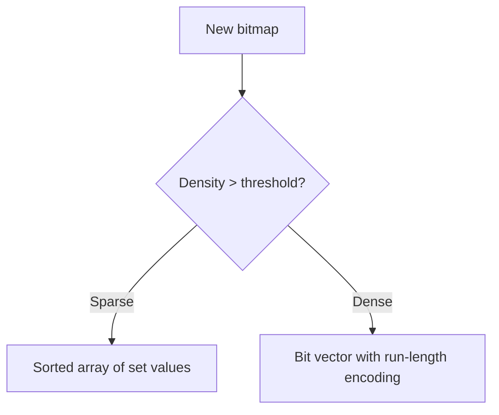

# Orbitinghail -- Splinter-RS Compressed Bitmap

Splinter-rs is a compressed bitmap for small, sparse sets of u32s with zero-copy querying. It is used by graft for `PageSet` tracking and by lsm-tree for block index compaction. The bitmap uses a combination of run-length encoding and sparse representation to achieve high compression for sparse sets.

**Aha:** Splinter-rs provides two main types: `Splinter` (owned) and `CowSplinter` (copy-on-write). The `CowSplinter` variant enables zero-copy reads from byte slices — the bitmap can be read directly from disk or network without deserialization. For sparse sets, the bitmap stores sorted arrays of values. For dense sets, it switches to a bit vector with run-length encoding. The transition between representations is transparent to the caller.

Source: `splinter-rs/src/lib.rs` — compressed bitmap operations

## Bitmap Structure

The library exposes `Splinter` (owned) and `CowSplinter<B>` (copy-on-write enum):

```rust
// splinter-rs/src/splinter.rs
#[derive(Clone, PartialEq, Eq, Default)]
pub struct Splinter(Partition<High>);  // 40 bytes, newtype over Partition

// splinter-rs/src/cow.rs
pub enum CowSplinter<B> {
    Ref(SplinterRef<B>),  // Zero-copy reference to serialized data
    Owned(Splinter),       // Owned, mutable splinter
}
```

`Splinter` is a newtype over `Partition<High>` (the top-level segment). `CowSplinter` provides the zero-copy story — `CowSplinter::Ref` reads directly from a byte slice without deserialization, while `CowSplinter::Owned` holds a fully materialized bitmap. Mutations on a `Ref` transparently promote to `Owned`.

## Operations

| Operation | Description | Complexity |
|-----------|-------------|-----------|
| `insert(u32)` | Set a bit | O(n) where n = bitmap size |
| `contains(u32) -> bool` | Check if bit is set | O(log n) with binary search |
| `cardinality() -> u32` | Count of set bits | O(1) — cached |
| `union(&Bitmap) -> Bitmap` | Set union | O(n + m) |
| `intersection(&Bitmap) -> Bitmap` | Set intersection | O(min(n, m)) |
| `cut(&Range<u32>) -> Bitmap` | Remove bits in range | O(n) |
| `select(n: u32) -> Option<u32>` | Find n-th set bit | O(n) |
| `iter() -> impl Iterator` | Iterate over set bits | O(cardinality) |

## Compression Strategy

The bitmap uses different encoding strategies based on density:



For **sparse sets** (<10% density): Store sorted array of set values as `u32` entries.

For **dense sets** (>10% density): Use a bit vector with run-length encoding. Consecutive runs of 0s or 1s are compressed as `(value, length)` pairs.

## Usage in Graft

In graft, `PageSet` tracks which pages are in a volume:

```rust
// Pages 1, 5, 100, 1000 set in a 10,000-page volume
use splinter_rs::Splinter;

let mut pageset = Splinter::new();
pageset.insert(1);
pageset.insert(5);
pageset.insert(100);
pageset.insert(1000);

// Check if page 5 is in the set
assert!(pageset.contains(5));
assert!(!pageset.contains(6));

// Union with another pageset
let pageset2 = ...;
let combined = pageset.union(&pageset2);
```

For a volume with 1 million pages where only 1000 are set, the sparse array uses 1000 × 3 = 3000 bytes instead of 1 million bits = 125,000 bytes.

## Usage in LSM-Tree

In lsm-tree, splinter-rs is used for block index tracking and prefix compression metadata. The compressed bitmap reduces the size of the binary index for large SSTables.

## Replicating in Rust

```rust
use splinter_rs::Splinter;

// Create and populate
let mut bm = Splinter::new();
for i in [1, 5, 100, 1000] {
    bm.insert(i);
}

// Query
assert_eq!(bm.cardinality(), 4);
assert!(bm.contains(100));

// Set operations
let other = Splinter::from_iter([5, 200, 300]);
let union = bm.union(&other);     // {1, 5, 100, 200, 300, 1000}
let intersection = bm.intersection(&other);  // {5}

// Iterate
for value in bm.iter() {
    println!("Set bit: {}", value);
}

// Zero-copy read from bytes (CowSplinter)
let bytes: &[u8] = &bm.to_bytes();
let cow = splinter_rs::CowSplinter::from_bytes(bytes);
assert_eq!(cow.cardinality(), 4);
```

See [Graft Storage](04-graft-storage.md) for how PageSet is used.
See [LSM-Tree](02-lsm-tree.md) for block index usage.
See [Architecture](01-architecture.md) for the dependency graph.
