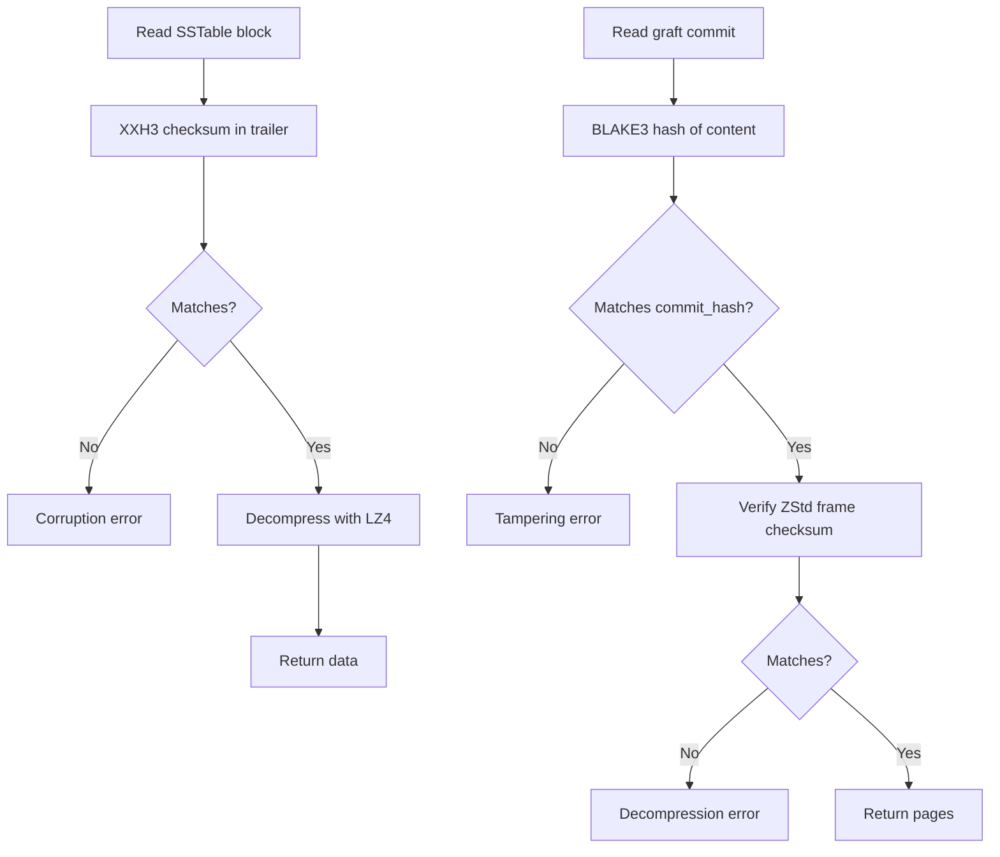

# Orbitinghail -- Checksums and Data Validation

The orbitinghail ecosystem uses multiple checksum and hash algorithms for data integrity, each chosen for its specific tradeoffs: speed, collision resistance, or cryptographic security.

**Aha:** The ecosystem uses a layered integrity strategy. At the block level, XXH3 128-bit catches random bit flips (fast, 99.999...% detection). At the commit level, BLAKE3 catches intentional tampering (cryptographic). At the segment level, ZStd checksums catch decompression errors. Each layer catches corruption at its granularity — a corrupted page in a segment is caught by the ZStd frame checksum before the BLAKE3 commit hash is even checked.

## XXH3 128-bit Checksums

**Used by:** lsm-tree blocks, SFA ToC, graft order-independent checksums

```rust
use xxhash_rust::xxh3::xxh3_128;

let hash: u128 = xxh3_128(data);
```

| Property | Value |
|----------|-------|
| Output size | 128 bits |
| Speed | ~30 GB/s on modern CPU |
| Collision resistance | Non-cryptographic (birthday bound 2^64) |
| Use case | Block integrity, corruption detection |

XXH3 is the fastest non-cryptographic hash for block-level integrity checks. It is used for:
- SSTable data block checksums (trailer)
- SFA Table of Contents checksum (trailer)
- Graft's order-independent set checksum

**Aha:** XXH3 is used for block checksums because decompression speed is the bottleneck, not hash speed. LZ4 decompresses at ~20 GB/s — computing XXH3 at 30 GB/s doesn't add measurable overhead. A cryptographic hash like BLAKE3 (~5 GB/s) would add ~25% overhead to the decompression pipeline.

## BLAKE3 Commit Hashes

**Used by:** graft commit hashes

```
┌────────────────���────┬────────────────────���─────┐
│ prefix (1 byte)     │ truncated BLAKE3 (31b)   │
│ b'C' (0x43)         │                          │
└──��──────────────────┴──────────────────��───────┘
Total: 32 bytes (COMMIT_HASH_SIZE), Base58 encoded = 44 chars
```

```rust
use blake3::Hasher;

const COMMIT_HASH_MAGIC: [u8; 4] = [0x68, 0xA4, 0x19, 0x30];

let mut hasher = Hasher::new();
hasher.update(&COMMIT_HASH_MAGIC);
hasher.update(log_id.as_bytes());
hasher.update(CBE64::from(lsn).as_bytes());         // CBE64-encoded
hasher.update(&vol_page_count.to_u32().to_be_bytes());   // big-endian
hasher.update(&commit_page_count.to_u32().to_be_bytes()); // big-endian
for (pageidx, page_data) in ordered_pages {
    hasher.update(&pageidx.to_u32().to_be_bytes());  // big-endian
    hasher.update(page_data.as_ref());
}
let hash = hasher.finalize();
// bytes[0] = b'C';  // overwrite first byte with CommitHashPrefix
```

| Property | Value |
|----------|-------|
| Output size | 32 bytes (1-byte prefix `b'C'` + 31-byte truncated BLAKE3) |
| Speed | ~5 GB/s |
| Collision resistance | Cryptographic (2^124 birthday bound on 31 bytes) |
| Use case | Commit integrity, tamper detection |

The hash covers:
- Magic 4-byte prefix `[0x68, 0xA4, 0x19, 0x30]` (domain separation in hash input)
- Log ID (16 bytes, which log this commit belongs to)
- LSN in CBE64 encoding (8 bytes)
- Volume page count in big-endian u32 (snapshot size)
- Commit page count in big-endian u32 (this commit's scope)
- Ordered (pageidx BE u32, page_data) pairs (actual data, must be in ascending PageIdx order)

**Aha:** The commit hash uses two layers of type safety: (1) the 4-byte `COMMIT_HASH_MAGIC` fed into the hasher provides domain separation — a BLAKE3 hash of commit data can never collide with a BLAKE3 hash of non-commit data because the inputs differ; (2) the first byte of the output is overwritten with `b'C'` (the `CommitHashPrefix`), making it visually distinguishable and parseable — if byte[0] != 0x43, it's not a valid CommitHash.

## ZStd Frame Checksums

**Used by:** graft segment frames

ZStd's built-in checksum (32-bit XXH32) is enabled for every frame:

```rust
use zstd::zstd_safe::{CCtx, CParameter};

let mut cctx = CCtx::create();
cctx.set_parameter(CParameter::ChecksumFlag(true))?;
```

The checksum covers the uncompressed frame content. On decompression, ZStd verifies the checksum — if it fails, decompression returns an error.

## Order-Independent Checksum (Graft)

Source: `graft/crates/graft/src/core/checksum.rs`

```rust
#[repr(C)]
pub struct Checksum {
    sum: u128,    // wrapping sum of xxh3_128 digests
    xor: u128,    // XOR of xxh3_128 digests
    count: u128,  // number of elements added
    bytes: u128,  // total byte length of all elements
}

pub struct ChecksumBuilder {
    checksum: Checksum,
}

impl ChecksumBuilder {
    pub const fn new() -> Self { /* ... */ }

    pub fn write<B: AsRef<[u8]>>(&mut self, data: &B) {
        let hash = xxh3_128(data.as_ref());
        self.checksum.sum = self.checksum.sum.wrapping_add(hash);
        self.checksum.xor ^= hash;
        self.checksum.count = self.checksum.count.wrapping_add(1);
        self.checksum.bytes = self.checksum.bytes.wrapping_add(data.as_ref().len() as u128);
    }

    pub const fn merge(self, b: Self) -> Self { /* combines two builders */ }
    pub const fn build(self) -> Checksum { self.checksum }
}
```

This checksum has the property: `checksum([a, b]) == checksum([b, a])`. Both wrapping addition and XOR are commutative. The four fields together detect:
- Duplicate items (XOR cancels for pairs, but sum and count differ)
- Items with same hash but different content (bytes differs)
- Missing or extra items (count differs)

Display uses `blake3::hash` of the raw `Checksum` bytes, then Base58, for human-readable comparison.

**Aha:** The order-independent checksum is used when the set of items matters but not their order. This is common in distributed systems where two nodes may process the same items in different orders but need to verify they have the same set. Without this property, every comparison would require sorting first.

## Checksum Verification Chain



## Replicating in Rust

```rust
// Block-level integrity with XXH3
use xxhash_rust::xxh3::xxh3_128;

let expected_checksum = xxh3_128(&block_data);
let actual_checksum = read_checksum_from_trailer(&file)?;
if expected_checksum != actual_checksum {
    return Err(Error::Corruption);
}

// Commit-level integrity with BLAKE3 (use CommitHashBuilder in practice)
use graft::core::commit_hash::CommitHashBuilder;

let mut builder = CommitHashBuilder::new(log_id, lsn, vol_pages, commit_pages);
for (pageidx, page) in pages_in_ascending_order {
    builder.write_page(pageidx, &page);  // panics if out of order
}
let commit_hash = builder.build();  // CommitHash with b'C' prefix
```

See [Storage Formats](08-storage-formats.md) for the formats that use these checksums.
See [S3 Remote Optimizations](10-s3-remote-optimizations.md) for remote integrity patterns.
See [LSM-Tree](02-lsm-tree.md) for block-level checksums.
