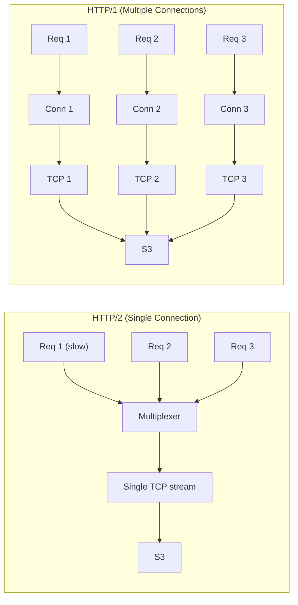

# Orbitinghail -- S3 and Remote Storage Optimizations

This document details the optimizations used when writing to S3 and other remote object stores in the orbitinghail ecosystem. The graft remote storage layer applies specific HTTP, DNS, connection, and concurrency optimizations that are non-obvious but critical for production performance.

**Aha:** The single most impactful S3 optimization in this codebase is using HTTP/1 instead of HTTP/2. HTTP/2 multiplexes all requests over a single TCP connection, which means one slow request (e.g., a large object upload) blocks all other requests — head-of-line blocking at the TCP level. For S3, where each request is independent and the bottleneck is per-request latency, 5 concurrent HTTP/1 connections give better throughput than 1 HTTP/2 connection with multiplexing.

Source: `graft/crates/graft/src/remote.rs` — remote client configuration

## HTTP/1 vs HTTP/2 for Object Storage



| Aspect | HTTP/2 | HTTP/1 (multi-conn) |
|--------|--------|-------------------|
| Connection count | 1 | 5 |
| Head-of-line blocking | Yes (TCP level) | No |
| TLS handshake | 1 | 5 |
| Memory per connection | Higher | Lower |
| Throughput for independent requests | Lower | Higher |

## DNS Caching with Hickory

```rust
let client = reqwest::ClientBuilder::new()
    .hickory_dns(true)  // enables hickory-resolver for DNS caching
    .build()?;
```

S3 requests resolve `bucket.s3.region.amazonaws.com` on every new connection. Without DNS caching, each connection adds ~10-50ms for DNS resolution. Hickory (via reqwest's `hickory_dns` feature) caches DNS responses according to their TTL, reducing resolution to ~0ms for cached entries.

## Connection Timeouts

```rust
let client = reqwest::ClientBuilder::new()
    .http1_only()
    .hickory_dns(true)
    .connect_timeout(Duration::from_secs(5))     // fail fast when S3 is unreachable
    .tcp_user_timeout(Duration::from_secs(60))   // detect dead connections
    .build()?;
```

The connect timeout prevents hanging on network issues. The TCP user timeout (Linux-specific) detects connections that have stopped responding — the kernel sends a RST after 60 seconds of unacked data.

## Retry Strategy

```rust
use opendal::layers::RetryLayer;

let op = Operator::new(backend)?
    .layer(RetryLayer::new())
    .finish();
```

The `RetryLayer::new()` applies OpenDAL's default retry strategy with exponential backoff and jitter for transient S3 errors.

## Concurrent Operations

```rust
const REMOTE_CONCURRENCY: usize = 5;

// Commits: write_options with concurrent
self.store.write_options(&path, data, WriteOptions {
    if_not_exists: true,
    concurrent: REMOTE_CONCURRENCY,
    ..WriteOptions::default()
}).await?;

// Segments: streaming writer with concurrent
let mut w = self.store.writer_with(&path).concurrent(REMOTE_CONCURRENCY).await?;
for chunk in chunks {
    w.write(chunk).await?;
}
w.close().await?;

// Reads: read_options with concurrent
self.store.read_options(&path, ReadOptions {
    range: bytes.into(),
    concurrent: REMOTE_CONCURRENCY,
    ..ReadOptions::default()
}).await?;
```

5 concurrent operations provide a good balance between throughput and connection count. The concurrency is set per-operation via OpenDAL's `WriteOptions`/`ReadOptions`, not via a global connection pool.

## Atomic Writes with Preconditions

```rust
// graft uses write_options with if_not_exists
let result = op.write_options(
    &path,
    data,
    WriteOptions { if_not_exists: true, ..WriteOptions::default() },
).await;

match result {
    Ok(()) => { /* Created new object */ },
    Err(err) if err.kind() == ErrorKind::ConditionNotMatch => {
        /* Object already exists — check via RemoteErr::precondition_failed() */
    },
    Err(err) => return Err(err.into()),
}
```

S3 supports conditional writes via `If-None-Match: *`. OpenDAL abstracts this as `if_not_exists: true` in `WriteOptions`. This is used for:
- Commit records: prevent duplicate commits (only point of contention)
- Segments are written without precondition (content-addressed by SegmentId)

**Aha:** The `if_not_exists` precondition replaces distributed locking. Instead of acquiring a lock before writing, two processes simply attempt to write with `if_not_exists(true)`. One succeeds, the other gets a condition-not-met error. This is lock-free idempotency — the same pattern used in distributed databases with compare-and-swap operations.

## Object Path Design

```
/logs/{logid}/commits/{CBE64-hex-LSN}    # CBE encoding for descending order
/segments/{sid}                          # Flat structure
```

CBE encoding ensures that listing objects in reverse order gives the newest commits first. This eliminates the need to list all objects and sort them.

## Byte-Range Reads

```rust
// graft uses get_segment_range with ReadOptions
let bytes = remote.get_segment_range(&sid, 1000..2000).await?;

// Internally calls:
let buffer = self.store.read_options(&path, ReadOptions {
    range: (1000..2000u64).into(),
    concurrent: REMOTE_CONCURRENCY,
    ..ReadOptions::default()
}).await?;
```

S3 supports HTTP Range headers for partial object reads. The graft segment format leverages this by storing a frame index (`SegmentFrameIdx { frame_size, last_pageidx }`) that maps PageIdx to byte ranges. Reading one page requires downloading only the frame containing that page — the `SegmentIdx::frame_for_pageidx` method computes the byte range from the frame index.

## Cost Considerations

| Operation | S3 Cost | Optimization |
|-----------|---------|-------------|
| PUT request | $0.005 per 1000 | Batch pages into segments to reduce PUT count |
| GET request | $0.0004 per 1000 | Use Range requests to get only needed frames |
| LIST request | $0.005 per 1000 | Use CBE encoding to avoid listing all objects |
| Data transfer out | $0.09/GB | Compress pages with ZStd (typically 2-3x ratio) |

## Replicating in Rust

```rust
use opendal::{Operator, layers::{HttpClientLayer, RetryLayer}, raw::HttpClient, services::S3};
use opendal::options::{WriteOptions, ReadOptions};

// Build the S3 operator with graft's optimizations
let mut builder = S3::default().bucket("my-bucket");
let client = reqwest::ClientBuilder::new()
    .http1_only()
    .hickory_dns(true)
    .connect_timeout(Duration::from_secs(5))
    .tcp_user_timeout(Duration::from_secs(60))
    .build()?;

let op = Operator::new(builder)?
    .layer(HttpClientLayer::new(HttpClient::with(client)))
    .layer(RetryLayer::new())
    .finish();

// Atomic commit write
op.write_options("path/to/commit", data, WriteOptions {
    if_not_exists: true,
    concurrent: 5,
    ..WriteOptions::default()
}).await?;

// Range read
let buffer = op.read_options("path/to/segment", ReadOptions {
    range: (1000..2000u64).into(),
    concurrent: 5,
    ..ReadOptions::default()
}).await?;
```

See [Remote Sync](05-remote-sync.md) for the full sync process.
See [Graft Storage](04-graft-storage.md) for segment format.
See [Production Patterns](12-production-patterns.md) for broader production considerations.
