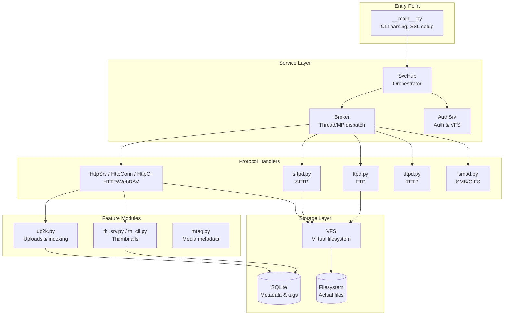

# copyparty Overview

copyparty is a portable HTTP file server that transforms any device with Python into a multi-protocol file sharing hub. It provides a web-based interface for browsing, uploading, downloading, and managing files, alongside support for WebDAV, SFTP, FTP, TFTP, and SMB protocols.

**Source:** `/home/darkvoid/Boxxed/@formulas/src.rust/src.copyparty/copyparty`  
**Repository:** https://github.com/9001/copyparty  
**License:** MIT  
**Language:** Python (2.7+ and 3.3+)

## What It Does

copyparty maps local filesystem directories to web-accessible URLs with granular permission control. The server handles:

- **File browsing** through a responsive web interface with thumbnails and media previews
- **Resumable uploads** using a custom up2k protocol that survives network interruptions
- **Multi-protocol access** via HTTP, WebDAV, SFTP, FTP, TFTP, and SMB simultaneously
- **Media streaming** with on-the-fly transcoding and thumbnail generation
- **File deduplication** through content-addressed storage and symlink-based dedup
- **Search indexing** with SQLite-backed metadata for files, including media tags

The design philosophy prioritizes portability and minimal dependencies. The entire server runs as a single Python module with only one mandatory dependency (Jinja2). All other features—thumbnails, media transcoding, cryptographic hashing—are optional and detected at runtime.

## Architecture at a Glance



## Key Components

### SvcHub (svchub.py:114)

The `SvcHub` class is the central orchestrator that hosts all services relying on monolithic resources. It creates and manages:

- **Broker**: Handles dispatch to worker threads or processes
- **AuthSrv**: Authentication and virtual filesystem
- **Thumbnail service**: Media thumbnail generation
- **mDNS/SSDP**: Network discovery

```python
class SvcHub(object):
    """
    Hosts all services which cannot be parallelized due to reliance
    on monolithic resources. Creates a Broker which does most of
    the heavy stuff; hosted services can use this to perform work:
        hub.broker.<say|ask>(destination, args_list).
    """
```

### HttpSrv (httpsrv.py:110)

Handles incoming HTTP connections using `HttpConn` for connection management and `HttpCli` for request processing. Key features:

- Thread pool management for connection handling
- Jinja2 template rendering for web UI
- Rate limiting and IP banning via `Garda` class
- IP allowlist/blocklist support

### HttpCli (httpcli.py:212)

Processes individual HTTP transactions. Each request gets an `HttpCli` instance that:

- Parses HTTP headers and request lines
- Handles authentication via `AuthSrv`
- Serves files, directories, and API endpoints
- Implements WebDAV methods (PROPFIND, PROPPATCH, etc.)

### AuthSrv & VFS (authsrv.py)

The authentication server maintains user accounts, groups, and the virtual filesystem (VFS). The VFS maps URL paths to physical directories with permission overlays. Permissions include:

- `r` - read (browse, download)
- `w` - write (upload)
- `x` - execute/move
- `d` - delete
- `g` - get (direct file access)
- `G` - upget (upload and get)
- `h` - html (view as web page)
- `a` - admin (server control)

### up2k (up2k.py:149)

The upload subsystem providing:

- Resumable uploads with client-side chunking
- Deduplication via content hashing
- SQLite-backed file registry
- Metadata extraction for media files

## Aha: The "Leeloo Dallas" Pattern

**Key insight:** copyparty uses a special internal username `LEELOO_DALLAS` for operations that must bypass normal permission checks.

From `authsrv.py:76-94`:

```python
LEELOO_DALLAS = "leeloo_dallas"
##
## you might be curious what Leeloo Dallas is doing here, so let me explain:
##
## certain daemonic tasks, namely:
##  * deletion of expired files, running on a timer
##  * deletion of sidecar files, initiated by plugins
## need to skip the usual permission-checks to do their thing,
## so we let Leeloo handle these
##
## and also, the smb-server has really shitty support for user-accounts
## so one popular way to avoid issues is by running copyparty without users;
## this makes all smb-clients identify as LD to gain unrestricted access
##
## Leeloo, being a fictional character from The Fifth Element,
## obviously does not exist and will never be able to access any copyparty
## instances from the outside (the username is rejected at every entrypoint)
```

This is a clever design: instead of sprinkling `if admin: bypass_checks()` throughout the codebase, there's a single well-known identity that gets full access, and this identity can never authenticate from the outside because it's explicitly rejected at all entry points.

## Multi-Protocol Design

A notable architectural decision is the unified backend across protocols. SFTP, FTP, TFTP, and SMB all delegate to the same `VFS` and authentication layer rather than implementing parallel filesystem logic. This ensures consistent permission behavior regardless of how clients connect.

The HTTP implementation is most feature-complete, handling the web UI, REST API, and WebDAV. Other protocols provide basic file access with varying degrees of feature support (SFTP has full read/write, TFTP is read-only by default, SMB has limited metadata support).

## Next Document

[01-architecture.md](01-architecture.md) — Module dependency graph and detailed layer breakdown.
