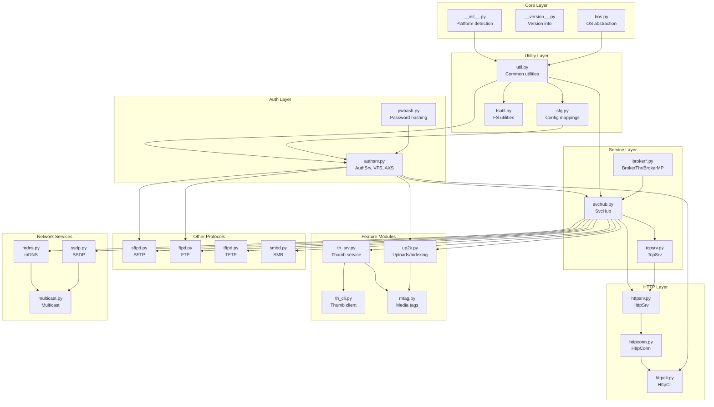
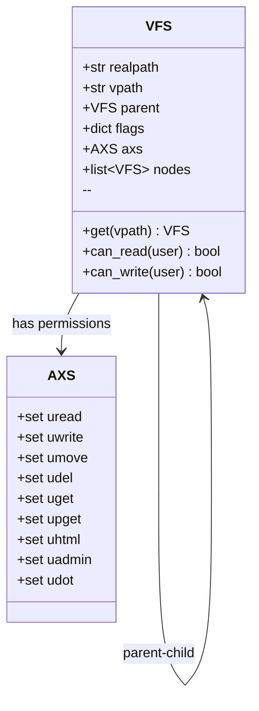
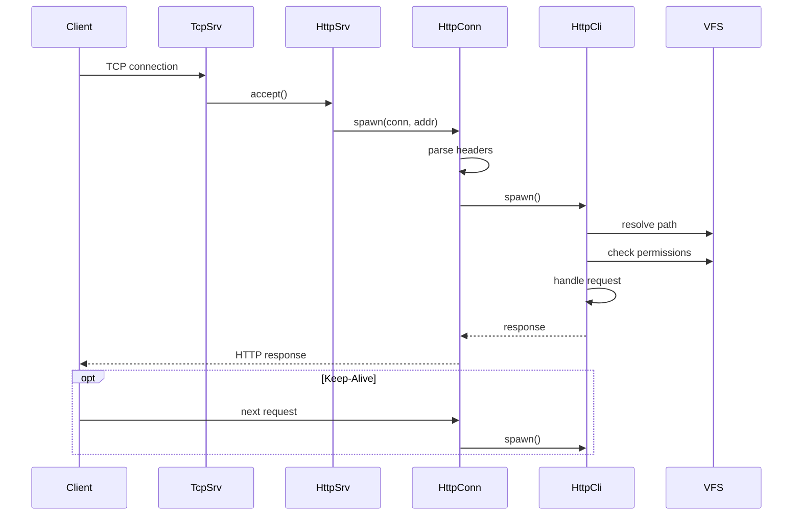
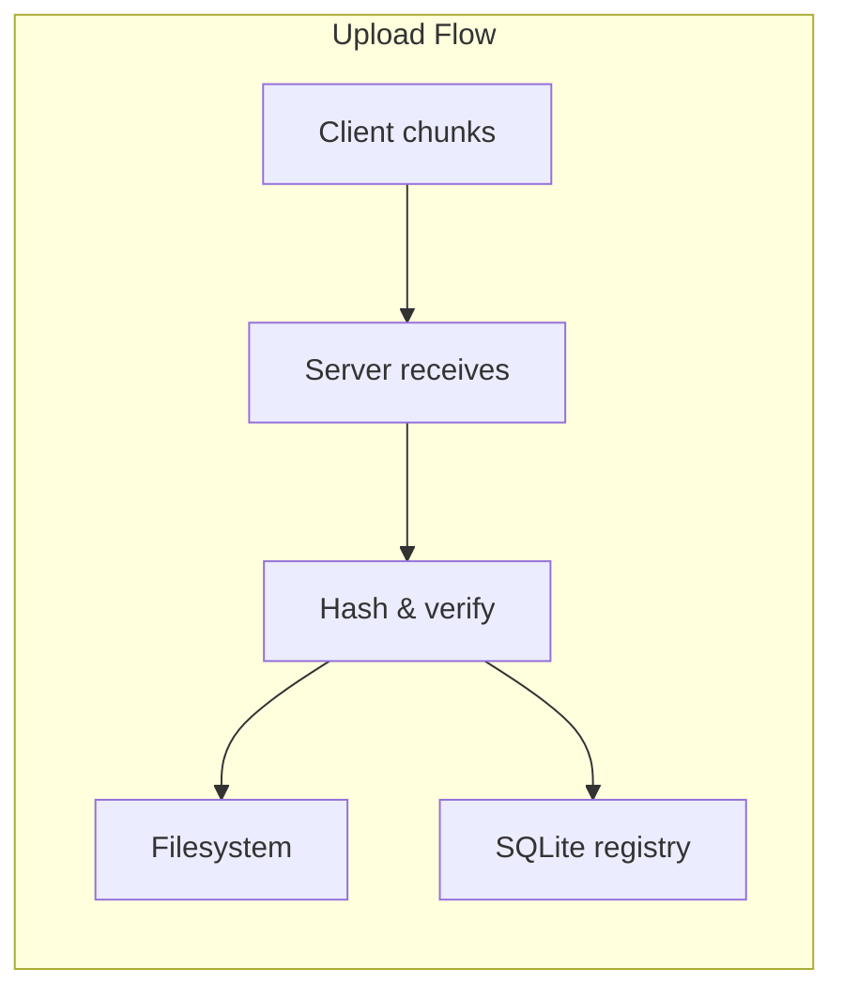
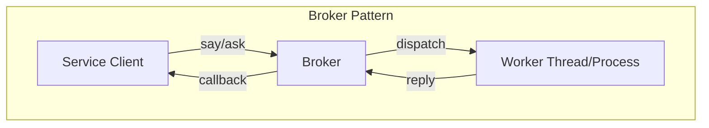

# copyparty Architecture

This document details the architectural layers, module dependencies, and component relationships in copyparty.

## Module Dependency Graph



## Layer Architecture

### Layer 1: Platform Abstraction (`__init__.py`, `bos.py`)

The foundation handles Python 2/3 compatibility and OS differences.

**`__init__.py`** detects:
- Python version (PY2, PY36, etc.)
- Operating system (ANYWIN, MACOS)
- Execution context (EXE for PyInstaller)

**`bos.py`** provides OS abstraction:
```python
# Cross-platform path operations
bos.path.join  # Uses / on all platforms for consistency
bos.makedirs   # Creates directories with proper permissions
```

### Layer 2: Utilities (`util.py`, `fsutil.py`, `cfg.py`)

**`util.py`** (127KB) is the largest utility module containing:
- `Daemon` - Thread wrapper with naming
- `Garda` - Rate limiting/banning
- `ODict` - Ordered dict with attribute access
- `Pebkac` - Exception class for user errors
- HTTP helpers: `read_header`, `sendfile_kern`, `sendfile_py`
- Encoding: `ub64enc`, `ub64dec`, `html_escape`

**`fsutil.py`** (8KB) handles filesystem operations:
- `Fstab` - Filesystem type detection
- `ramdisk_chk` - Check if path is on ramdisk

**`cfg.py`** (19KB) contains configuration mappings:
- `vf_bmap()` - Boolean volflag mappings
- `vf_vmap()` - Value volflag mappings  
- `vf_cmap()` - Complex/list volflag mappings
- `flagcats` - CLI argument categories

### Layer 3: Authentication & VFS (`authsrv.py`)

**`AuthSrv`** manages users, groups, and the virtual filesystem.

**`VFS`** maps URL paths to physical directories:


**`AXS`** (access) class defines permissions per user:
```python
class AXS(object):
    def __init__(self, uread=None, uwrite=None, umove=None,
                 udel=None, uget=None, upget=None, uhtml=None,
                 uadmin=None, udot=None):
        self.uread = set(uread or [])   # Read access
        self.uwrite = set(uwrite or []) # Upload
        self.umove = set(umove or [])   # Move/rename
        self.udel = set(udel or [])     # Delete
        # ... etc
```

### Layer 4: Service Hub (`svchub.py`)

**`SvcHub`** is the central coordinator. It cannot be parallelized due to reliance on monolithic resources like SQLite databases.

Key responsibilities:
1. Creates and manages `Broker` (thread or multiprocess dispatch)
2. Initializes `AuthSrv` with user/VFS configuration
3. Starts protocol servers (HTTP, SFTP, FTP, etc.)
4. Manages thumbnail service
5. Handles signals (SIGHUP for reload, SIGTERM for shutdown)

```python
class SvcHub(object):
    """
    Hosts all services which cannot be parallelized due to reliance
    on monolithic resources. Creates a Broker which does most of the
    heavy stuff; hosted services can use this to perform work:
        hub.broker.<say|ask>(destination, args_list).
    """
```

### Layer 5: Protocol Handlers

#### HTTP Stack (`httpsrv.py`, `httpconn.py`, `httpcli.py`)



**`HttpSrv`** (23KB):
- Manages listening sockets
- Thread pool for connection handling
- Jinja2 template environment
- Rate limiters (Garda instances)

**`HttpConn`** (7KB):
- Wraps socket with buffered I/O
- Parses HTTP headers
- Spawns `HttpCli` per request

**`HttpCli`** (272KB - largest module):
- Processes HTTP transactions
- Handles all HTTP methods (GET, POST, PUT, DELETE, WebDAV)
- File serving with range requests
- Directory listings with JSON/XML/HTML output
- Upload handling

#### Other Protocols

| Protocol | File | Backend | Notes |
|----------|------|---------|-------|
| SFTP | `sftpd.py` | `VFS` | paramiko-based |
| FTP | `ftpd.py` | `VFS` | pyftpdlib-based |
| TFTP | `tftpd.py` | `VFS` | partftpy-based |
| SMB | `smbd.py` | `VFS` | smbprotocol-based |

### Layer 6: Feature Modules

#### up2k (`up2k.py`)

The upload and indexing system. 194KB of code handling:
- Chunked, resumable uploads
- Content-addressed deduplication
- SQLite metadata database
- File change monitoring



#### Thumbnails (`th_srv.py`, `th_cli.py`)

**`ThumbSrv`** runs in a separate process/thread and generates thumbnails.

Supported backends:
- **PIL/Pillow** - Image thumbnails (jpg, png, webp, jxl)
- **FFmpeg** - Video thumbnails
- **libvips** - Alternative image processor

**`ThumbCli`** communicates with `ThumbSrv` via the broker.

### Layer 7: Network Services (`mdns.py`, `ssdp.py`)

- **mDNS**: Bonjour/Zeroconf service announcement
- **SSDP**: UPnP/Windows network discovery

## Broker Architecture

The broker provides async communication between services:



Two implementations:
- **`BrokerThr`** (`broker_thr.py`) - Thread-based, shared memory
- **`BrokerMP`** (`broker_mp.py`, `broker_mpw.py`) - Multiprocess, uses queues

## Aha: Thread Pool Sizing Strategy

**Key insight:** copyparty uses a dynamic thread pool that scales based on actual load rather than pre-allocating threads.

From `httpsrv.py:283-295`:

```python
def periodic(self) -> None:
    while True:
        time.sleep(2 if self.tp_ncli or self.ncli else 10)
        with self.u2mutex, self.mutex:
            self.u2fh.clean()
            if self.tp_q:
                self.tp_ncli = max(self.ncli, self.tp_ncli - 2)
                if self.tp_nthr > self.tp_ncli + 8:
                    self.stop_threads(4)

            if not self.ncli and not self.u2fh.cache and self.tp_nthr <= 8:
                self.t_periodic = None
                return
```

The server:
1. Starts with 4 worker threads (configurable)
2. Adds threads when queue builds up
3. Removes threads when idle (down to minimum)
4. The periodic thread sleeps longer (10s vs 2s) when completely idle

This avoids the thundering herd problem while keeping memory usage low during idle periods.

## Next Document

[02-http-handlers.md](02-http-handlers.md) — Deep dive into HTTP request handling.
