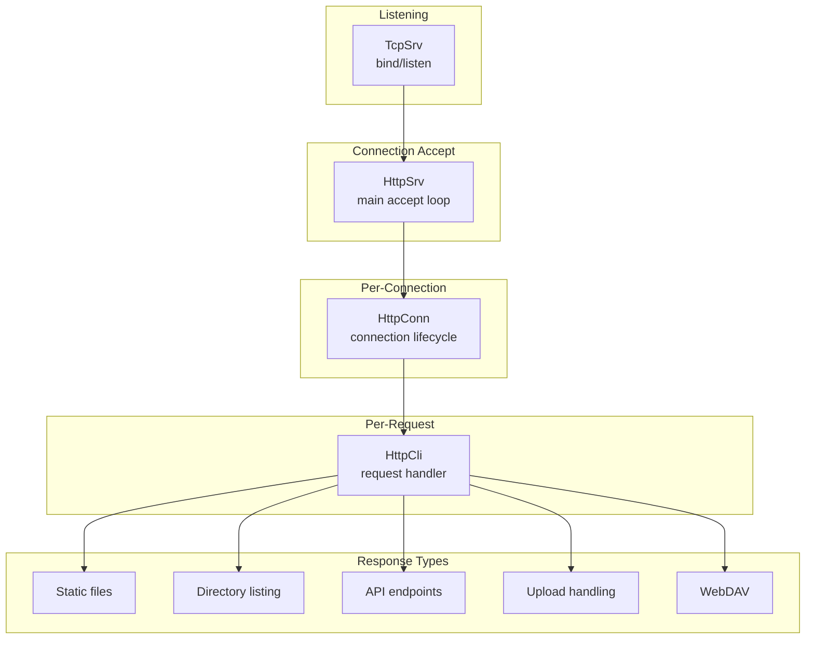
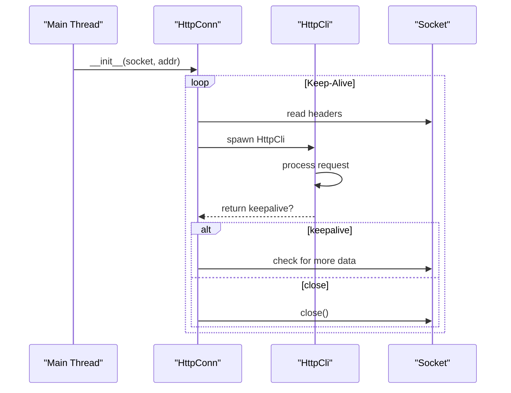
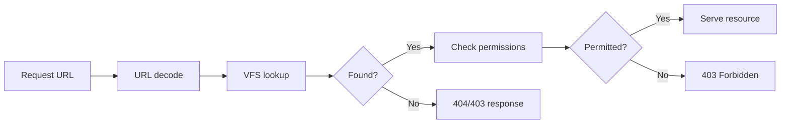

# copyparty HTTP Handlers

This document covers the HTTP handling stack, from socket acceptance to response generation.

## Handler Architecture



## TcpSrv: The Listener

**File:** `tcpsrv.py:1`

`TcpSrv` handles the low-level socket binding and listening:

```python
class TcpSrv(object):
    def __init__(self, hub: SvcHub) -> None:
        self.hub = hub
        self.args = hub.args
        # ...

    def listen(self, sck: socket.socket, nlisteners: int) -> None:
        """Start listening on a socket"""
        # Binds to interface, sets socket options
```

Key features:
- Supports TCP and Unix domain sockets
- Socket options: `SO_REUSEADDR`, `TCP_NODELAY`
- Can listen on multiple interfaces/ports
- IPv4 and IPv6 support

## HttpSrv: The Orchestrator

**File:** `httpsrv.py:110`

`HttpSrv` manages the HTTP server lifecycle:

```python
class HttpSrv(object):
    """
    handles incoming connections using HttpConn to process http,
    relying on MpSrv for performance (HttpSrv is just plain threads)
    """
```

### Initialization (`httpsrv.py:116-244`)

```python
def __init__(self, broker: "BrokerCli", nid: Optional[int]) -> None:
    self.broker = broker
    self.args = broker.args
    self.asrv = broker.asrv  # AuthSrv reference

    # Rate limiters (Garda instances)
    self.gpwd = Garda(self.args.ban_pw)    # Password attempts
    self.gpwc = Garda(self.args.ban_pwc)  # Password cookies
    self.g404 = Garda(self.args.ban_404)  # 404 probing
    self.g403 = Garda(self.args.ban_403)  # 403 responses

    # Thread pool for worker threads
    self.tp_q: Optional[queue.LifoQueue] = (
        None if self.args.no_htp else queue.LifoQueue()
    )

    # Jinja2 template environment
    self.j2 = self._init_jinja2()
```

### Thread Pool (`httpsrv.py:266-281`)

```python
def start_threads(self, n: int) -> None:
    self.tp_nthr += n
    for _ in range(n):
        Daemon(self.thr_poolw, self.name + "-poolw")

def thr_poolw(self) -> None:
    """Worker thread - processes requests from queue"""
    while True:
        item = self.tp_q.get()
        if item is None:  # Shutdown signal
            break
        conn, addr = item
        HttpConn(self, conn, addr)
```

## HttpConn: Connection Handler

**File:** `httpconn.py:1`

`HttpConn` wraps a single TCP connection and manages HTTP keep-alive:

```python
class HttpConn(object):
    """Handles a single HTTP connection (may process multiple requests via keep-alive)"""

    def __init__(self, hsrv: HttpSrv, s: socket.socket, addr: tuple) -> None:
        self.hsrv = hsrv
        self.s = s
        self.addr = addr
        self.sr = SocketReader(s)  # Buffered reader
        self.run()
```

### Connection Lifecycle



## HttpCli: Request Processor

**File:** `httpcli.py:212`

`HttpCli` is the largest module (272KB) handling all HTTP logic:

```python
class HttpCli(object):
    """Spawned by HttpConn to process one http transaction"""

    def __init__(self, conn: "HttpConn") -> None:
        self.conn = conn
        self.s = conn.s           # socket
        self.sr = conn.sr         # socket reader
        self.ip = conn.addr[0]    # client IP
        self.args = conn.args     # server args
        self.asrv = conn.asrv     # AuthSrv
```

### Request Parsing (`httpcli.py:335-420`)

```python
def run(self) -> bool:
    """returns true if connection can be reused"""
    # Read HTTP headers with timeout
    self.s.settimeout(2)
    headerlines = read_header(self.sr, self.args.s_thead, self.args.s_thead)

    # Parse request line: "GET /path HTTP/1.1"
    self.mode, self.req, self.http_ver = headerlines[0].split(" ")

    # Normalize headers to lowercase
    for header_line in headerlines[1:]:
        k, zs = header_line.split(":", 1)
        self.headers[k.lower()] = zs.strip()

    # Determine keep-alive
    zs = self.headers.get("connection", "").lower()
    self.keepalive = "close" not in zs and (
        self.http_ver != "HTTP/1.0" or zs == "keep-alive"
    )
```

### URL Routing

The main dispatch happens in `run()` after parsing. Key routes:

| Prefix | Handler | Purpose |
|--------|---------|---------|
| `/.cpr/` | `tx_cpr()` | Internal resources (CSS, JS, images) |
| `/?` | `tx_index()` | Directory listing or index file |
| `/up2k` | `handle_upload()` | Upload API endpoints |
| `/thumbs` | `tx_thumb()` | Thumbnail serving |
| `/api` | Various | REST API endpoints |
| `/f/` | `tx_file()` | Direct file access |

### Virtual Path Resolution



From `httpcli.py`:

```python
# Parse virtual path from request
self.vpath = unquotep(self.req.split(" ")[1])
self.vpaths = self.vpath.split("/")

# Look up in VFS
self.vn = self.asrv.vfs  # Root VFS node
self.avn = self.vn.get(self.vpath)  # Actual VFS node

# Check permissions
self.can_read = self.avn.can_read(self.uname)
self.can_write = self.avn.can_write(self.uname)
```

## Directory Listings

**File:** `httpcli.py` - `tx_index()` method

Directory listings support multiple output formats:

```python
def tx_index(self, vpath: str) -> bool:
    # Determine format from request
    if "?json" in self.uparam:
        return self.tx_dir_json(vpath)
    elif "?xml" in self.uparam:
        return self.tx_dir_xml(vpath)
    elif "?tar" in self.uparam:
        return self.tx_dir_tar(vpath)
    else:
        return self.tx_dir_html(vpath)  # Default
```

### HTML Directory Listing

Uses Jinja2 template `browser.html`:

```python
def tx_dir_html(self, vpath: str) -> bool:
    files = self.listdir(vpath)
    html = self.j2s("browser",
        files=files,
        breadcrumbs=self.get_breadcrumbs(vpath),
        # ... template vars
    )
    self.send_html(html)
```

## File Serving

### Static File Serving (`httpcli.py`)

```python
def tx_file(self, vpath: str) -> bool:
    """Serve a file with proper headers"""
    fspath = self.avn.realpath

    # Check if-modified-since
    if self.check_304(fspath):
        return self.send_304()

    # Determine mime type
    mime = self.guess_mime(fspath)

    # Handle range requests
    if "range" in self.headers:
        return self.send_range(fspath, self.headers["range"])

    # Send file
    self.send_file(fspath, mime)
```

### sendfile Optimization

**Key insight:** copyparty uses kernel `sendfile` when available for zero-copy file serving.

From `util.py`:

```python
def sendfile_kern(self, f, n: int) -> int:
    """Use kernel sendfile for zero-copy transfer"""
    import sendfile  # type: ignore
    return sendfile.sendfile(self.s.fileno(), f.fileno(), None, n)

def sendfile_py(self, f, n: int) -> int:
    """Fallback to userspace copy"""
    return self.s.send(f.read(n))
```

## WebDAV Support

**File:** `httpcli.py` - WebDAV methods

WebDAV extends HTTP with additional methods:

```python
def do_PROPFIND(self) -> bool:
    """List directory properties (WebDAV)"""
    depth = self.headers.get("depth", "infinity")
    # Generate XML response with file properties

def do_MKCOL(self) -> bool:
    """Create directory (WebDAV)"""
    # Create directory with proper permissions

def do_COPY(self) -> bool:
    """Copy file (WebDAV)"""
    # Copy with overwrite handling

def do_MOVE(self) -> bool:
    """Move file (WebDAV)"""
    # Move with overwrite handling
```

## Reverse Proxy Support

**Aha:** copyparty has sophisticated reverse proxy detection with security considerations.

From `httpcli.py:419-484`:

```python
def run(self) -> bool:
    # X-Forwarded-For handling
    n = self.args.rproxy
    if n:
        zso = self.headers.get(self.args.xff_hdr)
        if zso:
            zsl = zso.split(",")
            cli_ip = zsl[n].strip()  # Get nth hop

            # Security: Verify proxy is trusted
            pip = self.conn.addr[0]  # Proxy IP
            xffs = self.conn.xff_nm   # Allowed proxies
            if xffs and not xffs.map(pip):
                # Reject - untrusted proxy
                self.log("got header from untrusted source", 3)
```

The design prevents IP spoofing by:
1. Only accepting XFF from configured trusted proxies (`--xff-src`)
2. Configurable header depth (`--rproxy N`)
3. Fallback protocol detection (`--xf-proto`, `--xf-proto-fb`)

## Aha: Connection Reuse Tracking

**Key insight:** `HttpConn` tracks connection reuse to detect suspicious patterns.

```python
class HttpConn:
    def __init__(self, hsrv, s, addr):
        # ...
        self.nreq = 0  # Request counter

    def run(self):
        while True:
            self.nreq += 1
            cli = HttpCli(self)
            keepalive = cli.run()
            if not keepalive:
                break
            # Reset timeout for next request
            self.s.settimeout(120 if self.args.keepalive else 30)
```

This allows detecting:
- Request flooding from single connection
- Slowloris attacks (via timeout tracking)
- Connection exhaustion attempts

## Next Document

[03-authentication.md](03-authentication.md) — Authentication system and access control.
