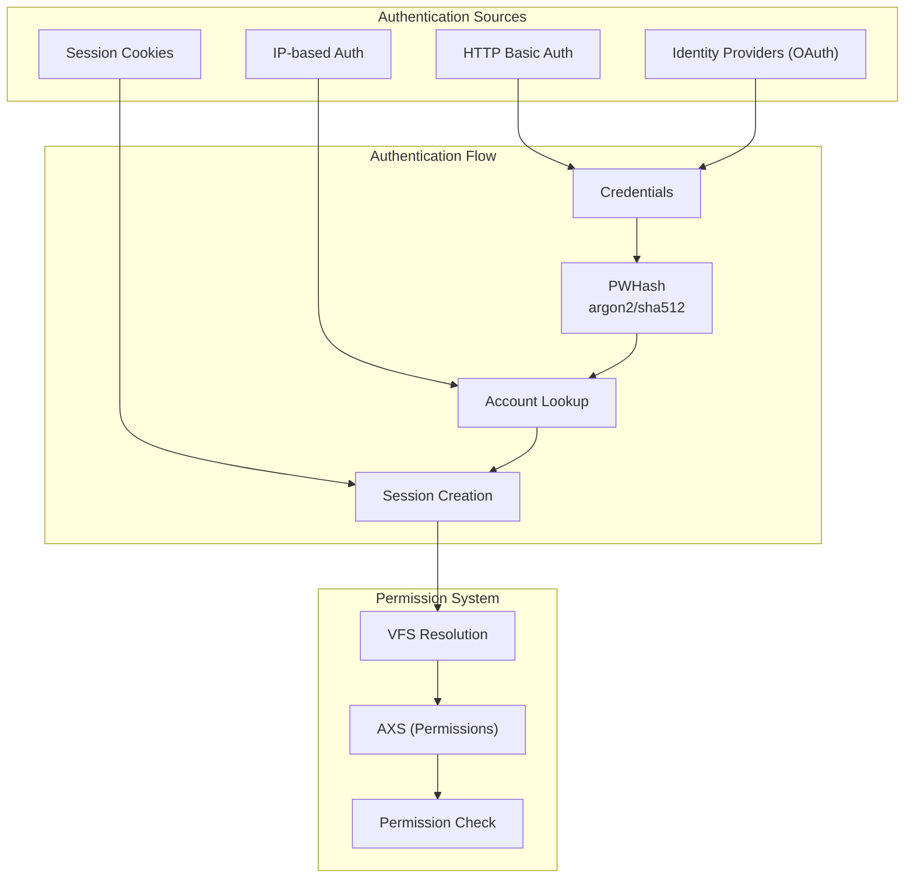
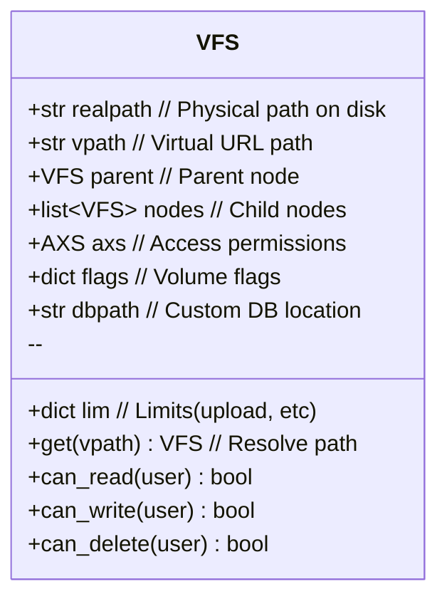
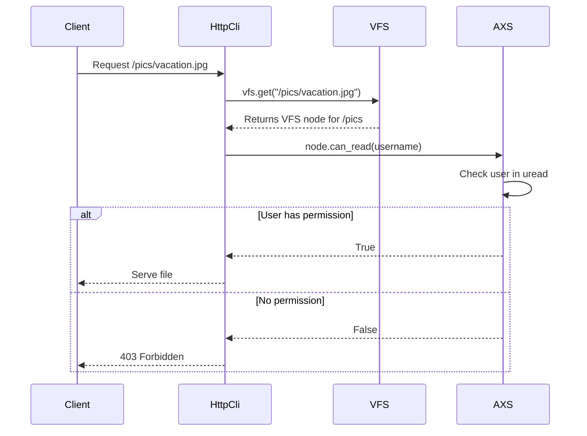

# copyparty Authentication & Access Control

This document covers the authentication system, user management, group handling, and the virtual filesystem (VFS) permission model.

## Authentication Architecture



## AuthSrv: The Authentication Server

**File:** `authsrv.py`

`AuthSrv` manages user accounts, groups, and the virtual filesystem.

```python
class AuthSrv(object):
    """
    Authentication server - manages users, groups, and VFS
    """
    def __init__(self, args, dargs, log_func):
        self.args = args
        self.log_func = log_func
        self._reload()

    def _reload(self):
        """Load accounts and VFS from config"""
        self.acct = {}      # username -> password hash
        self.iacct = {}     # uid -> username (reverse lookup)
        self.sesa = {}      # session_id -> username
        self.grps = {}      # group -> set of users
        self.vfs = self._build_vfs()  # Root VFS node
```

## User Account Storage

**File:** `authsrv.py`

Accounts are loaded from command-line arguments or config files:

```python
# From command line: --a user:password
# From config: [accounts] section

def _reload(self):
    self.acct = {}
    for usr in self.args.a:
        # Parse "user:password" or "user:password,group1,group2"
        user, pwd = usr.split(":", 1)
        if "," in pwd:
            pwd, groups = pwd.split(",", 1)
            self.grps[user] = set(groups.split(","))
        self.acct[user] = pwd

    # Build reverse lookup for display
    self.iacct = {str(n): k for n, k in enumerate(sorted(self.acct.keys()))}
```

## Password Hashing

**File:** `pwhash.py`

```python
class PWHash(object):
    """
    Password hashing using argon2 (preferred) or SHA-512
    """
    def __init__(self, salt: str):
        self.salt = salt

    def hash(self, password: str) -> str:
        if HAVE_ARGON2:
            # Argon2id - modern, memory-hard
            return argon2.hash(password + self.salt)
        else:
            # SHA-512 - fallback, fast
            return hashlib.sha512((password + self.salt).encode()).hexdigest()
```

## AXS: The Permission Class

**File:** `authsrv.py:121-146`

```python
class AXS(object):
    """
    Access permissions for a VFS node
    """
    def __init__(self,
                 uread: Optional[Union[list[str], set[str]]] = None,
                 uwrite: Optional[Union[list[str], set[str]]] = None,
                 umove: Optional[Union[list[str], set[str]]] = None,
                 udel: Optional[Union[list[str], set[str]]] = None,
                 uget: Optional[Union[list[str], set[str]]] = None,
                 upget: Optional[Union[list[str], set[str]]] = None,
                 uhtml: Optional[Union[list[str], set[str]]] = None,
                 uadmin: Optional[Union[list[str], set[str]]] = None,
                 udot: Optional[Union[list[str], set[str]]] = None) -> None:
        self.uread: set[str] = set(uread or [])   # Read/browse
        self.uwrite: set[str] = set(uwrite or []) # Upload
        self.umove: set[str] = set(umove or [])   # Move/rename
        self.udel: set[str] = set(udel or [])     # Delete
        self.uget: set[str] = set(uget or [])     # Direct file access
        self.upget: set[str] = set(upget or [])   # Upload + get
        self.uhtml: set[str] = set(uhtml or [])   # View as HTML page
        self.uadmin: set[str] = set(uadmin or []) # Admin operations
        self.udot: set[str] = set(udot or [])     # See dotfiles
```

## Permission Characters

| Char | Permission | Description |
|------|------------|-------------|
| `r` | read | Browse directory, view directory listings |
| `w` | write | Upload files |
| `x` | execute/move | Move/rename files |
| `d` | delete | Delete files/folders |
| `g` | get | Direct file access (via /f/ prefix) |
| `G` | upget | Combined upload + get permission |
| `h` | html | View files as HTML pages |
| `a` | admin | Server administration |
| `.` | dot | View hidden (dot) files |

## VFS: Virtual File System

**File:** `authsrv.py`



### VFS Resolution

```python
class VFS(object):
    def get(self, vpath: str) -> "VFS":
        """Get VFS node for a virtual path"""
        if vpath == self.vpath or not vpath:
            return self

        # Split path components
        parts = vpath.strip("/").split("/")

        # Walk VFS tree
        node = self
        for part in parts:
            for child in node.nodes:
                if child.vpath == part:
                    node = child
                    break
            else:
                # No matching child - use current node
                break

        return node
```

## Volume Configuration

**File:** `authsrv.py` - VFS building

Volumes are configured from command-line arguments:

```bash
# Basic: mount /home/user/share at URL /share
copyparty /home/user/share:/share

# With permissions: only user1 can write
copyparty /home/user/share:/share:user1+w

# Multiple volumes
copyparty \
    /home/user/pics:/pics:r \
    /home/user/dropbox:/upload:w \
    /home/user/private:/admin:user1+rw
```

```python
def _build_vfs(self) -> VFS:
    """Build VFS tree from arguments"""
    root = VFS(self.args, "/", "", AXS(), {})

    for voldef in self.args.v:
        # Parse "realpath:vpath:permissions"
        parts = voldef.split(":")
        realpath = parts[0]
        vpath = parts[1] if len(parts) > 1 else ""
        perms = parts[2] if len(parts) > 2 else ""

        # Create AXS from permission string
        axs = self._parse_perms(perms)

        # Add to VFS tree
        node = VFS(self.args, realpath, vpath, axs, {})
        root.add_node(node)

    return root
```

## Permission Parsing

**File:** `authsrv.py`

```python
def _parse_perms(self, perms: str) -> AXS:
    """Parse permission string like 'user1+rwd.user2+rw'"""
    axs = AXS()

    for seg in perms.split("."):
        # Split "user1+rwd" into "user1" and "+rwd"
        user, flags = seg.split("+")

        for flag in flags:
            if flag == "r":
                axs.uread.add(user)
            elif flag == "w":
                axs.uwrite.add(user)
            elif flag == "x":
                axs.umove.add(user)
            elif flag == "d":
                axs.udel.add(user)
            # ... etc

    return axs
```

## Permission Checking Flow



## Aha: The "Leeloo Dallas" Pattern

**Key insight:** copyparty uses a special internal username `LEELOO_DALLAS` to bypass permission checks for system operations.

**File:** `authsrv.py:76-94`

```python
LEELOO_DALLAS = "leeloo_dallas"
##
## you might be curious what Leeloo Dallas is doing here, so let me explain:
##
## certain daemonic tasks, namely:
##  * deletion of expired files, running on a timer
##  * deletion of sidecar files, initiated by plugins
## need to skip the usual permission-checks to do their thing,
## so we let Leeloo handle these
##
## and also, the smb-server has really shitty support for user-accounts
## so one popular way to avoid issues is by running copyparty without users;
## this makes all smb-clients identify as LD to gain unrestricted access
##
## Leeloo, being a fictional character from The Fifth Element,
## obviously does not exist and will never be able to access any copyparty
## instances from the outside (the username is rejected at every entrypoint)
```

This pattern:
1. Creates an internal "superuser" identity
2. The username is rejected at all external entry points
3. System operations can authenticate as LD
4. No special-casing in permission logic - just add LD to all AXS sets

## Session Management

**File:** `authsrv.py`

Session cookies provide remember-me functionality:

```python
def loginsession(self, uname: str, pwd: str) -> Optional[str]:
    """Create a session cookie for successful login"""
    if not self._verify_creds(uname, pwd):
        return None

    # Generate session token
    session_id = hashlib.sha256(
        os.urandom(32) + uname.encode()
    ).hexdigest()[:32]

    self.sesa[session_id] = uname
    return session_id
```

Cookie format (`httpcli.py`):

```python
def set_cookie(self, session_id: str) -> None:
    """Set session cookie on response"""
    self.out_headers["Set-Cookie"] = (
        f"cppwd={session_id}; Path=/; "
        f"Max-Age={7*24*60*60}; SameSite=Lax"
    )
```

## Identity Providers (IDP)

**File:** `authsrv.py` - External authentication

```python
def check_idp(self, username: str, password: str) -> bool:
    """Check credentials against external IdP"""
    for idp in self.args.idp:
        if idp.startswith("http"):
            # OAuth/OIDC
            return self._check_oauth(idp, username, password)
        elif idp.startswith("ldap://"):
            # LDAP/AD
            return self._check_ldap(idp, username, password)
    return False
```

IDP configuration allows using external auth systems:

```bash
# Google OAuth
copyparty --idp "oauth:google:client_id:client_secret"

# LDAP/Active Directory
copyparty --idp "ldap://dc.company.com:bind_dn"

# Generic header auth (e.g., from reverse proxy)
copyparty --idp "header:X-Authenticated-User"
```

## IP-Based Authentication

**File:** `authsrv.py`

Auto-login based on client IP:

```python
def check_ipauth(self, ip: str) -> Optional[str]:
    """Check if IP is allowed to auto-login as specific user"""
    for rule in self.args.ipauth:
        # "192.168.1.0/24=user1"
        cidr, user = rule.split("=")
        if self._ip_in_cidr(ip, cidr):
            return user
    return None
```

## Next Document

[04-file-operations.md](04-file-operations.md) — File uploads, downloads, and filesystem operations.
