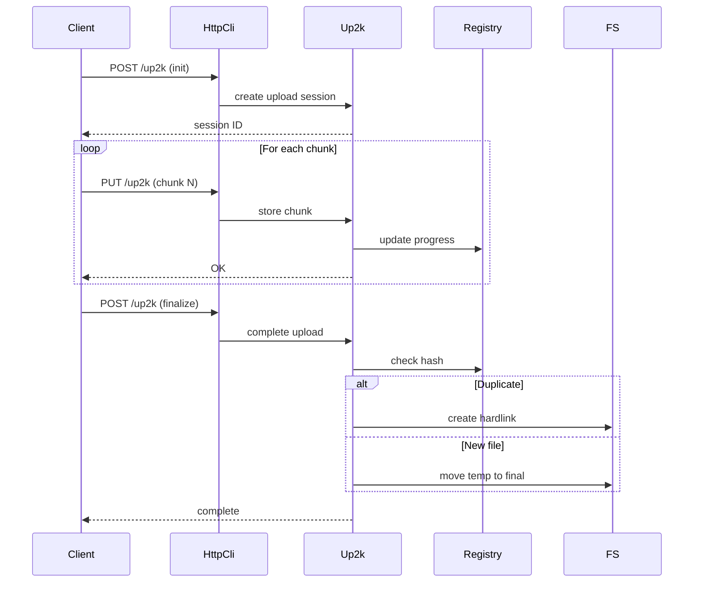
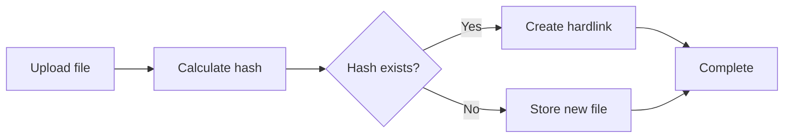
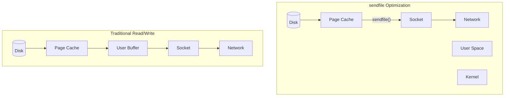

# copyparty File Operations

This document covers file uploads (up2k protocol), downloads, directory listings, and filesystem operations.

## File Operations Architecture

```mermaid
flowchart TB
    subgraph Upload["Upload Flow"]
        client["Client (up2k.js)"]
        chunk["Chunk upload"]
        hash["Hash verification"]
        dedup["Deduplication"]
        finalize["Finalize file"]
    end

    subgraph Download["Download Flow"]
        req["HTTP request"]
        check["Permission check"]
        range["Range parsing"]
        sendfile["sendfile()"]
    end

    subgraph Dir["Directory Operations"]
        list["List directory"]
        filter["Filter/sort"]
        format["Format output"]
    end

    client --> chunk --> hash --> dedup --> finalize
    req --> check --> range --> sendfile
    list --> filter --> format
```



## up2k: Upload Protocol

**File:** `up2k.py`

The up2k protocol provides resumable, chunked uploads with deduplication.

### up2k Data Flow



### Up2k Class (`up2k.py:149`)

```python
class Up2k(object):
    """
    Upload handler with deduplication support
    """
    def __init__(self, hub: "SvcHub") -> None:
        self.hub = hub
        self.asrv = hub.asrv  # Auth/VFS
        self.args = hub.args

        # Threading
        self.mutex = threading.Lock()

        # Hash queue for background processing
        self.hashq: Queue = Queue()
        self.tagq: Queue = Queue()  # For metadata extraction

        # Per-volume registries
        self.registry: dict[str, dict] = {}

        # Database connections per volume
        self.volstate: dict[str, str] = {}
```

### Chunked Upload Process

```python
def handle_chunk(self, wark: str, chunk_idx: int, data: bytes) -> bool:
    """
    Handle an upload chunk
    wark: upload session ID
    chunk_idx: which chunk (0-based)
    data: binary chunk data
    """
    # Store chunk in temp location
    tmp_path = self._chunk_path(wark, chunk_idx)
    with open(tmp_path, "wb") as f:
        f.write(data)

    # Update registry
    with self.mutex:
        self.registry[wark]["have"][chunk_idx] = len(data)

    return True
```

### Hash-Based Deduplication

**Aha:** copyparty uses content-addressed storage for deduplication.



**File:** `up2k.py`

```python
def finalize_upload(self, wark: str, fpath: str, fsize: int, fhash: str) -> str:
    """
    Finalize upload: check for duplicates, move to final location
    """
    # Check if file already exists (by hash)
    existing = self._lookup_hash(fhash)

    if existing and self.args.hardlink:
        # Create hardlink instead of duplicate
        os.link(existing, fpath)
        self._log("dedup: hardlink %s -> %s" % (fpath, existing))
    elif existing and self.args.reflink:
        # Use reflink (copy-on-write) if filesystem supports it
        self._reflink(existing, fpath)
    else:
        # Move temp file to final location
        atomic_move(self.tmp_path(wark), fpath)

    # Add to registry
    self._add_to_db(fhash, fpath, fsize)

    return fpath
```

### wark: The Upload Token

**Key insight:** "wark" is a unique upload session token derived from file properties.

**File:** `up2k.py:162`

```python
self.r_hash = re.compile("^[0-9a-zA-Z_-]{44}$")  # wark format

# wark format: base64url-encoded hash of:
#   filename + filesize + mtime + salt
# This allows resuming uploads across sessions
```

## File Downloads

### HTTP Range Requests

**File:** `httpcli.py`

```python
def tx_file(self, vpath: str) -> bool:
    """Serve a file with range support"""
    fspath = self.avn.realpath
    fsize = os.path.getsize(fspath)

    # Check for Range header
    rng = self.headers.get("range", "")
    if rng.startswith("bytes="):
        # Parse range: "bytes=start-end"
        start, end = self._parse_range(rng, fsize)

        # Send partial content
        self.send_range(fspath, start, end)
    else:
        # Send entire file
        self.send_file(fspath)
```

### Zero-Copy sendfile

**File:** `util.py`

```python
def sendfile_kern(self, f, n: int) -> int:
    """
    Use kernel sendfile for zero-copy file serving.
    Falls back to userspace copy if unavailable.
    """
    import sendfile

    # sendfile copies directly from page cache to socket
    # No userspace buffer needed
    return sendfile.sendfile(
        self.s.fileno(),  # Destination: socket
        f.fileno(),         # Source: file
        None,               # Offset (None = current)
        n                   # Count
    )
```

### File Transfer Optimization



## Directory Listings

### List Generation

**File:** `httpcli.py` - `tx_index()`

```python
def tx_index(self, vpath: str) -> bool:
    """Generate directory listing"""
    # Get directory contents
    files = self.listdir(vpath)

    # Filter based on permissions
    if not self.can_dot:
        files = [f for f in files if not f["name"].startswith(".")]

    # Sort
    sort_by = self.uparam.get("sort", "name")
    files = sorted(files, key=lambda x: x[sort_by])

    # Generate output
    if "?json" in self.uparam:
        return self.tx_dir_json(files)
    elif "?xml" in self.uparam:
        return self.tx_dir_xml(files)
    else:
        return self.tx_dir_html(files)
```

### Directory Listing Formats

| Format | URL Parameter | MIME Type |
|--------|--------------|-----------|
| HTML | (default) | `text/html` |
| JSON | `?json` | `application/json` |
| XML | `?xml` | `application/xml` |
| Tar | `?tar` | `application/x-tar` |

### JSON Directory Listing

**File:** `httpcli.py`

```python
def tx_dir_json(self, files: list) -> bool:
    """Return directory listing as JSON"""
    response = {
        "files": [
            {
                "name": f["name"],
                "size": f["size"],
                "mtime": f["mtime"],
                "type": "dir" if f["is_dir"] else "file",
            }
            for f in files
        ],
        "path": self.vpath,
    }
    return self.send_json(response)
```

## File System Operations

### Move and Rename

**File:** `httpcli.py`

```python
def handle_move(self) -> bool:
    """Handle MOVE request (WebDAV)"""
    src = self.vpath
    dst = self.headers.get("destination", "")

    # Verify permissions on both source and dest
    if not self.can_move:
        raise Pebkac(403, "not allowed to move")

    # Perform move
    bos.rename(src_vfs.realpath, dst_vfs.realpath)

    # Update database if indexed
    self.up2k.move_file(src, dst)
```

### Delete

**File:** `httpcli.py`

```python
def handle_delete(self) -> bool:
    """Handle DELETE request"""
    if not self.can_delete:
        raise Pebkac(403, "not allowed to delete")

    if os.path.isdir(fspath):
        # Recursive delete
        rmdirs(fspath)
    else:
        os.unlink(fspath)

    # Remove from database
    self.up2k.forget_file(self.vpath)
```

## Aha: Atomic File Operations

**Key insight:** copyparty uses atomic operations to prevent data corruption during concurrent access.

**File:** `util.py`

```python
def atomic_move(src: str, dst: str) -> None:
    """
    Atomically move file to destination.
    On POSIX: rename() is atomic
    On Windows: use MoveFileEx with MOVEFILE_REPLACE_EXISTING
    """
    if ANYWIN:
        import ctypes
        from ctypes.wintypes import BOOL, DWORD, LPCWSTR, LPVOID

        MOVEFILE_REPLACE_EXISTING = 1
        MOVEFILE_WRITE_THROUGH = 8

        kernel32 = ctypes.windll.kernel32
        ret = kernel32.MoveFileExW(
            ctypes.c_wchar_p(src),
            ctypes.c_wchar_p(dst),
            DWORD(MOVEFILE_REPLACE_EXISTING | MOVEFILE_WRITE_THROUGH)
        )
        if not ret:
            raise ctypes.WinError(ctypes.get_last_error())
    else:
        # POSIX: os.rename() is atomic
        os.rename(src, dst)
```

## Hardlink and Reflink Deduplication

**File:** `up2k.py` and `util.py`

```python
# Check for FICLONE (reflink) support
HAVE_FICLONE = hasattr(fcntl, "FICLONE") if os.name != "nt" else False

def reflink(src: str, dst: str) -> bool:
    """
    Create copy-on-write copy using reflink.
    Falls back to hardlink if reflink unavailable.
    Falls back to copy if hardlink unavailable.
    """
    if HAVE_FICLONE:
        try:
            with open(src, "rb") as s:
                with open(dst, "wb+") as d:
                    fcntl.ioctl(d.fileno(), fcntl.FICLONE, s.fileno())
            return True
        except OSError:
            pass

    # Try hardlink
    try:
        os.link(src, dst)
        return True
    except OSError:
        pass

    # Fall back to copy
    shutil.copy2(src, dst)
    return False
```

## File Indexing and Database

**File:** `up2k.py`

up2k maintains a SQLite database for each volume:

```python
# Database schema (simplified)
CREATE TABLE up (
    id INTEGER PRIMARY KEY,
    w TEXT,           -- wark hash
    sz INTEGER,       -- file size
    at INTEGER,       -- add time
    dn TEXT,          -- directory
    fn TEXT,          -- filename
    mt INTEGER,       -- mtime
    tags TEXT         -- JSON metadata
);

CREATE INDEX idx_w ON up(w);
CREATE INDEX idx_fn ON up(dn, fn);
```

### Database Operations

```python
def _add_to_db(self, w: str, fpath: str, fsize: int, mtime: int) -> None:
    """Add file to registry database"""
    dn, fn = os.path.split(fpath)

    with self._get_db(vol) as db:
        db.execute(
            "INSERT INTO up (w, sz, at, dn, fn, mt) VALUES (?, ?, ?, ?, ?, ?)",
            (w, fsize, time.time(), dn, fn, mtime)
        )
```

## Next Document

[05-media-streaming.md](05-media-streaming.md) — Thumbnails, media transcoding, and streaming.
