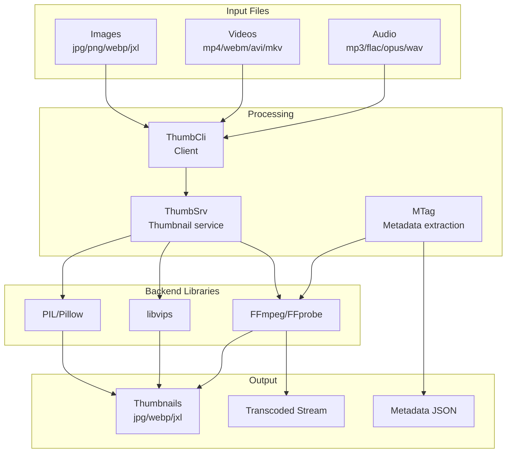
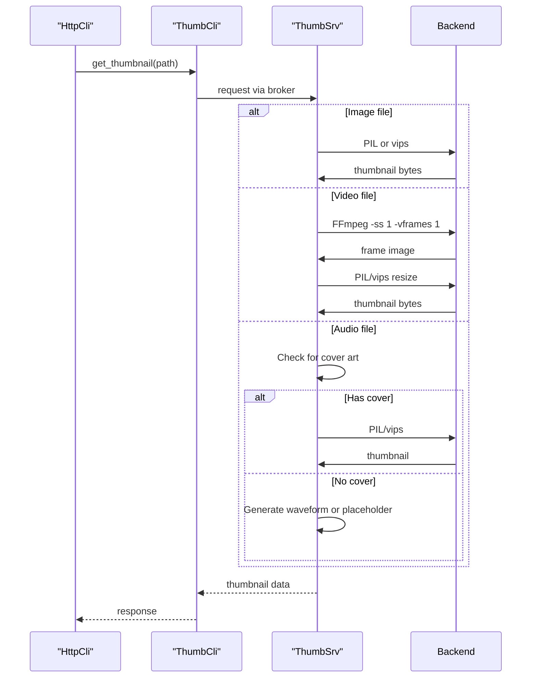

# copyparty Media Streaming

copyparty provides comprehensive media handling including thumbnail generation for images and videos, audio transcoding for streaming, and metadata extraction for media files.

## Media Architecture



## Thumbnail System

### ThumbSrv: The Thumbnail Service

**File:** `th_srv.py:1`

`ThumbSrv` runs as a separate process/thread and generates thumbnails:

```python
class ThumbSrv(object):
    """
    Thumbnail generation service running in separate process
    """
    def __init__(self, hub: "SvcHub") -> None:
        self.hub = hub
        self.args = hub.args

        # Supported image formats
        self.have_pil = HAVE_PIL
        self.have_vips = HAVE_VIPS
        self.have_ffmpeg = HAVE_FFMPEG

        # Quality settings
        self.quality = args.th_qv  # 0-20
        self.codec = args.th_co   # j/p/w/x (jpeg/png/webp/jxl)
```

### Supported Image Formats

**File:** `th_srv.py:55-59`

```python
# Image codec mapping
TH_CH = {"j": "jpg", "p": "png", "w": "webp", "x": "jxl"}

# Supported extensions
EXTS_TH = set(["jpg", "webp", "jxl", "png"])

# Audio/video codec extensions for thumbnails
EXTS_AC = set(["opus", "owa", "caf", "mp3", "flac", "wav"])
```

### Quality Mappings

**File:** `th_srv.py:65-112`

```python
# FFmpeg JPEG quality mapping (0-20 scale)
FF_JPG_Q = {
    0: b"30",   # Lowest quality
    10: b"11",  # Medium
    20: b"2",   # Highest quality
}

# libvips JPEG quality mapping
VIPS_JPG_Q = {
    0: 4,       # Lowest
    10: 52,     # Medium
    20: 97,     # Highest
}
```

### Thumbnail Generation Flow



### Image Processing Backends

**File:** `th_srv.py:114-150`

```python
# PIL (Pillow) - Python imaging library
try:
    from PIL import ExifTags, Image, ImageFont, ImageOps
    HAVE_PIL = True

    # Optional: WebP support
    Image.new("RGB", (2, 2)).save(BytesIO(), format="webp")
    H_PIL_WEBP = True

    # Optional: JXL (JPEG XL) support
    Image.new("RGB", (2, 2)).save(BytesIO(), format="jxl")
    H_PIL_JXL = True
except:
    HAVE_PIL = False

# libvips - Fast image processing
try:
    import pyvips
    HAVE_VIPS = True
except:
    HAVE_VIPS = False
```

### Thumbnail Size and Cropping

**File:** `th_srv.py`

```python
def generate_thumb(self, fspath: str, thumb_size: tuple) -> bytes:
    """
    Generate thumbnail with optional cropping
    """
    # Default thumbnail size
    width, height = thumb_size

    if self.args.th_crop:
        # Center crop to square
        # Resize so shortest side = target
        # Then crop center
        thumb = self._crop_center(img, width, height)
    else:
        # Fit within bounds (preserve aspect)
        thumb = self._fit_within(img, width, height)

    return self._encode(thumb)
```

## Media Metadata Extraction

### MTag: Metadata Parser

**File:** `mtag.py:1`

```python
class MTag(object):
    """
    Media metadata extraction using FFmpeg/ffprobe or mutagen
    """
    def __init__(self, hub: "SvcHub") -> None:
        self.hub = hub
        self.args = hub.args

        # Available parsers
        self.have_ffmpeg = HAVE_FFMPEG
        self.have_ffprobe = HAVE_FFPROBE
        self.have_mutagen = HAVE_MUTAGEN
```

### Supported Media Formats

**File:** `up2k.py:99-106`

```python
# Image formats
ICV_EXTS = set(["jpg", "png", "webp", "avif", "heic", "gif"])

# Video formats
VCV_EXTS = set(["mp4", "webm", "avi", "mkv", "mov"])

# Audio formats
ACV_EXTS = set(["mp3", "flac", "opus", "ogg", "m4a", "wav"])
```

### Metadata Extraction

**File:** `mtag.py`

```python
def extract(self, fspath: str) -> dict[str, Any]:
    """Extract metadata from media file"""
    ext = os.path.splitext(fspath)[1].lower()[1:]

    if ext in ICV_EXTS:
        return self._extract_image(fspath)
    elif ext in VCV_EXTS:
        return self._extract_video(fspath)
    elif ext in ACV_EXTS:
        return self._extract_audio(fspath)

    return {}

def _extract_audio(self, fspath: str) -> dict[str, Any]:
    """Extract audio metadata using ffprobe"""
    cmd = [
        "ffprobe",
        "-v", "quiet",
        "-print_format", "json",
        "-show_format",
        "-show_streams",
        fspath
    ]

    result = subprocess.run(cmd, capture_output=True, text=True)
    data = json.loads(result.stdout)

    tags = {}
    if "format" in data and "tags" in data["format"]:
        fmt_tags = data["format"]["tags"]
        tags["title"] = fmt_tags.get("title")
        tags["artist"] = fmt_tags.get("artist")
        tags["album"] = fmt_tags.get("album")
        tags["track"] = fmt_tags.get("track")
        tags["duration"] = float(data["format"].get("duration", 0))

    return tags
```

## Audio Transcoding

### On-the-fly Transcoding

copyparty can transcode audio on-demand for streaming to browsers:


**File:** `httpcli.py`

```python
def tx_audio(self, vpath: str) -> bool:
    """Stream audio with optional transcoding"""
    fspath = self.avn.realpath

    # Check if browser supports format natively
    ext = os.path.splitext(fspath)[1].lower()
    if self._browser_supports(ext):
        # Stream directly
        return self.send_file(fspath)

    # Transcode to supported format
    target_codec = self._select_codec()

    # Stream with ffmpeg
    cmd = [
        "ffmpeg",
        "-i", fspath,
        "-f", target_codec,
        "-",  # Output to stdout
    ]

    proc = subprocess.Popen(cmd, stdout=subprocess.PIPE)

    # Stream chunks to client
    while True:
        chunk = proc.stdout.read(8192)
        if not chunk:
            break
        self.send(chunk)
```

### Transcoding to Apple CAF

**Aha:** copyparty transcodes to Apple's CAF format for better iOS compatibility.

**File:** `httpcli.py`

```python
# ACODE2_FMT = set(["opus", "owa", "caf", "mp3", "flac", "wav"])

def _select_codec(self, user_agent: str) -> str:
    """Select best codec based on browser capabilities"""
    if "Safari" in user_agent or "iPhone" in user_agent:
        # iOS Safari needs CAF container for Opus
        return "caf"
    elif "Firefox" in user_agent:
        # Firefox supports opus natively
        return "opus"
    else:
        # Default to MP3 for broad compatibility
        return "mp3"
```

## Thumbnail Caching

### Cache Structure

Thumbnails are stored in a directory structure based on hash:

```
.volume/
└── .hist/
    └── th/
        ├── 1n/              # First 2 chars of hash
        │   └── Bs/          # Next 2 chars
        │       └── 1nBs...  # Full hash as filename
        └── ...
```

**File:** `th_srv.py`

```python
def _thumb_path(self, fspath: str, fmt: str) -> str:
    """
    Generate cache path for thumbnail
    Based on file content hash, not path
    """
    # Get file hash
    file_hash = self._file_hash(fspath)

    # Build path: .hist/th/xx/yy/xxyy...
    return os.path.join(
        self.args.thumb_dir,
        file_hash[:2],
        file_hash[2:4],
        file_hash + "." + fmt
    )
```

### Cache Invalidation

```python
def _file_hash(self, fspath: str) -> str:
    """
    Hash based on file content + modification time
    This ensures thumbnail is regenerated if file changes
    """
    stat = os.stat(fspath)
    data = f"{fspath}:{stat.st_size}:{stat.st_mtime}"
    return hashlib.sha256(data.encode()).hexdigest()[:16]
```

## Video Thumbnail Extraction

### FFmpeg-based Thumbnails

**File:** `th_srv.py`

```python
def _thumb_video(self, fspath: str, size: tuple) -> bytes:
    """Extract thumbnail from video using FFmpeg"""
    width, height = size

    # Extract frame at 1 second (or first keyframe)
    cmd = [
        "ffmpeg",
        "-ss", "00:00:01",      # Seek to 1 second
        "-i", fspath,
        "-vf", f"scale={width}:{height}:force_original_aspect_ratio=decrease",
        "-vframes", "1",         # Extract 1 frame
        "-f", "image2pipe",
        "-"
    ]

    result = subprocess.run(cmd, capture_output=True)
    return result.stdout
```

### Thumbnail at Specific Time

```python
def _thumb_video_at(self, fspath: str, seconds: float) -> bytes:
    """Extract thumbnail at specific timestamp"""
    time_str = self._seconds_to_timecode(seconds)

    cmd = [
        "ffmpeg",
        "-ss", time_str,
        "-i", fspath,
        "-vf", "scale=320:240",
        "-vframes", "1",
        "-f", "image2pipe", "-"
    ]

    return subprocess.run(cmd, capture_output=True).stdout
```

## Media Player Integration

### Browser-side Player

The web UI includes a built-in media player (`browser.js`):

```javascript
// Media player supports:
// - Audio: mp3, opus, flac, wav, ogg, m4a
// - Video: mp4, webm (browser-dependent)
// - Playlists: m3u8
// - Cover art display
// - Lyrics display (if embedded)
```

### Playlist Generation

**File:** `httpcli.py`

```python
def tx_playlist(self, vpath: str) -> bool:
    """Generate M3U8 playlist"""
    files = self._get_audio_files(vpath)

    playlist = ["#EXTM3U"]
    for f in files:
        duration = self._get_duration(f)
        title = self._get_title(f)

        playlist.append(f"#EXTINF:{duration},{title}")
        playlist.append(self._get_url(f))

    self.send_text("\n".join(playlist), mime="audio/x-mpegurl")
```

## Performance Considerations

### Async Thumbnail Generation

Thumbnails are generated asynchronously to not block requests:

```python
# In HttpCli
def tx_thumb(self, vpath: str) -> bool:
    """Serve thumbnail (generate if needed)"""
    thumb_path = self._get_thumb_path(vpath)

    if not os.path.exists(thumb_path):
        # Queue for generation
        self.hsrv.thumbcli.enqueue(vpath)
        # Return placeholder
        return self.send_placeholder()

    return self.send_file(thumb_path)
```

### FFmpeg Optimization

**File:** `th_srv.py:65`

```python
# Comment from source - FFmpeg JPEG quality testing
# for n in {1..100}; do rm -rf /home/ed/Pictures/wp/.hist/th/ ; \
#   python3 -m copyparty -qv /home/ed/Pictures/wp/::r --th-no-webp \
#   --th-qv $n --th-dec pil >/dev/null 2>&1 & p=$!; \
#   printf '\033[A\033[J%3d ' $n; while true; do \
#   sleep 0.1; curl -s 127.1:3923 >/dev/null && break; done; \
#   curl -s '127.1:3923/?tar=j' >/dev/null ; \
#   cat /home/ed/Pictures/wp/.hist/th/1n/bs/1nBs.../*.* | wc -c; \
#   kill $p; wait >/dev/null 2>&1; done
#
# filesize-equivalent, not quality (ff looks much shittier)
```

This shows the author empirically tested quality settings to find filesize-equivalent values across different codecs.

## Next Document

[06-web-ui.md](06-web-ui.md) — Frontend JavaScript architecture and UI components.
