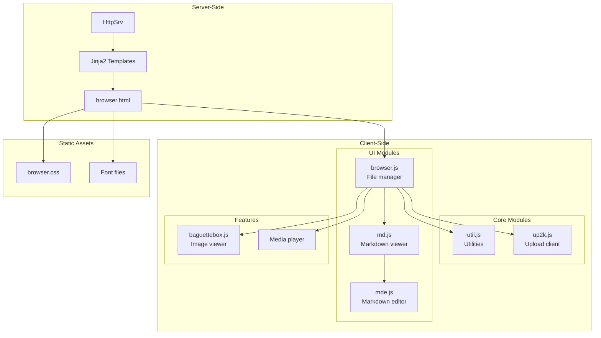
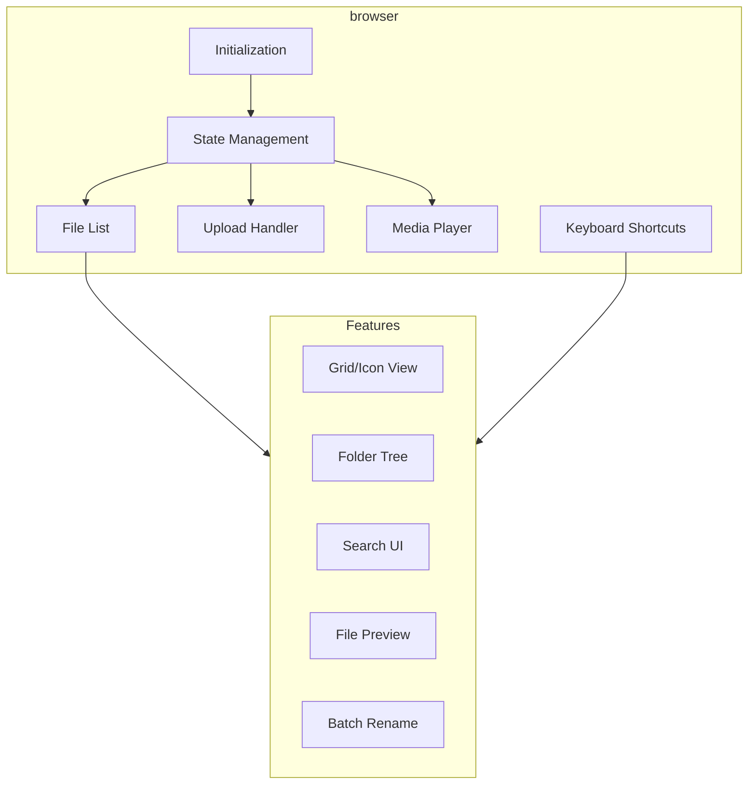
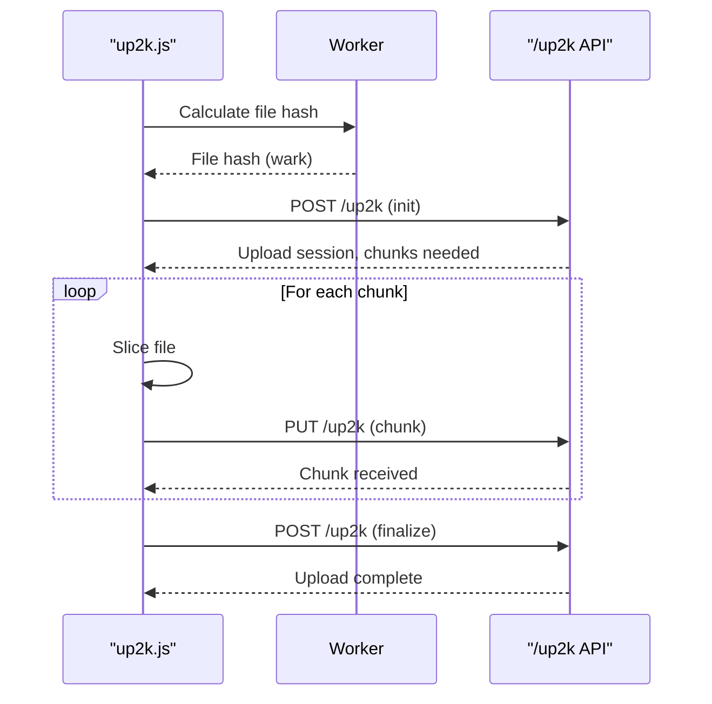

# copyparty Web UI

copyparty includes a comprehensive browser-based interface for file management, media playback, and server interaction. The frontend is built with vanilla JavaScript and uses server-rendered HTML templates.

## Web UI Architecture



## Template System

### Jinja2 Template Loading

**File:** `httpsrv.py:183-202`

```python
class HttpSrv:
    def __init__(self, broker, nid):
        # ...
        assert jinja2
        env = jinja2.Environment()
        env.loader = jinja2.FunctionLoader(lambda f: load_jinja2_resource(self.E, f))

        # Template names
        jn = [
            "browser",      # Main file manager
            "browser2",     # Alternative view
            "cf",           # Configuration
            "idp",          # Identity provider
            "md",           # Markdown viewer
            "mde",          # Markdown editor
            "msg",          # Message display
            "rups",         # Recent uploads
            "shares",       # Share links
            "splash",       # Initial loading
            "svcs",         # Services
        ]
        self.j2 = {x: env.get_template(x + ".html") for x in jn}
```

### Template Rendering

**File:** `httpcli.py:311-330`

```python
class HttpCli:
    def j2s(self, name: str, **ka: Any) -> str:
        """Render Jinja2 template with standard context"""
        tpl = self.conn.hsrv.j2[name]

        # Standard template variables
        ka["r"] = self.args.SR if self.is_vproxied else ""  # Root path
        ka["ts"] = self.conn.hsrv.cachebuster()             # Cache buster
        ka["lang"] = self.cookies.get("cplng") or self.args.lang
        ka["favico"] = self.args.favico
        ka["s_doctitle"] = self.args.doctitle
        ka["tcolor"] = self.vn.flags["tcolor"]  # Theme color

        return tpl.render(**ka)
```

## browser.js: The Main Interface

**File:** `copyparty/web/browser.js` (270KB)

browser.js is the largest frontend module, handling the file manager interface.

### Module Structure



### Initialization Flow

**File:** `browser.js:1-50`

```javascript
"use strict";

// Global configuration from server
var J_BRW = 1;  // Browser mode
var XHR = XMLHttpRequest;

// Translations loaded from server
if (window.dgauto === undefined)
    alert('FATAL ERROR: receiving stale data from the server...');

// Language strings (loaded from server)
var Ls = {
    eng: {
        tt: "English",
        // ... column headers, tooltips, messages
    }
};

// Main initialization
document.addEventListener('DOMContentLoaded', function() {
    var eb = document.getElementById('ggrid');
    if (!eb) return;  // Not in browser mode

    // Initialize components
    init_file_list();
    init_upload_handler();
    init_keyboard_shortcuts();
    init_media_player();
    init_folder_tree();
});
```

## File Listing

### Grid View Toggle

```javascript
// Toggle between list and grid view
function toggle_view() {
    var ggrid = document.getElementById('ggrid');
    var is_grid = ggrid.classList.contains('grid');

    if (is_grid) {
        ggrid.classList.remove('grid');
        localStorage.setItem('cpp_view', 'list');
    } else {
        ggrid.classList.add('grid');
        localStorage.setItem('cpp_view', 'grid');
    }

    render_file_list();
}
```

### Selection Management

```javascript
// Selection state
var selected_files = new Set();
var last_selected = null;

function toggle_selection(file_id, event) {
    if (event.shiftKey && last_selected) {
        // Range selection
        select_range(last_selected, file_id);
    } else if (event.ctrlKey || event.metaKey) {
        // Toggle individual
        if (selected_files.has(file_id)) {
            selected_files.delete(file_id);
        } else {
            selected_files.add(file_id);
            last_selected = file_id;
        }
    } else {
        // Single selection (clear others)
        selected_files.clear();
        selected_files.add(file_id);
        last_selected = file_id;
    }

    update_selection_ui();
}
```

## Upload Client: up2k.js

**File:** `copyparty/web/up2k.js` (107KB)

The up2k protocol client handles resumable uploads.

### Upload Architecture



### Client-Side Hashing

```javascript
// Web Worker for hashing (non-blocking)
var hash_worker = new Worker('hash-worker.js');

function calculate_hash(file, callback) {
    hash_worker.postMessage({
        file: file,
        algorithm: 'sha256'
    });

    hash_worker.onmessage = function(e) {
        callback(e.data.hash);  // Base64url encoded
    };
}
```

### Chunk Uploading

**Aha:** up2k uses dynamic chunk sizing based on file size to optimize parallel uploads.

```javascript
// Dynamic chunk size calculation
function get_chunksize(filesize) {
    var chunksize = 1024 * 1024;  // Start at 1MB
    var stepsize = 1024 * 256;    // Increment in 256KB steps
    
    while (true) {
        var nchunks = Math.ceil(filesize / chunksize);
        // Target: max 256 chunks, or 4096 if chunksize >= 32MB
        if (nchunks <= 256 || (chunksize >= 32 * 1024 * 1024 && nchunks <= 4096))
            return chunksize;
        chunksize += stepsize;
    }
}

function upload_file(file) {
    var wark = calculate_hash(file);
    var chunksize = get_chunksize(file.size);  // Dynamic based on file size
    var total_chunks = Math.ceil(file.size / chunksize);

    // Initialize upload
    fetch('/up2k', {
        method: 'POST',
        body: JSON.stringify({
            wark: wark,
            size: file.size,
            name: file.name,
            chunks: total_chunks
        })
    })
    .then(r => r.json())
    .then(session => {
        // Upload missing chunks
        var needed = session.needed;
        upload_chunks(file, wark, needed, chunksize);
    });
}

function upload_chunks(file, wark, indices, chunksize) {
    indices.forEach(function(idx) {
        var start = idx * chunksize;
        var end = Math.min(start + chunksize, file.size);
        var chunk = file.slice(start, end);

        fetch('/up2k?w=' + wark + '&c=' + idx, {
            method: 'PUT',
            body: chunk
        });
    });
}
```

## Keyboard Shortcuts

**File:** `browser.js`

```javascript
// Hotkey definitions from source
var HOTKEYS = [
    // File manager
    ['G', 'toggle list / grid view'],
    ['T', 'toggle thumbnails / icons'],
    ['⇧ A/D', 'thumbnail size'],
    ['ctrl-K', 'delete selected'],
    ['ctrl-X', 'cut selection to clipboard'],
    ['ctrl-C', 'copy selection to clipboard'],
    ['ctrl-V', 'paste (move/copy) here'],
    ['Y', 'download selected'],
    ['F2', 'rename selected'],

    // Navigation
    ['B', 'toggle breadcrumbs / navpane'],
    ['I/K', 'prev/next folder'],
    ['M', 'parent folder'],
    ['V', 'toggle folders / textfiles in navpane'],
    ['A/D', 'navpane size'],

    // Audio player
    ['J/L', 'prev/next song'],
    ['U/O', 'skip 10sec back/fwd'],
    ['0..9', 'jump to 0%..90%'],
    ['P', 'play/pause'],
    ['S', 'select playing song'],

    // Image viewer
    ['J/L, ←/→', 'prev/next pic'],
    ['Home/End', 'first/last pic'],
    ['F', 'fullscreen'],
    ['R', 'rotate clockwise'],
];

function handle_keydown(event) {
    if (event.target.tagName === 'INPUT') return;

    switch(event.key) {
        case 'g':
            if (!event.ctrlKey) toggle_view();
            break;
        case 't':
            if (!event.ctrlKey) toggle_thumbnails();
            break;
        case 'Delete':
        case 'k':
            if (event.ctrlKey) delete_selected();
            break;
        case 'F2':
            rename_selected();
            break;
        // ... more shortcuts
    }
}
```

## Media Player

### Audio Player

```javascript
// Audio player state
var audio = new Audio();
var current_track = 0;
var playlist = [];

function init_audio_player() {
    audio.addEventListener('ended', function() {
        play_next();
    });

    // Keyboard shortcuts
    document.addEventListener('keydown', function(e) {
        if (e.key === 'p' || e.key === ' ') {
            toggle_playback();
        } else if (e.key === 'j') {
            play_prev();
        } else if (e.key === 'l') {
            play_next();
        }
    });
}

function play_file(url, title) {
    audio.src = url;
    audio.play();
    update_now_playing(title);
}
```

### Image Viewer (baguetteBox)

**File:** `copyparty/web/baguettebox.js` (42KB)

```javascript
// Initialize baguetteBox for image galleries
baguetteBox.run('.ggrid a[href$=".jpg"], .ggrid a[href$=".png"]', {
    captions: function(element) {
        return element.getAttribute('title') || '';
    },
    buttons: true,
    keyboard: true
});
```

## Markdown Viewer and Editor

### Markdown Viewer (md.js)

**File:** `copyparty/web/md.js`

```javascript
// Markdown rendering with client-side highlighting
function render_markdown(content) {
    // Server pre-renders, but we enhance
    var blocks = document.querySelectorAll('pre code');
    blocks.forEach(function(block) {
        if (window.Prism) {
            Prism.highlightElement(block);
        }
    });
}

// Variable expansion from server
// Server replaces ${var} with values
```

### Markdown Editor (mde.js)

**File:** `copyparty/web/mde.js`

```javascript
// SimpleMDE-based editor
var mde = new SimpleMDE({
    element: document.getElementById('editor'),
    autosave: {
        enabled: true,
        uniqueId: location.pathname
    },
    toolbar: [
        'bold', 'italic', 'heading', '|',
        'quote', 'unordered-list', 'ordered-list', '|',
        'link', 'image', '|',
        'preview', 'side-by-side', 'fullscreen', '|',
        {
            name: 'save',
            action: save_document,
            className: 'fa fa-save',
            title: 'Save'
        }
    ]
});

function save_document() {
    var content = mde.value();

    fetch(location.pathname + '?edit', {
        method: 'PUT',
        body: content
    })
    .then(r => {
        if (r.ok) {
            show_notification('Saved!');
        } else {
            show_error('Save failed');
        }
    });
}
```

## Aha: Progressive Enhancement

**Key insight:** copyparty's web UI uses progressive enhancement - core functionality works without JavaScript, but is enhanced when JS is available.

```html
<!-- From browser.html -->
<!-- Basic links work without JS -->
<a href="file.jpg" title="View file">
    
</a>

<!-- Enhanced with JS -->
<script>
// Add click handlers for lightbox
if (window.baguetteBox) {
    document.querySelectorAll('a').forEach(function(a) {
        a.addEventListener('click', function(e) {
            if (is_image(this.href)) {
                e.preventDefault();
                open_lightbox(this);
            }
        });
    });
}
</script>
```

## Styling

### CSS Architecture

**File:** `copyparty/web/browser.css` (77KB)

```css
/* Grid view */
.ggrid.grid {
    display: grid;
    grid-template-columns: repeat(auto-fill, minmax(150px, 1fr));
    gap: 1em;
}

/* List view */
.ggrid.list {
    display: block;
}

/* Thumbnail styling */
.ggrid.grid .thumb {
    width: 100%;
    aspect-ratio: 1;
    object-fit: cover;
}

/* Selection highlighting */
.ggrid .selected {
    background: var(--select-bg);
    outline: 2px solid var(--accent);
}

/* Responsive adjustments */
@media (max-width: 600px) {
    .ggrid.grid {
        grid-template-columns: repeat(auto-fill, minmax(100px, 1fr));
    }
}
```

## Language Support (i18n)

**File:** `browser.js:10-97`

```javascript
// Translation dictionary
Ls.eng = {
    // Column headers
    "cols": {
        "c": "action buttons",
        "dur": "duration",
        "q": "quality / bitrate",
        "Ac": "audio codec",
        "Vc": "video codec",
    },

    // Hotkeys
    "hks": [
        "misc",
        ["ESC", "close various things"],
        ["G", "toggle list / grid view"],
        // ...
    ],

    // Tooltip text
    "ot_search": "`search for files by attributes...",
    "ot_unpost": "unpost: delete your recent uploads...",
    "ot_mkdir": "mkdir: create a new directory",
    // ...
};
```

## Next Document

[07-configuration.md](07-configuration.md) — Configuration system and CLI arguments.
