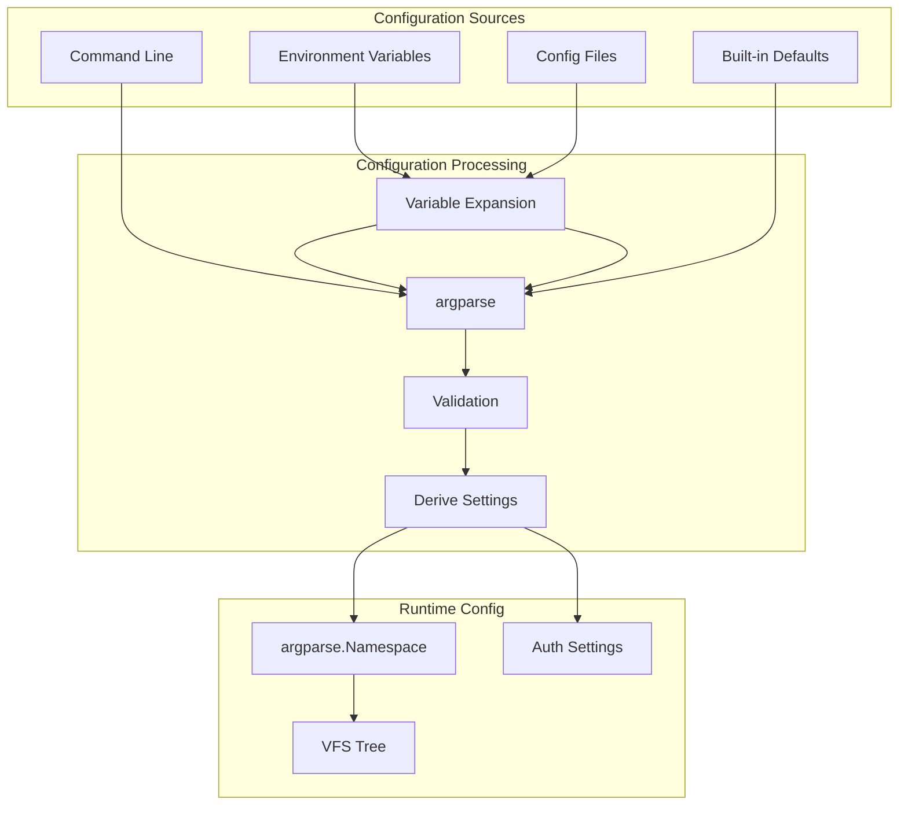

# copyparty Configuration

copyparty supports extensive configuration through command-line arguments, config files, and environment variables.

## Configuration Architecture



## Configuration Sources Priority

1. **Config file** (`-c file.conf`) - Expanded first
2. **Environment variables** (`$VAR`) - Expanded during config loading
3. **Command-line arguments** - Override everything
4. **Built-in defaults** - Fallback values

## Command-Line Arguments

**File:** `__main__.py`

The CLI uses Python's `argparse` with custom formatters:

```python
class RiceFormatter(argparse.HelpFormatter):
    """Custom formatter with colors and default display"""
    def _get_help_string(self, action: Action) -> str:
        # Add colored default values
        fmt = "\033[36m (default: \033[35m%(default)s\033[36m)\033[0m"
        # ...
```

### Core Arguments

**File:** `__main__.py` - Argument groups

| Group | Description | Key Arguments |
|-------|-------------|---------------|
| `bind` | Network binding | `-i`, `-p` |
| `accounts` | User accounts | `-a` |
| `volumes` | Volume mounts | (positional) |
| `tls` | TLS/SSL | `--tls`, `--cert` |
| `thumbnails` | Thumbnail settings | `--th-size`, `--th-qv` |
| `upload` | Upload settings | `--warksalt`, `--hardlink` |

### Argument Categories

**File:** `cfg.py:6`

```python
# Single-character arguments (no -- prefix needed for values)
zs = "a c e2d e2ds e2dsa e2t e2ts e2tsr e2v e2vp e2vu ed emp i j lo mcr mte mth mtm mtp nb nc nid nih nth nw p q s ss sss v z zv"
onedash = set(zs.split())
```

## Config File Format

**File:** `__main__.py:439-465`

Config files use INI-style syntax:

```ini
[global]
# Global options
ip = 0.0.0.0
port = 3923

[accounts]
# User accounts
user1 = password1
guest = guestpass,readonly

[volumes]
# Volume mounts
/home/user/share = /share:r
/home/user/dropbox = /upload:w
```

### Config File Loading

```python
def args_from_cfg(cfg_path: str) -> list[str]:
    """Convert config file to argument list"""
    lines: list[str] = []
    expand_config_file(None, expand_osenv_c, lines, cfg_path, "")

    ret: list[str] = []
    for ln in lines:
        sn = ln.split("  #")[0].strip()  # Remove comments
        if sn.startswith("[global]"):
            continue

        # Convert "key = value" to "--key=value"
        for k, v in split_cfg_ln(sn).items():
            prefix = "-" if k in onedash else "--"
            if v is True:
                ret.append(prefix + k)
            else:
                ret.append(prefix + k + "=" + v)

    return ret
```

## Volume Flags

**File:** `cfg.py:12-197`

Volume flags configure per-volume behavior:

### Boolean Flags (`vf_bmap`)

```python
def vf_bmap() -> dict[str, str]:
    """Boolean volume flags"""
    return {
        "dav_auth": "davauth",      # Require auth for WebDAV
        "no_thumb": "dthumb",       # Disable thumbnails
        "no_html": "nohtml",        # Disable HTML rendering
        "e2d": "e2d",              # Enable file indexing
        "e2ds": "e2ds",            # Enable file indexing (with scan)
        "rss": "rss",              # Enable RSS feed
        "grid": "grid",            # Default to grid view
        # ... many more
    }
```

### Value Flags (`vf_vmap`)

```python
def vf_vmap() -> dict[str, str]:
    """String value volume flags"""
    return {
        "th_size": "thsize",        # Thumbnail size
        "th_qv": "th_qv",          # Thumbnail quality
        "og_title": "og_title",    # OpenGraph title
        "sort": "sort",            # Default sort order
        "unlist": "unlist",        # Hide from listing
        # ... many more
    }
```

### Complex Flags (`vf_cmap`)

```python
def vf_cmap() -> dict[str, str]:
    """List/dict volume flags"""
    return {
        "mte": "mte",              # Metadata exclude patterns
        "mth": "mth",              # Metadata hash patterns
        "xau": "xau",              # Audio file exclude
        "xbr": "xbr",              # Browser exclude
        # ...
    }
```

## Permission Descriptions

**File:** `cfg.py:200-260`

```python
permdescs = {
    "r": "list files",
    "w": "upload files",
    "x": "rename/move",
    "d": "delete files",
    "g": "download with ?download",
    "G": "upload with ?get",
    "h": "render html",
    "a": "admin control",
    ".": "see dotfiles",
    "t": "use trashcan",
}
```

## Environment Variable Expansion

**File:** `util.py`

```python
def expand_osenv_c(txt: str) -> str:
    """Expand $ENVVAR in configuration values"""
    import re
    
    def repl(m: Match) -> str:
        var = m.group(1) or m.group(2)
        val = os.environ.get(var, "")
        return val
    
    # Match $VAR or ${VAR}
    return re.sub(r'\$\{(\w+)\}|\$(\w+)', repl, txt)

# Usage in config:
# --dbpath = ${XDG_DATA_HOME}/copyparty/db
# Expands to: /home/user/.local/share/copyparty/db
```

## SSL/TLS Configuration

**File:** `__main__.py:357-423`

```python
def configure_ssl_ver(al: argparse.Namespace) -> None:
    """Configure SSL/TLS version requirements"""
    import ssl
    
    # Parse --ssl-ver option
    sslver = terse_sslver(al.ssl_ver).split(",")
    
    # Build SSL context flags
    al.ssl_flags_en = 0
    al.ssl_flags_de = 0
    
    for flag in ssl.__dict__:
        if flag.startswith("OP_NO_"):
            ver = flag[6:]  # Extract version
            if ver in sslver:
                al.ssl_flags_en |= getattr(ssl, flag)
            else:
                al.ssl_flags_de |= getattr(ssl, flag)
```

### SSL Certificate Handling

**File:** `cert.py`

```python
def ensure_cert(cert_path: str, key_path: str) -> tuple[str, str]:
    """Ensure SSL certificates exist, generate if needed"""
    if not os.path.exists(cert_path):
        # Generate self-signed certificate
        return generate_self_signed(cert_path, key_path)
    
    return cert_path, key_path

def generate_self_signed(cert_path: str, key_path: str) -> tuple[str, str]:
    """Generate self-signed certificate using OpenSSL or cryptography"""
    # Uses cryptography library or falls back to openssl CLI
    # Generates 2048-bit RSA key + certificate
    # Valid for 1 year by default
```

## Upload Configuration

### Hash Salt

**File:** `__main__.py:308-316`

```python
def get_salt(name: str, nbytes: int) -> str:
    """Get or generate hash salt for deduplication"""
    fp = os.path.join(E.cfg, "%s-salt.txt" % (name,))
    try:
        return read_utf8(None, fp, True).strip()
    except:
        # Generate new salt
        ret = b64enc(os.urandom(nbytes))
        with open(fp, "wb") as f:
            f.write(ret + b"\n")
        return ret.decode("utf-8")
```

### Upload Limits

**File:** `authsrv.py:149-190`

```python
class Lim(object):
    """Upload limits for a volume"""
    def __init__(self, args, log_func):
        # File size limits
        self.smin = 0      # Min file size
        self.smax = 0      # Max file size (0 = unlimited)
        
        # Rate limits
        self.bwin = 0      # Byte window (seconds)
        self.bmax = 0      # Max bytes per window
        self.nwin = 0      # File count window
        self.nmax = 0      # Max files per window
        
        # Rotation settings
        self.rotn = 0      # Max files to keep
        self.rotl = 0      # Rotation depth
```

## Aha: The Config Directory Discovery

**Key insight:** copyparty discovers config directories in a specific priority order, with graceful degradation.

**File:** `__main__.py:189-273`

```python
def get_unixdir() -> tuple[str, bool]:
    """Find writable config directory on Unix"""
    paths = [
        (os.environ.get, "XDG_CONFIG_HOME"),  # Preferred
        (os.path.expanduser, "~/.config"),     # Standard
        (os.environ.get, "TMPDIR"),            # Fallback
        (os.environ.get, "TEMP"),
        (os.environ.get, "TMP"),
        (unicode, "/tmp"),                     # Last resort
    ]
    
    for npath, (pf, pa) in enumerate(paths):
        priv = npath < 2   # First 2 are private/trusted
        ram = npath > 1    # Rest are "volatile"
        
        try:
            p = pf(pa)
            if not p or p.startswith("~"):
                continue
            
            p = os.path.normpath(p)
            p = os.path.join(p, "copyparty")
            
            # Create if needed
            if not os.path.isdir(p):
                os.mkdir(p, 0o700)
            
            # Check ownership (security check)
            if not priv and os.path.isdir(p):
                uid = os.geteuid()
                if os.stat(p).st_uid != uid:
                    # Not owned by us - add UID suffix
                    p += ".%s" % (uid,)
            
            return p, priv
        except Exception:
            continue
    
    raise Exception("could not find writable path")
```

This approach:
1. Respects XDG directory standards
2. Falls back gracefully to temporary directories
3. Warns users when using non-persistent storage
4. Security-checks ownership to prevent collisions

## Runtime Configuration Reload

**File:** `svchub.py`

```python
class SvcHub:
    def __init__(self, args, dargs, argv):
        self.args = args
        self.reload_mutex = threading.Lock()
        self.reload_req = False
    
    def request_reload(self):
        """Request configuration reload (on SIGHUP)"""
        with self.reload_mutex:
            self.reload_req = True
    
    def check_reload(self):
        """Check and process reload request"""
        if not self.reload_req:
            return
        
        # Reload AuthSrv (accounts/VFS)
        self.asrv._reload()
        
        # Update thumbnail config
        if self.thumbsrv:
            self.thumbsrv.reload()
        
        self.reload_req = False
```

## Next Document

[08-plugins.md](08-plugins.md) — Plugin architecture and broker system.
