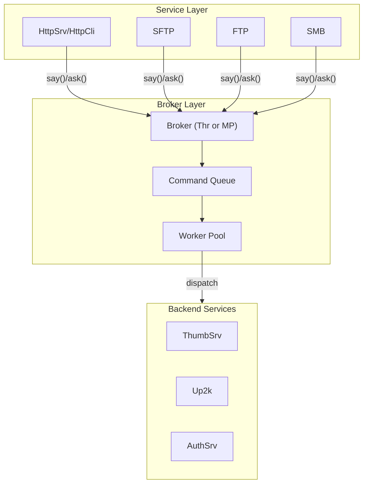
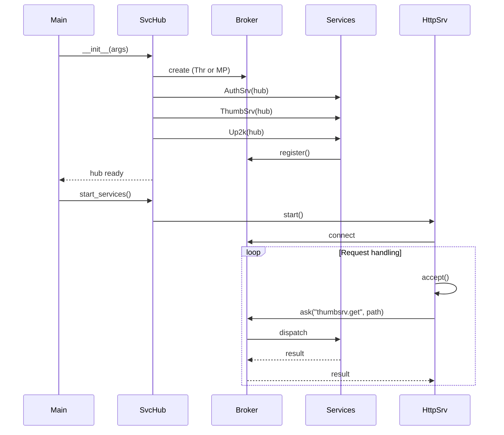

# copyparty Plugins & Broker System

copyparty uses a broker pattern for inter-service communication and supports an extensible plugin architecture for custom functionality.

## Broker Architecture



## Broker Pattern

**File:** `broker_util.py`, `broker_thr.py`, `broker_mp.py`

The broker provides async communication between services:

```python
class BrokerCli:
    """
    Client interface to broker
    Services use this to communicate with backend workers
    """
    def say(self, destination: str, *args) -> None:
        """Fire-and-forget message"""
        self._send(destination, args, want_reply=False)
    
    def ask(self, destination: str, *args) -> queue.Queue:
        """Request-response message"""
        return self._send(destination, args, want_reply=True)
```

### say() vs ask()

| Method | Purpose | Returns | Use Case |
|--------|---------|---------|----------|
| `say()` | Fire-and-forget | `None` | Notifications, logging |
| `ask()` | Request-response | `Queue` | Data retrieval, confirmations |

### Usage Example

```python
class HttpCli:
    def tx_thumb(self, vpath):
        # Request thumbnail
        reply_q = self.broker.ask("thumbsrv.get", vpath, size=(200, 200))
        
        # Wait for response
        thumb_data = reply_q.get(timeout=30)
        
        if thumb_data:
            self.send_bytes(thumb_data)
```

## Broker Implementations

### BrokerThr: Thread-Based

**File:** `broker_thr.py:1`

```python
class BrokerThr(object):
    """
    Thread-based broker for single-process operation.
    All workers run in threads within the same process.
    """
    def __init__(self, hub: "SvcHub"):
        self.hub = hub
        self.cmdq: queue.Queue = queue.Queue()
        self.workers: dict[str, WorkerThr] = {}
    
    def _worker(self, name: str, func: Callable):
        """Worker thread loop"""
        while True:
            cmd = self.cmdq.get()
            if cmd is None:
                break  # Shutdown
            
            dest, args, want_reply, reply_q = cmd
            
            try:
                result = func(*args)
                if want_reply:
                    reply_q.put(result)
            except Exception as ex:
                if want_reply:
                    reply_q.put(ex)
```

### BrokerMP: Multiprocess

**File:** `broker_mp.py:1`

```python
class BrokerMp(object):
    """
    Multiprocess broker for CPU-intensive operations.
    Workers run in separate processes to utilize multiple cores.
    """
    def __init__(self, hub: "SvcHub"):
        self.hub = hub
        self.mp = mp
        self.cmdq: mp.Queue = mp.Queue()
        self.pwq: mp.Queue = mp.Queue()  # Process work queue
        self.retq: mp.Queue = mp.Queue()  # Results
    
    def _worker(self, name: str):
        """Worker process loop"""
        # Reinitialize in subprocess
        self._reinit_logging()
        
        while True:
            cmd = self.pwq.get()
            if cmd is None:
                break
            
            dest, args = cmd
            func = self._get_handler(dest)
            
            try:
                result = func(*args)
                self.retq.put((True, result))
            except Exception as ex:
                self.retq.put((False, ex))
```

### Comparison: Thread vs Process

| Aspect | BrokerThr | BrokerMP |
|--------|-----------|----------|
| Memory | Shared | Separate |
| CPU | GIL-limited | Parallel |
| Startup | Fast | Slow |
| Overhead | Low | Higher |
| Use Case | I/O bound | CPU bound |
| Data | Shared | Serialized |

## Service Hub

**File:** `svchub.py:115`

```python
class SvcHub(object):
    """
    Hosts all services which cannot be parallelized.
    Creates a Broker which does most of the heavy stuff.
    """
    def __init__(self, args, dargs, argv):
        self.args = args
        self.E = args.E
        
        # Create appropriate broker
        if args.no_hash_mp:
            from .broker_thr import BrokerThr
            self.broker = BrokerThr(self)
        else:
            from .broker_mp import BrokerMp
            self.broker = BrokerMp(self)
        
        # Initialize services
        self.asrv = AuthSrv(args, dargs, self.log)
        self.thumbsrv = ThumbSrv(self)
        self.up2k = Up2k(self)
```

## ThumbSrv: Example Service

**File:** `th_srv.py`

```python
class ThumbSrv(object):
    """
    Thumbnail generation service.
    Runs in separate process when using BrokerMP.
    """
    def __init__(self, hub: "SvcHub"):
        self.hub = hub
        self.args = hub.args
        
        # Register with broker
        hub.broker.register("thumbsrv", self)
    
    def handle(self, cmd: str, *args) -> Any:
        """Handle broker commands"""
        if cmd == "get":
            return self.generate_thumbnail(*args)
        elif cmd == "getcfg":
            return self.get_config()
        elif cmd == "reload":
            return self.reload()
    
    def generate_thumbnail(self, fspath: str, size: tuple) -> bytes:
        """Generate thumbnail using PIL/vips/FFmpeg"""
        # ... thumbnail generation
```

## Plugin Architecture

### Handler Plugins

**File:** `__main__.py` - Handler plugin loading

```python
def load_plugins(args):
    """Load handler plugins from --plugins directory"""
    plugins = []
    
    for plugin_dir in args.plugins:
        for fn in os.listdir(plugin_dir):
            if fn.endswith(".py"):
                path = os.path.join(plugin_dir, fn)
                
                # Load plugin module
                spec = importlib.util.spec_from_file_location(fn[:-3], path)
                mod = importlib.util.module_from_spec(spec)
                spec.loader.exec_module(mod)
                
                # Find plugin classes
                for name in dir(mod):
                    obj = getattr(mod, name)
                    if isinstance(obj, type) and hasattr(obj, "handle"):
                        plugins.append(obj())
    
    return plugins
```

### Plugin Interface

```python
class HandlerPlugin:
    """
    Base class for request handler plugins.
    Plugins can intercept and modify HTTP requests.
    """
    
    def match(self, httpcli, vpath: str) -> bool:
        """Return True if this plugin handles this request"""
        return False
    
    def handle(self, httpcli, vpath: str) -> bool:
        """
        Handle the request.
        Return True to complete request, False to fall through.
        """
        return False
    
    def hook_upload(self, fspath: str, metadata: dict) -> bool:
        """Called after file upload, can modify/reject"""
        return True
    
    def hook_delete(self, fspath: str) -> bool:
        """Called before file deletion"""
        return True
```

### Example: Custom Handler

```python
# plugins/my_plugin.py
import os
from copyparty import HandlerPlugin

class MyPlugin(HandlerPlugin):
    """Example plugin that logs all uploads"""
    
    def match(self, httpcli, vpath: str) -> bool:
        # Match all uploads
        return httpcli.mode == "POST" and "/up2k" in vpath
    
    def handle(self, httpcli, vpath: str) -> bool:
        # Log upload attempt
        print(f"Upload to {vpath} by {httpcli.uname}")
        
        # Let default handler process
        return False
    
    def hook_upload(self, fspath: str, metadata: dict) -> bool:
        # Log successful upload
        size = os.path.getsize(fspath)
        print(f"Uploaded: {fspath} ({size} bytes)")
        
        # Allow upload
        return True
```

## Event Hooks

**File:** `httpcli.py` - Hook invocation

```python
class HttpCli:
    def handle_put(self, vpath):
        """Handle PUT request (upload)"""
        # ... upload processing ...
        
        # Run hooks
        for hook in self.args.hooks.get("upload", []):
            if not hook(fspath, metadata):
                # Hook rejected upload
                os.unlink(fspath)
                raise Pebkac(403, "upload rejected by hook")
        
        return self.send_response(201, "Created")
```

### Hook Types

| Hook | When Called | Can Cancel |
|------|-------------|------------|
| `upload` | After upload complete | Yes (delete file) |
| `delete` | Before delete | Yes (prevent) |
| `rename` | Before rename | Yes (prevent) |
| `mkdir` | After mkdir | Yes (rmdir) |
| `copy` | After copy | No |

## Metadata Parsers (mtag)

**File:** `mtag.py`

```python
class MParser:
    """Base class for metadata parsers"""
    
    def __init__(self, ext: str):
        self.ext = ext
    
    def parse(self, fspath: str) -> dict[str, Any]:
        """Parse file and return metadata dict"""
        raise NotImplementedError

class FFmpegParser(MParser):
    """Parse media files using ffprobe"""
    
    def parse(self, fspath: str) -> dict[str, Any]:
        cmd = ["ffprobe", "-v", "quiet", "-print_format", "json",
               "-show_format", "-show_streams", fspath]
        
        result = subprocess.run(cmd, capture_output=True, text=True)
        data = json.loads(result.stdout)
        
        return self._extract_tags(data)
    
    def _extract_tags(self, data: dict) -> dict[str, Any]:
        tags = {}
        
        if "format" in data and "tags" in data["format"]:
            fmt = data["format"]["tags"]
            tags["title"] = fmt.get("title")
            tags["artist"] = fmt.get("artist")
            tags["album"] = fmt.get("album")
            tags["track"] = fmt.get("track")
            tags["duration"] = float(data["format"].get("duration", 0))
        
        return tags
```

## Custom Parsers

```python
# plugins/pdf_parser.py
from copyparty.mtag import MParser

class PDFParser(MParser):
    """Extract PDF metadata"""
    
    exts = [".pdf"]
    
    def parse(self, fspath: str) -> dict[str, Any]:
        from PyPDF2 import PdfReader
        
        reader = PdfReader(fspath)
        info = reader.metadata
        
        return {
            "title": info.title,
            "author": info.author,
            "pages": len(reader.pages),
            "subject": info.subject,
        }

# Register
MParser.register(PDFParser)
```

## ZeroMQ Integration

**File:** `__main__.py` - Zeromq hook support

```python
def setup_zeromq(args):
    """Setup ZeroMQ event publishing"""
    import zmq
    
    context = zmq.Context()
    socket = context.socket(zmq.PUB)
    socket.bind(args.zmq_addr)
    
    def zmq_hook(event_type: str, path: str, **kwargs):
        """Send event to ZeroMQ subscribers"""
        socket.send_json({
            "type": event_type,
            "path": path,
            "timestamp": time.time(),
            **kwargs
        })
    
    # Register hooks
    args.hooks["upload"].append(lambda p, m: zmq_hook("upload", p, meta=m))
    args.hooks["delete"].append(lambda p: zmq_hook("delete", p))
```

## Aha: Broker Queue Pattern

**Key insight:** The broker uses Python's `queue.Queue` for backpressure and flow control.

**File:** `broker_util.py`, `broker_thr.py`

```python
def ask(self, destination: str, *args) -> queue.Queue:
    """
    Request-response pattern with timeout support.
    Returns a queue that will receive the response.
    """
    reply_q: queue.Queue = queue.Queue(maxsize=1)
    
    self._send(destination, args, want_reply=True, reply_q=reply_q)
    
    return reply_q

# Usage in HttpCli:
def tx_thumb(self, vpath):
    q = self.broker.ask("thumbsrv.get", vpath)
    
    try:
        data = q.get(timeout=30)  # Timeout prevents hanging
        if isinstance(data, Exception):
            raise data
        return data
    except queue.Empty:
        self.log("thumbnail timeout")
        return None
```

This pattern:
1. Decouples services (don't need direct references)
2. Provides natural backpressure (queues fill up)
3. Enables timeouts (prevents hanging)
4. Supports both sync and async usage

## Process Safety

**File:** `broker_mp.py` - Shared state handling

```python
def _reinit_logging(self):
    """
    Reinitialize logging in subprocess.
    Log handlers don't survive fork on all platforms.
    """
    import logging
    
    # Get new logger instance
    logger = logging.getLogger("copyparty")
    
    # Re-add handlers
    handler = logging.StreamHandler()
    handler.setFormatter(logging.Formatter(
        "%(asctime)s %(levelname)s: %(message)s"
    ))
    logger.addHandler(handler)
```

## Service Lifecycle



## Next Document

[09-data-flow.md](09-data-flow.md) — End-to-end request flows and sequence diagrams.
