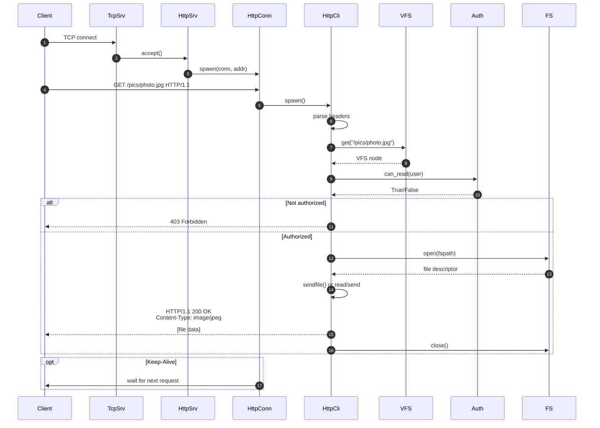
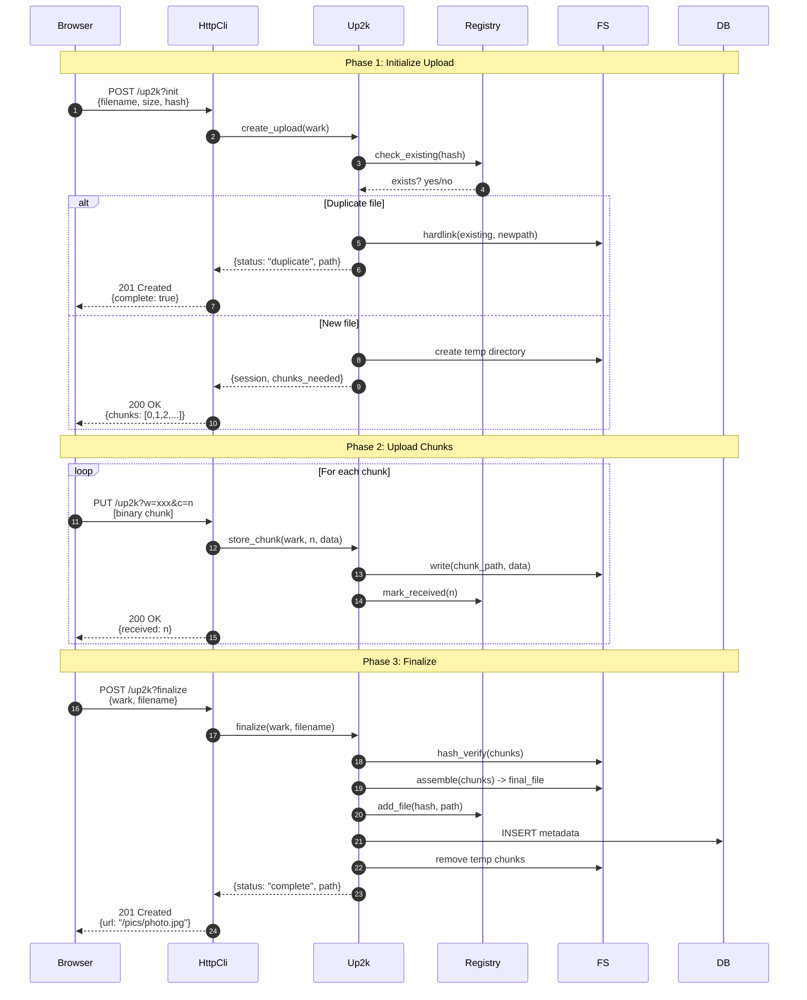
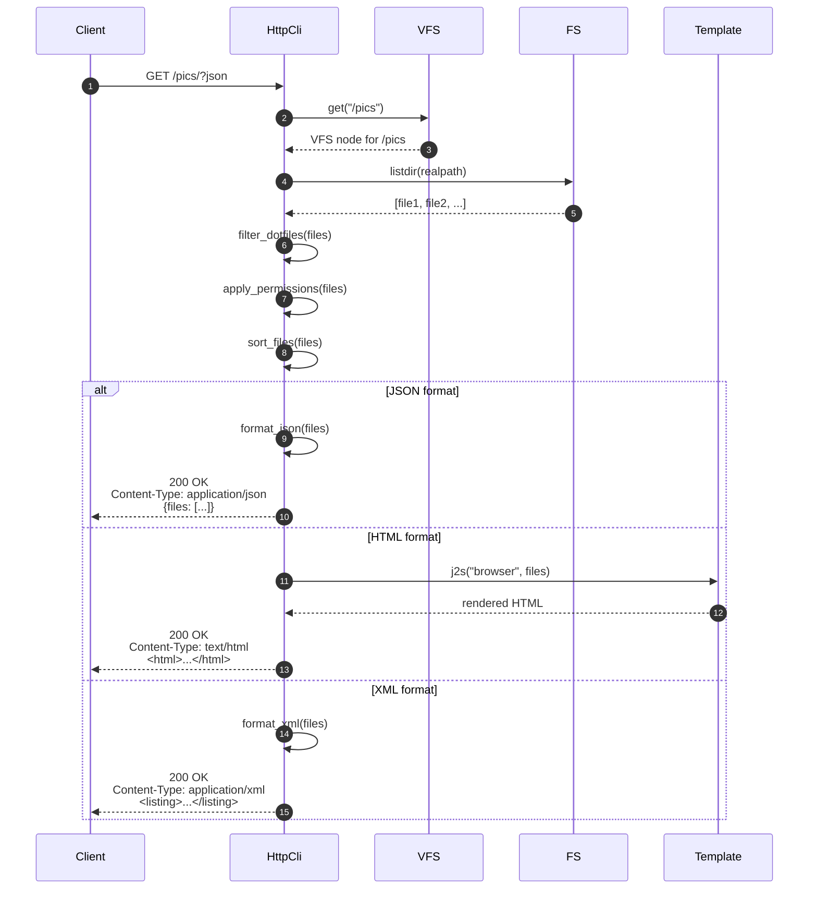
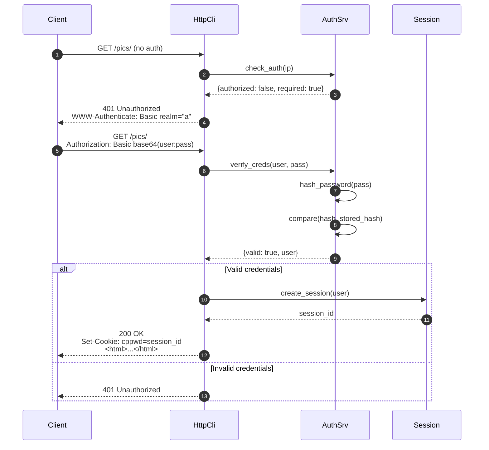
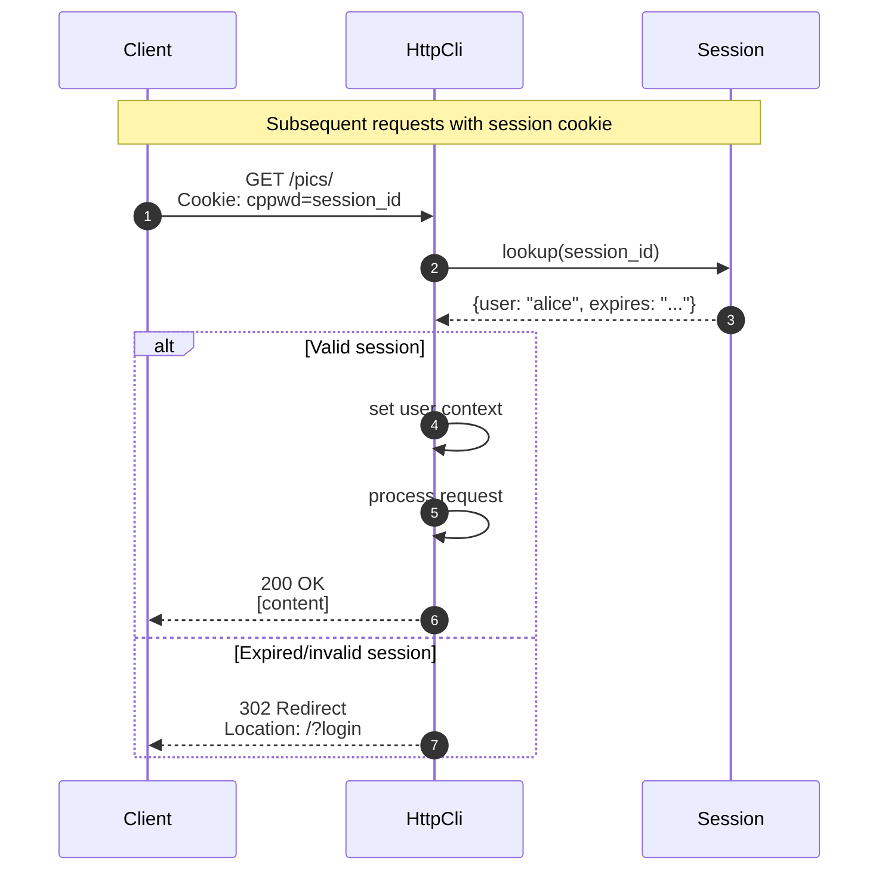
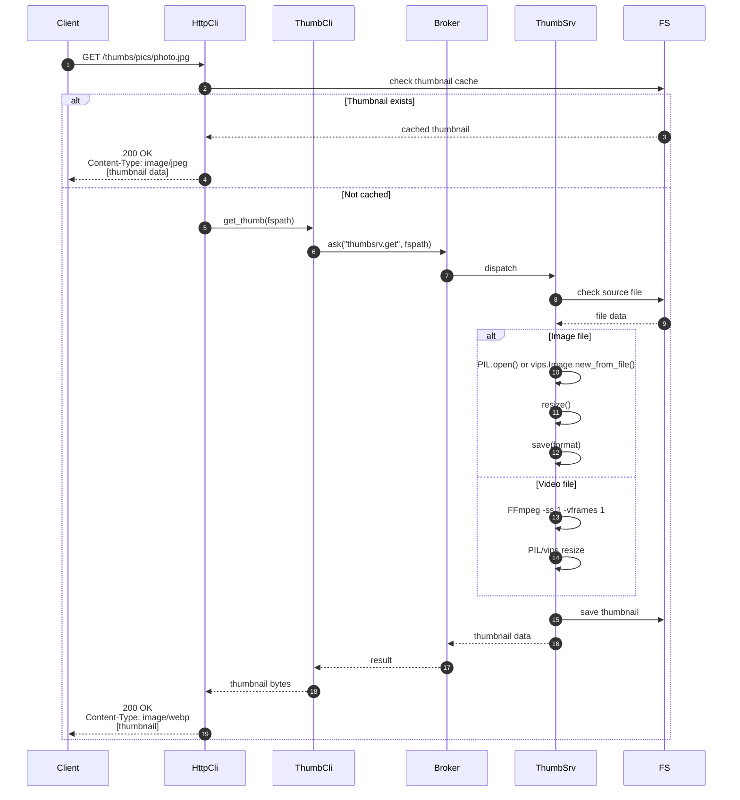
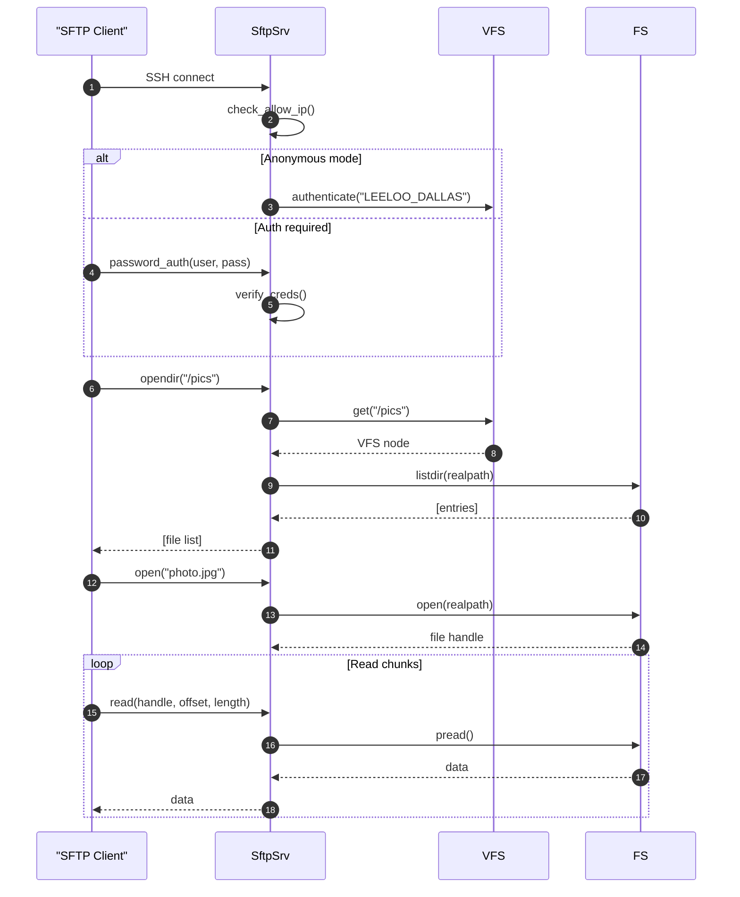
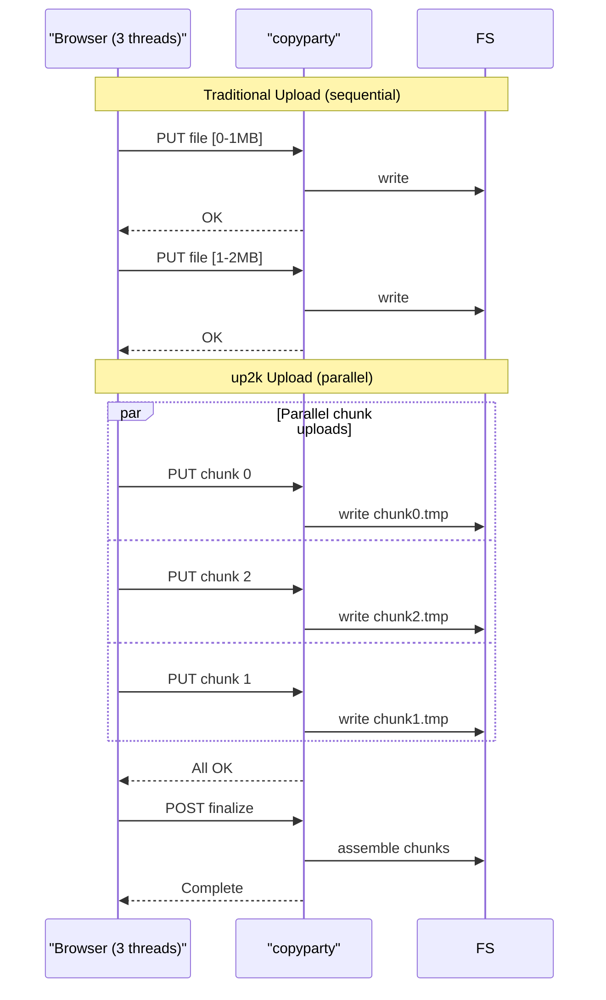
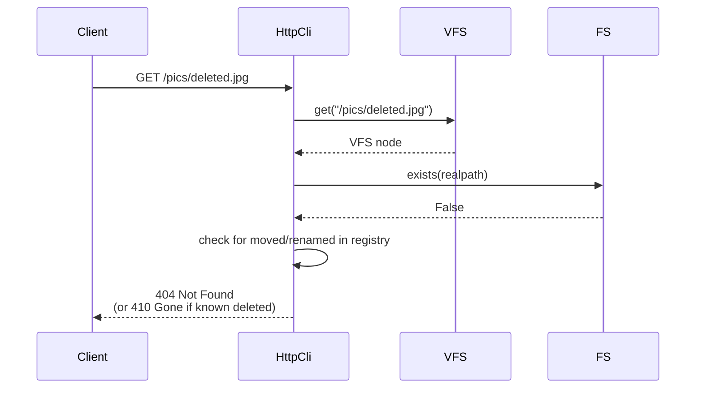
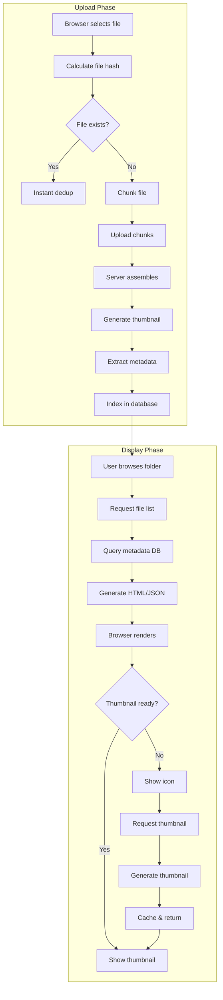

# copyparty Data Flows

This document shows end-to-end request flows through the copyparty system.

## HTTP Request Flow

### Standard File Request



### Upload Flow (up2k Protocol)



## Directory Listing Flow



## Authentication Flow

### HTTP Basic Auth



### Cookie-based Session



## Thumbnail Flow



## WebDAV Flow (PROPFIND)

```mermaid
sequenceDiagram
    autonumber
    participant Client
    participant HttpCli
    participant VFS
    participant FS

    Client->>HttpCli: PROPFIND /pics/<br/>Depth: 1
    
    HttpCli->>VFS: get("/pics")
    VFS-->>HttpCli: VFS node
    
    HttpCli->>HttpCli: check DAV permission
    
    HttpCli->>FS: listdir()
    FS-->>HttpCli: [entries]
    
    loop For each entry
        HttpCli->>FS: stat(entry)
        FS-->>HttpCli: stat_result
    end
    
    HttpCli->>HttpCli: generate_dav_xml(files)
    
    HttpCli-->>Client: 207 Multi-Status<br/>Content-Type: application/xml<br/>&lt;multistatus&gt;...&lt;/multistatus&gt;
```

## Alternative Protocol Flows

### SFTP Connection



## Aha: Parallel Upload Design

**Key insight:** The up2k protocol enables true parallel chunked uploads.



This allows:
1. **Resumability**: Only upload missing chunks
2. **Parallelism**: Multiple chunks simultaneously
3. **Browser optimization**: Use multiple HTTP connections
4. **Network resilience**: Failed chunks don't restart whole upload

## Error Flows

### Permission Denied

```mermaid
sequenceDiagram
    participant Client
    participant HttpCli
    participant VFS

    Client->>HttpCli: PUT /pics/upload.jpg
    
    HttpCli->>VFS: get("/pics")
    VFS-->>HttpCli: VFS node
    
    HttpCli->>HttpCli: check write permission
    
    alt No write permission
        HttpCli->>HttpCli: log("403: %s tried to upload" % user)
        HttpCli-->>Client: 403 Forbidden<br/>&lt;html&gt;not allowed&lt;/html&gt;
    end
```

### File Not Found



## Complete Upload-to-Display Flow



## Next Document

[README.md](README.md) — Table of contents and index.
