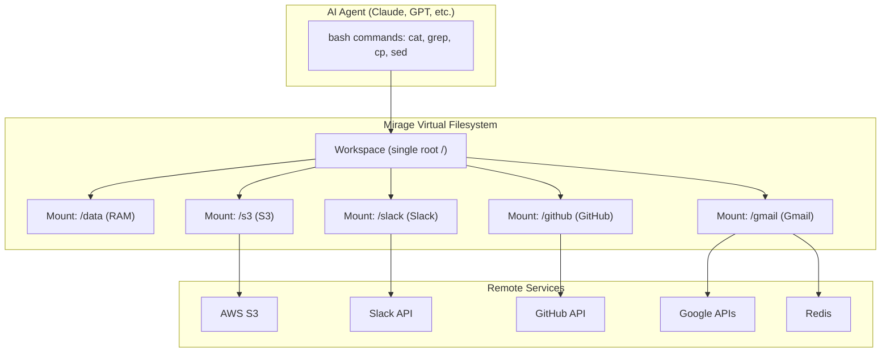
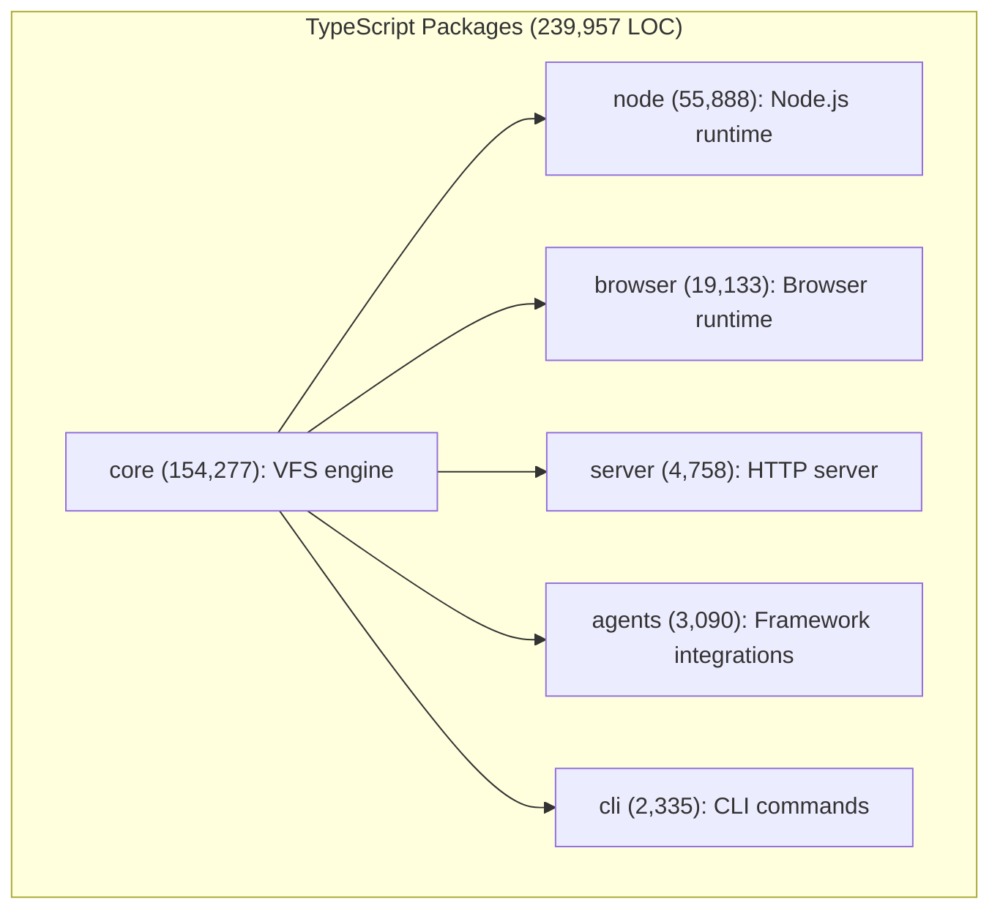

# Mirage — Unified Virtual File System for AI Agents

**Mirage is a Unified Virtual File System for AI Agents — a single tree that mounts services and data sources like S3, Google Drive, Slack, Gmail, and Redis side-by-side as one filesystem.**

## What It Does

**Aha:** The key insight is that AI agents already know bash — they don't need to learn a new API per service. Mirage translates a single `grep` command into service-specific operations: for S3 it downloads and searches, for Slack it reads channel messages, for Gmail it searches emails. The agent sees one filesystem underneath.

## Supported Backends (30+)

| Category | Resources |
|----------|-----------|
| Storage | RAM, Disk, S3/R2/GCS/OCI/Supabase, Dropbox, Box |
| Google Workspace | GDrive, GDocs, GSheets, GSlides, Gmail |
| Communication | Slack, Discord, Telegram, Email |
| Development | GitHub, GitHub CI, Linear, Notion, Trello |
| Database | MongoDB, Redis, Postgres |
| Analytics | Langfuse, PostHog, Vercel |
| Research | Semantic Scholar (papers, authors) |
| Browser | OPFS (Origin Private File System) |

## TypeScript SDK Architecture

## Python SDK Architecture

Source: `python/mirage/` (222,702 LOC)

| Module | Purpose |
|--------|---------|
| `workspace/` | Workspace, Mount, MountRegistry, Dispatcher |
| `resource/` | 30+ resource implementations |
| `commands/` | Built-in commands (cat, grep, sed, awk, etc.) |
| `shell/` | Shell parser, job table |
| `cache/` | File and index caching |
| `ops/` | Operation registry with per-resource overrides |
| `fuse/` | FUSE filesystem mount |
| `cli/` | Command-line interface |

## What's Next

- [01 — Architecture](01-architecture.md) — Full dependency graph, core abstractions
- [02 — Workspace](02-workspace.md) — The Workspace class, mount management
- [03 — Resource System](03-resource-system.md) — Resource interface, 30+ backends
