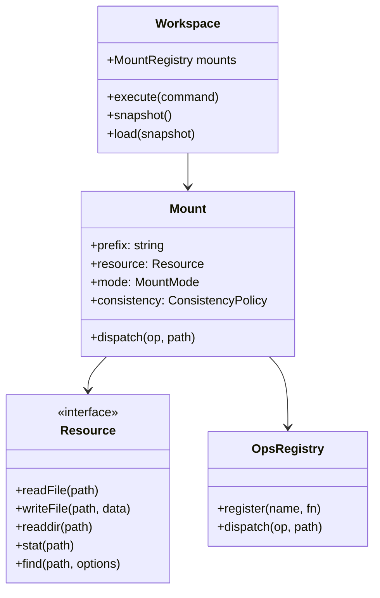
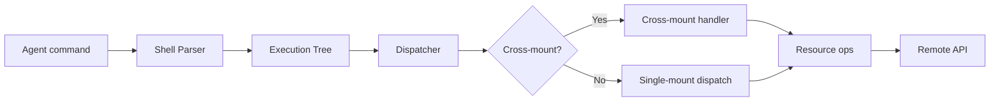

# Architecture — Core Abstractions, Dependency Graph

**Mirage is organized around four core abstractions: Workspace, Resource, Mount, and Operation.**

## Core Abstractions

## Key Types

**Aha:** The `PathSpec` type is the core of path resolution — every filesystem operation starts by parsing a path into a PathSpec, which identifies the mount prefix, the resource-local path, and whether the path crosses mount boundaries. This is how `cp /s3/data /github/repo/data` knows to read from S3 and write to GitHub.

Source: `typescript/packages/core/src/types.ts`

| Type | Purpose |
|------|---------|
| `PathSpec` | Parsed filesystem path with mount resolution |
| `FileStat` | File metadata (size, type, fingerprint, revision) |
| `FileType` | `file`, `directory`, `symlink` |
| `MountMode` | `read`, `write`, `exec` |
| `ConsistencyPolicy` | `lazy` (read-through cache) or `always` (sync every read) |
| `DriftPolicy` | `strict` (error on mismatch) or `off` (skip checks) |
| `ResourceName` | Enum of 30+ supported backends |

## Dependency Flow

## Package Dependencies

| Package | Depends On |
|---------|-----------|
| `@struktoai/mirage-core` | None (base package) |
| `@struktoai/mirage-node` | core, tree-sitter, FUSE bindings |
| `@struktoai/mirage-browser` | core, OPFS API |
| `@struktoai/mirage-server` | core, Express/Fastify |
| `@struktoai/mirage-agents` | core, OpenAI/LangChain/Mastra SDKs |
| `@struktoai/mirage-cli` | core, commander |

## What's Next

- [02 — Workspace](02-workspace.md) — The Workspace class, mount management
- [03 — Resource System](03-resource-system.md) — Resource interface, 30+ backends
- [00 — Overview](00-overview.md) — Return to overview
