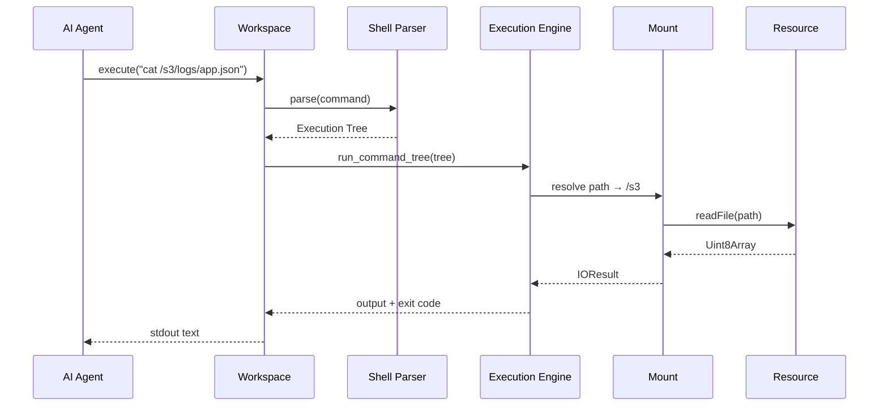
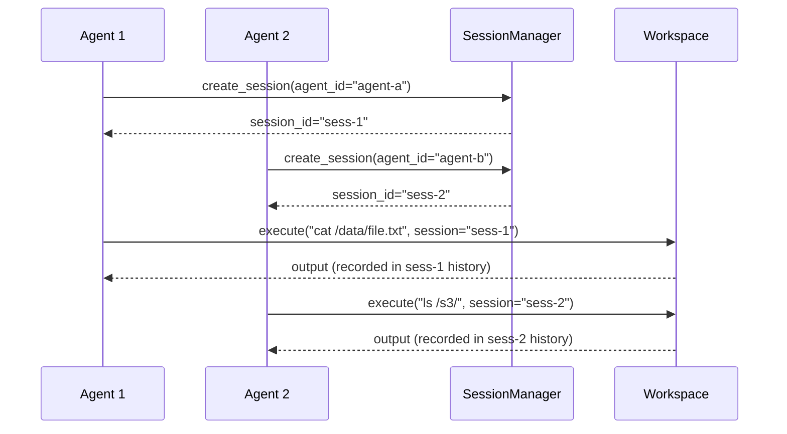

# Workspace — Single Root, Heterogeneous Mounts

**The Workspace is the central abstraction — a single root filesystem with heterogeneous mounts, each backed by a different Resource.**

## Workspace Class

Source: `typescript/packages/core/src/workspace/workspace.ts`

```typescript
const ws = new Workspace({
  '/data': new RAMResource(),
  '/s3': new S3Resource({ bucket: 'logs' }),
  '/slack': new SlackResource({}),
  '/github': new GitHubResource({}),
})
```

### Constructor Parameters

| Parameter | Purpose | Default |
|-----------|---------|---------|
| `resources` | Dict of mount path → Resource | Required |
| `cache_limit` | File cache size limit | `"512MB"` |
| `cache` | Cache config (RAM or Redis) | RAM |
| `consistency` | Default consistency policy | `lazy` |
| `drift` | Drift detection policy | `off` |

## Execution Flow



## Session Flow



**Aha:** Sessions enable multiple agents to share the same Workspace without interfering with each other's command history or state.

## Mount Registry

Source: `typescript/packages/core/src/workspace/mount/registry.ts`

The `MountRegistry` manages all mounts in the workspace:

| Method | Purpose |
|--------|---------|
| `register(mount)` | Add a mount to the workspace |
| `mountFor(path)` | Find the mount that owns a path |
| `list()` | List all mounts |
| `unregister(prefix)` | Remove a mount |

Path resolution walks mounts longest-prefix-first — `/s3/logs/app.json` matches `/s3` before `/`.

## What's Next

- [03 — Resource System](03-resource-system.md) — Resource interface, 30+ backends
- [04 — Mount System](04-mount-system.md) — Per-mount commands, ops, policies
- [01 — Architecture](01-architecture.md) — Return to architecture
