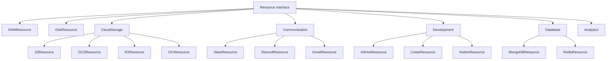
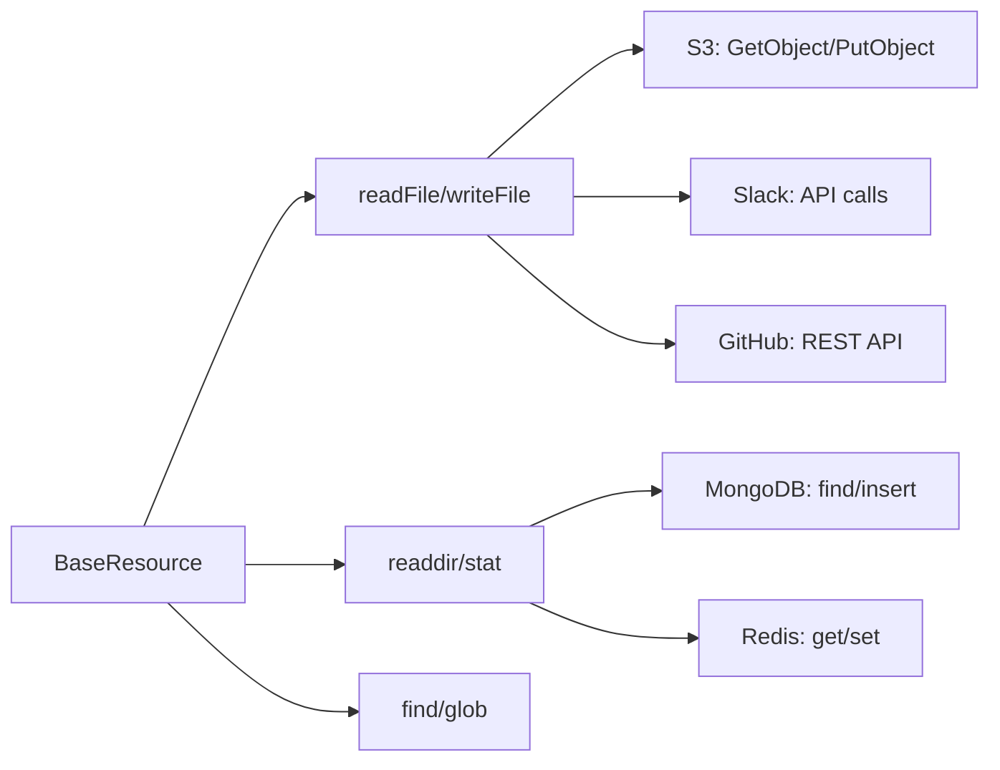

# Resource System — 30+ Backend Implementations

**The Resource interface is the contract that all 30+ backends implement — translating filesystem operations into service-specific API calls.**

## Resource Interface

Source: `typescript/packages/core/src/resource/base.ts`

```typescript
interface Resource {
  readonly kind: string
  readonly isRemote?: boolean
  readonly supportsSnapshot?: boolean
  readonly accessor?: Accessor
  readonly index?: IndexCacheStore

  open(): Promise<void>
  close(): Promise<void>

  readFile(path: PathSpec): Promise<Uint8Array>
  writeFile(path: PathSpec, data: Uint8Array): Promise<void>
  readdir(path: PathSpec): Promise<string[]>
  stat(path: PathSpec): Promise<FileStat>
  exists(path: PathSpec): Promise<boolean>
  mkdir(path: PathSpec): Promise<void>
  unlink(path: PathSpec): Promise<void>
  rename(src: PathSpec, dst: PathSpec): Promise<void>
  find(path: PathSpec, options?: FindOptions): Promise<string[]>
  // ... 15+ more methods
}
```

## Resource Categories



## Resource Implementations by Backend



## RAMResource

Source: `typescript/packages/core/src/resource/ram/ram.ts`

In-memory filesystem — the simplest resource implementation:

| Method | Implementation |
|--------|---------------|
| `readFile` | Read from in-memory Uint8Array map |
| `writeFile` | Write to in-memory map |
| `readdir` | List keys under prefix |
| `stat` | Return size, type, mtime from metadata |

## S3Resource

Source: `typescript/packages/core/src/resource/s3/`

AWS S3 (and compatible: R2, GCS, OCI, Supabase):

| Operation | S3 API |
|-----------|--------|
| `readFile` | `GetObject` |
| `writeFile` | `PutObject` |
| `readdir` | `ListObjectsV2` with prefix |
| `stat` | `HeadObject` |
| `unlink` | `DeleteObject` |
| `mkdir` | No-op (S3 has no directories) |
| `find` | `ListObjectsV2` with filter |

## SlackResource

Source: `typescript/packages/core/src/resource/slack/`

Slack as a filesystem:

| Path Pattern | Meaning |
|-------------|---------|
| `/channels/<name>` | Channel directory |
| `/channels/<name>/messages.json` | Channel messages |
| `/users` | User list |
| `/files/<id>` | File content |

**Aha:** The `supportsSnapshot` flag on Resource enables workspace snapshot/replay with drift detection. Remote resources like S3 populate `FileStat.fingerprint` (ETag for S3, last_modified for Slack) so replay can detect if the remote file changed since the snapshot was taken.

## What's Next

- [04 — Mount System](04-mount-system.md) — Per-mount commands, ops, policies
- [06 — Ops & Commands](06-ops-commands.md) — Operation registry, command overrides
- [02 — Workspace](02-workspace.md) — Return to workspace
