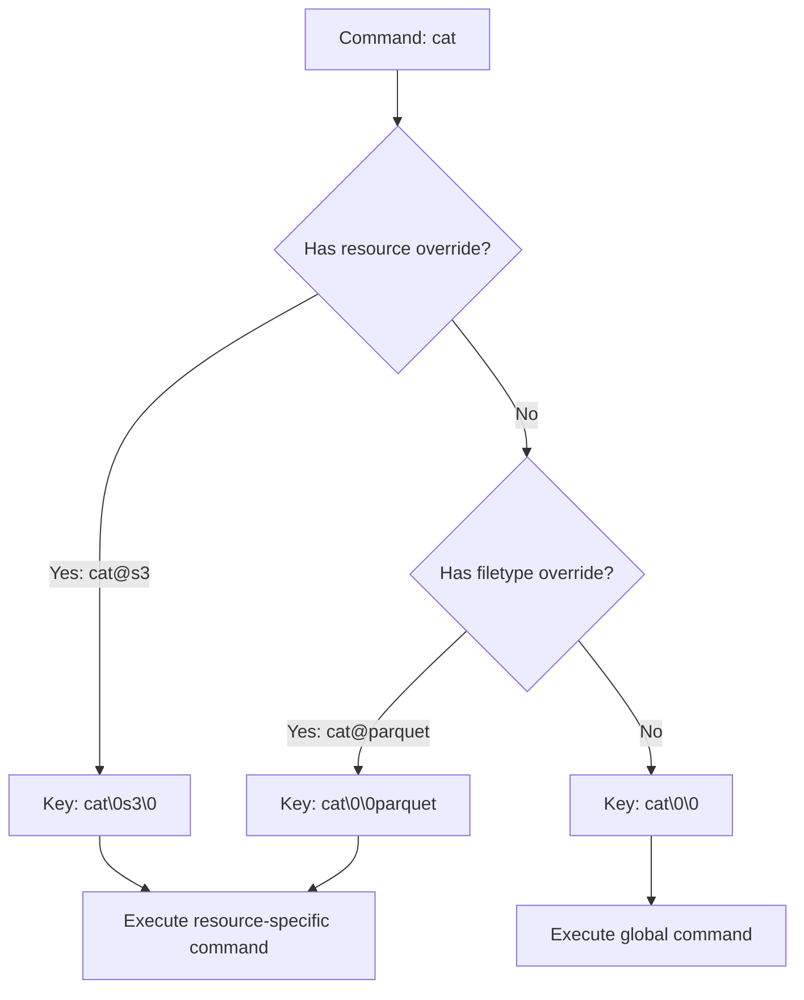
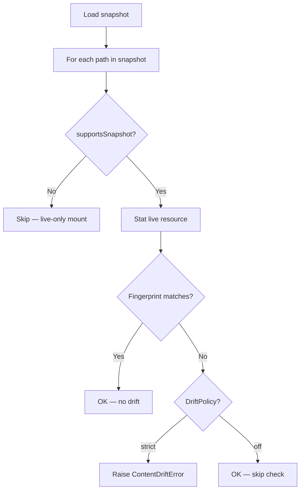

# Mount System — Per-Mount Commands, Ops, Policies

**Each Mount wraps a Resource and adds per-mount commands, operations, and policies — enabling service-specific behavior while maintaining a unified interface.**

## Mount Class

Source: `typescript/packages/core/src/workspace/mount/mount.ts`

```typescript
class Mount {
  readonly prefix: string       // e.g. "/s3"
  readonly resource: Resource   // e.g. S3Resource
  readonly mode: MountMode      // "read" | "write" | "exec"
  readonly consistency: ConsistencyPolicy  // "lazy" | "always"
  readonly revisions: Map<string, string>  // Snapshot revision pins
}
```

## Mount Modes

| Mode | Behavior |
|------|----------|
| `read` | Read-only — write operations return error |
| `write` | Read-write — all operations allowed |
| `exec` | Execute-only — only command execution, no file I/O |

## Consistency Policies

Source: `typescript/packages/core/src/types.ts`

```typescript
const ConsistencyPolicy = Object.freeze({
  LAZY: 'lazy',    // Read through cache, stale reads OK
  ALWAYS: 'always', // Sync every read, always fresh
})
```

| Policy | Cache Behavior | Use Case |
|--------|---------------|----------|
| `lazy` | Serve from cache, refresh in background | Fast reads, eventual consistency |
| `always` | Always fetch from resource, update cache | Fresh data required |

## Per-Mount Command Overrides

Source: `typescript/packages/core/src/workspace/mount/mount.ts:77-80`

```typescript
private readonly cmds = new Map<CmdKey, RegisteredCommand>()
private readonly ops = new Map<OpKey, RegisteredOp>()
```

Mounts can register custom commands and operations that override the global defaults:

```typescript
// Override `cat` for Parquet files in /s3
ws.command('cat', { resource: 's3', filetype: 'parquet' },
  async (accessor, path) => {
    const parquet = await readParquet(path)
    return parquet.rows.map(r => JSON.stringify(r)).join('\n')
  })
```

## Command Key Resolution



**Aha:** Command keys use a null-byte separator: `cat\0parquet` means "cat command for parquet files." This allows the same command name to have different implementations per resource and filetype — `cat` on a text file reads bytes, `cat` on a Parquet file renders rows as JSON.

## Drift Detection

Source: `typescript/packages/core/src/workspace/snapshot/drift.ts`

When loading a snapshot, Mount compares live fingerprints with recorded revisions:



## What's Next

- [05 — Shell Parser](05-shell-parser.md) — tree-sitter bash parsing
- [06 — Ops & Commands](06-ops-commands.md) — Operation registry
- [08 — Snapshot & Replay](08-snapshot-replay.md) — Serialization with drift detection
