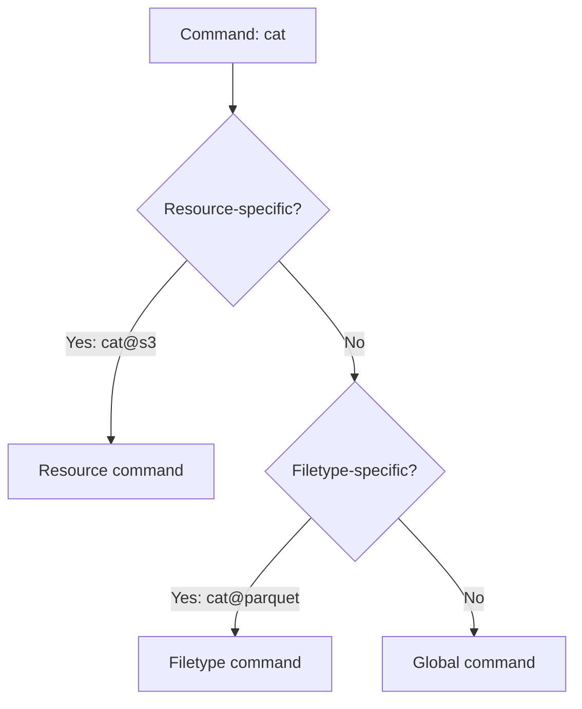
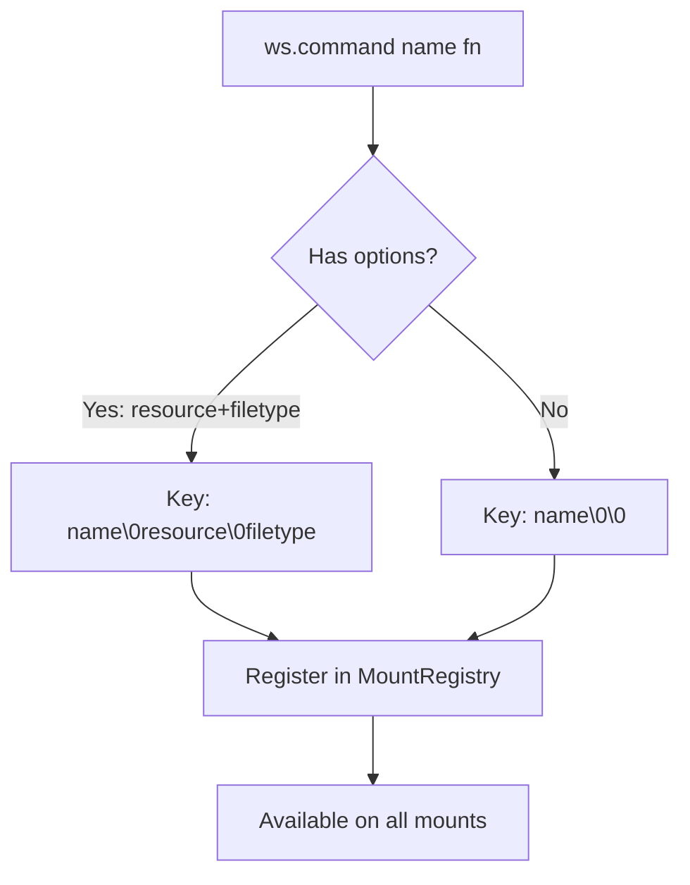
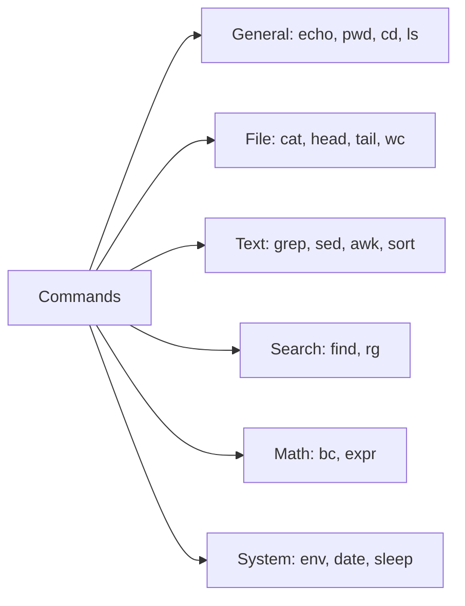

# Ops & Commands — Operation Registry, Built-in Commands

**Mirage has two command systems: Operations (low-level file ops like read/write) and Commands (shell commands like cat/grep/sed) — both overridable per-resource and per-filetype.**

## Operations Registry

Source: `typescript/packages/core/src/ops/registry.ts`

```typescript
export interface OpFn {
  (accessor: Accessor, path: PathSpec, args: unknown[], kwargs: OpKwargs): unknown
}

export interface RegisteredOp {
  name: string          // "read", "write", "readdir"
  resource: string | null  // null = global, or specific resource
  filetype: string | null  // null = all types, or specific extension
  fn: OpFn
  write: boolean        // Does this op modify data?
}
```

### Operation Decorator

```typescript
@op('read', { resource: 's3', filetype: 'parquet' })
async function readParquet(accessor, path, args, kwargs) {
  const data = await s3GetObject(path)
  return parseParquet(data)
}
```

## Commands Registry

Source: `typescript/packages/core/src/commands/`

Built-in commands are organized by category:

| Category | Commands |
|----------|----------|
| General | `echo`, `pwd`, `cd`, `ls`, `history`, `which` |
| File ops | `cat`, `head`, `tail`, `wc`, `cp`, `mv`, `rm`, `mkdir`, `touch` |
| Text | `grep`, `sed`, `awk`, `sort`, `uniq`, `cut`, `tr`, `diff` |
| Search | `find`, `rg` (ripgrep) |
| Math | `bc`, `expr` |
| Encoding | `base64`, `xxd` |
| System | `env`, `date`, `uname`, `sleep`, `true`, `false` |

## Command Resolution

Source: `typescript/packages/core/src/commands/resolve.ts`

Commands are resolved in order of specificity:



## Command Registration Flow



## Built-in Command Categories



**Aha:** Command resolution uses a null-byte key: `cat\0parquet`. The same `cat` command reads raw bytes for text files but renders Parquet rows as JSON for `.parquet` files in S3. The agent doesn't need to know about file formats — it just types `cat`.

## Custom Commands

```typescript
// Register a command available across all mounts
ws.command('summarize', async (accessor, path, args) => {
  const content = await accessor.readFile(path)
  return summarize(content)
})

// Override cat for a specific resource + filetype
ws.command('cat', { resource: 's3', filetype: 'parquet' },
  async (accessor, path) => {
    const data = await accessor.readFile(path)
    return parquetToJson(data)
  })
```

## What's Next

- [07 — Cross-Mount](07-cross-mount.md) — cp, mv, diff across backends
- [04 — Mount System](04-mount-system.md) — Return to mount system
- [05 — Shell Parser](05-shell-parser.md) — Return to shell parser
