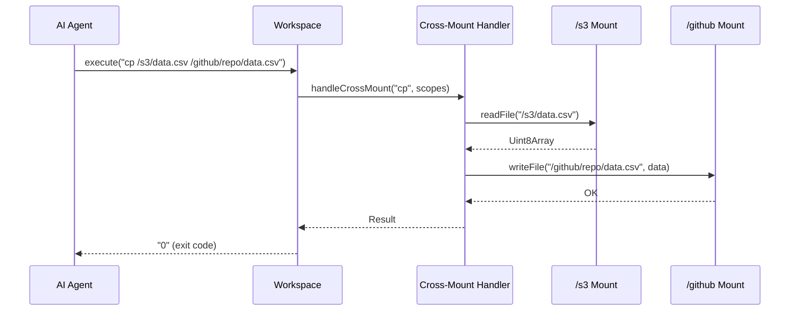
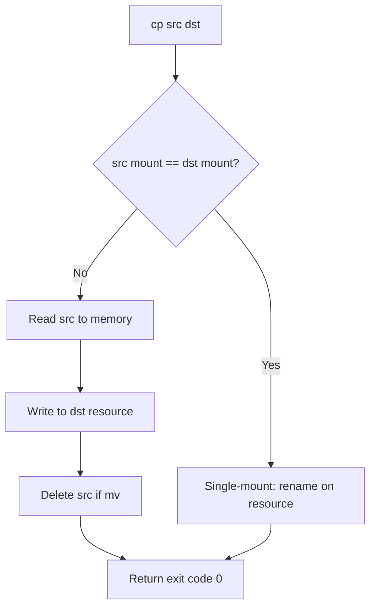

# Cross-Mount Operations — cp, mv, diff Across Backends

**Cross-mount operations enable commands like `cp /s3/data.csv /github/repo/data.csv` — copying data between completely different backends through a single command.**

## Cross-Mount Detection

Source: `typescript/packages/core/src/workspace/executor/cross_mount.ts`

```typescript
const CROSS_COMMANDS = new Set(['cp', 'mv', 'diff', 'cmp'])
const MULTI_READ_COMMANDS = new Set(['cat', 'head', 'tail', 'wc', 'grep', 'rg'])

function isCrossMount(cmdName, scopes, registry): boolean {
  if (!allowed.has(cmdName) || scopes.length < 2) return false
  const mounts = new Set(scopes.map(s => registry.mountFor(s.original)))
  return mounts.size > 1
}
```

## Cross-Mount Commands



## Supported Cross-Mount Operations

| Command | Operation |
|---------|-----------|
| `cp src dst` | Read from src mount, write to dst mount |
| `mv src dst` | Read from src, write to dst, delete src |
| `diff a b` | Read both, compare, output differences |
| `cmp a b` | Read both, byte-compare |
| `cat a b c` | Read from multiple mounts, concatenate |
| `grep pattern a b` | Search across multiple mounts |

## Cross-Mount cp Implementation



**Aha:** Cross-mount `cp` from S3 to GitHub reads the file through S3's `GetObject` API and writes it through GitHub's content API — the agent writes a single `cp` command and Mirage handles the protocol translation.

## Multi-Read Commands

Commands like `cat`, `grep`, `head` can read from multiple mounts simultaneously:

```bash
grep error /s3/logs/*.json /slack/general/*.json /github/issues/*.json
```

This searches three different backends in a single command — S3 objects, Slack messages, and GitHub issues — returning all matches in one output.

## What's Next

- [08 — Snapshot & Replay](08-snapshot-replay.md) — Workspace serialization
- [09 — Caching](09-caching.md) — File cache, index cache
- [06 — Ops & Commands](06-ops-commands.md) — Return to ops
