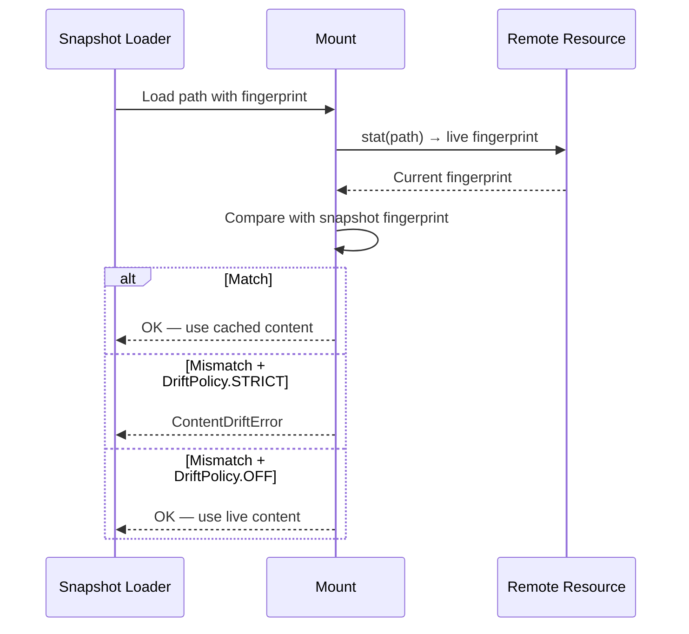

# Snapshot & Replay — Workspace Serialization with Drift Detection

**Mirage can serialize an entire workspace to a file and replay it later — capturing every file, every mount state, and detecting if remote resources changed since the snapshot.**

## Snapshot Format

Source: `typescript/packages/core/src/workspace/snapshot/`

```mermaid
flowchart TD
    A[workspace.snapshot] --> B[WorkspaceState]
    B --> C[MountSnapshot[]]
    B --> D[ResourceState[]]
    B --> E[FingerprintEntry[]]
    B --> F[ExecutionRecordSnapshot]

    C --> G[prefix, resource kind, mode]
    D --> H[serialized resource state]
    E --> I[path, fingerprint, revision]
    F --> J[command history, results]
```

## Snapshot Creation

```typescript
const snapshot = await ws.snapshot()
await saveSnapshotToFile(snapshot, 'workspace.mirage')
```

### What's Captured

| Component | Captured | Notes |
|-----------|----------|-------|
| RAM mounts | Full content | All files serialized |
| Disk mounts | File list + content | Files within cache limit |
| Remote mounts | Fingerprints only | ETag, last_modified, revision |
| Execution history | All commands | Command, output, exit code |
| Mount config | Prefix, resource, mode | Recreated on load |

## Snapshot Loading with Drift Detection

```typescript
const loaded = await loadSnapshotFromFile('workspace.mirage')
const ws = await Workspace.load(loaded, {
  drift: DriftPolicy.STRICT,  // Error if remote changed
})
```

### Drift Detection Flow



**Aha:** Remote resources (S3, Slack, GitHub) can't be fully snapshotted — their content changes independently. Instead, Mirage stores a fingerprint (ETag for S3, timestamp for Slack) and detects drift on load. With `DriftPolicy.STRICT`, any change since the snapshot causes an error, ensuring the agent sees the exact same state.

## Replay Execution

After loading a snapshot, the agent can replay commands:

```typescript
const ws = await Workspace.load(snapshot)
for (const record of snapshot.executionHistory) {
  const result = await ws.execute(record.command)
  assert(result.exitCode === record.exitCode)
}
```

## What's Next

- [09 — Caching](09-caching.md) — File cache, index cache, Redis
- [04 — Mount System](04-mount-system.md) — Return to mount system
- [02 — Workspace](02-workspace.md) — Return to workspace
