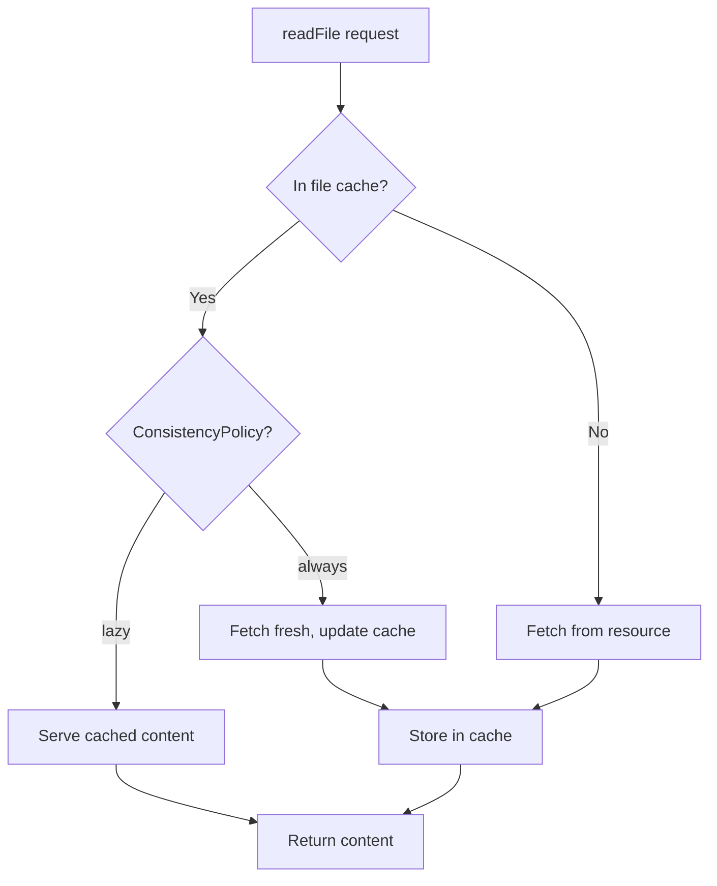
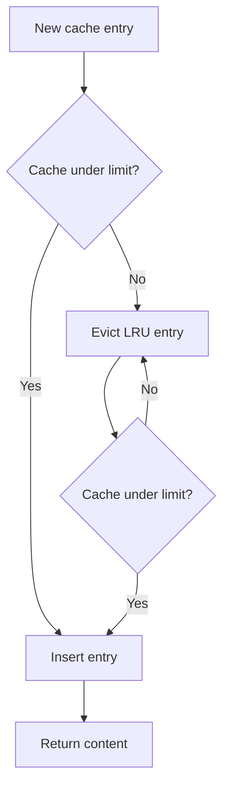
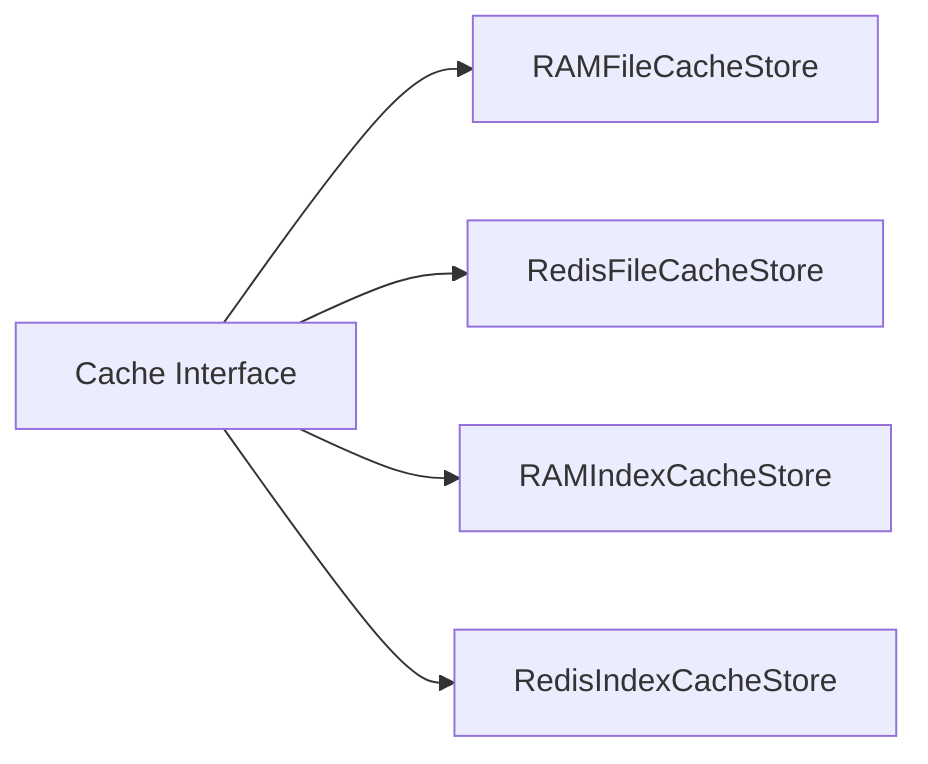

# Caching — File Cache, Index Cache, Redis Integration

**Mirage has a two-tier caching system: file cache for content and index cache for directory listings — both supporting RAM and Redis backends.**

## File Cache

Source: `typescript/packages/core/src/cache/file/`



### Cache Configuration

```typescript
const ws = new Workspace(resources, {
  cache_limit: "512MB",  // LRU eviction when exceeded
  cache: new RAMFileCacheStore({ maxSize: 512 * 1024 * 1024 }),
})
```

| Parameter | Purpose | Default |
|-----------|---------|---------|
| `cache_limit` | Max cache size (string or bytes) | `"512MB"` |
| `cache` | Cache store (RAM or Redis) | RAM |

## Index Cache

Source: `typescript/packages/core/src/cache/index/`

Caches directory listings and metadata — avoids repeated `ListObjectsV2` calls to S3 or API calls to Slack:

```typescript
ws.setIndex(new IndexConfig({
  ttl: 300,  // 5 minute TTL
  store: new RedisIndexCacheStore({ url: 'redis://localhost' }),
}))
```

| Store | Purpose |
|-------|---------|
| `RAMIndexCacheStore` | In-memory index cache |
| `RedisIndexCacheStore` | Redis-backed index cache |

## Redis Integration

Source: `typescript/packages/core/src/cache/file/redis.ts`

For distributed deployments, Mirage supports Redis for both file and index caching:

| Feature | Redis Implementation |
|---------|--------------------|
| File cache | Store file content as Redis keys |
| Index cache | Store directory listings with TTL |
| LRU eviction | Redis maxmemory policy |

## Cache Eviction (LRU)



## Cache Store Backends



**Aha:** The consistency policy interacts with caching — `lazy` mode serves from cache even if stale, while `always` mode fetches fresh content and updates the cache.

## Cache Keys

Cache keys are derived from the full path:

| Resource | Cache Key |
|----------|-----------|
| RAM | `/data/file.txt` |
| S3 | `/s3/bucket/key → ETag` |
| Slack | `/slack/general/messages.json → timestamp` |

## What's Next

- [10 — FUSE & CLI](10-fuse-cli.md) — FUSE mount, CLI commands
- [08 — Snapshot & Replay](08-snapshot-replay.md) — Return to snapshot
- [02 — Workspace](02-workspace.md) — Return to workspace
