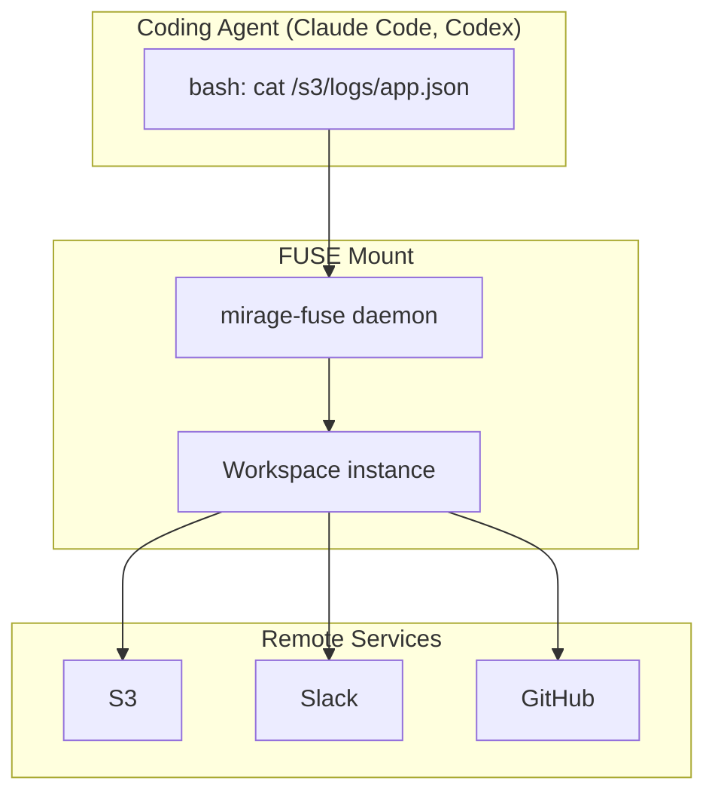
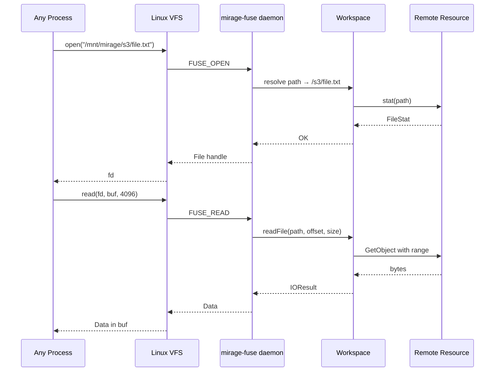
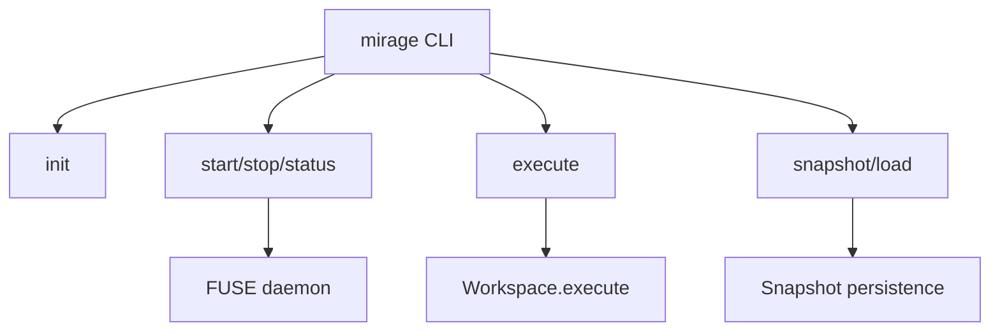

# FUSE & CLI — Real Filesystem Mount, Command-Line Interface

**Mirage can mount itself as a real FUSE filesystem on Linux/macOS — giving coding agents direct filesystem access to all mounted resources through familiar bash.**

## FUSE Integration

Source: `python/mirage/fuse/`

### FUSE Operations

| FUSE Op | Mirage Translation |
|---------|-------------------|
| `open()` | Resource.readFile() |
| `read()` | Stream from resource |
| `write()` | Resource.writeFile() |
| `readdir()` | Resource.readdir() |
| `getattr()` | Resource.stat() |
| `unlink()` | Resource.unlink() |
| `mkdir()` | Resource.mkdir() |

## CLI Commands

Source: `typescript/packages/cli/` and `python/mirage/cli/`

| Command | Purpose |
|---------|---------|
| `mirage init` | Initialize workspace config |
| `mirage start` | Start FUSE daemon |
| `mirage stop` | Stop FUSE daemon |
| `mirage status` | Show FUSE status |
| `mirage execute <cmd>` | Execute command in workspace |
| `mirage snapshot` | Create snapshot |
| `mirage load` | Load snapshot |

## FUSE Operation Flow

## CLI Architecture

**Aha:** When plugged into coding agents like Claude Code, Mirage runs as a FUSE daemon in the background. The agent's `cat`, `grep`, `sed` commands go through the kernel VFS layer into Mirage's FUSE handler, which dispatches to the appropriate resource. The agent has no idea it's talking to S3, Slack, or GitHub — it just sees files.

## Node.js Server

Source: `typescript/packages/server/`

HTTP server that exposes Mirage as a REST API:

| Endpoint | Purpose |
|----------|---------|
| `POST /execute` | Run a command |
| `GET /ls/:path` | List directory |
| `GET /cat/:path` | Read file |
| `POST /write/:path` | Write file |
| `POST /snapshot` | Create snapshot |
| `POST /load` | Load snapshot |

## What's Next

- [11 — Agent Integrations](11-agent-integrations.md) — OpenAI, LangChain, Mastra
- [12 — Python SDK](12-python-sdk.md) — Python API
- [00 — Overview](00-overview.md) — Return to overview
