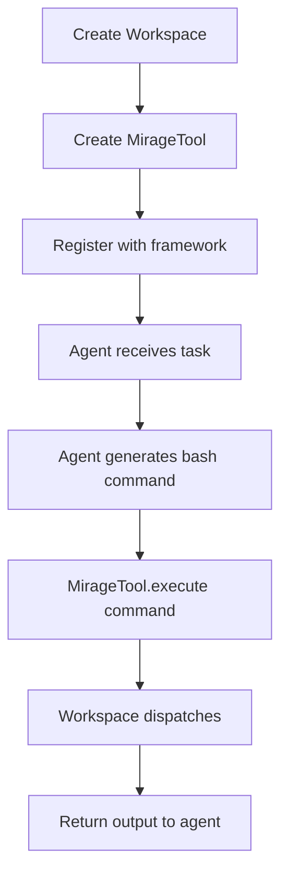

# Agent Integrations — OpenAI, LangChain, Mastra, Vercel AI

**Mirage integrates with major agent frameworks so AI agents can use the virtual filesystem directly — no special API needed, just bash commands.**

## Supported Frameworks

Source: `typescript/packages/agents/`

| Framework | Integration | LOC |
|-----------|------------|-----|
| OpenAI Agents SDK | Native tool registration | ~500 |
| Vercel AI SDK | Tool conversion | ~400 |
| LangChain | BaseTool wrapper | ~600 |
| Mastra | Agent tool integration | ~800 |
| Pydantic AI | Python integration | ~300 |
| CAMEL | Multi-agent support | ~200 |
| OpenHands | Sandbox integration | ~290 |

## OpenAI Agents Integration

```typescript
import { Agent } from 'openai/agents'
import { MirageTool } from '@struktoai/mirage-agents'

const ws = new Workspace({
  '/data': new RAMResource(),
  '/s3': new S3Resource({ bucket: 'logs' }),
})

const agent = new Agent({
  name: 'researcher',
  tools: [MirageTool(ws)],
})
```

The agent gets a single `execute` tool that accepts any bash command — the Mirage Workspace handles all the rest.

## LangChain Integration

```python
from mirage.agents.langchain import MirageTool
from langchain.agents import initialize_agent

tool = MirageTool(workspace)
agent = initialize_agent([tool], llm=ChatOpenAI())
```

## Vercel AI SDK

```typescript
import { tool } from 'ai'
import { createMirageTools } from '@struktoai/mirage-agents/vercel'

const tools = createMirageTools(workspace)
const result = await generateText({ model, tools })
```

## Integration Architecture

```mermaid
flowchart TB
    subgraph Agent["AI Agent Framework"]
        A1[OpenAI Agent]
        A2[LangChain Agent]
        A3[Mastra Agent]
    end

    subgraph Mirage["Mirage"]
        M1[MirageTool: execute(command)]
        M2[Workspace]
    end

    subgraph Resources["Backends"]
        R1[S3]
        R2[Slack]
        R3[GitHub]
    end

    A1 --> M1
    A2 --> M1
    A3 --> M1
    M1 --> M2
    M2 --> R1
    M2 --> R2
    M2 --> R3
```

## Tool Registration Pattern



**Aha:** All integrations expose the same single `execute` tool — the agent doesn't need to learn 30 different APIs for 30 different services.

## What's Next

- [12 — Python SDK](12-python-sdk.md) — Python API details
- [13 — Cross-Cutting](13-cross-cutting.md) — Testing, examples
- [00 — Overview](00-overview.md) — Return to overview
