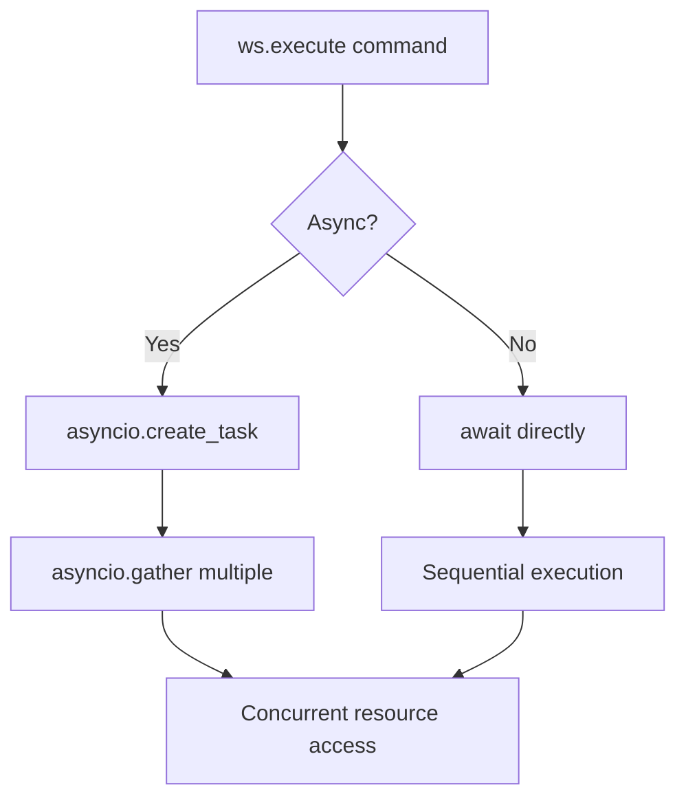
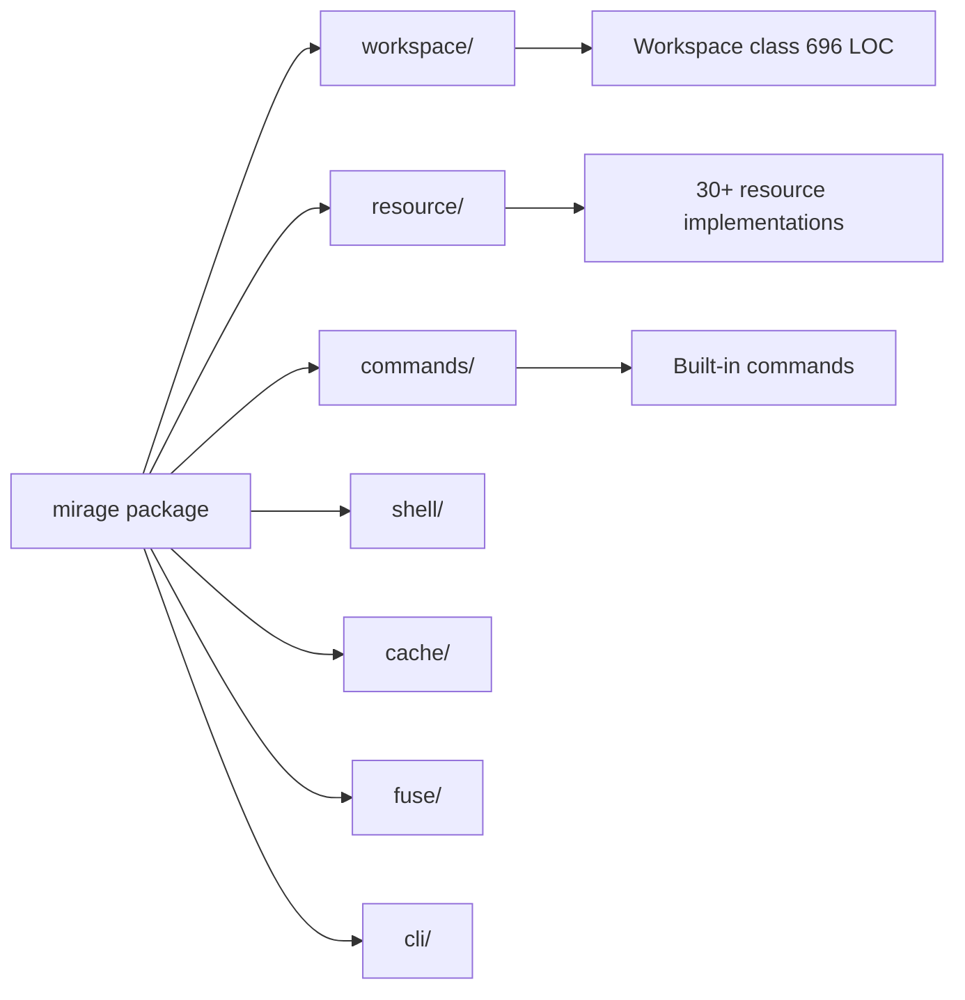

# Python SDK — Workspace API, Resources, FUSE

**The Python SDK mirrors the TypeScript API — same Workspace, same Resources, same commands — with full async support and FUSE integration.**

## Python Workspace

Source: `python/mirage/workspace/workspace.py` (696 lines)

```python
from mirage import Workspace
from mirage.resource.ram import RAMResource
from mirage.resource.s3 import S3Resource

ws = Workspace({
    '/data': RAMResource(),
    '/s3': S3Resource(bucket='logs'),
    '/slack': SlackResource(),
})

result = await ws.execute('cat /s3/logs/app.json | grep error | head -5')
print(result.stdout)
```

## Python Resource Interface

Source: `python/mirage/resource/base.py`

```python
class BaseResource(ABC):
    kind: str
    is_remote: bool = False
    supports_snapshot: bool = False

    async def open(self) -> None: ...
    async def close(self) -> None: ...
    async def read_file(self, path: PathSpec) -> bytes: ...
    async def write_file(self, path: PathSpec, data: bytes) -> None: ...
    async def readdir(self, path: PathSpec) -> list[str]: ...
    async def stat(self, path: PathSpec) -> FileStat: ...
    # ... 15+ more methods
```

## Python Commands

Source: `python/mirage/commands/`

| Module | Commands |
|--------|----------|
| `builtin/general/` | echo, pwd, cd, ls, history, which |
| `builtin/ram/` | cat, head, tail, wc, cp, mv, rm, mkdir |
| `builtin/text/` | grep, sed, awk, sort, uniq, cut, tr, diff |
| `builtin/search/` | find, rg |

## Python FUSE

Source: `python/mirage/fuse/fs.py` (339 lines)

```python
from mirage.fuse import FuseManager

fm = FuseManager(workspace)
fm.mount('/mnt/mirage')
# Now any process can access /mnt/mirage as a real filesystem
```

## Python CLI

Source: `python/mirage/cli/`

```bash
mirage init
mirage start /mnt/mirage
mirage execute "cat /s3/logs/app.json"
mirage snapshot --output workspace.mirage
mirage load workspace.mirage
```

## Python Async Model



## Python SDK Structure



**Aha:** The Python SDK has ~132K LOC — comparable to the TypeScript core package.

## Async Model

The Python SDK uses `asyncio` throughout:

```python
# Concurrent reads from multiple mounts
results = await asyncio.gather(
    ws.execute('cat /s3/logs/a.json'),
    ws.execute('cat /s3/logs/b.json'),
    ws.execute('cat /slack/general/messages.json'),
)
```

## What's Next

- [13 — Cross-Cutting](13-cross-cutting.md) — Testing, examples, security
- [11 — Agent Integrations](11-agent-integrations.md) — Return to integrations
- [00 — Overview](00-overview.md) — Return to overview
