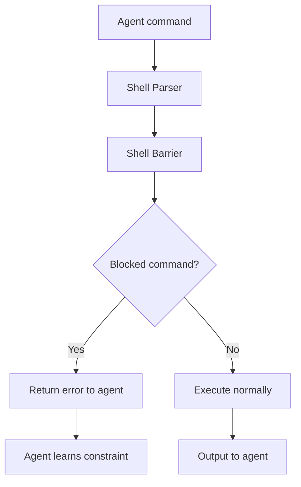
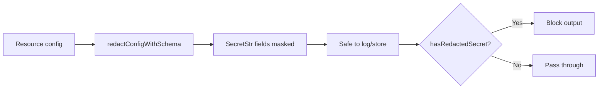

# Cross-Cutting — Testing, Examples, Security

**This document covers testing strategy, example workspaces, and security considerations for Mirage.**

## Testing

Source: `typescript/packages/*/` — test files alongside source

| Package | Test Files | Coverage |
|---------|-----------|----------|
| `core` | 50+ test files | Shell parser, workspace, resources, ops |
| `node` | 20+ test files | FUSE, CLI, server |
| `browser` | 10+ test files | OPFS, web workers |
| `agents` | 15+ test files | Framework integrations |

### Test Categories

| Category | Purpose |
|----------|---------|
| Unit tests | Individual functions, parsing, ops |
| Integration tests | Full workspace with multiple mounts |
| Cross-mount tests | cp, mv, diff across different backends |
| Snapshot tests | Serialize, load, drift detection |
| E2E tests | Full agent interaction via FUSE |

## Examples

Source: `examples/`

| Example | Purpose |
|---------|---------|
| `slack-search` | Search Slack channels with grep |
| `github-analyze` | Analyze GitHub repos |
| `s3-pipeline` | Process S3 data with pipes |
| `cross-service` | cp between S3 and GitHub |
| `claude-code-integration` | Mirage + Claude Code setup |

## Security

### Secret Management

Source: `typescript/packages/core/src/resource/secrets.ts`

| Feature | Implementation |
|---------|---------------|
| `SecretStr` | Opaque type that redacts in logs |
| `redactConfigWithSchema` | Redacts sensitive config fields |
| `hasRedactedSecret` | Detects leaked secrets in output |

### Shell Barrier

Source: `typescript/packages/core/src/shell/barrier.ts`

Restricts dangerous commands:

```typescript
applyBarrier(shellNode, {
  blocked: ['rm -rf /', 'mkfs', 'dd', 'wget', 'curl'],
  allowed: ['cat', 'grep', 'sed', 'awk', 'cp', 'mv'],
})
```

## Security Architecture



## Secret Redaction Flow



**Aha:** The shell barrier prevents agents from executing destructive commands — `rm -rf /`, `mkfs`, `dd` — while allowing safe read operations.

## Performance

| Metric | Value | Notes |
|--------|-------|-------|
| Shell parse | < 1ms | tree-sitter WASM |
| RAM read | < 0.1ms | In-memory |
| S3 read (cache hit) | < 5ms | RAM cache |
| S3 read (cold) | 50-200ms | Network latency |
| Cross-mount cp | sum of reads + writes | Sequential |

## What's Next

- [00 — Overview](00-overview.md) — Return to overview
- [01 — Architecture](01-architecture.md) — Return to architecture
- [02 — Workspace](02-workspace.md) — Return to workspace
