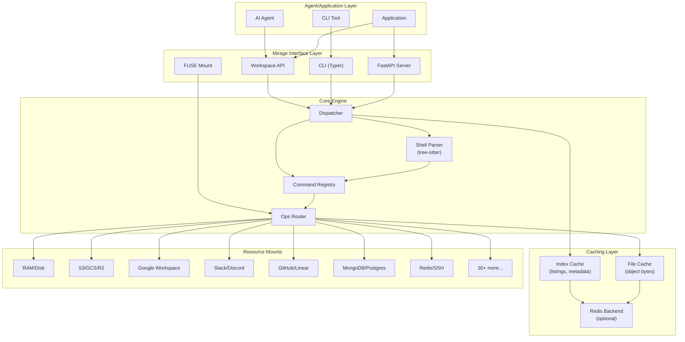
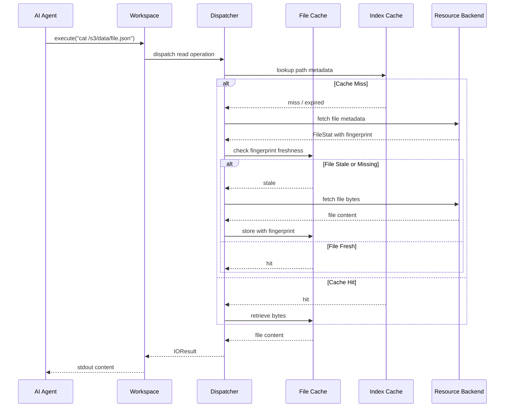
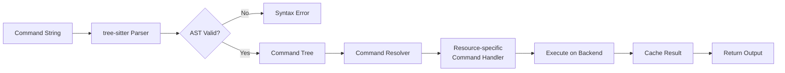
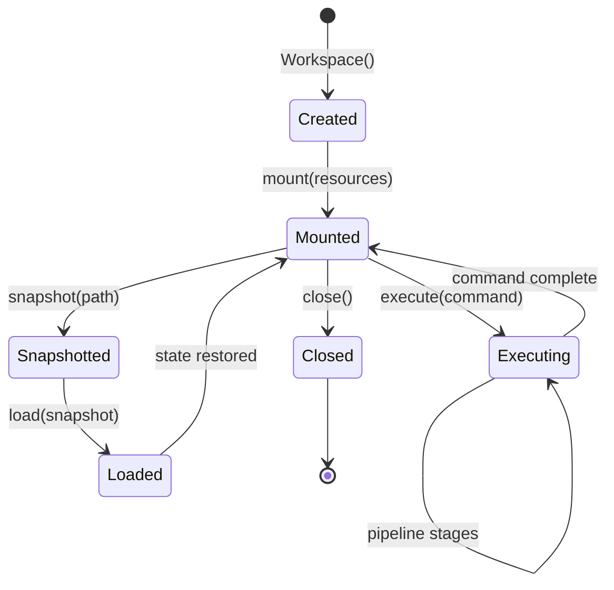
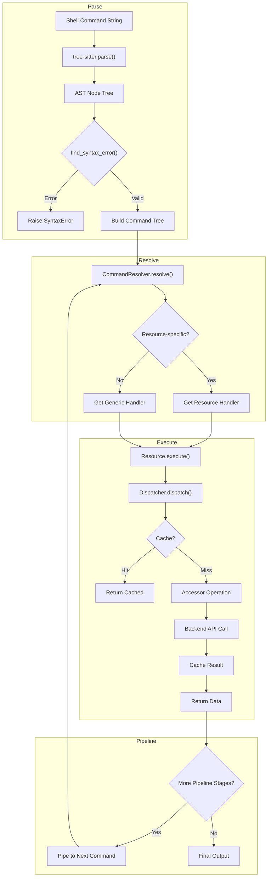

# Project Exploration: Mirage

## Overview

Mirage is a **Unified Virtual File System for AI Agents** that enables mounting diverse backend services (S3, Google Drive, Slack, Gmail, Redis, MongoDB, etc.) as a single cohesive filesystem. This architectural approach allows AI agents to interact with every backend using familiar Unix-like commands rather than learning N different SDKs and M different APIs.

The project addresses a fundamental problem in AI agent development: the fragmentation of data across many services. Each service typically requires its own authentication patterns, API client, data models, and error handling. Mirage unifies these behind filesystem semantics, leveraging the fact that modern LLMs are extensively trained on bash and Unix tool usage. Agents can use commands like `cat`, `grep`, `cp`, `mv`, and pipes (`|`) to read from Slack, write to S3, and process data through `jq` - all within a single command pipeline.

The system is implemented as a dual-language codebase with Python (primary, 222K+ lines) providing the full-featured implementation and TypeScript (240K+ lines) providing browser and Node.js runtimes. Both implementations share the same conceptual architecture: a Workspace that manages multiple mounted Resources, a two-layer caching system for performance, and a command registry that maps bash commands to resource-specific operations.

## Repository

- **Location:** `/home/darkvoid/Boxxed/@formulas/src.rust/src.llamacpp/src.strukto-ai/mirage/`
- **Remote:** `git@github.com:strukto-ai/mirage.git`
- **Primary Languages:** Python 3.12+ (3012 files), TypeScript/Node.js 20+ (2648 files)
- **License:** Apache-2.0
- **Author:** Zecheng Zhang (zecheng@strukto.ai)
- **Organization:** Strukto.AI

### Recent Commits

```
a72032f fix(cat): stop multi-file cat poisoning the cache on streaming backends (#153)
2671ad7 fix(commands): terminate generated record output with newlines (#147)
bee3faf fix(databricks-volume): prevent mv/cp onto same path from deleting the file (#127) (#142)
3d47ac5 fix(du,file): handle multiple files across remote backends (#148)
22a4b0a fix(python): handle multiple file args in cat/head/tail (mirror of #132) (#145)
```

## Directory Structure

```
mirage/
├── python/                          # Python implementation (primary)
│   ├── mirage/                      # Main package (222K+ lines)
│   │   ├── __init__.py              # Public API exports
│   │   ├── types.py                 # Core type definitions (PathSpec, FileStat, etc.)
│   │   ├── config.py                # Configuration management
│   │   ├── workspace/               # Workspace implementation
│   │   │   ├── workspace.py         # Main Workspace class (lines 69-600+)
│   │   │   ├── dispatcher.py        # Operation routing and caching
│   │   │   ├── runner.py            # Execution orchestration
│   │   │   ├── mount/               # Mount management
│   │   │   ├── session/             # Session state management
│   │   │   ├── snapshot/            # Workspace serialization
│   │   │   └── executor/            # Command execution engine
│   │   ├── resource/                # Resource implementations (30+ backends)
│   │   │   ├── base.py              # BaseResource abstract class
│   │   │   ├── ram/                 # In-memory storage
│   │   │   ├── disk/                # Local filesystem
│   │   │   ├── s3/                  # AWS S3 and compatibles
│   │   │   ├── gcs/                 # Google Cloud Storage
│   │   │   ├── gdrive/              # Google Drive
│   │   │   ├── gdocs/               # Google Docs
│   │   │   ├── gsheets/             # Google Sheets
│   │   │   ├── gslides/             # Google Slides
│   │   │   ├── gmail/               # Gmail
│   │   │   ├── slack/               # Slack
│   │   │   ├── discord/             # Discord
│   │   │   ├── github/              # GitHub
│   │   │   ├── github_ci/           # GitHub Actions
│   │   │   ├── linear/              # Linear
│   │   │   ├── notion/              # Notion
│   │   │   ├── trello/              # Trello
│   │   │   ├── mongodb/             # MongoDB
│   │   │   ├── postgres/              # PostgreSQL
│   │   │   ├── redis/               # Redis
│   │   │   ├── ssh/                 # SSH/SFTP
│   │   │   ├── hf_*/                # Hugging Face (buckets, datasets, models, spaces)
│   │   │   ├── dify/                # Dify
│   │   │   ├── databricks_volume/   # Databricks
│   │   │   ├── nextcloud/           # Nextcloud
│   │   │   └── ... (30+ total)
│   │   ├── commands/                # Command implementations
│   │   │   ├── builtin/             # Built-in commands (cat, grep, ls, etc.)
│   │   │   ├── registry.py          # Command registration system
│   │   │   └── resolve.py           # Command resolution
│   │   ├── cache/                   # Two-layer caching
│   │   │   ├── index/               # Index cache (listings, metadata)
│   │   │   └── file/                # File cache (object bytes)
│   │   ├── shell/                   # Bash parsing and execution
│   │   │   ├── parse.py             # Tree-sitter bash parser
│   │   │   ├── helpers.py           # Shell helper functions
│   │   │   └── job_table.py         # Job management
│   │   ├── ops/                     # VFS operations
│   │   │   ├── ops.py               # Ops class - VFS operation coordinator
│   │   │   └── registry.py          # Operation registry
│   │   ├── accessor/                # Resource accessors
│   │   │   ├── base.py              # Accessor base classes
│   │   │   └── {resource}.py        # Resource-specific accessors
│   │   ├── cli/                     # Command-line interface
│   │   │   ├── main.py              # Typer CLI entry point
│   │   │   ├── daemon.py            # Daemon management
│   │   │   ├── workspace.py         # Workspace CLI commands
│   │   │   └── execute.py           # Execute CLI commands
│   │   ├── server/                  # FastAPI daemon server
│   │   │   ├── app.py               # FastAPI application factory
│   │   │   ├── registry.py          # Workspace registry
│   │   │   ├── auth/                # Authentication middleware
│   │   │   └── routers/             # API route handlers
│   │   ├── agents/                  # Agent framework integrations
│   │   ├── fuse/                    # FUSE filesystem mount
│   │   ├── io/                      # I/O abstractions
│   │   ├── observe/                 # Operation observation/logging
│   │   ├── provision/               # Resource provisioning
│   │   ├── runtime/                 # Runtime checks
│   │   ├── utils/                   # Utility functions
│   │   └── vfp/                     # Virtual file protocol
│   ├── tests/                       # Test suite
│   ├── pyproject.toml               # Python package config
│   └── uv.lock                      # UV lockfile
├── typescript/                      # TypeScript implementation
│   ├── packages/                    # Monorepo packages
│   │   ├── core/                    # Runtime-agnostic primitives
│   │   ├── node/                    # Node.js runtime
│   │   ├── browser/                 # Browser/edge runtime
│   │   ├── server/                  # Server components
│   │   ├── cli/                     # CLI implementation
│   │   └── agents/                  # Agent framework integrations
│   ├── package.json                 # Root package.json
│   ├── pnpm-workspace.yaml          # PNPM workspace config
│   └── tsconfig.base.json           # Shared TypeScript config
├── docs/                            # Documentation (Mintlify)
├── examples/                        # Usage examples
│   ├── python/                      # Python examples
│   └── typescript/                  # TypeScript examples
├── integ/                           # Integration tests
├── spec/                            # API specifications
├── data/                            # Example data files
├── scripts/                         # Utility scripts
├── readme/                          # Localized READMEs
└── assets/                          # Project assets (logos, diagrams)
```

## Architecture

### High-Level Component Diagram



### Data Flow Sequence



### Command Execution Flow



### Workspace Lifecycle State Machine



## Component Breakdown

### 1. Workspace (`mirage/workspace/workspace.py`)

**Location:** `python/mirage/workspace/workspace.py:69-600+`

The Workspace is the primary user-facing abstraction. It manages a collection of mounted resources under a unified namespace.

**Key Design Decisions:**

- **Why tree-sitter for parsing?** The shell parser at `mirage/shell/parse.py:14-28` uses tree-sitter with a bash grammar because it provides robust error recovery and produces a structured AST. This allows Mirage to support complex pipelines (`cmd1 | cmd2 | cmd3`) and subshells without reimplementing a bash parser.

- **Why two-layer caching?** Remote resources have different access patterns: directory listings change less frequently than file contents. The index cache (`mirage/cache/index/`) stores listings with a default 600-second TTL, while the file cache stores actual bytes with pluggable backends (RAM or Redis).

**Core Properties:**
```python
# mirage/workspace/workspace.py:76-93
class Workspace:
    def __init__(
        self,
        resources: dict[str, BaseResource | tuple],
        cache_limit: str | int = "512MB",
        cache: CacheConfig | None = None,
        index: IndexConfig | None = None,
        mode: MountMode = MountMode.READ,
        consistency: ConsistencyPolicy = ConsistencyPolicy.LAZY,
        history: int | None = 100,
        # ... additional params
    )
```

**Key insight:** The `SUPPORTS_SNAPSHOT` flag on resources (`mirage/resource/base.py:49`) indicates whether a resource can participate in workspace serialization. Resources like S3 and GitHub support snapshotting because they have version identifiers (ETags, commit SHAs), while ephemeral resources like RAM do not.

### 2. Dispatcher (`mirage/workspace/dispatcher.py`)

**Location:** `python/mirage/workspace/dispatcher.py:28-141`

The Dispatcher routes VFS operations to the appropriate mount and manages cache consistency.

**Key insight:** The dispatcher separates read and write operations into different cache invalidation paths. Writes invalidate both the file cache AND the parent directory's index cache. This ensures that `ls` after a `cp` sees the new file without stale listings.

```python
# mirage/workspace/dispatcher.py:118-126
async def invalidate_after_write(self, mount: Mount, path: str) -> None:
    if mount.resource.is_remote is True:
        await self._cache.remove(path)
    idx = getattr(mount.resource, "index", None)
    if idx is not None:
        parent = path.rsplit("/", 1)[0] or "/"
        await idx.invalidate_dir(parent)
```

### 3. Command Registry (`mirage/commands/registry.py`, `mirage/commands/builtin/`)

**Location:** `python/mirage/commands/builtin/` (60+ command implementations)

Mirage implements a registry pattern where commands can be registered at three scopes:
1. **General commands** - available on all resources (e.g., `cat`, `ls`)
2. **Resource-specific commands** - only on specific mounts (e.g., slack-specific search)
3. **Filetype-specific commands** - override based on file extension (e.g., `cat` on `.parquet` renders as JSON)

**Key insight:** This three-level registration allows Mirage to provide familiar Unix commands everywhere while enabling specialized behavior where appropriate. The registration happens via decorators:

```python
# From mirage/commands/registry.py patterns
@command("cat")  # General
def cat_handler(...): ...

@command("cat", resource="s3", filetype="parquet")  # Specific
def cat_parquet_s3(...): ...
```

### 4. Resource Implementations (`mirage/resource/`)

**Location:** `python/mirage/resource/` (30+ subdirectories)

Each resource extends `BaseResource` and provides:
- **Accessor** (`mirage/accessor/{resource}.py`): Low-level I/O operations
- **Commands** (`mirage/commands/builtin/{resource}/`): Resource-specific command handlers
- **Config** (`{resource}/config.py`): Pydantic configuration models
- **Ops** (`mirage/ops/{resource}/`): VFS operation implementations

**Key insight:** The accessor pattern separates resource-specific I/O from command logic. The accessor exposes methods like `read()`, `write()`, `stat()` while the command layer handles argument parsing, output formatting, and cross-resource operations like `cp` between mounts.

### 5. Caching System (`mirage/cache/`)

**Two-Layer Architecture:**

| Layer | Purpose | Backends | TTL |
|-------|---------|----------|-----|
| Index Cache | Listings, metadata | RAM, Redis | 600s default |
| File Cache | Object bytes | RAM, Redis | Configurable |

**Key insight:** The separation allows different invalidation strategies. Index entries can be held longer because directory listings are less volatile than file contents. Remote resources set `is_remote = True` to opt into caching; local resources like RAM skip the cache entirely.

### 6. Shell Parser (`mirage/shell/parse.py`)

**Location:** `python/mirage/shell/parse.py:1-99`

Uses tree-sitter's bash grammar to parse shell commands into an AST.

**Key insight:** The parser includes error recovery heuristics. Tree-sitter emits ERROR nodes for some valid bash constructs (like `& ;` combinations). The `find_syntax_error()` function filters these to avoid false positives on legitimate shell syntax.

```python
# mirage/shell/parse.py:62-78
def _is_structural_error(node: tree_sitter.Node) -> bool:
    """True if an ERROR node represents a real syntactic problem."""
    for child in node.children:
        if child.is_named:
            return True
        if child.type in _BASH_KEYWORDS:
            return True
        if child.type in _STRUCTURAL_TOKENS:
            return True
    return False
```

## Entry Points

### 1. Python Library Entry Point

**File:** `python/mirage/__init__.py:14-38`

```python
from mirage import Workspace
from mirage.resource.ram import RAMResource
from mirage.resource.s3 import S3Resource

ws = Workspace({
    "/data": RAMResource(),
    "/s3": S3Resource({"bucket": "my-bucket"})
})
await ws.execute("cat /s3/file.txt")
```

**Execution Flow:**
1. `Workspace.__init__()` initializes mounts, cache, and dispatcher
2. `Workspace.execute()` calls `shell.parse.parse()` to get AST
3. Command tree is resolved via `CommandResolver`
4. Each command is dispatched to its resource's accessor
5. Results flow back through cache layer to caller

### 2. CLI Entry Point

**File:** `python/mirage/cli/main.py:14-37`

```python
app = typer.Typer(
    name="mirage",
    help="Mirage daemon CLI: manage workspaces and execute commands.",
    no_args_is_help=True,
)
app.add_typer(workspace_module.app, name="workspace")
app.add_typer(execute_module.app, name="execute")
# ... additional subcommands
```

**Commands:**
- `mirage workspace create ws.yaml --id demo`
- `mirage execute --workspace_id demo --command "cat /s3/file.txt"`
- `mirage workspace snapshot demo demo.tar`
- `mirage workspace load demo.tar --id restored`

### 3. Server Entry Point

**File:** `python/mirage/server/app.py:80-100`

FastAPI application providing REST API for workspace management:

```python
def build_app(idle_grace_seconds: float = 30.0,
              exit_event: asyncio.Event | None = None,
              allowed_hosts: list[str] | None = None,
              auth_config: AuthConfig | None = None) -> FastAPI
```

**Routers:** `python/mirage/server/routers/`
- `workspaces.py`: CRUD for workspaces
- `execute.py`: Command execution endpoints
- `jobs.py`: Job management
- `sessions.py`: Session state
- `versions.py`: Version information

### 4. TypeScript Entry Points

**Core:** `typescript/packages/core/src/index.ts`
**Node:** `typescript/packages/node/src/index.ts`
**Browser:** `typescript/packages/browser/src/index.ts`

Each runtime exposes the same `Workspace` API adapted to its environment.

## Data Flow

### Command Execution Pipeline



### File Operation with Caching

**Read Flow:**
1. Dispatcher receives read request for path
2. Checks Index Cache for metadata (TTL: 600s)
3. On index miss: calls resource `stat()` to get metadata including fingerprint
4. Checks File Cache for content keyed by path + fingerprint
5. On file miss: calls resource `read()` to fetch bytes
6. Stores in File Cache with fingerprint for future freshness checks

**Write Flow:**
1. Dispatcher receives write request
2. Validates mount is not read-only
3. Calls resource `write()` operation
4. On success: invalidates File Cache entry for path
5. Invalidates Index Cache for parent directory
6. Returns result

## External Dependencies

### Python Dependencies (`pyproject.toml`)

| Dependency | Version | Purpose |
|------------|---------|---------|
| aiohttp | >=3.13.3 | Async HTTP client |
| fastapi | >=0.135.1 | REST API framework |
| httpx | >=0.28.1 | HTTP client |
| numpy | >=2.4.3 | Numerical operations |
| orjson | >=3.11 | Fast JSON handling |
| pyyaml | >=6.0.3 | YAML configuration |
| tree-sitter | >=0.25.2 | Bash parsing |
| tree-sitter-bash | >=0.25.1 | Bash grammar |
| typer | >=0.12.0 | CLI framework |
| uvicorn | >=0.41.0 | ASGI server |
| pypdfium2 | >=5.7.0 | PDF processing |
| pillow | >=12.2.0 | Image handling |
| jq | >=1.11.0 | JSON query utility |
| mfusepy | >=1.0.0 | FUSE bindings |
| pyjwt | >=2.10 | JWT authentication |
| dulwich | >=1.2.4 | Git operations |
| opendal | >=0.47.1 | Data access layer |

### Optional Dependencies

| Feature | Extra | Dependencies |
|---------|-------|--------------|
| S3/R2/GCS/OCI | `s3` | aioboto3>=13.0 |
| MongoDB | `mongodb` | motor>=3.7.1 |
| PostgreSQL | `postgres` | asyncpg>=0.30.0 |
| Redis | `redis` | redis[hiredis]>=5.0 |
| SSH | `ssh` | asyncssh>=2.22.0 |
| Parquet | `parquet` | pandas>=3.0.1, pyarrow>=15.0 |
| HDF5 | `hdf5` | h5py>=3.16.0, tables>=3.11.1 |
| Audio | `audio` | av>=17.0.0, sherpa-onnx>=1.12.34 |
| OpenAI | `openai` | openai>=2.30.0, openai-agents>=0.14.7 |
| Pydantic AI | `pydantic-ai` | pydantic-ai-slim>=1.35 |

### TypeScript Dependencies

| Package | Purpose |
|---------|---------|
| @aws-sdk/client-s3 | S3 operations |
| @modelcontextprotocol/sdk | MCP protocol |
| apache-arrow | Arrow/Parquet support |
| bson | MongoDB BSON |
| h5wasm | HDF5 in browser |
| hyparquet | Parquet parsing |
| jq-wasm | jq in WASM |
| web-tree-sitter | Tree-sitter in browser |
| zod | Schema validation |

## Configuration

### Environment Variables

| Variable | Purpose | Default |
|----------|---------|---------|
| `MIRAGE_ALLOWED_HOSTS` | Server allowed hosts | `127.0.0.1,localhost,::1` |
| `MIRAGE_AUTH_MODE` | Authentication mode | `local-with-no-token` |
| `MIRAGE_HISTORY_PATH` | History persistence path | None |
| `MIRAGE_CACHE_LIMIT` | Default cache size | `512MB` |
| `MIRAGE_INDEX_TTL` | Index cache TTL | `600` seconds |

### Workspace Configuration

Workspaces can be defined via YAML:

```yaml
# example workspace definition
mounts:
  /data:
    type: ram
  /s3:
    type: s3
    config:
      bucket: my-bucket
      region: us-east-1
  /slack:
    type: slack
    config:
      token: ${SLACK_TOKEN}
cache:
  type: redis
  url: redis://localhost:6379/0
  limit: 8GB
```

## Testing

**Location:** `python/tests/`

| Directory | Coverage |
|-----------|----------|
| `accessor/` | Resource accessor tests |
| `agents/` | Agent integration tests |
| `cache/` | Cache layer tests |
| `cli/` | CLI tests |
| `commands/` | Command tests |
| `core/` | Core functionality |
| `fuse/` | FUSE mount tests |
| `integration/` | Integration tests |
| `io/` | I/O tests |
| `ops/` | Operation tests |
| `provision/` | Provisioning tests |
| `resource/` | Resource tests |
| `server/` | Server API tests |
| `shell/` | Shell parsing tests |
| `workspace/` | Workspace tests |

**Running Tests:**
```bash
cd python
pytest --cov=mirage --cov-report=term-missing
```

## Key Insights

### 1. Why Filesystem Semantics?

Modern LLMs are trained on vast amounts of shell scripts, documentation, and Unix man pages. By exposing all backends through filesystem operations, Mirage leverages this existing knowledge rather than requiring agents to learn new APIs. A command like `grep error /s3/logs/*.json | wc -l` is universally understood by LLMs.

### 2. Accessor Pattern Design

The Accessor pattern (`mirage/accessor/base.py:16-23`) provides a minimal interface that resources implement. The base class uses `__getattr__` to return `None` for unimplemented features, allowing gradual resource implementation rather than requiring full compliance upfront.

### 3. Lazy vs Always Consistency

The `ConsistencyPolicy` enum (`mirage/types.py:70-72`) offers two modes:
- **LAZY** (default): Serve from cache; check freshness asynchronously
- **ALWAYS**: Verify remote fingerprint before serving cached data

This trade-off between performance and freshness lets users tune for their use case.

### 4. Command Resolution Strategy

Commands resolve in priority order:
1. Filetype-specific override (e.g., `cat` on `.parquet`)
2. Resource-specific override (e.g., Slack's custom `search`)
3. Generic handler (standard Unix behavior)

This allows "sensible defaults" everywhere with targeted specialization.

### 5. Snapshot/Drift Detection

Resources supporting snapshots provide fingerprints (ETags, commit SHAs) in `stat()`. When loading a snapshot, Mirage can detect if remote content changed via `DriftPolicy.STRICT` (raise error) or `DriftPolicy.OFF` (ignore).

## Open Questions

1. **How does the TypeScript implementation compare in feature parity?** The Python implementation is primary; TypeScript has some resource limitations.

2. **What is the performance overhead of tree-sitter parsing?** Shell commands are parsed for every execution; caching parsed ASTs might help for repeated commands.

3. **How does FUSE integration work on different platforms?** FUSE is mentioned but implementation details are in `mirage/fuse/`.

4. **What is the resource matrix?** The docs mention `resource-matrix.mdx` - which resources support which operations?

5. **How does cross-mount copy work?** Resources with different storage semantics require data bridging; implementation at `mirage/commands/builtin/cross_mount.py`.

## File Reference Summary

| Component | Primary File | Line Count |
|-----------|--------------|------------|
| Workspace | `python/mirage/workspace/workspace.py` | ~600 |
| Dispatcher | `python/mirage/workspace/dispatcher.py` | ~141 |
| Base Resource | `python/mirage/resource/base.py` | ~130 |
| Types | `python/mirage/types.py` | ~295 |
| Shell Parser | `python/mirage/shell/parse.py` | ~99 |
| Ops | `python/mirage/ops/ops.py` | ~150+ |
| CLI Main | `python/mirage/cli/main.py` | ~37 |
| Server App | `python/mirage/server/app.py` | ~100+ |

---

*Exploration generated following the Exploration Agent guidelines from `/home/darkvoid/Boxxed/@dev/repo-expolorations/.agents/exploration-agent.md`*
