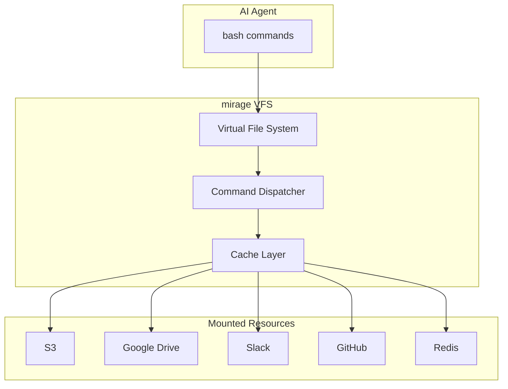
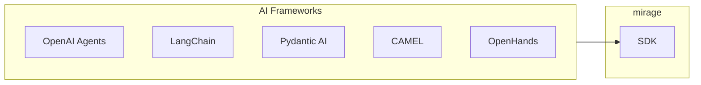

# mirage Overview

A Unified Virtual File System for AI Agents.

## Philosophy

**One filesystem, every backend.**

Modern AI agents need to interact with dozens of services — S3 buckets, Google Drive, Slack, Gmail, GitHub, databases. Each service has its own API, SDK, authentication, and quirks.

Mirage solves this by presenting **all services as files**:

```
/data/          → RAM (temporary storage)
/s3/            → AWS S3 bucket
/drive/         → Google Drive
/slack/general/ → Slack #general channel
/github/mirage/ → GitHub repository
/redis/         → Redis keys
```

**Aha:** AI agents already know bash. By mounting services as files, agents use familiar tools (`cat`, `grep`, `cp`, `ls`) with zero new vocabulary.

## Quick Example

```python
from mirage import Workspace
from mirage.resource import S3Resource, SlackResource, GitHubResource

# Create workspace with mounted resources
ws = Workspace({
    '/data':   RAMResource(),
    '/s3':     S3Resource(bucket='logs'),
    '/slack':  SlackResource(token=SLACK_TOKEN),
    '/github': GitHubResource(token=GITHUB_TOKEN),
})

# Use bash across all resources
await ws.execute('grep alert /slack/general/*.json | wc -l')
await ws.execute('cat /github/mirage/README.md')
await ws.execute('cp /s3/report.csv /data/local.csv')
```

## Architecture at a Glance



## Key Concepts

### Workspace

A **Workspace** is the root filesystem containing mounted resources:

```python
ws = Workspace({
    '/data': RAMResource(),
    '/s3': S3Resource(...),
})
```

### Resources

**Resources** implement filesystem operations for specific backends:

```python
class S3Resource:
    async def read(self, path: str) -> bytes:
        # Read from S3
        
    async def write(self, path: str, data: bytes):
        # Write to S3
        
    async def list(self, path: str) -> list[str]:
        # List S3 objects
```

### Commands

**Commands** are bash-like operations dispatched to resources:

| Command | Operation | Example |
|---------|-----------|---------|
| `cat` | read file | `cat /s3/config.json` |
| `ls` | list directory | `ls /slack/general/` |
| `cp` | copy | `cp /s3/a.csv /data/b.csv` |
| `grep` | search | `grep error /s3/*.log` |
| `wc` | count | `wc -l /s3/access.log` |

## Installation

### Python

```bash
pip install mirage-ai

# With specific resources
pip install "mirage-ai[s3,slack,redis]"

# Everything
pip install "mirage-ai[all]"
```

### TypeScript

```bash
npm install @struktoai/mirage-node
```

## Framework Support



Mirage integrates with:
- **OpenAI Agents SDK** — Tool functions
- **LangChain** — Tools and retrievers  
- **Pydantic AI** — Dependency injection
- **CAMEL** — Tool toolkit
- **OpenHands** — Runtime tools

## Next Steps

Continue to [Architecture →](01-architecture.html) for the full system design.
