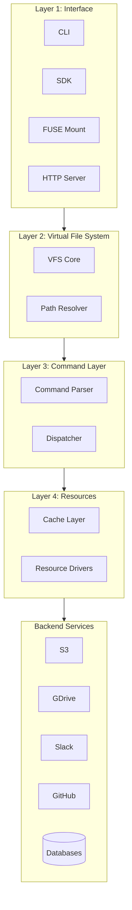
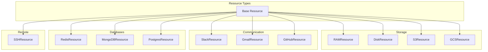
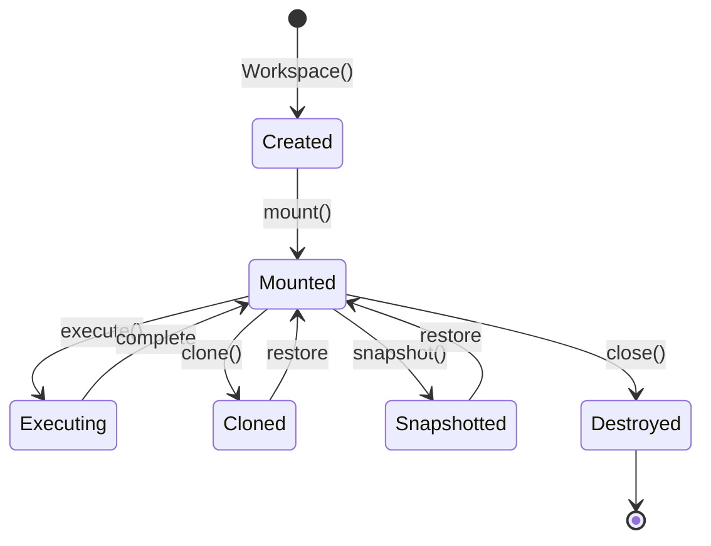
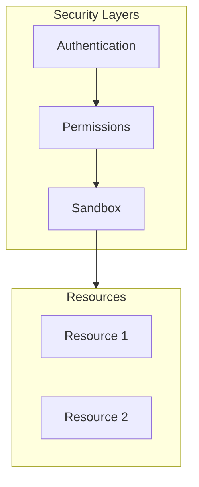

# mirage Architecture

The architecture layers: AI Agent → VFS → Dispatcher → Cache → Resources.

## High-Level Architecture



## Layer Breakdown

### Layer 1: Interface

Multiple ways to access mirage:

| Interface | Use Case | Entry Point |
|-----------|----------|-------------|
| **CLI** | Terminal usage | `mirage shell` |
| **SDK** | Programmatic | `Workspace()` |
| **FUSE** | Host filesystem | `mirage mount` |
| **Server** | Remote access | `mirage server` |
| **Browser** | Web apps | Browser SDK |

### Layer 2: Virtual File System

**Source:** `python/mirage/core/`

The VFS provides filesystem semantics:

```python
# python/mirage/core/vfs.py
class VirtualFileSystem:
    def __init__(self):
        self.mounts: Dict[str, Resource] = {}
        
    def mount(self, path: str, resource: Resource):
        """Mount a resource at path."""
        self.mounts[path] = resource
        
    def resolve(self, path: str) -> tuple[Resource, str]:
        """Resolve path to (resource, relative_path)."""
        for mount_point, resource in sorted(self.mounts.items(), reverse=True):
            if path.startswith(mount_point):
                rel_path = path[len(mount_point):]
                return resource, rel_path
        raise FileNotFoundError(path)
```

**Aha:** Path resolution is longest-prefix-match, like Unix mount points.

### Layer 3: Command Layer

**Source:** `python/mirage/commands/`

Commands are parsed and dispatched:

```python
# python/mirage/commands/dispatcher.py
class CommandDispatcher:
    def __init__(self, vfs: VirtualFileSystem):
        self.vfs = vfs
        self.commands: Dict[str, Command] = {
            'cat': CatCommand(),
            'ls': LsCommand(),
            'cp': CpCommand(),
            'grep': GrepCommand(),
            'wc': WcCommand(),
        }
    
    async def dispatch(self, cmd_line: str) -> str:
        # Parse bash command
        tokens = self.parse(cmd_line)
        cmd_name = tokens[0]
        args = tokens[1:]
        
        # Get command handler
        cmd = self.commands[cmd_name]
        
        # Execute
        return await cmd.execute(self.vfs, args)
```

### Layer 4: Resources

**Source:** `python/mirage/resource/`

Resources implement filesystem operations:

```python
# python/mirage/resource/base.py
from abc import ABC, abstractmethod

class Resource(ABC):
    """Base class for all resources."""
    
    @abstractmethod
    async def read(self, path: str) -> bytes:
        """Read file contents."""
        pass
    
    @abstractmethod
    async def write(self, path: str, data: bytes):
        """Write file contents."""
        pass
    
    @abstractmethod
    async def list(self, path: str) -> list[DirEntry]:
        """List directory contents."""
        pass
    
    @abstractmethod
    async def stat(self, path: str) -> FileStat:
        """Get file statistics."""
        pass
```

## Resource Types



## Caching Layer

**Source:** `python/mirage/cache/`

```python
# python/mirage/cache/manager.py
class CacheManager:
    def __init__(self):
        self.cache: Dict[str, CacheEntry] = {}
        self.ttl: int = 300  # 5 minutes
    
    async def get(self, key: str) -> Optional[bytes]:
        entry = self.cache.get(key)
        if entry and not entry.is_expired():
            return entry.data
        return None
    
    async def set(self, key: str, data: bytes, ttl: Optional[int] = None):
        self.cache[key] = CacheEntry(
            data=data,
            expires=time.time() + (ttl or self.ttl)
        )
```

**Aha:** Caching at the resource level reduces API calls and improves performance.

## Workspace Lifecycle



## Security Model



| Layer | Purpose |
|-------|---------|
| **Authentication** | Verify identity (tokens, keys) |
| **Permissions** | Access control (read/write/execute) |
| **Sandbox** | Resource isolation |

## Next Steps

Continue to [Python SDK →](02-python-sdk.html) for implementation details.
