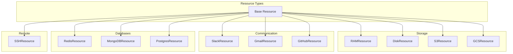
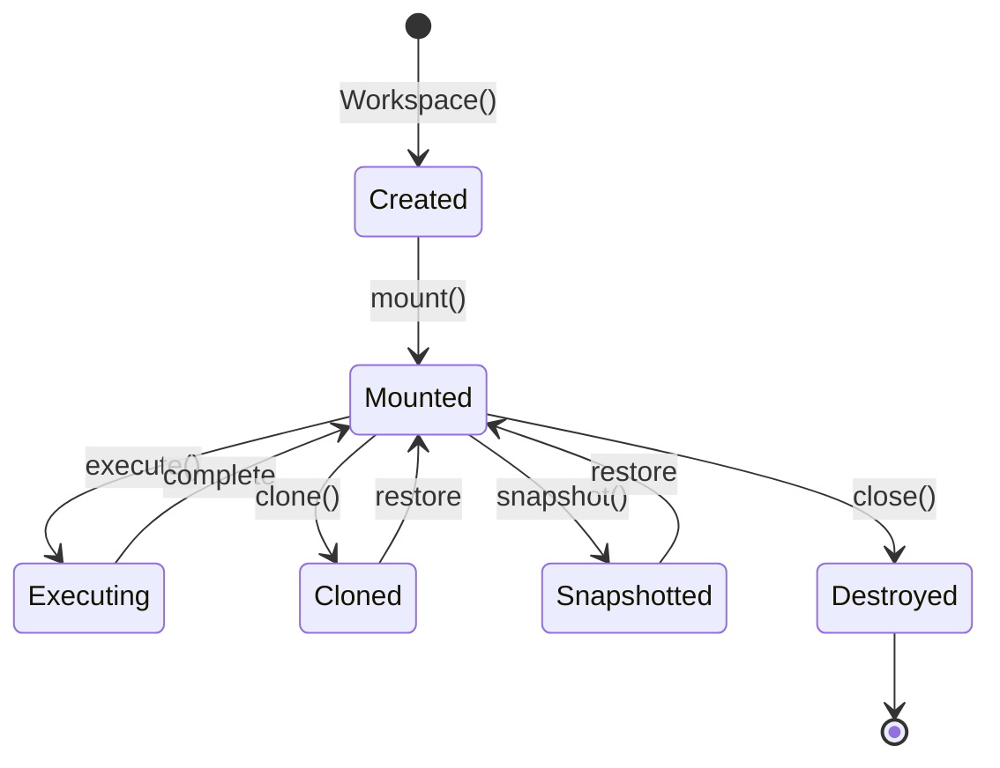
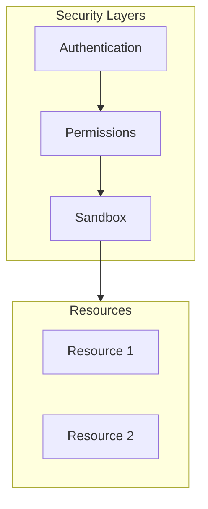

# mirage Architecture

The architecture: AI Agent → Interface → VFS → Commands → Cache → Resources.

## High-Level Architecture

```mermaid
flowchart TB
    subgraph Layer1["Layer 1: Interface"]
        CLI[CLI]
        SDK[SDK]
        FUSE[FUSE Mount]
        SERVER[HTTP Server]
        BROWSER[Browser SDK]
    end

    subgraph Layer2["Layer 2: Core"]
        VFS[VFS Core]
        WORKSPACE[Workspace]
        RUNTIME[Runtime]
    end

    subgraph Layer3["Layer 3: Command Layer"]
        CMD[Command Parser]
        DISPATCH[Dispatcher]
        BRIDGE[Language Bridge]
    end

    subgraph Layer4["Layer 4: Operations"]
        ACCESSOR[Accessor]
        OPS[Operations]
        PROVISION[Provisioner]
        IO[I/O]
        SHELL[Shell]
    end

    subgraph Layer5["Layer 5: Cache & Observe"]
        CACHE[Cache]
        OBSERVE[Observer]
    end

    subgraph Layer6["Layer 6: Resources"]
        RESOURCES[Resource Drivers]
    end

    subgraph Backends["Backend Services"]
        S3[S3]
        DRIVE[GDrive]
        SLACK[Slack]
        GH[GitHub]
        DB[(Databases)]
    end

    Layer1 --> Layer2
    Layer2 --> Layer3
    Layer3 --> Layer4
    Layer4 --> Layer5
    Layer5 --> Layer6
    Layer6 --> Backends
```



## Module Overview

mirage consists of 20+ modules organized in layers:

| Layer | Module | Purpose | Key Files |
|-------|--------|---------|-----------|
| **Interface** | cli/ | Command-line | main.py, commands.py |
| | server/ | HTTP API | fastapi.py, routes.py |
| | fuse/ | FUSE mount | mount.py, operations.py |
| | agents/ | Framework integration | openai.py, langchain.py |
| **Core** | core/ | VFS core | vfs.py, workspace.py |
| | workspace/ | Workspace management | manager.py, snapshot.py |
| | runtime/ | Runtime lifecycle | context.py, state.py |
| **Command** | commands/ | Command dispatch | dispatcher.py, registry.py |
| | bridge/ | Language interop | protocol.py, grpc/ |
| **Operations** | accessor/ | File access | reader.py, writer.py |
| | ops/ | Operations | batch.py, pipeline.py |
| | provision/ | Resource provisioning | factory.py, loader.py |
| | io/ | I/O utilities | streams.py, buffers.py |
| | shell/ | Shell execution | executor.py, subprocess.py |
| **Cache/Observe** | cache/ | Caching | manager.py, policies.py |
| | observe/ | Metrics/tracing | telemetry.py, metrics.py |
| **Resources** | resource/ | Resource drivers | 50+ resources |
| | vfp/ | Virtual file protocol | protocol.py, handlers.py |
| **Utils** | utils/ | Utilities | helpers.py, async_.py |

## Layer Breakdown

### Layer 1: Interface

Multiple ways to access mirage:

| Interface | Use Case | Entry Point |
|-----------|----------|-------------|
| **CLI** | Terminal usage | `mirage shell` |
| **SDK** | Programmatic | `Workspace()` |
| **FUSE** | Host filesystem | `mirage mount` |
| **Server** | Remote access | `mirage server` |
| **Browser** | Web apps | Browser SDK |

### Layer 2: Virtual File System

**Source:** `python/mirage/core/`

The VFS provides filesystem semantics:

```python
# python/mirage/core/vfs.py
class VirtualFileSystem:
    def __init__(self):
        self.mounts: Dict[str, Resource] = {}
        
    def mount(self, path: str, resource: Resource):
        """Mount a resource at path."""
        self.mounts[path] = resource
        
    def resolve(self, path: str) -> tuple[Resource, str]:
        """Resolve path to (resource, relative_path)."""
        for mount_point, resource in sorted(self.mounts.items(), reverse=True):
            if path.startswith(mount_point):
                rel_path = path[len(mount_point):]
                return resource, rel_path
        raise FileNotFoundError(path)
```

**Aha:** Path resolution is longest-prefix-match, like Unix mount points.

### Layer 3: Command Layer

**Source:** `python/mirage/commands/`

Commands are parsed and dispatched:

```python
# python/mirage/commands/dispatcher.py
class CommandDispatcher:
    def __init__(self, vfs: VirtualFileSystem):
        self.vfs = vfs
        self.commands: Dict[str, Command] = {
            'cat': CatCommand(),
            'ls': LsCommand(),
            'cp': CpCommand(),
            'grep': GrepCommand(),
            'wc': WcCommand(),
        }
    
    async def dispatch(self, cmd_line: str) -> str:
        # Parse bash command
        tokens = self.parse(cmd_line)
        cmd_name = tokens[0]
        args = tokens[1:]
        
        # Get command handler
        cmd = self.commands[cmd_name]
        
        # Execute
        return await cmd.execute(self.vfs, args)
```

### Layer 4: Resources

**Source:** `python/mirage/resource/`

Resources implement filesystem operations:

```python
# python/mirage/resource/base.py
from abc import ABC, abstractmethod

class Resource(ABC):
    """Base class for all resources."""
    
    @abstractmethod
    async def read(self, path: str) -> bytes:
        """Read file contents."""
        pass
    
    @abstractmethod
    async def write(self, path: str, data: bytes):
        """Write file contents."""
        pass
    
    @abstractmethod
    async def list(self, path: str) -> list[DirEntry]:
        """List directory contents."""
        pass
    
    @abstractmethod
    async def stat(self, path: str) -> FileStat:
        """Get file statistics."""
        pass
```

## Resource Types



## Caching Layer

**Source:** `python/mirage/cache/`

```python
# python/mirage/cache/manager.py
class CacheManager:
    def __init__(self):
        self.cache: Dict[str, CacheEntry] = {}
        self.ttl: int = 300  # 5 minutes
    
    async def get(self, key: str) -> Optional[bytes]:
        entry = self.cache.get(key)
        if entry and not entry.is_expired():
            return entry.data
        return None
    
    async def set(self, key: str, data: bytes, ttl: Optional[int] = None):
        self.cache[key] = CacheEntry(
            data=data,
            expires=time.time() + (ttl or self.ttl)
        )
```

**Aha:** Caching at the resource level reduces API calls and improves performance.

## Workspace Lifecycle



## Security Model



| Layer | Purpose |
|-------|---------|
| **Authentication** | Verify identity (tokens, keys) |
| **Permissions** | Access control (read/write/execute) |
| **Sandbox** | Resource isolation |

## Detailed Module Descriptions

### workspace/ Module

**Source:** `python/mirage/workspace/`

Manages workspace lifecycle and state:

```python
# python/mirage/workspace/manager.py
class WorkspaceManager:
    def __init__(self):
        self.workspaces: Dict[str, Workspace] = {}
    
    def create(self, config: WorkspaceConfig) -> Workspace:
        """Create new workspace."""
        ws = Workspace(config)
        self.workspaces[ws.id] = ws
        return ws
    
    def clone(self, workspace_id: str) -> Workspace:
        """Clone existing workspace."""
        original = self.workspaces[workspace_id]
        return original.clone()
    
    async def snapshot(self, workspace_id: str) -> Snapshot:
        """Create workspace snapshot."""
        ws = self.workspaces[workspace_id]
        return await ws.snapshot()
```

**Aha:** Workspaces are first-class objects that can be cloned, snapshotted, and versioned.

### runtime/ Module

**Source:** `python/mirage/runtime/`

Manages runtime context and execution state:

```python
# python/mirage/runtime/context.py
class RuntimeContext:
    def __init__(self):
        self.working_dir = '/'
        self.env_vars: Dict[str, str] = {}
        self.limits = ResourceLimits()
    
    def chdir(self, path: str):
        """Change working directory."""
        self.working_dir = path
    
    def setenv(self, key: str, value: str):
        """Set environment variable."""
        self.env_vars[key] = value
```

### accessor/ Module

**Source:** `python/mirage/accessor/`

Provides file access abstractions:

```python
# python/mirage/accessor/reader.py
class FileAccessor:
    """Unified file access interface."""
    
    async def read(self, path: str) -> AsyncIterator[bytes]:
        """Read file in chunks."""
        resource, rel_path = self.vfs.resolve(path)
        async for chunk in resource.read_stream(rel_path):
            yield chunk
```

### bridge/ Module

**Source:** `python/mirage/bridge/`

Language interoperability (Python ↔ TypeScript):

```python
# python/mirage/bridge/protocol.py
class BridgeProtocol:
    """Protocol for cross-language communication."""
    
    async def call_js(self, method: str, args: list) -> Any:
        """Call TypeScript method from Python."""
        # Uses gRPC or WebSocket
        return await self.channel.call(method, args)
```

### observe/ Module

**Source:** `python/mirage/observe/`

Observability and telemetry:

```python
# python/mirage/observe/telemetry.py
class TelemetryCollector:
    def __init__(self):
        self.metrics: Dict[str, Metric] = {}
    
    def record(self, metric: str, value: float, tags: Dict[str, str]):
        """Record metric."""
        if metric not in self.metrics:
            self.metrics[metric] = Metric(metric)
        self.metrics[metric].record(value, tags)
    
    async def export(self):
        """Export metrics to collector."""
        for metric in self.metrics.values():
            await self.exporter.send(metric)
```

### ops/ Module

**Source:** `python/mirage/ops/`

Operations and batch processing:

```python
# python/mirage/ops/batch.py
class BatchOperations:
    async def batch_read(self, paths: list[str]) -> list[bytes]:
        """Read multiple files concurrently."""
        tasks = [self.read(path) for path in paths]
        return await asyncio.gather(*tasks)
    
    async def batch_write(self, items: list[tuple[str, bytes]]):
        """Write multiple files concurrently."""
        tasks = [self.write(path, data) for path, data in items]
        await asyncio.gather(*tasks)
```

### provision/ Module

**Source:** `python/mirage/provision/`

Resource provisioning and factory:

```python
# python/mirage/provision/factory.py
class ResourceFactory:
    def __init__(self):
        self.providers: Dict[str, Provider] = {}
    
    def register(self, name: str, provider: Provider):
        """Register resource provider."""
        self.providers[name] = provider
    
    async def provision(self, name: str, config: dict) -> Resource:
        """Provision resource."""
        provider = self.providers[name]
        return await provider.create(config)
```

### io/ Module

**Source:** `python/mirage/io/`

I/O utilities:

```python
# python/mirage/io/streams.py
class AsyncStream:
    """Async stream wrapper."""
    
    def __init__(self, chunks: AsyncIterator[bytes]):
        self.chunks = chunks
    
    async def read(self, size: int = -1) -> bytes:
        """Read from stream."""
        if size < 0:
            return b''.join([chunk async for chunk in self.chunks])
        # ...
```

### shell/ Module

**Source:** `python/mirage/shell/`

Shell command execution:

```python
# python/mirage/shell/executor.py
class ShellExecutor:
    async def execute(self, command: str) -> ShellResult:
        """Execute shell command."""
        # Parse command
        args = shlex.split(command)
        
        # Execute with subprocess
        proc = await asyncio.create_subprocess_exec(
            *args,
            stdout=asyncio.subprocess.PIPE,
            stderr=asyncio.subprocess.PIPE,
        )
        stdout, stderr = await proc.communicate()
        
        return ShellResult(
            stdout=stdout.decode(),
            stderr=stderr.decode(),
            returncode=proc.returncode,
        )
```

### vfp/ Module

**Source:** `python/mirage/vfp/`

Virtual File Protocol (internal protocol):

```python
# python/mirage/vfp/protocol.py
class VFPMessage:
    """Virtual File Protocol message."""
    
    def __init__(self, op: str, path: str, data: Optional[bytes] = None):
        self.op = op  # READ, WRITE, LIST, STAT
        self.path = path
        self.data = data
    
    def serialize(self) -> bytes:
        return json.dumps({
            'op': self.op,
            'path': self.path,
            'data': base64.b64encode(self.data).decode() if self.data else None,
        }).encode()
```

### utils/ Module

**Source:** `python/mirage/utils/`

Utility functions:

```python
# python/mirage/utils/async_.py
async def gather_with_limit(tasks: list[Coroutine], limit: int = 10) -> list:
    """Gather tasks with concurrency limit."""
    semaphore = asyncio.Semaphore(limit)
    
    async def limited_task(task):
        async with semaphore:
            return await task
    
    return await asyncio.gather(*[limited_task(t) for t in tasks])
```

## Next Steps

Continue to [Python SDK →](02-python-sdk.html) for implementation details.
