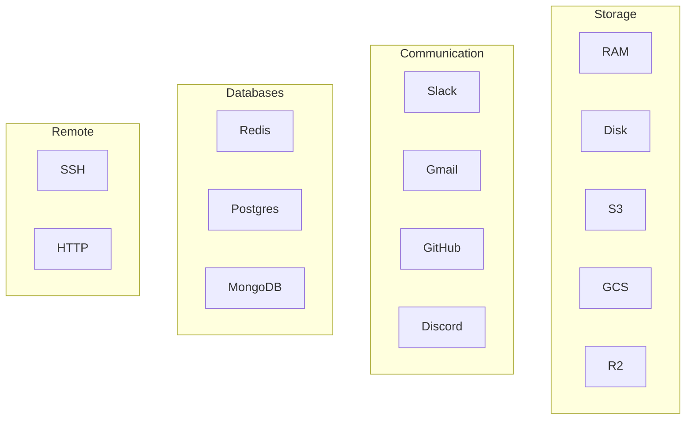

# Resources

Built-in resource types for mounting backends.

## Resource Overview



## Storage Resources

### RAMResource

**Purpose:** In-memory temporary storage.

```python
from mirage.resource import RAMResource

ws = Workspace({
    '/tmp': RAMResource(),
})

await ws.execute('echo data > /tmp/file.txt')
```

**Implementation:**
```python
class RAMResource(Resource):
    def __init__(self):
        self.files: Dict[str, bytes] = {}
        self.dirs: Dict[str, set] = {'/': set()}
    
    async def read(self, path: str) -> bytes:
        return self.files[path]
    
    async def write(self, path: str, data: bytes):
        self.files[path] = data
        parent = os.path.dirname(path)
        self.dirs.setdefault(parent, set()).add(os.path.basename(path))
    
    async def list(self, path: str) -> list[DirEntry]:
        return [
            DirEntry(name=name, is_file=name in self.files)
            for name in self.dirs.get(path, set())
        ]
```

### DiskResource

**Purpose:** Local filesystem access.

```python
from mirage.resource import DiskResource

ws = Workspace({
    '/local': DiskResource('/home/user/data'),
})

await ws.execute('ls /local')
```

### S3Resource

**Purpose:** AWS S3 buckets.

```python
from mirage.resource import S3Resource

ws = Workspace({
    '/s3': S3Resource(
        bucket='my-bucket',
        region='us-east-1',
        access_key_id='...',
        secret_access_key='...',
    ),
})

await ws.execute('cat /s3/config.json')
await ws.execute('cp /s3/old.csv /s3/backup/')
```

**Features:**
- Read/write objects
- List buckets/prefixes
- Copy between paths
- Streaming for large files

### GCSResource

**Purpose:** Google Cloud Storage.

```python
from mirage.resource import GCSResource

ws = Workspace({
    '/gcs': GCSResource(
        bucket='my-bucket',
        project='my-project',
    ),
})
```

## Communication Resources

### SlackResource

**Purpose:** Slack channels and messages.

```python
from mirage.resource import SlackResource

ws = Workspace({
    '/slack': SlackResource(token='xoxb-...'),
})

# List channels
await ws.execute('ls /slack')

# Read channel messages
await ws.execute('cat /slack/general/2025-01-15.json')

# Search messages
await ws.execute('grep alert /slack/general/*.json')
```

**Aha:** Each message is a JSON file named by timestamp.

### GmailResource

**Purpose:** Gmail messages.

```python
from mirage.resource import GmailResource

ws = Workspace({
    '/gmail': GmailResource(credentials='...'),
})

await ws.execute('ls /gmail/inbox')
await ws.execute('cat /gmail/inbox/unread.json')
```

### GitHubResource

**Purpose:** GitHub repositories.

```python
from mirage.resource import GitHubResource

ws = Workspace({
    '/github': GitHubResource(token='ghp_...'),
})

await ws.execute('ls /github/mirage')
await ws.execute('cat /github/mirage/README.md')
await ws.execute('ls /github/mirage/issues')
```

## Database Resources

### RedisResource

**Purpose:** Redis keys as files.

```python
from mirage.resource import RedisResource

ws = Workspace({
    '/redis': RedisResource(host='localhost', port=6379),
})

await ws.execute('echo "value" > /redis/key.txt')
await ws.execute('cat /redis/key.txt')
```

**Mapping:**
- Keys → Files
- Strings → File contents
- Hashes → JSON files
- Lists → Line-delimited files

### PostgresResource

**Purpose:** PostgreSQL tables as directories.

```python
from mirage.resource import PostgresResource

ws = Workspace({
    '/db': PostgresResource(
        host='localhost',
        database='mydb',
        user='user',
        password='pass',
    ),
})

await ws.execute('ls /db/public')  # List tables
await ws.execute('cat /db/public/users.csv')  # Export table as CSV
```

**Aha:** Tables become directories, rows become files.

### MongoDBResource

**Purpose:** MongoDB collections.

```python
from mirage.resource import MongoDBResource

ws = Workspace({
    '/mongo': MongoDBResource(
        uri='mongodb://localhost:27017',
        database='mydb',
    ),
})

await ws.execute('ls /mongo/collections')
await ws.execute('cat /mongo/collections/users/document_id.json')
```

## Remote Resources

### SSHResource

**Purpose:** Remote SSH hosts.

```python
from mirage.resource import SSHResource

ws = Workspace({
    '/remote': SSHResource(
        host='server.example.com',
        user='admin',
        key_path='~/.ssh/id_rsa',
    ),
})

await ws.execute('ls /remote/home/admin')
await ws.execute('cat /remote/etc/nginx/nginx.conf')
```

## Resource Comparison

| Resource | Read | Write | List | Best For |
|----------|------|-------|------|----------|
| RAM | ✅ | ✅ | ✅ | Temp data, caching |
| Disk | ✅ | ✅ | ✅ | Local files |
| S3 | ✅ | ✅ | ✅ | Object storage |
| Slack | ✅ | ❌ | ✅ | Message archives |
| Redis | ✅ | ✅ | ✅ | Key-value cache |
| Postgres | ✅ | ⚠️ | ✅ | Structured data |
| SSH | ✅ | ✅ | ✅ | Remote servers |

## Next Steps

Continue to [Commands →](05-commands.html) for command reference.
