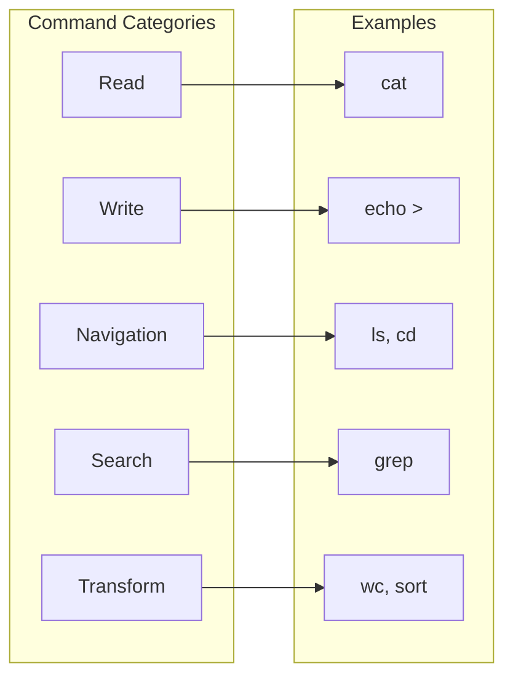

# Commands

Bash-like commands for the virtual filesystem.

## Command Overview



## Read Commands

### cat

Concatenate and display files.

```python
await ws.execute('cat /s3/config.json')
await ws.execute('cat /s3/file1.txt /s3/file2.txt')
```

**Implementation:**
```python
class CatCommand:
    async def execute(self, vfs, args):
        paths = args
        outputs = []
        
        for path in paths:
            resource, rel_path = vfs.resolve(path)
            data = await resource.read(rel_path)
            outputs.append(data.decode('utf-8', errors='replace'))
        
        return '\n'.join(outputs)
```

### head

Display first lines.

```python
await ws.execute('head -n 10 /s3/access.log')
```

### tail

Display last lines.

```python
await ws.execute('tail -n 20 /s3/error.log')
await ws.execute('tail -f /s3/stream.log')  # Follow mode
```

## Write Commands

### echo >

Write to file.

```python
await ws.execute('echo "hello" > /tmp/test.txt')
```

### cp

Copy files.

```python
await ws.execute('cp /s3/old.csv /s3/backup/')
await ws.execute('cp -r /s3/dir /s3/backup/')
```

**Implementation:**
```python
class CpCommand:
    async def execute(self, vfs, args):
        src, dst = args[-2:]
        
        src_res, src_path = vfs.resolve(src)
        dst_res, dst_path = vfs.resolve(dst)
        
        data = await src_res.read(src_path)
        await dst_res.write(dst_path, data)
        
        return ''
```

**Aha:** Copy works across resources — `cp /s3/file /gcs/file` transfers S3 → GCS.

### mv

Move/rename files.

```python
await ws.execute('mv /s3/old.csv /s3/new.csv')
```

### rm

Remove files.

```python
await ws.execute('rm /tmp/test.txt')
await ws.execute('rm -r /tmp/dir/')
```

## Navigation Commands

### ls

List directory contents.

```python
await ws.execute('ls /s3')
await ws.execute('ls -la /s3')  # Long format
await ws.execute('ls -R /s3')   # Recursive
```

### pwd

Print working directory.

```python
await ws.execute('pwd')  # Returns current path
```

### cd

Change directory.

```python
await ws.execute('cd /s3')
await ws.execute('ls')  # Relative to /s3
```

## Search Commands

### grep

Search patterns.

```python
await ws.execute('grep error /s3/*.log')
await ws.execute('grep -r alert /s3/')
await ws.execute('grep -i warning /s3/*.log')
```

**Implementation:**
```python
class GrepCommand:
    async def execute(self, vfs, args):
        pattern = args[0]
        paths = args[1:]
        
        matches = []
        for path in paths:
            resource, rel_path = vfs.resolve(path)
            data = await resource.read(rel_path)
            text = data.decode('utf-8', errors='replace')
            
            for i, line in enumerate(text.split('\n'), 1):
                if pattern in line:
                    matches.append(f'{path}:{i}:{line}')
        
        return '\n'.join(matches)
```

### find

Find files.

```python
await ws.execute('find /s3 -name "*.csv"')
await ws.execute('find /s3 -type d')
```

## Transform Commands

### wc

Word/line/character count.

```python
await ws.execute('wc -l /s3/access.log')  # Line count
await ws.execute('wc -c /s3/file.txt')   # Byte count
```

### sort

Sort lines.

```python
await ws.execute('sort /s3/names.txt')
await ws.execute('sort -r /s3/scores.txt')  # Reverse
```

### uniq

Unique lines.

```python
await ws.execute('uniq /s3/dups.txt')
await ws.execute('uniq -c /s3/dups.txt')  # Count
```

## Pipeline Commands

### |

Pipe output to input.

```python
await ws.execute('cat /s3/access.log | grep ERROR')
await ws.execute('cat /s3/data.txt | sort | uniq -c')
```

**Implementation:**
```python
class PipelineCommand:
    async def execute(self, vfs, pipeline: list):
        # Execute each command, piping output to next input
        data = None
        for cmd in pipeline:
            data = await cmd.execute(vfs, data)
        return data
```

**Aha:** Pipelines work across resources seamlessly.

## Command Reference

| Command | Args | Description |
|---------|------|-------------|
| `cat` | `[file...]` | Display file contents |
| `cp` | `[-r] source dest` | Copy files |
| `mv` | `source dest` | Move/rename files |
| `rm` | `[-r] file...` | Remove files |
| `ls` | `[-laR] [path]` | List directory |
| `pwd` | — | Print working directory |
| `cd` | `path` | Change directory |
| `grep` | `[-r] pattern files...` | Search pattern |
| `find` | `path -name pattern` | Find files |
| `wc` | `[-lwc] file` | Count words/lines/chars |
| `sort` | `[-r] file` | Sort lines |
| `uniq` | `[-c] file` | Unique lines |
| `head` | `[-n N] file` | First N lines |
| `tail` | `[-n N -f] file` | Last N lines |
| `echo` | `text` | Print text |
| `>` | `file` | Redirect output |

## Next Steps

Continue to [FUSE & Server →](06-fuse-server.html) for mounting and server modes.
