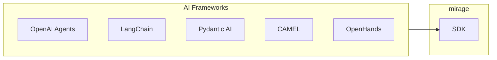

# Framework Integrations

Using mirage with popular AI frameworks.

## Supported Frameworks



## OpenAI Agents SDK

**Python:** `pip install mirage-ai[openai]`

```python
from agents import Agent, Tool
from mirage import Workspace
from mirage.resource import S3Resource

# Create mirage workspace
ws = Workspace({
    '/s3': S3Resource(bucket='logs'),
})

# Create tool
cat_tool = Tool(
    name="cat",
    description="Read file contents",
    parameters={
        "path": "Path to file"
    },
    func=lambda path: ws.execute(f'cat {path}')
)

# Create agent with mirage tool
agent = Agent(
    name="LogAnalyzer",
    tools=[cat_tool],
)

# Agent uses bash commands on S3
await agent.run("Analyze /s3/access.log for errors")
```

## LangChain

**Python:** `pip install mirage-ai`

```python
from langchain.tools import BaseTool
from mirage import Workspace

class MirageTool(BaseTool):
    """Base class for mirage tools."""
    
    def __init__(self, workspace: Workspace):
        self.workspace = workspace
        super().__init__()

class CatTool(MirageTool):
    name = "cat"
    description = "Read file contents"
    
    def _run(self, path: str) -> str:
        return self.workspace.execute(f'cat {path}')

class LsTool(MirageTool):
    name = "ls"
    description = "List directory"
    
    def _run(self, path: str = '/') -> str:
        return self.workspace.execute(f'ls {path}')

# Create tools
ws = Workspace({...})
tools = [CatTool(ws), LsTool(ws)]

# Use with LangChain agent
from langchain.agents import initialize_agent

agent = initialize_agent(tools, llm, agent="zero-shot-react-description")
agent.run("Read /s3/config.json and list /s3/")
```

## Pydantic AI

**Python:** `pip install mirage-ai[pydantic-ai]`

```python
from pydantic_ai import Agent
from mirage import Workspace
from mirage.resource import S3Resource, SlackResource

# Create workspace
ws = Workspace({
    '/s3': S3Resource(...),
    '/slack': SlackResource(...),
})

# Define dependencies
class Deps:
    workspace: Workspace

# Create agent
agent = Agent(
    'openai:gpt-4',
    deps_type=Deps,
    system_prompt="You have access to files via bash commands"
)

@agent.tool
def cat(ctx: RunContext[Deps], path: str) -> str:
    """Read file contents."""
    return ctx.deps.workspace.execute(f'cat {path}')

@agent.tool  
def ls(ctx: RunContext[Deps], path: str) -> str:
    """List directory."""
    return ctx.deps.workspace.execute(f'ls {path}')

# Run with deps
result = await agent.run(
    "Analyze /s3/logs/ and summarize",
    deps=Deps(workspace=ws)
)
```

**Aha:** Pydantic AI uses dependency injection to share the workspace across tools.

## CAMEL

**Python:** `pip install mirage-ai[camel]`

```python
from camel.agents import ChatAgent
from camel.toolkits import FunctionToolkit
from mirage import Workspace

ws = Workspace({...})

# Define tools
def cat(path: str) -> str:
    return ws.execute(f'cat {path}')

def ls(path: str) -> str:
    return ws.execute(f'ls {path}')

def grep(pattern: str, path: str) -> str:
    return ws.execute(f'grep {pattern} {path}')

# Create toolkit
toolkit = FunctionToolkit([cat, ls, grep])

# Create agent
agent = ChatAgent(
    system_message="You can access files via bash commands",
    tools=toolkit.get_tools()
)

response = agent.step("Find errors in /s3/logs/")
```

## OpenHands

**Python:** `pip install mirage-ai[openhands]`

```python
from openhands.agent import Agent
from mirage import Workspace

# Create workspace
ws = Workspace({
    '/github': GitHubResource(...),
})

# Configure OpenHands to use mirage
agent = Agent(
    runtime="mirage",
    workspace=ws,
)

# Agent uses mirage for file operations
result = agent.run("Clone github repo and analyze")
```

## Vercel AI SDK (TypeScript)

**TypeScript:** `npm install @struktoai/mirage-node`

```typescript
import { generateText, tool } from 'ai';
import { Workspace } from '@struktoai/mirage-core';

const ws = new Workspace({...});

const result = await generateText({
    model: openai('gpt-4'),
    tools: {
        cat: tool({
            description: 'Read file contents',
            parameters: z.object({ path: z.string() }),
            execute: async ({ path }) => {
                return await ws.execute(`cat ${path}`);
            },
        }),
        ls: tool({
            description: 'List directory',
            parameters: z.object({ path: z.string() }),
            execute: async ({ path }) => {
                return await ws.execute(`ls ${path}`);
            },
        }),
    },
    prompt: 'List files in /s3 and read config.json',
});
```

## Framework Comparison

| Framework | Integration | Best For |
|-----------|-------------|----------|
| **OpenAI Agents** | Tool functions | Simple agents |
| **LangChain** | Tool classes | Complex chains |
| **Pydantic AI** | Dependency injection | Type-safe agents |
| **CAMEL** | Tool toolkit | Multi-agent |
| **OpenHands** | Runtime | Coding agents |
| **Vercel AI** | Tool objects | Web apps |

## Best Practices

1. **Pass workspace as dependency** — Avoid global state
2. **Limit tool scope** — Don't expose all commands
3. **Add descriptions** — Help LLM understand tools
4. **Handle errors** — Graceful failures
5. **Cache results** — Reduce API calls

## Next Steps

Continue to [Extending →](08-extending.html) for adding custom resources.
