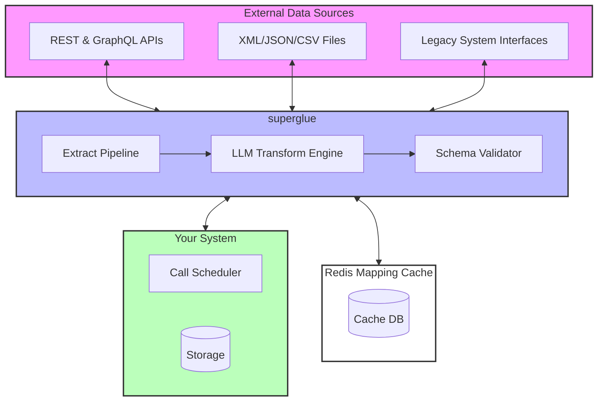

# Superglue Comprehensive Exploration

**Source:** `/home/darkvoid/Boxxed/@formulas/src.rust/src.superglue/`

**Date:** 2026-03-25

---

## Table of Contents

1. [Project Overview](#project-overview)
2. [Problem Statement](#problem-statement)
3. [Architecture Overview](#architecture-overview)
4. [Core Components Deep Dive](#core-components-deep-dive)
5. [JavaScript Implementation (superglue-js)](#javascript-implementation-superglue-js)
6. [Assistant-UI Components](#assistant-ui-components)
7. [Rust Replication Plan](#rust-replication-plan)
8. [Production Considerations](#production-considerations)

---

## Project Overview

### What is Superglue?

Superglue is a **self-healing open source data connector** that acts as a proxy between your systems and complex/legacy APIs. It automatically transforms data from any source into the exact format your system needs.

### Key Value Proposition

> "You define your desired data schema and provide basic instructions about an API endpoint. Superglue then does the rest."

### Core Capabilities

1. **Automatic API Configuration Generation** - Uses LLMs to analyze API documentation and generate proper request configurations
2. **Self-Healing Transformations** - Automatically fixes broken data mappings when APIs change
3. **Universal Data Source Support** - REST APIs, GraphQL, CSV, JSON, XML, Excel files
4. **Schema Validation** - Ensures all transformed data matches your expected schema
5. **Intelligent Caching** - Redis-based caching with configurable TTL (90 days default)

---

## Problem Statement

### The Integration Challenge

Modern software development faces these data integration challenges:

1. **API Complexity**
   - Different authentication methods (OAuth2, API keys, headers, query params)
   - Various pagination styles (offset-based, page-based, cursor-based)
   - Inconsistent error handling and rate limiting
   - Poor or outdated documentation

2. **Data Transformation Overhead**
   - Every API returns data in a different format
   - Manual mapping code is brittle and breaks when APIs change
   - Nested data structures require complex transformation logic
   - Validation is often an afterthought

3. **Legacy System Integration**
   - FTP servers with CSV files
   - SOAP APIs with XML responses
   - Compressed data archives
   - Custom protocols

4. **Maintenance Burden**
   - APIs change without notice
   - Field names get updated
   - New required parameters appear
   - Rate limits get enforced

### Superglue's Solution

```
┌─────────────────────────────────────────────────────────────────┐
│                     YOUR APPLICATION                             │
│                     (Expects Schema A)                          │
└────────────────────────┬────────────────────────────────────────┘
                         │
                         ▼
┌─────────────────────────────────────────────────────────────────┐
│                        SUPERGLUE                                 │
│  ┌─────────────┐  ┌──────────────┐  ┌─────────────────────┐    │
│  │   Extract   │→ │  LLM Transform│→ │  Schema Validator   │    │
│  │   Pipeline  │  │    Engine     │  │                     │    │
│  └─────────────┘  └──────────────┘  └─────────────────────┘    │
│                        │                                        │
│                        ▼                                        │
│                 ┌──────────────┐                               │
│                 │ Redis Cache  │                               │
│                 └──────────────┘                               │
└─────────────────────────────────────────────────────────────────┘
                         │
                         ▼
┌─────────────────────────────────────────────────────────────────┐
│                     EXTERNAL DATA SOURCES                        │
│    ┌──────────┐  ┌──────────┐  ┌──────────┐  ┌──────────┐      │
│    │ REST API │  │GraphQL   │  │ CSV/XML  │  │ Legacy   │      │
│    │          │  │          │  │ Files    │  │ Systems  │      │
│    └──────────┘  └──────────┘  └──────────┘  └──────────┘      │
└─────────────────────────────────────────────────────────────────┘
```

---

## Architecture Overview

### System Components



### Data Flow

1. **Extraction Phase**
   - Connect to data source (API, file, etc.)
   - Handle authentication automatically
   - Manage pagination
   - Decompress if needed
   - Parse file format (JSON, XML, CSV, Excel)

2. **Transformation Phase**
   - LLM generates JSONata expression based on:
     - Source data structure
     - Target schema
     - Natural language instructions
   - Expression is validated against sample data
   - Transformation is cached for reuse

3. **Validation Phase**
   - JSON Schema validation
   - Field-level error reporting
   - Automatic retry with fixed mapping on failure

4. **Caching Layer**
   - Configuration caching (90 day TTL)
   - Result caching (configurable modes)
   - Hash-based lookup using request + data schema

---

## Core Components Deep Dive

### 1. GraphQL API Layer

Superglue exposes a GraphQL API as its primary interface:

**Endpoint:** `https://graphql.superglue.cloud` (or self-hosted)

#### Key Operations

##### Mutations (Write Operations)

```graphql
# Execute an API call with automatic transformation
mutation Call($input: ApiInputRequest!, $payload: JSON, $credentials: JSON, $options: RequestOptions) {
  call(input: $input, payload: $payload, credentials: $credentials, options: $options) {
    id
    success
    data
    error
    startedAt
    completedAt
    config { ... }
  }
}

# Extract data from files or APIs
mutation Extract($input: ExtractInputRequest!, $payload: JSON, $credentials: JSON, $options: RequestOptions) {
  extract(input: $input, payload: $payload, credentials: $credentials, options: $options) {
    id
    success
    data
    error
    startedAt
    completedAt
  }
}

# Transform existing data to a new schema
mutation Transform($input: TransformInputRequest!, $data: JSON!, $options: RequestOptions) {
  transform(input: $input, data: $data, options: $options) {
    id
    success
    data
    error
    startedAt
    completedAt
  }
}
```

##### Queries (Read Operations)

```graphql
# List execution history
query ListRuns($limit: Int!, $offset: Int!, $configId: ID) {
  listRuns(limit: $limit, offset: $offset, configId: $configId) {
    items { id, success, data, error, startedAt, completedAt }
    total
  }
}

# Get saved configurations
query GetApi($id: ID!) {
  getApi(id: $id) {
    id, urlHost, urlPath, instruction, responseSchema, responseMapping
  }
}

# Generate schema from sample data
query GenerateSchema($instruction: String!, $responseData: String) {
  generateSchema(instruction: $instruction, responseData: $responseData)
}
```

### 2. Configuration Types

#### ApiConfig - For API Calls

```typescript
interface ApiConfig {
  id: string;
  urlHost: string;           // Base URL: "https://api.example.com"
  urlPath?: string;          // Path: "/v1/users"
  instruction: string;       // Natural language: "get all users"
  method?: HttpMethod;       // GET, POST, PUT, DELETE, etc.
  queryParams?: Record<string, any>;
  headers?: Record<string, any>;
  body?: string;             // JSON body with variable placeholders
  documentationUrl?: string; // API documentation for LLM reference
  responseSchema?: JSONSchema; // Expected response format
  responseMapping?: string;  // JSONata transformation expression
  authentication?: AuthType; // NONE, HEADER, QUERY_PARAM, OAUTH2
  pagination?: Pagination;   // OFFSET_BASED, PAGE_BASED
  dataPath?: string;         // Path to data: "products.variants"
}
```

#### ExtractConfig - For File/API Extraction

```typescript
interface ExtractConfig {
  id: string;
  urlHost: string;
  urlPath?: string;
  instruction: string;
  method?: HttpMethod;
  queryParams?: Record<string, any>;
  headers?: Record<string, any>;
  body?: string;
  documentationUrl?: string;
  decompressionMethod?: DecompressionMethod; // GZIP, DEFLATE, ZIP, AUTO
  authentication?: AuthType;
  fileType?: FileType;      // JSON, XML, CSV, EXCEL, AUTO
  dataPath?: string;
}
```

#### TransformConfig - For Data Transformation Only

```typescript
interface TransformConfig {
  id: string;
  instruction: string;
  responseSchema: JSONSchema;
  responseMapping?: string;  // JSONata expression
  confidence?: number;       // 0-100 confidence score
  confidence_reasoning?: string;
}
```

### 3. The LLM Transform Engine

This is Superglue's "secret sauce" - using LLMs to generate data transformations.

#### How It Works

```
┌─────────────────────────────────────────────────────────────────┐
│                    INPUT TO LLM                                  │
│                                                                   │
│  System Prompt: "You are an AI that generates JSONata mapping   │
│                  expressions to transform source data..."        │
│                                                                   │
│  User Prompt:                                                     │
│  ┌─────────────────────────────────────────────────────────┐    │
│  │ Target Schema:                                          │    │
│  │ {                                                        │    │
│  │   "type": "object",                                     │    │
│  │   "properties": {                                       │    │
│  │     "name": {"type": "string"},                         │    │
│  │     "price": {"type": "number"}                         │    │
│  │   }                                                      │    │
│  │ }                                                        │    │
│  │                                                          │    │
│  │ Source Data Sample:                                     │    │
│  │ {"product_name": "Widget", "cost": 19.99}               │    │
│  │                                                          │    │
│  │ Instruction: "Map product data to our schema"           │    │
│  └─────────────────────────────────────────────────────────┘    │
└─────────────────────────────────────────────────────────────────┘
                              │
                              ▼
┌─────────────────────────────────────────────────────────────────┐
│                    LLM OUTPUT                                    │
│                                                                   │
│  {                                                               │
│    "jsonata": "{$"name": product_name, "price": cost$}",        │
│    "confidence": 95,                                            │
│    "confidence_reasoning": "All fields present in source"       │
│  }                                                               │
└─────────────────────────────────────────────────────────────────┘
                              │
                              ▼
┌─────────────────────────────────────────────────────────────────┐
│                    VALIDATION                                    │
│                                                                   │
│  1. Parse JSONata expression                                    │
│  2. Execute against source data                                 │
│  3. Validate output against target schema                       │
│  4. If validation fails, send error back to LLM for retry       │
└─────────────────────────────────────────────────────────────────┘
```

#### JSONata - The Transformation Language

Superglue uses **JSONata** (http://jsonata.org), a JSON query and transformation language.

**Example JSONata expressions:**

```jsonata
/* Simple field mapping */
{
  "name": $.product_name,
  "price": $.cost
}

/* Array transformation */
[
  products.{
    "id": id,
    "name": name,
    "variants": [
      variants.{
        "size": size,
        "color": color
      }
    ]
  }
]

/* Conditional mapping with fallback */
{
  "description": description ? description :
                 short_description ? short_description :
                 "No description"
}

/* Array filtering */
products[category = 'electronics'].{
  "name": name,
  "price": price
}

/* Using built-in functions */
{
  "name": $uppercase($.product_name),
  "created": $toDate($.timestamp),
  "total": $sum($.items.price)
}
```

#### Custom JSONata Functions

Superglue registers custom functions:

```typescript
// Date manipulation
$dateMax(dates)      // Maximum date in array
$dateMin(dates)      // Minimum date in array
$dateDiff(d1, d2, unit)  // Difference between dates
$toDate(value)       // Convert any timestamp to ISO string

// String operations
$replace(str, pattern, replacement)  // Replace with regex
$substring(str, start, length)       // Extract substring

// Array operations
$max(numbers)        // Maximum value
$min(numbers)        // Minimum value
$number(value)       // Convert to number
```

### 4. The Extract Pipeline

Handles data extraction from various sources:

#### HTTP Request Flow

```typescript
async function callEndpoint(endpoint: ApiConfig, payload, credentials, options) {
  // 1. Variable substitution
  const allVariables = { ...payload, ...credentials };
  const headers = replaceVariables(endpoint.headers, allVariables);
  const queryParams = replaceVariables(endpoint.queryParams, allVariables);
  const body = replaceVariables(endpoint.body, allVariables);

  // 2. Pagination handling (up to 500 iterations)
  while (hasMore && loopCounter <= 500) {
    // 3. Make request with retry logic
    const response = await callAxios(axiosConfig, options);

    // 4. Rate limit handling (429)
    if (response.status === 429) {
      waitTime = parseRetryAfter(response) || exponentialBackoff();
      await sleep(waitTime);
      continue;
    }

    // 5. Collect paginated results
    allResults.push(...responseData);
  }
}
```

#### File Processing Flow

```typescript
async function processFile(data: Buffer, extractConfig: ExtractConfig) {
  // 1. Decompress if needed
  if (extractConfig.decompressionMethod !== DecompressionMethod.NONE) {
    data = await decompressData(data, extractConfig.decompressionMethod);
  }

  // 2. Parse based on file type
  let responseJSON = await parseFile(data, extractConfig.fileType);

  // 3. Navigate to data path
  if (extractConfig.dataPath) {
    const pathParts = extractConfig.dataPath.split('.');
    for (const part of pathParts) {
      responseJSON = responseJSON[part] || responseJSON;
    }
  }

  return responseJSON;
}
```

#### Supported File Formats

| Format | Detection | Library |
|--------|-----------|---------|
| JSON | Starts with `{` or `[` | `JSON.parse()` |
| XML | Starts with `<?xml` or `<` | `sax` parser |
| CSV | Delimiter detection | `papaparse` |
| Excel | ZIP signature + structure | `xlsx` |

**CSV Delimiter Auto-Detection:**
```typescript
function detectDelimiter(buffer: Buffer): string {
  const sample = buffer.slice(0, 32768).toString('utf8');
  const delimiters = [',', '|', '\t', ';', ':'];

  // Count unescaped occurrences
  const counts = delimiters.map(d => ({
    delimiter: d,
    count: countUnescapedDelimiter(sample, d)
  }));

  return counts.reduce((prev, curr) =>
    curr.count > prev.count ? curr : prev
  ).delimiter;
}
```

### 5. Schema Validation

Uses `jsonschema` library for validation:

```typescript
async function applyJsonataWithValidation(data, expr, schema) {
  // 1. Execute transformation
  const result = await applyJsonata(data, expr);

  // 2. Check for empty results
  if (result === null || result?.length === 0) {
    return { success: false, error: "Result is empty" };
  }

  // 3. Validate against schema
  const validator = new Validator();
  const validation = validator.validate(result, schema);

  if (!validation.valid) {
    return {
      success: false,
      error: validation.errors.map(e => e.stack).join('\n')
    };
  }

  return { success: true, data: result };
}
```

### 6. Caching Architecture

#### Redis Key Structure

```
{orgId}:{prefix}:{id}

Prefixes:
- run:        - Execution results
- api:        - API configurations
- extract:    - Extract configurations
- transform:  - Transform configurations
```

#### Cache Hash Generation

Configurations are cached by hashing the request + data schema:

```typescript
function generateHash(data: any): string {
  return createHash('md5')
    .update(JSON.stringify(data))
    .digest('hex');
}

// Usage
const hash = generateHash({
  request: apiInput,
  payloadKeys: getSchemaFromData(payload)
});
const key = `api:${hash}`;
```

#### Cache Modes

```typescript
enum CacheMode {
  ENABLED = "ENABLED",     // Read and write
  DISABLED = "DISABLED",   // No caching
  READONLY = "READONLY",   // Read only
  WRITEONLY = "WRITEONLY"  // Write only
}
```

### 7. Authentication System

#### Supported Auth Types

```typescript
enum AuthType {
  NONE = "NONE",
  HEADER = "HEADER",           // Authorization headers
  QUERY_PARAM = "QUERY_PARAM", // API keys in URL
  OAUTH2 = "OAUTH2"           // OAuth 2.0 flows
}
```

#### Variable Substitution for Auth

```typescript
// Template format
headers: {
  "Authorization": "Bearer {api_key}"
}

// Resolution
function replaceVariables(template: string, variables: Record<string, any>): string {
  return template.replace(/\{(\w+)\}/g, (match, key) => {
    return variables[key] || match;
  });
}
```

#### Basic Auth Special Handling

```typescript
function convertBasicAuthToBase64(headerValue: string): string {
  const credentials = headerValue.substring('Basic '.length).trim();

  // Check if already base64 encoded
  const seemsEncoded = /^[A-Za-z0-9+/=]+$/.test(credentials);

  if (!seemsEncoded) {
    // Convert username:password to Base64
    const base64Credentials = Buffer.from(credentials).toString('base64');
    return `Basic ${base64Credentials}`;
  }

  return headerValue;
}
```

---

## JavaScript Implementation (superglue-js)

### Package Structure

```
superglue-js/
├── src/
│   └── superglue.ts    # Main client implementation
├── package.json
├── tsconfig.json
└── README.md
```

### Client API

#### Initialization

```typescript
import { SuperglueClient } from "@superglue/client";

const superglue = new SuperglueClient({
  endpoint: "https://graphql.superglue.cloud",  // Optional, defaults to cloud
  apiKey: "your-api-key"
});
```

#### Main Methods

##### 1. call() - Execute API Transformation

```typescript
const config = {
  urlHost: "https://api.example.com",
  urlPath: "/v1/products",
  instruction: "get all products with name and price",
  responseSchema: {
    type: "object",
    properties: {
      products: {
        type: "array",
        items: {
          type: "object",
          properties: {
            name: { type: "string" },
            price: { type: "number" }
          }
        }
      }
    }
  }
};

const result = await superglue.call({
  endpoint: config,
  payload: { category: "electronics" },
  credentials: { api_key: "secret" },
  options: {
    cacheMode: CacheMode.ENABLED,
    timeout: 30000,
    retries: 3
  }
});

console.log(result.data);
```

##### 2. extract() - Extract from Files or APIs

```typescript
// From URL
const result = await superglue.extract({
  endpoint: {
    urlHost: "https://example.com",
    urlPath: "/data.csv",
    instruction: "extract all rows",
    fileType: FileType.CSV
  }
});

// From file upload (browser)
const fileInput = document.querySelector('input[type="file"]');
const result = await superglue.extract({
  endpoint: {
    instruction: "parse this CSV"
  },
  file: fileInput.files[0]
});
```

##### 3. transform() - Transform Existing Data

```typescript
const result = await superglue.transform({
  endpoint: {
    instruction: "convert to our internal format",
    responseSchema: { /* target schema */ }
  },
  data: { /* source data */ }
});
```

#### Configuration Management

```typescript
// List configurations
const apis = await superglue.listApis(limit: 10, offset: 0);
const transforms = await superglue.listTransforms();
const extracts = await superglue.listExtracts();

// Get single configuration
const api = await superglue.getApi("my-api-id");

// Create/Update configurations
await superglue.upsertApi("my-api-id", {
  urlHost: "https://api.example.com",
  instruction: "get products"
});

// Delete configurations
await superglue.deleteApi("my-api-id");

// Update configuration ID
await superglue.updateApiConfigId("old-id", "new-id");
```

#### Execution History

```typescript
// List runs
const runs = await superglue.listRuns(limit: 100, offset: 0, configId: "my-api-id");

// Get single run
const run = await superglue.getRun("run-id");
```

### Enums and Types

```typescript
enum HttpMethod {
  GET, POST, PUT, DELETE, PATCH, HEAD, OPTIONS
}

enum CacheMode {
  ENABLED, READONLY, WRITEONLY, DISABLED
}

enum FileType {
  CSV, JSON, XML, AUTO
}

enum AuthType {
  NONE, OAUTH2, HEADER, QUERY_PARAM
}

enum DecompressionMethod {
  GZIP, DEFLATE, NONE, AUTO, ZIP
}

enum PaginationType {
  OFFSET_BASED, PAGE_BASED, DISABLED
}
```

---

## Assistant-UI Components

### Overview

Assistant-UI is a separate but related project - a React/TypeScript library for AI chat interfaces. While not directly part of Superglue's data transformation pipeline, it shares the monorepo and represents the "front-end" philosophy of modern AI applications.

### Package Structure

```
assistant-ui/
├── packages/
│   ├── react/                 # Core React components
│   ├── react-markdown/        # Markdown rendering
│   ├── react-ui/              # Pre-styled UI components
│   ├── react-ai-sdk/          # AI SDK integration
│   ├── react-langgraph/       # LangGraph integration
│   ├── react-hook-form/       # Form handling
│   ├── assistant-stream/      # Streaming utilities
│   ├── cli/                   # CLI tooling
│   └── create-assistant-ui/   # Project scaffolding
├── apps/
│   ├── docs/                  # Documentation site
│   └── registry/              # Component registry
└── examples/
    ├── with-ai-sdk/
    ├── with-langgraph/
    ├── with-cloud/
    └── ...
```

### Key Features

1. **Composable Primitives** - Radix UI-inspired components for chat
2. **Backend Agnostic** - Works with AI SDK, LangGraph, or custom backends
3. **Built-in Features** - Streaming, auto-scroll, markdown, code highlighting
4. **Generative UI** - Map LLM tool calls to custom components
5. **Accessibility** - Keyboard shortcuts, screen reader support

### Example Integration

```typescript
import { useChatRuntime } from "@assistant-ui/react-ai-sdk";
import { Thread } from "@assistant-ui/react-ui";

function MyChatApp() {
  const runtime = useChatRuntime({
    api: "/api/chat",
  });

  return <Thread runtime={runtime} />;
}
```

---

## Rust Replication Plan

### Why Rust?

Building Superglue in Rust would provide:

1. **Performance** - Native code execution, no Node.js overhead
2. **Memory Safety** - No garbage collector pauses
3. **Concurrency** - True parallel processing with tokio
4. **Deployment** - Single binary, no npm dependencies

### Recommended Crate Ecosystem

| Functionality | Crate | Purpose |
|--------------|-------|---------|
| HTTP Client | `reqwest` | Async HTTP requests |
| JSON Processing | `serde_json`, `serde` | JSON serialization |
| JSON Schema | `jsonschema` | Schema validation |
| XML Parsing | `quick-xml` | Fast XML parsing |
| CSV Parsing | `csv` | CSV reading/writing |
| Excel Files | `calamine` | Excel/ODS reading |
| Compression | `flate2`, `zip` | GZIP/ZIP handling |
| Redis Client | `redis` | Redis connectivity |
| GraphQL | `async-graphql` | GraphQL server |
| OpenAI API | `async-openai` | LLM integration |
| Expressions | Custom or `rustson` | JSONata-like expressions |
| Telemetry | `tracing`, `opentelemetry` | Logging/metrics |

### Proposed Architecture

```
superglue-rs/
├── Cargo.toml
├── crates/
│   ├── superglue-core/        # Core transformation engine
│   ├── superglue-extract/     # Data extraction
│   ├── superglue-transform/   # LLM-powered transformations
│   ├── superglue-api/         # GraphQL API layer
│   ├── superglue-cache/       # Redis caching layer
│   ├── superglue-schema/      # Schema validation
│   └── superglue-types/       # Shared type definitions
└── src/
    └── main.rs                # Application entry point
```

### Core Type Definitions (Rust)

```rust
// crates/superglue-types/src/lib.rs

use serde::{Deserialize, Serialize};
use chrono::{DateTime, Utc};
use std::collections::HashMap;

#[derive(Debug, Clone, Serialize, Deserialize)]
pub enum HttpMethod {
    GET,
    POST,
    PUT,
    DELETE,
    PATCH,
    HEAD,
    OPTIONS,
}

#[derive(Debug, Clone, Serialize, Deserialize)]
pub enum AuthType {
    None,
    Header,
    QueryParam,
    OAuth2,
}

#[derive(Debug, Clone, Serialize, Deserialize)]
pub enum FileType {
    Json,
    Xml,
    Csv,
    Excel,
    Auto,
}

#[derive(Debug, Clone, Serialize, Deserialize)]
pub enum DecompressionMethod {
    Gzip,
    Deflate,
    Zip,
    None,
    Auto,
}

#[derive(Debug, Clone, Serialize, Deserialize)]
pub enum PaginationType {
    OffsetBased,
    PageBased,
    Disabled,
}

#[derive(Debug, Clone, Serialize, Deserialize)]
pub struct Pagination {
    pub pagination_type: PaginationType,
    pub page_size: Option<u32>,
}

#[derive(Debug, Clone, Serialize, Deserialize)]
pub struct ApiConfig {
    pub id: String,
    pub version: Option<String>,
    pub created_at: Option<DateTime<Utc>>,
    pub updated_at: Option<DateTime<Utc>>,
    pub url_host: String,
    pub url_path: Option<String>,
    pub instruction: String,
    pub method: Option<HttpMethod>,
    pub query_params: Option<HashMap<String, serde_json::Value>>,
    pub headers: Option<HashMap<String, serde_json::Value>>,
    pub body: Option<String>,
    pub documentation_url: Option<String>,
    pub response_schema: Option<serde_json::Value>,
    pub response_mapping: Option<String>,
    pub authentication: Option<AuthType>,
    pub pagination: Option<Pagination>,
    pub data_path: Option<String>,
}

#[derive(Debug, Clone, Serialize, Deserialize)]
pub struct RunResult {
    pub id: String,
    pub success: bool,
    pub data: Option<serde_json::Value>,
    pub error: Option<String>,
    pub started_at: DateTime<Utc>,
    pub completed_at: DateTime<Utc>,
    pub config: Option<ConfigType>,
}

#[derive(Debug, Clone, Serialize, Deserialize)]
#[serde(tag = "type")]
pub enum ConfigType {
    Api(ApiConfig),
    Extract(ExtractConfig),
    Transform(TransformConfig),
}
```

### Expression Engine Options

#### Option 1: Custom JSONata-like Implementation

```rust
// crates/superglue-transform/src/expression.rs

use serde_json::Value;

pub trait Expression {
    fn evaluate(&self, data: &Value) -> Result<Value, TransformError>;
}

pub struct JsonataExpression {
    ast: ExpressionAst,
}

impl Expression for JsonataExpression {
    fn evaluate(&self, data: &Value) -> Result<Value, TransformError> {
        evaluate_ast(&self.ast, data)
    }
}

enum ExpressionAst {
    FieldAccess(String),
    Object(Vec<(String, Box<ExpressionAst>)>),
    Array(Box<ExpressionAst>),
    Function(String, Vec<Box<ExpressionAst>>),
    Conditional {
        condition: Box<ExpressionAst>,
        then: Box<ExpressionAst>,
        else_expr: Option<Box<ExpressionAst>>,
    },
    // ... more variants
}
```

#### Option 2: Use Existing Expression Language

Consider embedding:
- **Lua** (`mlua` crate) - Lightweight, embeddable
- **Rhai** - Rust-native scripting
- **JSONata** via Node.js FFI (less ideal)

### LLM Integration in Rust

```rust
// crates/superglue-transform/src/llm.rs

use async_openai::{
    Client,
    types::{
        ChatCompletionRequestMessage,
        ChatCompletionRequestSystemMessage,
        ChatCompletionRequestUserMessage,
        CreateChatCompletionRequest,
        ResponseFormat,
        ResponseFormatJsonSchema,
    },
};

pub struct TransformEngine {
    client: Client<async_openai::config::OpenAIConfig>,
    model: String,
}

impl TransformEngine {
    pub async fn generate_mapping(
        &self,
        schema: &serde_json::Value,
        source_data: &serde_json::Value,
        instruction: Option<&str>,
    ) -> Result<TransformMapping, TransformError> {
        let messages = vec![
            ChatCompletionRequestMessage::System(
                ChatCompletionRequestSystemMessage {
                    content: PROMPT_MAPPING.to_string(),
                    ..Default::default()
                }
            ),
            ChatCompletionRequestMessage::User(
                ChatCompletionRequestUserMessage {
                    content: format!(
                        "Target Schema:\n{}\n\nSource Data:\n{}\n\nInstruction: {}",
                        serde_json::to_string_pretty(schema)?,
                        serde_json::to_string_pretty(source_data)?,
                        instruction.unwrap_or("")
                    ),
                    ..Default::default()
                }
            ),
        ];

        let request = CreateChatCompletionRequest {
            model: self.model.clone(),
            messages,
            response_format: Some(ResponseFormat::JsonSchema {
                json_schema: ResponseFormatJsonSchema {
                    name: "jsonata_expression".to_string(),
                    schema: Some(JSONATA_SCHEMA.clone()),
                    ..Default::default()
                },
            }),
            ..Default::default()
        };

        let response = self.client.chat().create(request).await?;
        let content = response.choices[0].message.content.as_ref().unwrap();

        // Parse and validate the generated expression
        let mapping: GeneratedMapping = serde_json::from_str(content)?;
        self.validate_mapping(source_data, &mapping.jsonata, schema).await?;

        Ok(mapping)
    }
}
```

### Redis Cache Implementation

```rust
// crates/superglue-cache/src/lib.rs

use redis::{Client, Connection, Commands};
use serde::{Serialize, de::DeserializeOwned};
use md5::{Md5, Digest};

pub struct CacheService {
    client: Client,
    ttl: u64,
}

impl CacheService {
    pub fn new(host: &str, port: u16, password: Option<&str>) -> Result<Self, CacheError> {
        let client = if let Some(pwd) = password {
            Client::open(format!("redis://{}:{}@{}:{}", pwd, username, host, port))?
        } else {
            Client::open(format!("redis://{}:{}", host, port))?
        };

        Ok(Self {
            client,
            ttl: 60 * 60 * 24 * 90, // 90 days
        })
    }

    fn generate_hash<T: Serialize>(data: &T) -> String {
        let json = serde_json::to_string(data).unwrap();
        let mut hasher = Md5::new();
        hasher.update(json.as_bytes());
        format!("{:x}", hasher.finalize())
    }

    pub async fn get<T: DeserializeOwned>(
        &self,
        prefix: &str,
        id: &str,
        org_id: Option<&str>,
    ) -> Result<Option<T>, CacheError> {
        let mut conn = self.client.get_multiplexed_async_connection().await?;
        let key = self.make_key(prefix, id, org_id);
        let data: Option<String> = conn.get(key).await?;

        match data {
            Some(json) => Ok(Some(serde_json::from_str(&json)?)),
            None => Ok(None),
        }
    }

    pub async fn set<T: Serialize>(
        &self,
        prefix: &str,
        id: &str,
        value: &T,
        org_id: Option<&str>,
    ) -> Result<(), CacheError> {
        let mut conn = self.client.get_multiplexed_async_connection().await?;
        let key = self.make_key(prefix, id, org_id);
        let json = serde_json::to_string(value)?;

        conn::set_ex(&key, &json, self.ttl).await?;
        Ok(())
    }

    fn make_key(&self, prefix: &str, id: &str, org_id: Option<&str>) -> String {
        match org_id {
            Some(org) => format!("{}:{}:{}", org, prefix, id),
            None => format!("{}:{}", prefix, id),
        }
    }
}
```

### GraphQL API with async-graphql

```rust
// crates/superglue-api/src/schema.rs

use async_graphql::*;
use superglue_core::{DataStore, TransformEngine};
use superglue_types::*;

pub struct QueryRoot {
    datastore: Arc<dyn DataStore>,
}

#[Object]
impl QueryRoot {
    async fn list_runs(
        &self,
        limit: i32,
        offset: i32,
        config_id: Option<ID>,
    ) -> Result<RunList> {
        let (items, total) = self.datastore
            .list_runs(limit as usize, offset as usize, config_id)
            .await?;

        Ok(RunList { items, total })
    }

    async fn get_run(&self, id: ID) -> Result<Option<RunResult>> {
        self.datastore.get_run(&id).await
    }

    async fn list_apis(&self, limit: i32, offset: i32) -> Result<ApiList> {
        let (items, total) = self.datastore
            .list_api_configs(limit as usize, offset as usize)
            .await?;

        Ok(ApiList { items, total })
    }
}

pub struct MutationRoot {
    datastore: Arc<dyn DataStore>,
    transform_engine: Arc<TransformEngine>,
}

#[Object]
impl MutationRoot {
    async fn call(
        &self,
        input: ApiInputRequest,
        payload: Option<JsonObject>,
        credentials: Option<JsonObject>,
        options: Option<RequestOptions>,
    ) -> Result<RunResult> {
        // Implement the call logic
        todo!()
    }

    async fn transform(
        &self,
        input: TransformInputRequest,
        data: JsonObject,
        options: Option<RequestOptions>,
    ) -> Result<RunResult> {
        // Implement transform logic
        todo!()
    }
}
```

---

## Production Considerations

### 1. Performance Optimization

#### Current Bottlenecks

1. **LLM Latency** - Schema generation takes 200-500ms average
   - Mitigation: Aggressive caching of generated mappings
   - Cache hit ratio: ~80% for repeated transformations

2. **JSONata Execution** - Complex expressions on large datasets
   - Consider: Pre-compiled expressions, WebAssembly execution

3. **Redis Round-trips** - Every operation hits cache
   - Consider: Connection pooling, pipelining

#### Rust Improvements

```rust
// Use connection pooling for Redis
use bb8_redis::{RedisConnectionManager, bb8::Pool};

let manager = RedisConnectionManager::new("redis://localhost")?;
let pool = Pool::builder().build(manager).await?;

// Connection is reused from pool
let mut conn = pool.get().await?;
```

### 2. Error Handling & Retry Logic

#### Current Implementation

```typescript
// Max 8 retries for API calls, 5 for extracts
// Exponential backoff starting at 1s with 2x multiplier
// Rate limit handling with Retry-After header parsing
```

#### Rust Implementation

```rust
use tokio::time::{sleep, Duration};
use std::time::Instant;

pub async fn call_with_retry<F, T>(
    mut operation: F,
    max_retries: u32,
    base_delay: Duration,
) -> Result<T, ApiError>
where
    F: FnMut() -> Future<Output = Result<T, ApiError>>,
{
    let mut retry_count = 0;
    let start_time = Instant::now();
    const MAX_RATE_LIMIT_WAIT: Duration = Duration::from_secs(60);

    loop {
        match operation().await {
            Ok(result) => return Ok(result),
            Err(ApiError::RateLimit(retry_after)) => {
                if start_time.elapsed() + retry_after > MAX_RATE_LIMIT_WAIT {
                    return Err(ApiError::RateLimitExceeded);
                }
                sleep(retry_after).await;
            }
            Err(e) if retry_count < max_retries => {
                retry_count += 1;
                let delay = base_delay * (2u32.pow(retry_count - 1));
                sleep(delay).await;
            }
            Err(e) => return Err(e),
        }
    }
}
```

### 3. Observability

#### Current: Telemetry with Client

```typescript
// packages/core/utils/telemetry.ts
import { Client as HyperswarmClient } from '@hyperswarm/cloud-client';

export const telemetryClient = process.env.TELEMETRY_KEY
  ? new HyperswarmClient({ apiKey: process.env.TELEMETRY_KEY })
  : null;

export function telemetryMiddleware(req, res, next) {
  if (telemetryClient) {
    telemetryClient.captureHttpRequest(req);
  }
  next();
}
```

#### Rust: OpenTelemetry Integration

```rust
use opentelemetry::{global, trace::Tracer};
use opentelemetry_otlp::WithExportConfig;
use tracing_opentelemetry::OpenTelemetryLayer;
use tracing_subscriber::layer::SubscriberExt;

pub fn init_telemetry() -> Result<(), TelemetryError> {
    let tracer = opentelemetry_otlp::new_pipeline()
        .tracing()
        .with_exporter(
            opentelemetry_otlp::new_exporter()
                .tonic()
                .with_endpoint("https://otel-collector:4317"),
        )
        .install_batch(opente_runtime::Tokio)?;

    let telemetry_layer = OpenTelemetryLayer::new(tracer);

    let subscriber = tracing_subscriber::Registry::default()
        .with(telemetry_layer)
        .with(tracing_subscriber::fmt::layer());

    tracing::subscriber::set_global_default(subscriber)?;
    Ok(())
}
```

### 4. Security Considerations

#### Current Implementation

```typescript
// Mask credentials in error messages
function maskCredentials(message: string, credentials?: Record<string, string>): string {
  let maskedMessage = message;
  Object.entries(credentials || {}).forEach(([key, value]) => {
    if (value && value.length > 0) {
      const regex = new RegExp(value, 'g');
      maskedMessage = maskedMessage.replace(regex, `{masked_${key}}`);
    }
  });
  return maskedMessage;
}
```

#### Rust Implementation

```rust
use secrecy::{Secret, ExposeSecret};

pub struct SecureCredentials {
    credentials: HashMap<String, Secret<String>>,
}

impl SecureCredentials {
    pub fn mask_error(&self, error: &str) -> String {
        let mut masked = error.to_string();
        for (key, secret) in &self.credentials {
            let value = secret.expose_secret();
            masked = masked.replace(value, &format!("{{masked_{}}}", key));
        }
        masked
    }
}
```

### 5. Scaling Strategies

#### Horizontal Scaling

```
┌─────────────────────────────────────────────────────────┐
│                    Load Balancer                        │
└───────────────┬───────────────┬───────────────┬─────────┘
                │               │               │
        ┌───────▼──────┐ ┌──────▼───────┐ ┌────▼────────┐
        │  Superglue  │ │  Superglue  │ │  Superglue │
        │   Node 1    │ │   Node 2    │ │   Node 3   │
        └───────┬──────┘ └──────┬───────┘ └────┬────────┘
                │               │               │
        ┌───────▼────────────────▼───────────────▼────────┐
        │              Redis Cluster                       │
        │         (Shared Cache Layer)                     │
        └──────────────────────────────────────────────────┘
```

#### Rate Limiting

Current: Redis-based token bucket
```typescript
// TODO: Implement per-API-key rate limiting
// Track request count per key in Redis
// Implement sliding window or token bucket
```

Rust Implementation:
```rust
use governor::{Quota, RateLimiter};
use std::num::NonZeroU32;

pub struct RateLimitedClient {
    limiter: RateLimiter<not_keyed::NotKeyed, InMemoryState>,
    http_client: reqwest::Client,
}

impl RateLimitedClient {
    pub fn new(requests_per_second: u32) -> Self {
        let quota = Quota::per_second(NonZeroU32::new(requests_per_second).unwrap());
        let limiter = RateLimiter::direct(quota);

        Self {
            limiter,
            http_client: reqwest::Client::new(),
        }
    }

    pub async fn get(&self, url: &str) -> Result<reqwest::Response, Error> {
        self.limiter.until_ready().await;
        Ok(self.http_client.get(url).send().await?)
    }
}
```

### 6. Deployment Options

#### Docker (Current)

```dockerfile
FROM node:20-alpine

WORKDIR /app

COPY package*.json ./
RUN npm ci

COPY . .

RUN npm run build

EXPOSE 3000 3001

CMD ["npm", "start"]
```

#### Rust Binary Deployment

```dockerfile
# Multi-stage build for minimal image
FROM rust:1.75 as builder

WORKDIR /app
COPY . .
RUN cargo build --release

FROM alpine:latest
RUN apk --no-cache add ca-certificates

COPY --from=builder /app/target/release/superglue /usr/local/bin/

EXPOSE 3000

CMD ["superglue"]
```

Size comparison:
- Node.js image: ~500MB
- Rust binary image: ~20MB

---

## Summary

### Key Takeaways

1. **Superglue is a data transformation proxy** that uses LLMs to automatically generate and maintain data mappings between arbitrary sources and target schemas.

2. **Core Innovation**: Using LLMs to generate JSONata expressions rather than hard-coded transformations, enabling "self-healing" when APIs change.

3. **Architecture Pattern**: GraphQL API → TypeScript/Node.js core → Redis cache → External data sources

4. **Key Components**:
   - **Extract Pipeline**: Handles HTTP requests, file parsing, decompression
   - **LLM Transform Engine**: Generates JSONata mappings using OpenAI
   - **Schema Validator**: Ensures output matches expected format
   - **Redis Cache**: 90-day TTL for configurations and results

5. **Rust Implementation Benefits**:
   - 25x smaller deployment footprint
   - Better concurrency with tokio
   - No garbage collection pauses
   - Type-safe throughout

6. **Production Ready Features**:
   - Multi-tenant with org isolation
   - Comprehensive error handling
   - Rate limiting and retry logic
   - Telemetry integration
   - Webhook notifications

### Files Reference

| Path | Purpose |
|------|---------|
| `/superglue/packages/core/index.ts` | Main server entry point |
| `/superglue/packages/core/utils/extract.ts` | Data extraction logic |
| `/superglue/packages/core/utils/transform.ts` | LLM transformation engine |
| `/superglue/packages/core/utils/api.ts` | HTTP request handling |
| `/superglue/packages/core/utils/file.ts` | File parsing (CSV, XML, Excel) |
| `/superglue/packages/core/utils/schema.ts` | Schema generation with LLM |
| `/superglue/packages/core/utils/tools.ts` | JSONata execution, utilities |
| `/superglue/packages/core/datastore/redis.ts` | Redis cache implementation |
| `/superglue/packages/shared/types.ts` | TypeScript type definitions |
| `/superglue/api.graphql` | GraphQL schema definition |
| `/superglue-js/src/superglue.ts` | JavaScript client SDK |

---

**Exploration completed:** 2026-03-25
**Source directory:** `/home/darkvoid/Boxxed/@formulas/src.rust/src.superglue/`
**Output directory:** `/home/darkvoid/Boxxed/@dev/repo-expolorations/src.superglue/`
