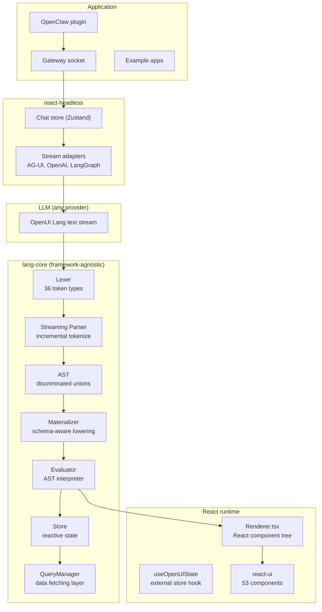
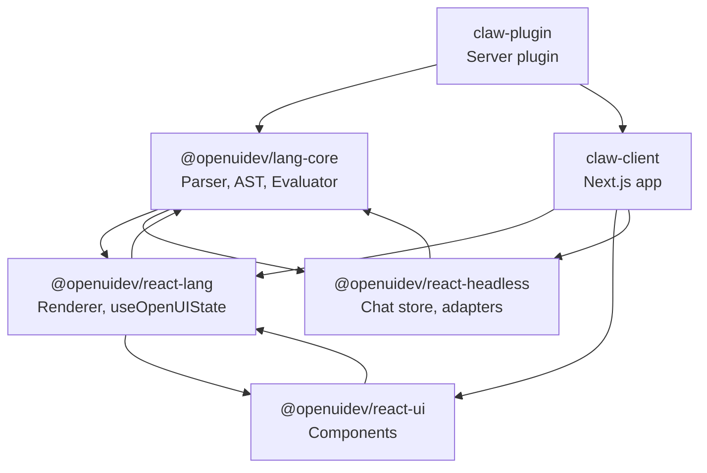

# OpenUI Ecosystem -- Architecture and Layer Map

OpenUI is organized into layers: the framework-agnostic language core at the bottom, the React-specific runtime above it, and the application-level integrations (OpenClaw, examples, voice agent) at the top.

**Aha:** The lang-core package has zero framework dependencies — no React, no DOM, no browser APIs. It is a pure TypeScript library that parses OpenUI Lang strings and produces an AST. The React renderer imports lang-core and evaluates the AST against a component library. This separation means you could write a Svelte, Vue, or native mobile renderer by importing lang-core and targeting your framework's rendering API.

## Layer Diagram



## Module Dependency Graph



## Technology Stack

| Concern | Choice | Rationale |
|---------|--------|-----------|
| DSL parsing | Hand-written lexer + recursive descent parser | Full control over streaming behavior, no parser generator overhead |
| Streaming | Incremental parser with watermark | Parse complete statements as they arrive, re-parse incomplete ones on each push |
| State management | Map-based store + useSyncExternalStore | Framework-agnostic core, React-compatible store |
| Component rendering | React (functional components) | Ecosystem compatibility, component composition |
| Chat state | Zustand | Lightweight, no boilerplate, React-native |
| Server integration | WebSocket + RPC (GatewaySocket) | Bidirectional, real-time, structured method calls |
| Server storage | JSON files + SQLite | Simple, no database dependency, per-session isolation |
| Client storage | localStorage | Browser-native, persistent across sessions |

## Entry Points

### Lang Core (Parser/Runtime)

Source: `openui/packages/lang-core/src/`

```typescript
import { createStreamParser } from './parser/parser';

const parser = createStreamParser();
parser.push('root = Card([header, content])\nheader = CardHeader("Title")\n');
const result = parser.buildResult();  // { statements, errors }
```

### React Renderer

Source: `openui/packages/react-lang/src/Renderer.tsx`

```tsx
<Renderer
  response={openuiLangString}
  library={openuiChatLibrary}
  isStreaming={true}
  onAction={handleAction}
/>
```

## Key Files

```
openui/
├── packages/lang-core/src/
│   ├── parser/
│   │   ├── lexer.ts            # Hand-written tokenizer (36 token types)
│   │   ├── ast.ts              # Discriminated union AST types
│   │   ├── parser.ts           # Recursive descent + streaming parser
│   │   ├── expressions.ts      # Expression parsing
│   │   ├── statements.ts       # Statement parsing
│   │   ├── materialize.ts      # Schema-aware AST lowering
│   │   ├── builtins.ts         # 13 data functions + 5 action steps
│   │   ├── prompt.ts           # LLM system prompt generation
│   │   └── serialize.ts        # JSON to OpenUI Lang conversion
│   └── runtime/
│       ├── evaluator.ts        # Framework-agnostic AST interpreter
│       ├── store.ts            # Reactive state store
│       ├── queryManager.ts     # Data fetching layer
│       └── toolProvider.ts     # Tool invocation interface
├── packages/react-lang/src/
│   ├── Renderer.tsx            # Main React component
│   └── hooks/useOpenUIState.ts # External store hook
├── packages/react-ui/src/
│   └── (53 component directories) # Prebuilt UI components
└── packages/react-headless/src/
    ├── store/createChatStore.ts # Zustand chat store
    └── stream/adapters/         # SSE stream adapters
openclaw-ui/
├── packages/claw-plugin/src/
│   └── index.ts                # Server-side OpenClaw plugin
└── packages/claw-client/src/
    ├── lib/gateway/socket.ts   # WebSocket client with auth
    └── lib/chat/               # Chat engine and hooks
```

See [Lang Core](02-lang-core.md) for the DSL lexer and parser.
See [Streaming Parser](03-streaming-parser.md) for incremental parsing.
See [Materializer](04-materializer.md) for schema-aware lowering.
