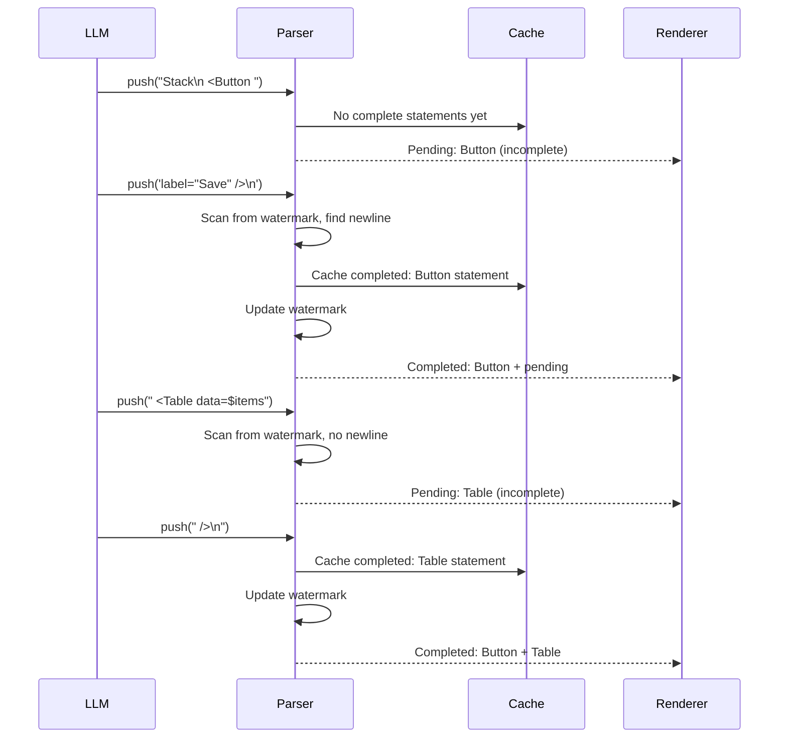
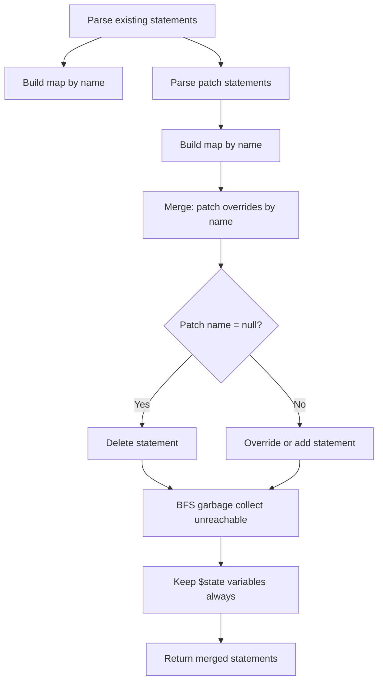

# OpenUI -- Streaming Parser Algorithm

The streaming parser is the most innovative component of OpenUI. It parses OpenUI Lang incrementally as tokens arrive from the LLM, caching completed statements and re-parsing only the incomplete portion on each push.

**Aha:** The streaming parser uses a watermark (`completedEnd`) to avoid re-processing already-completed statements. When new text arrives, it scans from the watermark for the next newline-at-depth-0. Everything before that newline is guaranteed complete — it was parsed on a previous push and hasn't changed. Only the text after the watermark (the "pending" portion) is re-parsed. This means parsing cost grows with the pending statement size, not the total document size.

Source: `openui/packages/lang-core/src/parser/parser.ts` — streaming parser implementation

## Streaming Algorithm



## Watermark Mechanism

```
Source buffer:
"Stack\n  <Button label=\"Save\" />\n  <Table data=$items />"
                                     ↑
                               completedEnd (watermark)

Before watermark: 2 complete statements (Stack, Button)
After watermark: 1 pending statement (Table, incomplete)
```

The watermark marks the boundary between completed and pending content. On each push:

1. New text is appended to the buffer
2. Scan from watermark for `newline-at-depth-0` (top-level newline not inside parentheses)
3. Parse the completed portion (watermark to found newline)
4. Cache the parsed statements
5. Update watermark to the found newline position
6. Re-parse the pending portion (watermark to end of buffer)

## Depth Tracking

The scanner tracks parenthesis depth to identify top-level newlines:

```typescript
function findCompleteStatements(buffer: string, from: number): { completed: string, pending: string } {
  let depth = 0;
  for (let i = from; i < buffer.length; i++) {
    const ch = buffer[i];
    if (ch === '(' || ch === '[' || ch === '{') depth++;
    if (ch === ')' || ch === ']' || ch === '}') depth--;
    if (ch === '\n' && depth === 0) {
      // Found a complete statement boundary
      return {
        completed: buffer.slice(from, i + 1),
        pending: buffer.slice(i + 1)
      };
    }
  }
  return { completed: '', pending: '' };  // No complete boundary found
}
```

**Aha:** The depth check is critical. A newline inside a prop value or child component is not a statement boundary:

```
Text(
  Line 1
  Line 2
)
```

The newlines after "Line 1" and "Line 2" are at depth 1 (inside the Text call). Only the newline after `)` is at depth 0 and marks a statement boundary.

## Statement Merge (Edit Mode)

When the user edits the generated UI, the patch overrides the existing statements:



Steps:
1. Parse existing and patch into statement maps keyed by identifier
2. Patch statements override existing by name
3. `name = null` in patch means "delete this statement"
4. BFS from root to garbage-collect unreachable statements
5. `$` state variables are always kept (they may be referenced by remaining statements)

## Strip Fences

The parser extracts code from markdown fences:

```typescript
function stripFences(source: string): string {
  // Match ```openui-lang ... ``` blocks
  // Handle string-context-aware fences (don't match ``` inside strings)
  return extracted;
}
```

This allows the LLM to wrap OpenUI Lang in markdown code blocks, and the parser extracts just the DSL content.

## Parse Errors

Errors are structured for LLM correction:

```typescript
interface OpenUIError {
  source: 'parser' | 'runtime' | 'query' | 'mutation';
  code: string;
  message: string;
  hint?: string;  // LLM-friendly correction hint
}
```

The parser produces errors like:
- `UNCLOSED_PAREN`: "Expected `)` at position 15"
- `UNKNOWN_COMPONENT`: "Component `Foo` not found in library"
- `MISSING_REQUIRED_PROP`: "Component `Table` requires prop `data`"

**Aha:** Error hints are designed for the LLM, not the human. A hint like "Component `Table` requires prop `data` of type `array`" gives the LLM enough information to regenerate the correct markup on the next turn. The human sees the error in the UI, but the LLM sees the hint in the system prompt.

See [Lang Core](02-lang-core.md) for the lexer and AST.
See [Materializer](04-materializer.md) for how parsed statements are resolved.
See [Evaluator](05-evaluator.md) for how expressions are interpreted.
