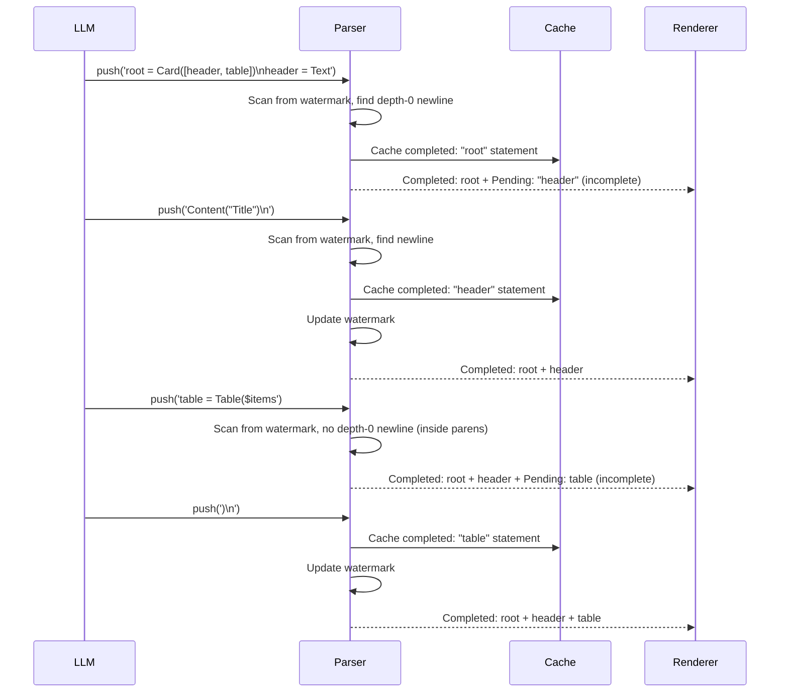
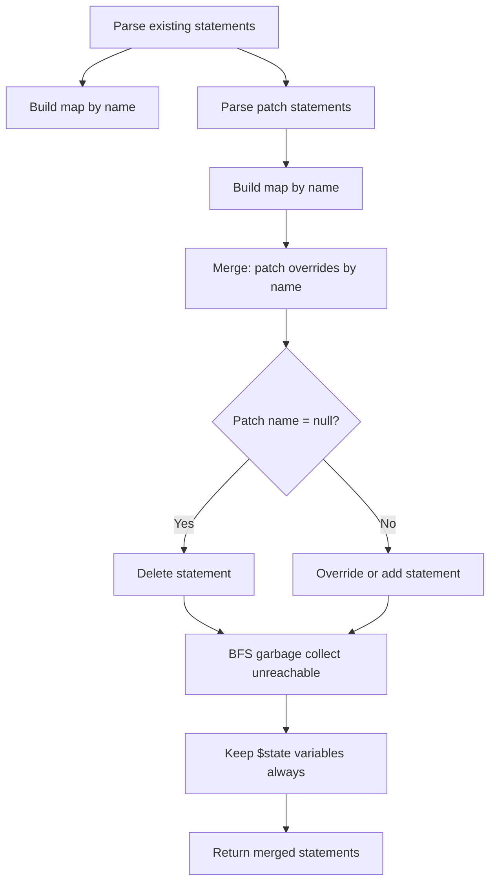

# OpenUI -- Streaming Parser Algorithm

The streaming parser is the most innovative component of OpenUI. It parses OpenUI Lang incrementally as tokens arrive from the LLM, caching completed statements and re-parsing only the incomplete portion on each push.

**Aha:** The streaming parser uses a watermark (`completedEnd`) to avoid re-processing already-completed statements. When new text arrives, it scans from the watermark for the next newline-at-depth-0. Everything before that newline is guaranteed complete — it was parsed on a previous push and hasn't changed. Only the text after the watermark (the "pending" portion) is re-parsed. This means parsing cost grows with the pending statement size, not the total document size.

Source: `openui/packages/lang-core/src/parser/parser.ts` — streaming parser implementation

## Streaming Algorithm



## Watermark Mechanism

```
Source buffer:
"root = Card([header, table])\nheader = TextContent("Title")\ntable = Table($items"
                                                            ↑
                                                      completedEnd (watermark)

Before watermark: 2 complete statements (root, header) → cached in completedStmtMap
After watermark: 1 pending statement (table, incomplete) → re-parsed every push
```

The watermark marks the boundary between completed and pending content. On each push:

1. New text is appended to `buf`
2. `scanNewCompleted()` scans from watermark tracking bracket depth and string context
3. Each depth-0 newline marks a statement boundary — text between boundaries is parsed and cached
4. Cached statements are stored in `completedStmtMap` (a `Map<string, Statement>`)
5. Watermark (`completedEnd`) advances to the end of the last completed statement
6. Pending tail (watermark to end of buffer) is autoclosed and re-parsed fresh each push
7. Completed + pending maps are merged — pending cannot overwrite completed entries

## Depth Tracking

The scanner (`scanNewCompleted`) tracks bracket depth, ternary depth, and string context to identify top-level newlines:

```typescript
// From parser.ts — scanNewCompleted (simplified)
function scanNewCompleted(): number {
  let depth = 0, ternaryDepth = 0;
  let inStr: false | '"' | "'" = false, esc = false;
  let stmtStart = completedEnd;

  for (let i = completedEnd; i < buf.length; i++) {
    const c = buf[i];
    if (esc) { esc = false; continue; }
    if (c === '\\' && inStr) { esc = true; continue; }
    if (inStr) { if (c === inStr) inStr = false; continue; }
    if (c === '"' || c === "'") { inStr = c; continue; }

    if (c === '(' || c === '[' || c === '{') depth++;
    else if (c === ')' || c === ']' || c === '}') depth = Math.max(0, depth - 1);
    else if (c === '?' && depth === 0) ternaryDepth++;
    else if (c === ':' && depth === 0 && ternaryDepth > 0) ternaryDepth--;
    else if (c === '\n' && depth <= 0 && ternaryDepth <= 0) {
      // Look-ahead: skip if next meaningful char is ? or : (ternary continuation)
      const t = buf.slice(stmtStart, i).trim();
      if (t) addStmt(t);      // Parse and cache the completed statement
      stmtStart = i + 1;
      completedEnd = i + 1;   // Advance watermark
    }
  }
  return stmtStart;
}
```

**Aha:** The depth check is critical. A newline inside a component call is not a statement boundary:

```
Text(
  "Line 1"
  "Line 2"
)
```

The newlines inside are at depth 1 (inside the parens). Only the newline after `)` is at depth 0 and marks a statement boundary. The ternary tracking ensures multi-line ternaries like `$x ? A("yes")\n  : B("no")` aren't split prematurely.

## Statement Merge (Edit Mode)

When the user edits the generated UI, the patch overrides the existing statements:



Steps:
1. Parse existing and patch into statement maps keyed by identifier
2. Patch statements override existing by name
3. `name = null` in patch means "delete this statement"
4. BFS from root to garbage-collect unreachable statements
5. `$` state variables are always kept (they may be referenced by remaining statements)

## Strip Fences

The parser extracts code from markdown fences:

```typescript
function stripFences(source: string): string {
  // Match ```openui-lang ... ``` blocks
  // Handle string-context-aware fences (don't match ``` inside strings)
  return extracted;
}
```

This allows the LLM to wrap OpenUI Lang in markdown code blocks, and the parser extracts just the DSL content.

## Parse Errors

Errors are structured for LLM correction:

```typescript
interface OpenUIError {
  source: "parser" | "runtime" | "query" | "mutation";
  code: OpenUIErrorCode;  // "unknown-component" | "missing-required" | "null-required" | ...
  message: string;
  statementId?: string;   // Which statement to patch (e.g. "header", "metrics")
  component?: string;     // Component type (e.g. "BarChart", "Table")
  path?: string;          // JSON Pointer path within props (e.g. "/title")
  toolName?: string;      // For query/mutation errors
  hint?: string;          // Actionable fix context for the LLM
}
```

The parser produces errors like:
- `unknown-component`: `"Unknown component "Foo" — not found in catalog or builtins"`
- `missing-required`: `"Component "Table" requires prop "data""`
- `excess-args`: `"Component "Button" received 5 arguments but only accepts 3"`

**Aha:** Error hints are designed for the LLM, not the human. A hint like available component names or correct signatures gives the LLM enough information to generate a correcting patch. The `statementId` tells the LLM exactly which statement to rewrite — enabling targeted surgical patches rather than full regeneration.

See [Lang Core](02-lang-core.md) for the lexer and AST.
See [Materializer](04-materializer.md) for how parsed statements are resolved.
See [Evaluator](05-evaluator.md) for how expressions are interpreted.
