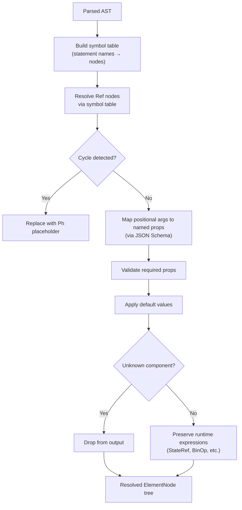

# OpenUI -- Materializer (Schema-Aware Lowering)

The materializer is a single-pass, schema-aware lowering pass that transforms the parsed AST into resolved element nodes. It resolves references, maps positional arguments to named properties via JSON Schema, validates required props, applies defaults, and drops unknown components.

**Aha:** The materializer maps positional arguments to named props using the component's JSON Schema `parameters` definition. When the LLM writes `<Button "Save" primary>`, the materializer looks up Button's schema, sees that the first parameter is `label` and the second is `primary` (boolean), and maps them accordingly. This means the LLM can use positional syntax for common components while the materializer normalizes everything to named props. Without this mapping, the LLM would need to write `<Button label="Save" primary={true}>` every time.

Source: `openui/packages/lang-core/src/parser/materialize.ts` — materialization pass

## Materialization Process



## Symbol Table and Reference Resolution

The materializer first builds a symbol table from statement names:

```typescript
// Input statements:
// 1. name: "header", element: Comp("Stack", [...])
// 2. name: null, element: Comp("Button", [Ref("header")])

const symbols = new Map([
  ['header', statement1.element],
]);

// Resolve Ref("header") → statement1.element
```

Circular references are detected during resolution:

```typescript
function resolveRef(ref: RefNode, symbols: Map<string, ElementNode>, resolving: Set<string>): ElementNode {
  if (resolving.has(ref.name)) {
    return { k: 'Ph' };  // Cycle → placeholder
  }
  resolving.add(ref.name);
  const target = symbols.get(ref.name);
  const resolved = resolve(target, symbols, resolving);
  resolving.delete(ref.name);
  return resolved;
}
```

## Positional-to-Named Prop Mapping

Source: `openui/packages/lang-core/src/materialize.ts`

Each component has a JSON Schema defining its parameters:

```json
{
  "name": "Button",
  "parameters": {
    "properties": {
      "label": { "type": "string" },
      "primary": { "type": "boolean" },
      "disabled": { "type": "boolean" }
    },
    "required": ["label"]
  }
}
```

Positional arguments are mapped by order:

```
<Button "Save" true>  →  { label: "Save", primary: true }
```

The materializer:
1. Gets the parameter order from the schema (`["label", "primary", "disabled"]`)
2. Maps the Nth positional argument to the Nth parameter name
3. Named props (from `key=value` syntax) are matched directly
4. Unknown props are dropped with a warning
5. Missing required props generate an error

**Aha:** The parameter order is determined by the JSON Schema `properties` object. In JavaScript, object property order is preserved for string keys, so the schema author controls the positional argument order. This is a clever use of JSON Schema's implicit ordering — no separate `parameterOrder` array is needed.

## Default Value Application

If a prop is not provided by the LLM, the materializer applies the schema default:

```json
{
  "properties": {
    "disabled": { "type": "boolean", "default": false }
  }
}
```

If the LLM didn't specify `disabled`, the materializer sets it to `false`.

## Unknown Component Handling

Components not found in the library are dropped:

```typescript
if (!componentLibrary.has(comp.name)) {
  errors.push({
    source: 'runtime',
    code: 'UNKNOWN_COMPONENT',
    message: `Component "${comp.name}" not found`,
    hint: `Available components: ${componentLibrary.keys().join(', ')}`
  });
  return null;  // Dropped from output
}
```

This is a safety mechanism — the LLM might hallucinate component names. Dropping them prevents rendering errors.

## Runtime Expression Preservation

Expressions like `$count + 1` or `@fetch(...)` are preserved as AST nodes:

```typescript
// After materialization:
{
  k: 'Comp',
  name: 'Button',
  props: {
    label: { k: 'StateRef', name: 'count' },
    onClick: { k: 'BuiltinCall', name: 'fetch', args: [...] }
  }
}
```

The evaluator interprets these expressions at render time. The materializer doesn't evaluate them — it only validates that the component accepts them as prop values.

See [Streaming Parser](03-streaming-parser.md) for how statements are parsed.
See [Evaluator](05-evaluator.md) for how expressions are interpreted.
See [React Renderer](06-react-renderer.md) for how materialized nodes are rendered.
