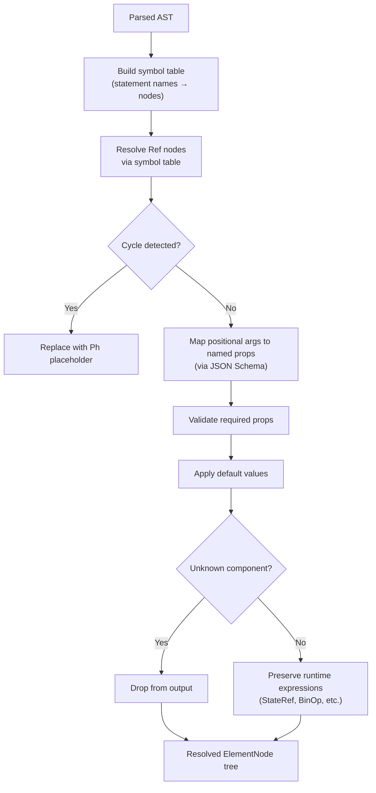

# OpenUI -- Materializer (Schema-Aware Lowering)

The materializer is a single-pass, schema-aware lowering pass that transforms the parsed AST into resolved element nodes. It resolves references, maps positional arguments to named properties via JSON Schema, validates required props, applies defaults, and drops unknown components.

**Aha:** The materializer maps positional arguments to named props using the library's `ParamMap`. When the LLM writes `Button("Save", true)`, the materializer looks up Button's parameter order from the `ParamMap`, sees that the first parameter is `label` and the second is `primary`, and maps them to `{ label: "Save", primary: true }`. This means the LLM can use compact positional syntax while the materializer normalizes everything to named props for the renderer.

Source: `openui/packages/lang-core/src/parser/materialize.ts` — materialization pass

## Materialization Process



## Symbol Table and Reference Resolution

The materializer builds a symbol table from classified statements:

```typescript
// From buildResult() in parser.ts:
const syms = new Map<string, ASTNode>();
for (const [id, stmt] of stmtMap) {
  syms.set(id, stmt.kind === "state" ? stmt.init : stmt.expr);
}
```

The `MaterializeCtx` carries this symbol table along with error tracking and cycle detection:

```typescript
interface MaterializeCtx {
  syms: Map<string, ASTNode>;      // Symbol table (statement id → AST)
  cat: ParamMap | undefined;        // Component parameter definitions
  errors: ValidationError[];        // Accumulated errors
  unres: string[];                  // Unresolved reference names
  visited: Set<string>;             // Cycle detection (currently resolving)
  partial: boolean;                 // True if streaming/incomplete
  currentStatementId?: string;      // For error attribution
  unreached?: Set<string>;          // Track orphaned statements
}
```

Circular references are detected by the `visited` set:

```typescript
function resolveRef(name: string, ctx: MaterializeCtx, mode: "value" | "expr"): unknown {
  if (ctx.visited.has(name)) {
    ctx.unres.push(name);
    return mode === "expr" ? { k: "Ph", n: name } : null;  // Cycle → placeholder
  }
  if (!ctx.syms.has(name)) {
    ctx.unres.push(name);
    return mode === "expr" ? { k: "Ph", n: name } : null;  // Missing → placeholder
  }
  ctx.visited.add(name);
  const result = mode === "value" ? materializeValue(target, ctx) : materializeExpr(target, ctx);
  ctx.visited.delete(name);
  return result;
}
```

## Positional-to-Named Prop Mapping

Source: `openui/packages/lang-core/src/parser/materialize.ts`

The library provides a `ParamMap` — a `Map<string, { params: ParamDef[] }>` where each entry defines the parameter list for a component:

```typescript
interface ParamDef {
  name: string;          // Parameter name, e.g. "title", "columns"
  required: boolean;     // Whether the parameter is required
  defaultValue?: unknown; // Default from JSON Schema
}

type ParamMap = Map<string, { params: ParamDef[] }>;
```

Positional arguments are mapped by order:

```
Button("Save", true)  →  { label: "Save", primary: true }
```

The materializer (during `materializeValue` for Comp nodes):
1. Looks up the component name in `ctx.cat` (the `ParamMap`)
2. Maps the Nth positional argument to the Nth parameter's `name`
3. Produces an `ElementNode` with named `props`
4. Validates required props — drops the node if any required prop is `null` or missing
5. Emits `excess-args` error if more args provided than params defined

**Aha:** The `ParamMap` is compiled from the library's JSON Schema definitions (`compileSchema()` in parser.ts). The property order in the JSON Schema `properties` object determines positional argument order. This is a clever use of JavaScript's guaranteed string-key property ordering — no separate `parameterOrder` array is needed.

## Default Value Application

If a prop is not provided by the LLM, the materializer applies the schema default:

```json
{
  "properties": {
    "disabled": { "type": "boolean", "default": false }
  }
}
```

If the LLM didn't specify `disabled`, the materializer sets it to `false`.

## Unknown Component Handling

Components not found in the library's `ParamMap` emit a validation error:

```typescript
// From materializeExprInternal and materializeValue:
ctx.errors.push({
  code: "unknown-component",        // lowercase-kebab, not uppercase
  component: node.name,
  path: "",
  message: `Unknown component "${node.name}" — not found in catalog or builtins`,
  statementId: ctx.currentStatementId,
});
```

In the value path (`materializeValue`), unknown components are dropped from the output tree. In the expression path (`materializeExprInternal`), the Comp node is preserved with recursed args — it may still be useful at runtime.

## Runtime Expression Preservation

Expressions containing `StateRef`, `BinOp`, `Ternary`, `RuntimeRef`, etc. are preserved as AST nodes inside the `ElementNode.props`:

```typescript
// After materialization, Comp nodes become ElementNode:
{
  type: "element",
  typeName: "Button",
  statementId: "myButton",
  partial: false,
  hasDynamicProps: true,     // Contains runtime expressions
  props: {
    label: { k: "BinOp", op: "+", left: { k: "Str", v: "Count: " }, right: { k: "StateRef", n: "count" } },
    onClick: { k: "Comp", name: "Action", args: [...] }
  }
}
```

The `hasDynamicProps` flag is set when any prop value contains AST nodes (detected by `containsDynamicValue()`). The evaluator interprets these expressions at render time. When `hasDynamicProps` is false, all props are plain values and evaluation can be skipped entirely.

See [Streaming Parser](03-streaming-parser.md) for how statements are parsed.
See [Evaluator](05-evaluator.md) for how expressions are interpreted.
See [React Renderer](06-react-renderer.md) for how materialized nodes are rendered.
