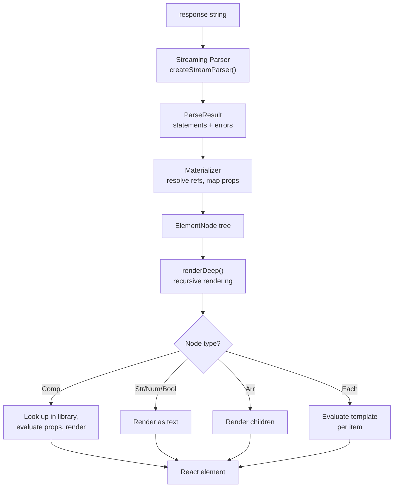

# OpenUI -- React Renderer

The React renderer is a `Renderer` component that takes an OpenUI Lang string, a component library, and streams the progressive parse results as React nodes. It uses `useSyncExternalStore` to subscribe to the internal Store and QueryManager, re-rendering automatically when signals change or queries resolve.

**Aha:** The renderer intentionally shows the "last good state" during streaming errors. If the LLM produces malformed markup mid-stream, the renderer doesn't crash or show a blank screen — it shows the last successfully parsed version. This is critical for the streaming experience where the LLM is still generating and the markup is temporarily incomplete. The `ElementErrorBoundary` catches render errors and falls back to the previous render.

Source: `openui/packages/react-lang/src/Renderer.tsx` — main React component
Source: `openui/packages/react-lang/src/hooks/useOpenUIState.ts` — state management hook

## Renderer Component

```tsx
// Renderer.tsx
interface RendererProps {
  response: string | null;       // OpenUI Lang string (streaming)
  library: Library;              // From createLibrary() in react-lang
  isStreaming?: boolean;         // Whether LLM is still generating
  onAction?: (event: ActionEvent) => void;  // ActionEvent, not ActionPlan
  onStateUpdate?: (state: Record<string, unknown>) => void;
  initialState?: Record<string, any>;       // $-prefixed = bindings, others = form state
  onParseResult?: (result: ParseResult | null) => void;
  toolProvider?:
    | Record<string, (args: Record<string, unknown>) => Promise<unknown>>  // Function map
    | McpClientLike                          // MCP client (callTool({ name, arguments }))
    | null;
  queryLoader?: React.ReactNode;  // Custom loading indicator
  onError?: (errors: OpenUIError[]) => void;
}
```

### Rendering Pipeline



## useOpenUIState Hook

Source: `openui/packages/react-lang/src/hooks/useOpenUIState.ts`

The hook manages the streaming parser, store, and query manager:

```typescript
function useOpenUIState(options: UseOpenUIStateOptions, renderDeep: (value: unknown) => React.ReactNode): OpenUIState {
  // Create streaming parser — memoized on library, uses sp.set() to diff against buffer
  const sp = useMemo(() => createStreamingParser(library.toJSONSchema(), library.root), [library]);

  // Parse — uses sp.set(response) which auto-resets if text was replaced (not appended)
  const result = useMemo(() => response ? sp.set(response) : null, [sp, response]);

  // Store — factory function, not class
  const store = useMemo<Store>(() => createStore(), []);

  // QueryManager — handles Query()/Mutation() tool calls
  const queryManager = useMemo<QueryManager>(() => createQueryManager(toolProvider ?? null), [toolProvider]);

  // Subscribe via useSyncExternalStore (store.subscribe + store.getSnapshot)
  const storeSnapshot = useSyncExternalStore(store.subscribe, store.getSnapshot, store.getSnapshot);
  const querySnapshot = useSyncExternalStore(queryManager.subscribe, queryManager.getSnapshot, queryManager.getSnapshot);

  // Build EvaluationContext
  const evaluationContext: EvaluationContext = {
    getState: (name) => unwrapFieldValue(store.get(name)),
    resolveRef: (name) => queryManager.getMutationResult(name) ?? queryManager.getResult(name),
  };

  const querySnapshot = useSyncExternalStore(
    queryManagerRef.current.subscribe,
    () => queryManagerRef.current.getSnapshot()
  );

  return { statements: result.statements, errors: result.errors, storeSnapshot, querySnapshot };
}
```

`useSyncExternalStore` is React 18's hook for subscribing to external stores without re-rendering on every state change. The store only notifies React when values actually change (shallow comparison), preventing unnecessary re-renders.

## ElementErrorBoundary

```tsx
<ElementErrorBoundary>
  {renderDeep(elementNode)}
</ElementErrorBoundary>
```

The boundary catches rendering errors and falls back to the last good state:

```typescript
class ElementErrorBoundary extends React.Component {
  state = { hasError: false, lastChildren: null };

  static getDerivedStateFromError(error) {
    return { hasError: true };
  }

  render() {
    if (this.state.hasError) {
      return this.state.lastChildren;  // Show last good state
    }
    return this.props.children;
  }
}
```

**Aha:** The boundary doesn't show an error UI — it silently falls back to the last successful render. This is intentional for streaming: if the LLM writes `<Table data=$itemz>` but the signal is `$items`, the table disappears (last good state had no table) rather than showing an error. When the LLM corrects to `$items`, the table appears.

## Action Execution

```typescript
async function triggerAction(plan: ActionPlan) {
  for (const step of plan.steps) {
    switch (step.type) {
      case 'Set':
        store.set(step.target, step.value);
        break;
      case 'Reset':
        store.reset(step.target);
        break;
      case 'ToAssistant':
        await onMessage(step.value);
        break;
      case 'OpenUrl':
        window.open(step.value, '_blank');
        break;
      case 'Run':
        await executeSteps(step.steps);
        break;
    }
    // Mutation failures halt the action plan
    if (step.type === 'Mutation' && step.failed) {
      break;  // Halt on mutation failure
    }
  }
}
```

Actions execute sequentially. If a mutation step fails (e.g., a query mutation returns an error), the plan halts — remaining steps are not executed.

## QueryManager

Source: `openui/packages/lang-core/src/queryManager.ts`

The QueryManager handles data fetching:

- **Cache**: Stable key ordering via `JSON.stringify` with sorted keys for consistent cache keys
- **Deduplication**: In-flight requests are deduplicated — two queries for the same data share one fetch
- **Refetch on dependency change**: When a signal that a query depends on changes, the query refetches
- **Auto-refresh**: Configurable refresh intervals
- **Loading states**: `__openui_loading`, `__openui_refetching`, `__openui_errors` markers

```typescript
const querySnapshot = {
  data: { users: [...] },
  __openui_loading: { users: false },
  __openui_refetching: { users: true },
  __openui_errors: { users: 'Network error' },
};
```

See [Evaluator](05-evaluator.md) for how expressions produce action plans.
See [Component Library](07-component-library.md) for the available components.
See [OpenClaw Plugin](08-openclaw-plugin.md) for server-side tool integration.
