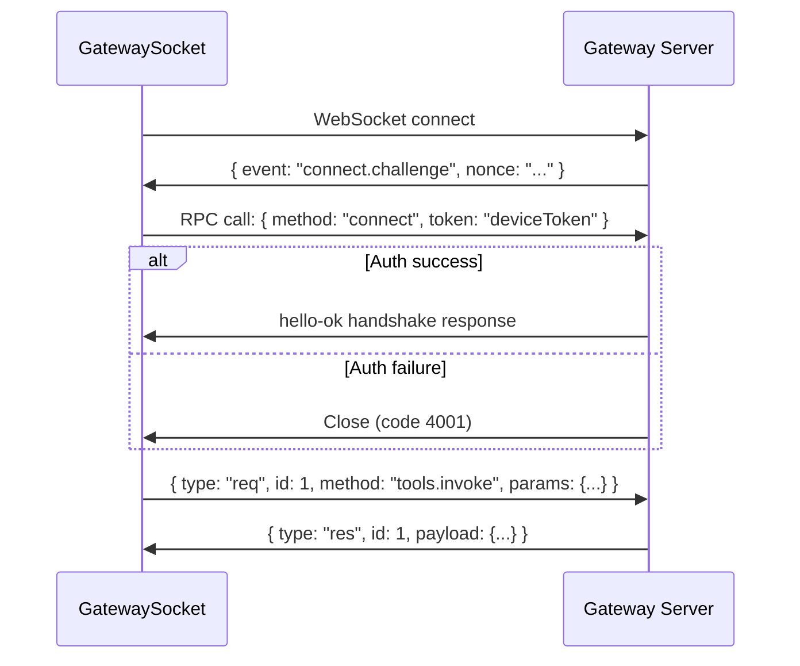

# OpenUI -- Gateway Socket Protocol

The GatewaySocket is a WebSocket-based RPC client that connects the OpenClaw web client to the server. It implements a challenge-response auth handshake, RPC request/response with deduplication, exponential backoff reconnect, and device identity/pairing.

**Aha:** The GatewaySocket uses a custom frame-based protocol where messages are distinguished by `frame.event` (for events like `connect.challenge`) and `frame.type` (for `req`/`res`). The auth handshake happens via an RPC `connect` call after receiving the `connect.challenge` event. The response uses a `hello-ok` pattern for the initial handshake. This separation prevents infinite reconnect loops when the credentials are wrong.

Source: `openclaw-ui/packages/claw-client/src/lib/gateway/socket.ts` — WebSocket client

## Message Protocol

### Connection Flow



### Message Types

| Type/Event | Direction | Purpose |
|------|-----------|---------|
| `connect.challenge` (event) | Server → Client | Auth challenge with nonce |
| `connect` (RPC method) | Client → Server | Auth response with device token |
| `hello-ok` | Server → Client | Connection authenticated |
| `req` | Client → Server | RPC request with unique ID |
| `res` | Server → Client | RPC response matching request ID |
| `agent`/`chat` (events) | Server → Client | Server-initiated events (session updates, etc.) |

## RPC Implementation

```typescript
class GatewaySocket {
  private pendingRequests = new Map<string, {
    resolve: (value: any) => void;
    reject: (error: Error) => void;
    timer: ReturnType<typeof setTimeout>;
  }>();

  async invoke(method: string, params: any, timeout = 30000): Promise<any> {
    const id = crypto.randomUUID();
    const promise = new Promise((resolve, reject) => {
      const timer = setTimeout(() => {
        this.pendingRequests.delete(id);
        reject(new Error(`RPC timeout: ${method}`));
      }, timeout);
      this.pendingRequests.set(id, { resolve, reject, timer });
    });

    this.send({ type: 'request', id, method, params });
    return promise;
  }

  handleMessage(msg: GatewayMessage) {
    if (msg.type === 'response') {
      const pending = this.pendingRequests.get(msg.id);
      if (pending) {
        clearTimeout(pending.timer);
        this.pendingRequests.delete(msg.id);
        if (msg.error) {
          pending.reject(new Error(msg.error));
        } else {
          pending.resolve(msg.result);
        }
      }
    }
  }
}
```

## Reconnection Strategy

```typescript
// Exponential backoff: 1s → 2s → 4s → 8s → 16s → 30s
const BACKOFF_BASE = 1000;
const BACKOFF_MAX = 30000;
const MAX_ATTEMPTS = 6;

async function reconnect() {
  for (let attempt = 0; attempt < MAX_ATTEMPTS; attempt++) {
    const delay = Math.min(BACKOFF_BASE * Math.pow(2, attempt), BACKOFF_MAX);
    await sleep(delay);
    try {
      await this.connect();
      return;  // Success
    } catch (e) {
      // Continue to next attempt
    }
  }
  // All attempts failed — emit fatal error
}
```

### Fatal Detection

Close codes that indicate a fatal error (don't reconnect):

| Code | Meaning |
|------|---------|
| 4001 | Unauthorized — credentials invalid |
| 4003 | Forbidden — account suspended |
| 4401 | Token expired — device token needs refresh |

All other close codes trigger reconnection.

## Device Identity and Pairing

The device token is stored in `localStorage`:

```typescript
// localStorage key
const SETTINGS_KEY = 'claw-settingsv1';

// Settings structure
interface Settings {
  gatewayUrl: string;
  token: string;        // Auth token
  deviceToken: string;  // Device identity
}
```

On first connection, if no device token exists, the client generates one and registers with the server. The server associates the device token with the user's account, enabling device management (list, revoke, rename devices).

## Session Change Subscriptions

The GatewaySocket subscribes to server events for real-time session updates:

```typescript
socket.on('event', (event: GatewayEvent) => {
  if (event.type === 'session_update') {
    // New message arrived, update chat store
    chatStore.addMessage(event.message);
  } else if (event.type === 'session_compacted') {
    // Context was compacted, refresh display
    chatStore.refresh();
  }
});
```

**Aha:** Events are pushed server-initiated — the client doesn't poll for new messages. This means the chat UI updates in real time as the LLM streams responses. The WebSocket connection carries both RPC (client→server requests) and events (server→client pushes) simultaneously.

See [OpenClaw Plugin](08-openclaw-plugin.md) for the server-side plugin.
See [Storage Patterns](10-storage-patterns.md) for client and server storage.
See [Production Patterns](12-production-patterns.md) for WebSocket reliability considerations.
