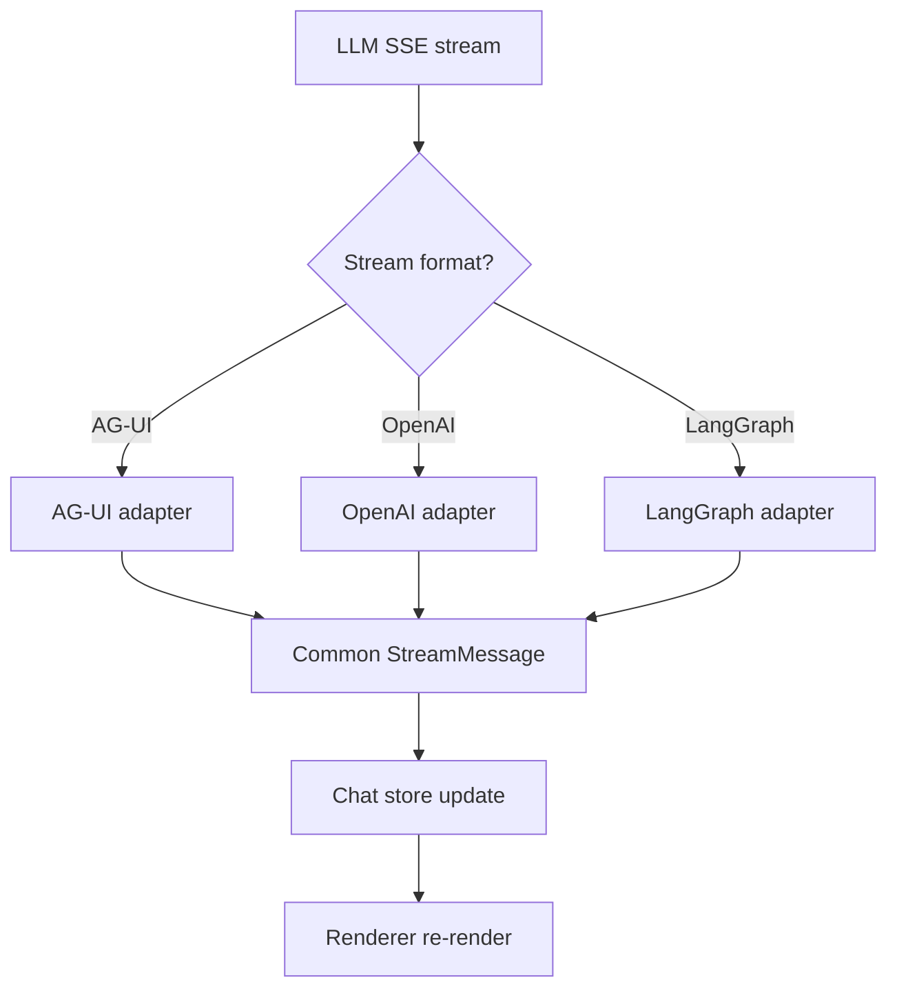

# OpenUI -- WASM and Web Patterns

This document covers how the OpenUI ecosystem interacts with WASM and the web platform, including SSE stream adapters, browser storage, and patterns for running generative UI in edge environments.

**Aha:** While OpenUI itself has no WASM components, its stream adapter architecture is directly applicable to WASM. The AG-UI, OpenAI, LangGraph, and other adapters each parse a different SSE format into a common message type. In a WASM implementation, these adapters would be compiled to WASM and run on the edge (Cloudflare Workers, Vercel Edge), parsing SSE streams server-side before forwarding to the browser. This reduces browser JavaScript complexity and enables server-side rendering of the initial UI state.

Source: `openui/packages/react-headless/src/` — stream adapters
Source: `openui/packages/react-headless/src/adapters/` — SSE format parsers

## Stream Adapters

The `react-headless` package includes adapters for different SSE stream formats:

| Adapter | Source Format | Purpose |
|---------|--------------|---------|
| AG-UI | SSE with `data:` prefix | Agentic UI protocol |
| LangGraph | LangGraph SSE format | LangGraph agent streams |
| OpenAI Completions | OpenAI streaming | GPT-4 tool call streams |
| OpenAI Responses | OpenAI Responses API | Structured response streams |
| OpenAI Readable Stream | Node.js ReadableStream | Server-side stream parsing |

### Common Message Type

```typescript
interface StreamMessage {
  type: 'text' | 'tool_call' | 'tool_result' | 'error' | 'done';
  content: string;
  metadata?: Record<string, any>;
}
```

Each adapter converts its source format to the common `StreamMessage` type:

```typescript
// AG-UI adapter
function parseAguiSSE(line: string): StreamMessage | null {
  const data = JSON.parse(line.slice(6));  // Skip "data: "
  switch (data.type) {
    case 'text': return { type: 'text', content: data.content };
    case 'tool_call': return { type: 'tool_call', content: data.tool, metadata: data.args };
    // ...
  }
}

// OpenAI adapter
function parseOpenAISSE(line: string): StreamMessage | null {
  const data = JSON.parse(line.slice(6));
  const choice = data.choices[0];
  if (choice.delta.content) {
    return { type: 'text', content: choice.delta.content };
  }
  if (choice.delta.tool_calls) {
    return { type: 'tool_call', content: choice.delta.tool_calls[0].function.name };
  }
  return null;
}
```

**Aha:** The adapter pattern means the same React UI components work with any LLM provider. The OpenClaw engine doesn't care whether the stream comes from Claude, GPT-4, or a local model — the adapter normalizes the format. This is the same principle as OpenUI Lang's materializer: normalize diverse inputs to a common representation.

## SSE Processing in Browser



## Edge Deployment (Cloudflare Workers)

The stream adapters can run on Cloudflare Workers:

```typescript
// Cloudflare Worker
export default {
  async fetch(request: Request, env: Env): Promise<Response> {
    const encoder = new TextEncoder();
    const stream = new ReadableStream({
      async start(controller) {
        // Forward LLM stream to adapter
        const response = await fetch(LLM_URL, { body: request.body });
        const reader = response.body.getReader();

        while (true) {
          const { done, value } = await reader.read();
          if (done) break;

          const text = decoder.decode(value);
          const messages = parseSSE(text);  // Adapter parsing

          for (const msg of messages) {
            // Forward normalized messages to client
            controller.enqueue(encoder.encode(`data: ${JSON.stringify(msg)}\n\n`));
          }
        }
        controller.close();
      }
    });

    return new Response(stream, {
      headers: { 'Content-Type': 'text/event-stream' },
    });
  }
};
```

The Worker parses SSE server-side and forwards normalized messages to the browser. This reduces client-side JavaScript complexity and enables caching at the edge.

## Service Worker for Offline

A service worker can cache the OpenUI components and initial state:

```javascript
// Service worker
self.addEventListener('fetch', (event) => {
  if (event.request.url.includes('/openui-lang.js')) {
    event.respondWith(caches.match('openui-bundle'));
  }
});
```

Combined with localStorage caching of chat history, this enables offline viewing of previous conversations.

## WASM Candidate: Parser Compilation

The OpenUI Lang parser could be compiled to WASM:

```rust
#[wasm_bindgen]
pub struct OpenUIParser {
    parser: StreamParser,
}

#[wasm_bindgen]
impl OpenUIParser {
    pub fn new() -> Self { Self::default() }

    pub fn push(&mut self, text: &str) {
        self.parser.push(text);
    }

    pub fn build_result(&self) -> JsValue {
        // Convert ParseResult to JsValue
        js_sys::JSON::stringify(&serde_wasm_bindgen::to_value(&result)).unwrap()
    }
}
```

**Benefits:**
- Consistent parsing behavior between server and client
- Potential performance improvement for large documents
- Server-side WASM parsing on edge workers

**Tradeoffs:**
- Additional WASM binary download (~100-200KB)
- JS-WASM boundary overhead for each `push()` call
- No significant performance gain for small documents (the TypeScript parser is already fast)

## Web Components

OpenUI's component library could be exposed as Web Components:

```html
<openui-renderer>
  <template openui-lang>
root = Card([btn, txt])
btn = Button("Save")
txt = TextContent("Hello")
  </template>
</openui-renderer>
```

The Web Component would encapsulate the parser, materializer, and renderer, providing a framework-agnostic custom element.

## Performance Considerations

| Concern | Current Approach | WASM Approach |
|---------|-----------------|---------------|
| Parse speed | TypeScript (fast for small docs) | Rust WASM (faster for large docs) |
| Memory | GC-managed JS objects | Linear WASM memory |
| Bundle size | ~50KB TypeScript | ~200KB WASM + glue |
| Threading | Main thread only | WASM threads (with SharedArrayBuffer) |
| Edge deployment | Node.js/Worker JavaScript | WASM on any edge runtime |

See [React Renderer](06-react-renderer.md) for the current rendering approach.
See [Rust Equivalents](11-rust-equivalents.md) for WASM build patterns.
See [Architecture](01-architecture.md) for the adapter layer in the ecosystem.
