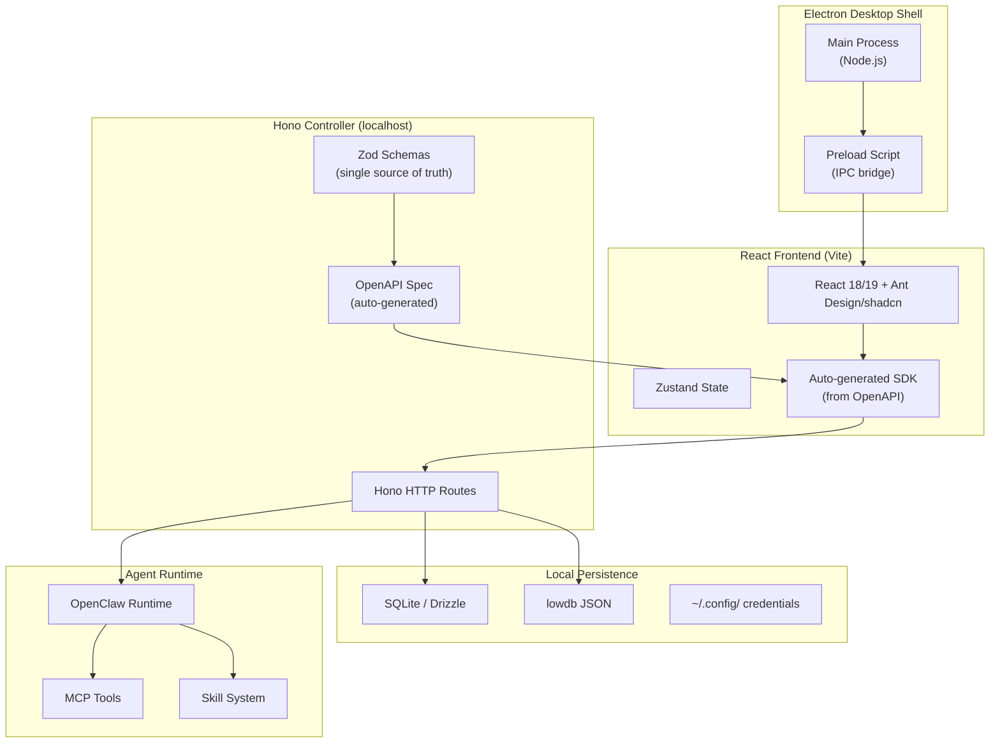

# OpenUI -- Nexuio Ecosystem (Agent Platforms and Design Tools)

The `src.nexuio/` directory contains a suite of interconnected desktop-first AI agent platforms and design tools. The core pattern: Electron shells hosting React frontends backed by Hono local HTTP controllers, with Zod schemas as the single source of truth flowing from backend to auto-generated frontend SDKs.

**Aha:** The nexuio ecosystem solves a specific problem: making AI agents accessible as always-on team members rather than ephemeral chat sessions. Nexu connects agents to IM channels (WeChat, Feishu, Slack, Discord) so they run 24/7. Multica assigns issues to agents like you'd assign to colleagues. Open-codesign generates design artifacts from prompts. All three share the same architecture: Electron + Hono controller + React + local persistence — no cloud dependency.

Source: `src.nexuio/` — 15 sub-projects

## Project Map

| Project | Type | Description |
|---------|------|-------------|
| **nexu** | Desktop + Agent Platform | Connect AI agents to IM channels (WeChat, Feishu, Slack, Discord) |
| **multica** | Managed Agent Infra | Assign issues to agents, track progress, compound skills |
| **open-codesign** | Design Tool | "Prompt to polished artifacts" — prototypes, slides, marketing |
| **open-cowork** | Agent Desktop | One-click Claude Code, MCP tools, sandbox isolation |
| **open-design** | Design Workspace | Chat-native workspace, 31 skills, 72 design systems |
| **monet** | App Scaffold | Electron + Next.js + Hono + SQLite starter template |
| **design** | Component Library | React 19 + Storybook 9 design system |

## Shared Architecture Pattern



## Nexu — IM Channel Agent Platform

Source: `src.nexuio/nexu/`

Nexu connects AI agents to messaging platforms for 24/7 deployment. Architecture:

- **Controller** (`@nexu/controller`): Hono-based API with Zod schemas → auto-generated OpenAPI
- **Web** (`@nexu/web`): React frontend with SDK auto-generated from OpenAPI spec
- **Desktop** (`@nexu/desktop`): Electron shell packaging the web + controller
- **Slimclaw** (`@nexu/slimclaw`): OpenClaw runtime wrapper for local agent execution

Type-safe pipeline: `Zod schemas → OpenAPI → Frontend SDK` — change a schema, regenerate types, frontend catches errors at compile time.

```bash
pnpm generate-types  # Zod → OpenAPI → SDK in one command
```

Supported IM channels: WeChat, Feishu (Lark), Slack, Discord, DingTalk, QQ.

## Multica — Managed Agents Infrastructure

Source: `src.nexuio/multica/`

"Turn coding agents into real teammates." Multica is a task board where agents are first-class assignees:

- **Turborepo monorepo**: `@multica/web` (Next.js), `@multica/desktop` (Electron), `@multica/docs`
- **PostgreSQL**: Persistent task state, agent progress tracking
- **Vendor-neutral**: Works with Claude Code, Codex, GitHub Copilot CLI, OpenClaw, Gemini, Cursor Agent, Kimi, Kiro CLI
- **Skill compounding**: Agents learn from previous tasks and apply accumulated skills

## Open-Codesign — Design Artifact Generator

Source: `src.nexuio/open-codesign/`

Desktop tool for generating design artifacts from natural language:

- **Outputs**: HTML prototypes, PDF slide decks, marketing assets
- **Multi-model**: `@mariozechner/pi-ai` provider support (BYOK)
- **Local-first**: No cloud proxy, no telemetry, credentials in `~/.config/open-codesign/`
- **Turborepo**: Electron + React 19 + Vite 6 + Tailwind v4
- **Lazy loading**: Heavy features (PPTX export, web capture, codebase scan) loaded on demand

## Open-Design — Chat-Native Design Workspace

Source: `src.nexuio/open-design/`

Agentic workspace for collaborative product design:

- **31 composable skills**: Prompt-driven design artifact generation
- **72 brand-grade design systems**: Curated and enforced via `od.craft` rules
- **CLI agent auto-detection**: Finds 15+ installed agents on PATH (Claude Code, Codex, Cursor Agent, etc.)
- **Sidecar protocol** (`packages/sidecar-proto`): Isolated process management for agent runtimes
- **Next.js 16 + Hono daemon**: App Router frontend + privileged daemon for file/process access

Architecture: `apps/web` (Next.js 16) → `apps/daemon` (Hono) → Agent spawning → `apps/desktop` (Electron shell)

## Monet — Desktop App Scaffold

Source: `src.nexuio/monet/`

Electron-first scaffold used as template for other nexuio apps:

```
apps/controller  → Hono (localhost HTTP + bearer token auth)
apps/desktop     → Electron (main + preload)
apps/web-ui      → Next.js (static export)
packages/shared  → Shared types
packages/database → SQLite + Drizzle ORM
```

## Shared Tooling

| Tool | Purpose |
|------|---------|
| **Biome** | Linting + formatting (replaces ESLint + Prettier) |
| **Changesets** | Versioning and release management |
| **pnpm workspaces** | Monorepo package management |
| **Turborepo** | Build orchestration (multica, open-codesign) |
| **Vitest** | Testing |
| **Playwright** | E2E testing |

## Replicating in Rust

The nexuio pattern maps to Rust as:

| TypeScript | Rust Equivalent |
|-----------|-----------------|
| Electron | Tauri (webview desktop shell) |
| Hono (HTTP) | Axum or Actix-Web (local API) |
| Zod schemas | serde + utoipa (OpenAPI gen) |
| lowdb (JSON) | serde_json + file-based storage |
| SQLite + Drizzle | rusqlite + sea-orm |
| React (frontend) | Leptos, Dioxus, or keep React via Tauri |
| pnpm workspaces | Cargo workspaces |

See [Architecture](01-architecture.md) for the core OpenUI framework.
See [Production Patterns](12-production-patterns.md) for deployment considerations.
